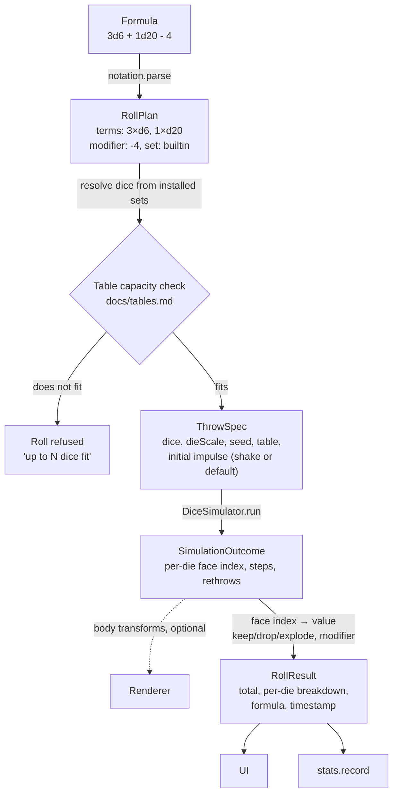

# Architecture

> **Design:** every screen this module map has to serve exists as a live
> prototype — open the [clickable design](../design/dInfinity.dc.html) or [design/](../design/).
> The menu (option 1q) and Settings (1y) show the navigation.

## Goals that shape the design

1. **The physics result is the roll.** There is no separate RNG path that
   decides the number. Rendering is a *view* of the simulation; turning it off
   must not change how rolls are produced.
2. **Dice sets are data, never code.** Anything downloaded from the internet
   is parsed, validated and rejected on error. It cannot execute, cannot reach
   outside its own folder, and cannot break other dice sets or the app.
3. **Offline first.** Everything except installing a dice set works with no
   network.
4. **Deterministic simulation.** Given the same seed and inputs, the
   simulation produces the same result on every device. This is what makes
   power-saving mode honest and makes bugs reproducible.

## Tech stack

| Concern | Choice | Notes |
|---|---|---|
| Language | Kotlin | Native code (C++) only inside the physics/rendering bridge |
| UI | Jetpack Compose | Material 3 |
| 3D rendering | [Filament](https://github.com/google/filament) | PBR, Vulkan/OpenGL ES, Android-first, Kotlin bindings |
| Physics | [Jolt Physics](https://github.com/jrouwe/JoltPhysics) 5.3.0 via JNI | Decided by a spike, not by reading: see decision 37. Built with `CROSS_PLATFORM_DETERMINISTIC=ON`, which is what goal 4 needs and what Bullet does not offer. |
| Persistence | Room (SQLite), processed by KSP | Statistics, saved rolls, installed set registry. Schemas exported and checked in; migrations from version 1 (`docs/statistics.md`) |
| Settings | DataStore | Preferences |
| Dice set parsing | [tomlj](https://github.com/tomlj/tomlj) (TOML 1.0), read through its document tree | Reports the line and column of every key, which is what a validation report is made of. No reflection-based deserialization of untrusted input |
| Network | OkHttp | Only for installing dice sets, tables and saved-roll collections from a URL (`https` only) |
| Images | Android `BitmapFactory` with bounds check first | Textures decoded with explicit size limits |

The physics engine choice was the one most likely to change, and is now made
(decision 37). The interface the rest of the app depends on (`DiceSimulator`)
stays engine-agnostic anyway, so that swapping is contained to one module and
so that everything above it can be tested without an engine at all.

## Modules

```text
build-logic/         Gradle convention plugins — every module's build config lives here, once
app/                 Application: single activity, theme, navigation graph
core/
  model/             Die, DiceSet, Face, the shape catalogue and its atlas layout, RollPlan, RollResult, SavedRoll — pure Kotlin, no Android deps
  notation/          Formula parser + evaluator (docs/dice-notation.md)
  probability/       Exact PMF computation (docs/probability.md)
  stats/             Statistics aggregation logic
dicesets/
  format/            TOML schema, validator, table definitions (docs/dice-sets.md, docs/tables.md)
  install/           Fetch from git forges / https archives / local files, verification, extraction into sandboxed storage
  builtin/           The bundled standard set and default tables as a normal package (eats its own dog food)
simulation/
  api/               DiceSimulator interface, table geometry + capacity check, settle/face-read logic, the frame clock
  jolt/              Jolt JNI bridge (C++), the roll loop and the roll in progress
render/
  filament/          Scene setup, materials, camera, die meshes, tray
  headless/          The Renderer contract, and the renderer that draws nothing (power-saving mode)
input/
  shake/             Sensor fusion → throw impulses
designer/            Face drawing canvas → dice set export (docs/face-designer.md)
data/                Room database, DAOs, DataStore
feature/             One module per screen group; see docs/TODO.md Step 4
  roll/              Roll screen: tray, dice picker, formula field, result sheet
  graph/             Outcome graph
  saved/             Saved rolls: groups, list, editor, import/export
  sets/              Dice set browser, details, installer
  tables/            Table picker
  designer/          Face designer screen over the designer/ engine
  stats/             Statistics, history and sessions — the "Look back" screens
  settings/          Settings and the menu
test-fixtures/       Test data shared by every module: dice sets, collections, golden roll cases
```

Ten screens, eight `feature/` modules: statistics, history and sessions are one
module because they are one screen group over one set of data
(`design/dInfinity.dc.html`, options 1w, 1x, 6c) and splitting them would only
split the queries.

Rule: `core/*`, `dicesets/format`, `simulation/api`, `render/headless` and
`test-fixtures` are plain Kotlin modules with no Android dependency, so they
run on the JVM and stay fast; everything else is an Android library.
`simulation/jolt` and `render/filament` carry native code and are tested with
instrumented tests on a device. The golden determinism suite spans both tiers
from a source set they share, `simulation/jolt/src/sharedTest`
(decision 44). Most of `simulation/jolt` is *not* device-only,
though, and that is deliberate: everything it decides about a roll is Kotlin
over an interface, and only the two files that talk to the engine need a phone
(decision 40).

Build configuration is not repeated per module: `build-logic` provides four
convention plugins — `dinfinity.kotlin-jvm`, `dinfinity.android-library`,
`dinfinity.android-feature` (a library with Compose) and `dinfinity.android-app`
— and every module's build script is a plugin line plus its dependencies.

## Data flow of a roll



The `DiceSimulator` runs at a fixed timestep. In normal mode it is stepped in
lockstep with the frame clock and the renderer interpolates. In power-saving
mode it is stepped as fast as the CPU allows on a background thread and only
the outcome is delivered. Same code path, same result for the same seed — and
"same code path" is literal: both are a `LiveRoll`, and the difference is who
calls it (decision 48).

## Threading

- **Main thread:** Compose UI only.
- **Roll thread:** owns the physics world *and* the Filament engine. Steps at
  the 120 Hz fixed timestep, off its own `Choreographer`, and draws each frame
  where it stands (`render/filament`'s `TrayDriver`). One thread rather than
  two, which is a change from the original design (decision 49).
- **Sensor thread:** `SensorManager` callbacks are batched and forwarded to the
  roll thread as impulse events.
- **IO dispatcher:** database, dice set installation, texture decoding.

## Storage layout

```text
<filesDir>/
  dicesets/
    <set-id>/                 one folder per installed package (dice and/or tables), id is a sanitised slug
      diceset.toml
      textures/…
      .meta.json              source URL, commit hash / archive checksum, install time, validation report
  designer/
    drafts/…                  in-progress face drawings
  savedrolls/
    imports/…                 imported collections kept for "re-import / diff"
<databases>/dinfinity.db       Room: stats, saved rolls, roll history, set registry
```

Dice set folders are treated as read-only after installation. Uninstall
deletes the folder and the registry row; statistics referencing that set are
kept (they are keyed by set id and die id, not by file path).

## Key decisions log

| # | Decision | Reason |
|---|---|---|
| 1 | Result comes from physics, always | Core value proposition; avoids "is the animation just theatre?" |
| 2 | Fixed-timestep, seeded, deterministic sim | Power-saving mode must be provably the same roll; reproducible bugs |
| 3 | TOML for dice sets | Human-editable, no code execution, comments allowed, simple to validate |
| 4 | v1's shape catalogue is closed: eight convex solids, no author-supplied meshes | Convex-convex collision is fast and robust, and eight known-fair solids need no fairness UI; sets vary values and artwork, not geometry |
| 5 | Dice sets installed into sandboxed per-set folders | Containment; a set cannot reference files outside its folder |
| 6 | Exact PMF via convolution, not a normal approximation | It is cheap for realistic formulas and correct for small dice counts |
| 7 | d100 is two d10s (tens + units) | Matches table convention; a 100-sided ball does not roll honestly in a tray |
| 8 | Stats keyed by (set id, die id), not by shape | A custom d20 with a skull on the 1 is still a d20 for statistics — but users may also want per-set stats |
| 9 | Table mesh is fixed; only its look is exchangeable | The tray *is* the screen; a fixed box keeps physics predictable and the capacity limit meaningful |
| 10 | Rolls that exceed table capacity are refused, not batched | Too many bodies in a small box produces tunnelling and jitter — that is not a roll, it is a bug generator |
| 11 | Downloads from any `https` archive URL, with first-class support for git forges | Not everyone is on GitHub; the safety comes from the validator, not from the host |
| 12 | GPL-2.0-or-later | Author's choice; user content (sets, tables, saved rolls) is explicitly not covered |
| 13 | Seeds and inputs are recorded but never surfaced; no replay in the app | Determinism is for testing and bug reports, not a feature; a past roll is a record, not something to re-run |
| 14 | Tables are global; a dice set never overrides the selected table | One tray on the screen, whatever mix of sets is in the throw |
| 15 | Saved-roll import refuses a duplicate group name instead of merging | No conflict UI to get wrong, and an import can never damage existing rolls |
| 16 | Power-saving is manual only | A roll that silently stops rendering because the battery dipped is a surprise |
| 17 | `minSdk` 36, `compileSdk`/`targetSdk` 37 | Robolectric cannot start API 37 and cannot run below `minSdk`; a `minSdk` of 37 would cost the whole Robolectric test tier for one API level of reach |
| 18 | Nothing touches a die at rest: prevention, then corrections while a die is still moving, then a visible re-throw of that one die | A settled die that twitches shows the player the result being arranged rather than rolled — worse than the stacked die it fixes. Re-throwing a cocked die is fair, and it is what a player does at a real table |
| 19 | The verdict on an instrumented run comes from its JUnit XML, not from AGP's own pass/fail | AGP 9.4.0 cannot pass a run on a device whose adb serial contains a colon — which is every device attached over WiFi debugging — so its verdict is unusable here (`docs/build-setup.md`) |
| 20 | Release APKs are signed v2+v3, not v1 or v4 | v3 carries the proof-of-rotation record, so a lost or compromised release key can be replaced without breaking updates for anyone who already installed the app; v1 is unread above API 24 and v4 only speeds up incremental `adb install` |
| 21 | The submitted dependency graph covers the runtime classpaths only | A graph of every configuration also carries the build's own toolchain, producing vulnerability alerts for transitives no file in this repository declares and that Dependabot therefore cannot patch; build-tool advisories ride in on the weekly AGP and Kotlin bumps instead |
| 22 | The accent is a fixed palette of six, not a colour picker | The Modernist system spends colour in one place and relies on that colour carrying meaning; a free picker would let someone choose an accent that vanishes against the ground. Every entry is asserted at 3:1 or better against both grounds, which a picker could not be |
| 23 | The identity's blue is fixed and does not follow the accent | The mark is the app's name, not its chrome, and a launcher icon cannot follow a runtime setting in any case (`docs/assets/README.md`) |
| 24 | SonarQube runs as the scanner in CI, not as automatic analysis | Automatic analysis cannot ingest a coverage report at all, and it ignores `sonar.issue.ignore.*`, so a reviewed finding could only be accepted by clicking it away in the web UI. It also reads a different file, so the repository had to carry two configurations that could silently disagree — and did (`docs/build-setup.md`) |
| 25 | Coverage is reported per module, not merged into one file | Each module has exactly one JVM test task, and SonarQube merges a list of reports itself. The Android modules' reports are built by AGP rather than by a hand-written `JacocoReport` task, so nothing depends on the paths of AGP's intermediate class directories, which are not API and have moved between versions |
| 26 | The coverage rule is a floor in `gradle.properties`, not a comparison against `main` | A floor fails the same way on a developer's machine as on CI, needs nothing cached or recomputed, and turns both directions into something a reader sees: raising it is a line in the diff, lowering it is an argument in the pull request |
| 27 | `build-logic` is linted by the ktlint CLI rather than its Gradle plugin | The plugin lints whole source sets, and Gradle generates its plugin accessors into that build's main source set — tens of thousands of violations in code nobody wrote, which no path filter would suppress. The CLI takes explicit patterns |
| 28 | Every dependency is pinned by SHA-256, not only by version | A version says which artifact was asked for; a checksum says which one arrived. The app installs downloaded dice sets, so a build that cannot tell the difference is the wrong foundation for one that must. The cost is that a dependency bump has to regenerate the metadata (`docs/build-setup.md`) |
| 29 | A release is refused unless the APK carries the expected certificate fingerprint | A signature that verifies is not the same as *our* signature. Without `keystore.properties` the build produces an unsigned APK rather than failing, and an APK signed with the debug key or a regenerated one installs as a different app and can never update anyone — a mistake that cannot be taken back once published (`SECURITY.md`) |
| 30 | Only one JaCoCo report is written at a time | JaCoCo's HTML formatter copies its static resources out of a jar reached through the class loader, and two reports running at once in the same daemon share that open archive — the first to finish closes it under the other (`ZipException: ZipFile closed`). It failed a build on `main` with nothing changed to explain it. Writing a report is milliseconds, so serialising costs nothing worth measuring |
| 31 | Typed notation names standard dice (`dN`, `d%`, `dF`), set-qualified or not; a set's own die ids are reached from the dice picker | A die id and a modifier are made of the same characters, so `brass:skull-d6kh1` has no unambiguous reading — the parser would have to ask the installed sets where the id ends, and the formula field re-validates on every keystroke on a thread that has never seen storage. Picked dice build the same `RollPlan` as typed ones, so nothing else in the app knows the difference (`docs/dice-sets.md`) |
| 32 | Everything a roll can fail on that does not need dice is decided at plan time | A roll is watched. A formula that turns out mid-throw to divide by zero, keep four of two dice or explode for ever would have to fail with dice on the table and nothing to show. `ResultBounds` proves the 64-bit promise the same way, which is also what lets the evaluator add in plain `Long` with no overflow checks |
| 33 | A dice set is parsed by tomlj and read field by field into plain data classes | Parsing TOML is the kind of thing that should not be hand-rolled, and this parser is the one that carries the line and column of every key — without which the validation report could not say `file:line` at all (`docs/dice-sets.md`). Its deserializer is never used: a downloaded file reaches a document tree and nothing else |
| 34 | A texture's dimensions are read from its own header, in plain Kotlin, before any decoder sees it | Refusing a 30,000-pixel image is only safe if the refusal happens before the decode, because the decoder is the part with the attack surface. It also means `dicesets/format` stays a JVM module and can be tested without an emulator |
| 35 | Every catalogue solid is computed from its closed form in `simulation/api`, and the hull, the mesh and the face reading all come from that one place | Three descriptions of the same solid are three chances to be a hundredth of a degree apart, and the one that would show is a die whose printed face and scored face disagree. Face 0 is the face that is up in the reference orientation, which is what both the atlas and a settled reading expect |
| 36 | `size_mm` is a die's nominal size — the edge length for a polyhedron, the diameter for the coin — not its bounding diameter | It is what a dice maker quotes, so "a d6 of 16 mm" means the same thing to an author as to the app. It is also the reading the capacity rule in `docs/tables.md` was worked out under: a 16 mm d6 covers 6.03 cm², and eighty of them are exactly what a phone-sized tray holds |
| 37 | Jolt Physics 5.3.0, not Bullet — decided by building both against the toolchain the app actually uses | Goal 4 is determinism, and Jolt offers cross-platform determinism as a supported build mode (`CROSS_PLATFORM_DETERMINISTIC=ON`) while Bullet offers no such guarantee at all. The spike settled the rest on evidence: Jolt configures and builds clean with the SDK's CMake 4.1.2 and NDK 30's Clang 21 in about three seconds, and a real slice of it — a convex-hull die, a box tray and fixed 1/120 s stepping — links to a 2.0 MB stripped `arm64-v8a` library. Bullet 3.25 does not configure at all: its `cmake_minimum_required(VERSION 2.4.3)` is below what CMake 4 still supports. An engine the build cannot even configure is not a fallback (`docs/build-setup.md`) |
| 38 | The `Renderer` contract lives in `render/headless`, and `render/filament` depends on it rather than the other way round | "No Filament engine is created at all" in power-saving mode is a claim about a whole dependency, and it is only true if the headless path can be built without that dependency present. A headless mode made out of the real renderer with the drawing switched off would still hold a GPU context and would quietly stop being free the first time somebody allocated in the wrong place. The contract also returns nothing anywhere, so a renderer cannot act on the simulation it is watching |
| 39 | The container's emulator is an automated-test image at the newest API that has one, even when that is a release below `targetSdk` | The same trade as decision 17, for the same reason and with the same floor: API 36 is the app's own `minSdk`, so it is a device the app must work on regardless, and the API it targets is covered by the phone. It is also not much of a choice — API 37's full image crashes `surfaceflinger` under headless software rendering and takes the framework with it, which surfaces as an install failing with "Can't find service: package" (`docs/build-setup.md`) |
| 40 | The physics engine is native; every decision about a roll is Kotlin. The bridge is a `PhysicsWorld` interface, and the native side only creates bodies, steps them and reports what they are doing | A roll is almost entirely judgement — where the dice start, which way the shake loads them, when a die has stopped, whether it may be touched, what it read, whether it has to be thrown again — and none of that is physics. Written in C++ it could only be checked by running it on a phone and looking; written in Kotlin over an interface, a test hands the loop a die that has stopped dead in the worst state a die can be in and asserts that nothing reaches it. A device can show that ten thousand rolls contained no post-rest correction; it cannot show that none is possible. The cost is a JNI call per step, which against 1,440 steps of a solver is nothing |
| 41 | The simulation runs in centimetres and grams, not metres and kilograms | Jolt's tolerances are absolute numbers tuned for objects about a metre across, and a die is sixteen millimetres. Most of them can be scaled by hand and some must be — its default penetration slop is 20 mm, larger than the die. One cannot: `MotionProperties::SetMassProperties` tests the inertia tensor for being "near zero" against a hard-coded 10⁻¹² on its *squared* length, and a 16 mm die's 2·10⁻⁷ falls under it, so Jolt silently substitutes the inertia of a sphere a metre across — nine thousand times too much to turn. Friction then cannot take the spin out of a die and rolls never end, which looks exactly like broken friction and is not. At one centimetre to the unit a die is 1.6 units across and Jolt's defaults mean what they were written to mean. Density needs no conversion either, which is the sign the unit is right: a set file quotes grams per cubic centimetre because that is what a dice maker quotes |
| 42 | Jolt is compiled optimised in every variant, the debug build included | An unoptimised solver is not a slower version of the same roll — it is too slow to step 120 Hz on a phone, so the emulator and device tiers would be judging something the release build never does. Nobody steps into Jolt with a debugger; the bridge's own bugs are in the Kotlin above it, which is built normally |
| 43 | Everything upstream of the engine does its trigonometry with `StrictMath`, through `simulation/api`'s `Exact` | `Math.sin` is only required to land within one ulp of the true result and is free to be a hardware intrinsic, so two runtimes may both be right and disagree in the last bit. That bit is a die's starting quaternion or a corner of the hull the engine collides, and a hundred steps of contacts later it is a different face — which would make the golden suite's recorded outcomes true of the machine that recorded them and nothing else. `StrictMath` is fdlibm and has no such freedom. No divergence was observed between the two on the JVM or on either ABI; what was removed is the licence to diverge, which is not something a test can be written against after the fact. `sqrt` and the four operators are correctly rounded by IEEE 754 and are left alone |
| 44 | The golden determinism suite is split where the engine begins, and the two halves compile the same code for turning a case into a throw | What CI can run and what only a device can run are different questions about the same roll: everything the engine is *handed* is Kotlin and belongs on the JVM, everything it *did* needs an ABI. Splitting it there means the part most likely to be changed by accident — a tuning constant, an extra random draw, a solid's closed form — is caught on every pull request rather than on whoever next runs a phone. Both halves assert the same digest of the throw, which is what makes the JVM half evidence about a real roll rather than about itself; the moment the two disagree about what a case even is, that is the failure, and it is a louder one than a wrong face. The shared source set exists because a JVM copy and a device copy of that definition would be two suites, and their first divergence would look exactly like a physics bug |
| 45 | A die's mesh is grouped onto `simulation/api`'s own face directions, and lives beside the shape catalogue's atlas layout in `core/model` | The mesh is the third description of a solid, after the hull the solver collides and the directions the reader reads, and decision 35 already says all three come from one construction. This is that rule carried out: a face of the mesh is not *matched* to a catalogue face afterwards, it is built by asking which corners lie on that face's plane, so face *i* of the picture is face *i* of the roll by construction. A die whose printed face and scored face disagree looks exactly like the physics cheating, and it is the one accusation this app cannot answer. The atlas grid moved out of `dicesets/format` for the same reason: both the validator that checks an author's image and the renderer that samples it have to mean the same grid, and a renderer that depended on a package validator to find out would be the wrong way round |
| 46 | Filament's materials are compiled on the device with `filamat-android`, not by `matc` at build time | Filament ships no default material: every surface needs one compiled from `.mat` source, and the two ways to get there are a host tool or the runtime compiler. `matc` would mean the devcontainer image and the CI action both gaining another pinned download, and the app build depending on a host binary — for a project whose whole build story is "it works in the container", that is a real cost. `filamat-android` is one dependency line, supports Vulkan as well as OpenGL ES and optimises what it compiles. It is paid for in APK size, because it bundles a shader compiler, and in some work at launch. If either turns out to matter on the Pixel 10a, the material source does not change — only who compiles it. It also leaves the door open to a dice set bringing its own material rather than only its own parameters, which `matc` at build time would have closed for good — but that door stays shut in v1, because a shader is code and `docs/dice-sets.md` says the app never runs anything from a package (`docs/TODO.md`, After v1) |
| 47 | `render/filament` draws through a `Stage` interface, and one file implements it | The same line decision 40 draws through the physics, for the same reason and with the same shape. Which meshes a throw needs, how big each die is at the capacity rule's scale, which numbers its material takes, when the camera stops framing the tray and starts framing the dice — all judgement, and none of it physics or GPU. Behind the seam a JVM test can say the dice were the right size, that the camera moved when they settled and that a second roll did not land on top of the first; in front of it a device can only say a frame was drawn. `FilamentStage` is the one file that holds a context, and the one file excluded from the coverage figure |
| 48 | A roll in progress is a `LiveRoll`: the loop steps one step at a time, and a `FrameClock` decides when. Power-saving mode is the same object with nobody calling the clock | The loop used to run to completion in one call, which meant a rendered roll could only be a second implementation of it — and two implementations of "the physics result *is* the roll" is one too many (goal 1). Splitting the loop at the step it was already taking costs nothing and buys the claim outright: normal mode asks for the time since the last frame, power-saving asks for the lot, and underneath it is one loop over one world taking the same steps in the same order. The clock is the other half. Handing a frame time to a solver would make the roll depend on the panel, the thermal state and whether the app was backgrounded, so the frame time stops at the clock: it is cut into whole fixed steps and the remainder becomes the moment a renderer interpolates at. That is also why a slow frame drops simulated *time* and never a step — the roll is unchanged, it simply arrives later. The dependency runs `simulation/jolt` → `render/headless`, the direction the data-flow diagram already showed: a renderer is handed frames and has no way back |
| 49 | The physics and the Filament engine share one thread, driven by that thread's own `Choreographer` | The design started with a simulation thread publishing transforms to a render thread through a lock-free double-buffer. Written down, the render side turns out to have exactly one thing it can do with a transform, which is draw it — so the buffer would be eighty entries copied across a boundary neither side wanted, and a class of bug (torn reads, a frame drawn from two different steps, a stage closed while the other thread is mid-draw) bought in exchange for overlapping a copy with a draw. Filament also insists every engine call comes from the thread that made the engine, and the physics world is single-threaded for determinism, so both halves already wanted one owner each; giving them the same owner removes the hand-off rather than synchronising it. The thread is still not the main one — eighty convex bodies at 120 Hz does not belong where the UI is drawn. What it costs is that a long physics step delays that frame, which is the same trade the frame clock's four-step catch-up cap already makes visible |
