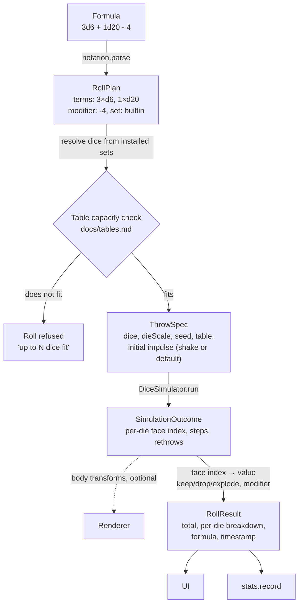

# Architecture

> **Design:** every screen this module map has to serve exists as a live
> prototype — open the [clickable design](https://claude.ai/design/p/5cee69c8-e516-4414-a446-7fd89bb7c706?file=dInfinity.dc.html) or [design/](../design/).
> The menu (option 1q) and Settings (1y) show the navigation.

## Goals that shape the design

1. **The physics result is the roll.** There is no separate RNG path that
   decides the number. Rendering is a *view* of the simulation; turning it off
   must not change how rolls are produced.
2. **Dice sets are data, never code.** Anything downloaded from the internet
   is parsed, validated and rejected on error. It cannot execute, cannot reach
   outside its own folder, and cannot break other dice sets or the app.
3. **Offline first.** Everything except installing a dice set works with no
   network.
4. **Deterministic simulation.** Given the same seed and inputs, the
   simulation produces the same result on every device. This is what makes
   power-saving mode honest and makes bugs reproducible.

## Tech stack

| Concern | Choice | Notes |
|---|---|---|
| Language | Kotlin | Native code (C++) only inside the physics/rendering bridge |
| UI | Jetpack Compose | Material 3 |
| 3D rendering | [Filament](https://github.com/google/filament) | PBR, Vulkan/OpenGL ES, Android-first, Kotlin bindings |
| Physics | [Jolt Physics](https://github.com/jrouwe/JoltPhysics) via JNI | Deterministic, convex-hull collision, good mobile performance. Bullet is the fallback if the JNI binding proves too costly to maintain. |
| Persistence | Room (SQLite) | Statistics, saved rolls, installed set registry |
| Settings | DataStore | Preferences |
| Dice set parsing | Custom TOML parser (or `tomlkt`) | No reflection-based deserialization of untrusted input |
| Network | OkHttp | Only for installing dice sets, tables and saved-roll collections from a URL (`https` only) |
| Images | Android `BitmapFactory` with bounds check first | Textures decoded with explicit size limits |

The physics engine choice is the one most likely to change. The interface the
rest of the app depends on (`DiceSimulator`, see below) is engine-agnostic so
that swapping is contained to one module.

## Modules

```
build-logic/         Gradle convention plugins — every module's build config lives here, once
app/                 Application: single activity, theme, navigation graph
core/
  model/             Die, DiceSet, Face, RollPlan, RollResult — pure Kotlin, no Android deps
  notation/          Formula parser + evaluator (docs/dice-notation.md)
  probability/       Exact PMF computation (docs/probability.md)
  stats/             Statistics aggregation logic
dicesets/
  format/            TOML schema, validator, shape catalogue, table definitions (docs/dice-sets.md, docs/tables.md)
  install/           Fetch from git forges / https archives / local files, verification, extraction into sandboxed storage
  builtin/           The bundled standard set and default tables as a normal package (eats its own dog food)
simulation/
  api/               DiceSimulator interface, table geometry + capacity check, settle/face-read logic
  jolt/              Jolt JNI bridge (C++)
render/
  filament/          Scene setup, materials, camera, die meshes, tray
  headless/          No-op renderer used in power-saving mode
input/
  shake/             Sensor fusion → throw impulses
designer/            Face drawing canvas → dice set export (docs/face-designer.md)
data/                Room database, DAOs, DataStore
feature/             One module per screen group; see docs/TODO.md Step 4
  roll/              Roll screen: tray, dice picker, formula field, result sheet
  graph/             Outcome graph
  saved/             Saved rolls: groups, list, editor, import/export
  sets/              Dice set browser, details, installer
  tables/            Table picker
  designer/          Face designer screen over the designer/ engine
  stats/             Statistics, history and sessions — the "Look back" screens
  settings/          Settings and the menu
test-fixtures/       Test data shared by every module: dice sets, collections, golden roll cases
```

Ten screens, eight `feature/` modules: statistics, history and sessions are one
module because they are one screen group over one set of data
(`design/dInfinity.dc.html`, options 1w, 1x, 6c) and splitting them would only
split the queries.

Rule: `core/*`, `dicesets/format`, `simulation/api`, `render/headless` and
`test-fixtures` are plain Kotlin modules with no Android dependency, so they
run on the JVM and stay fast; everything else is an Android library.
`simulation/jolt` and `render/filament` are tested with instrumented tests on
a device plus the golden determinism suite (`docs/TODO.md`, Step 5).

Build configuration is not repeated per module: `build-logic` provides four
convention plugins — `dinfinity.kotlin-jvm`, `dinfinity.android-library`,
`dinfinity.android-feature` (a library with Compose) and `dinfinity.android-app`
— and every module's build script is a plugin line plus its dependencies.

## Data flow of a roll



The `DiceSimulator` runs at a fixed timestep. In normal mode it is stepped in
lockstep with the frame clock and the renderer interpolates. In power-saving
mode it is stepped as fast as the CPU allows on a background thread and only
the outcome is delivered. Same code path, same result for the same seed.

## Threading

- **Main thread:** Compose UI only.
- **Simulation thread:** owns the physics world. Steps at 120 Hz fixed
  timestep (see physics doc). Publishes transforms via a lock-free
  double-buffer.
- **Render thread:** Filament's own thread; reads the latest transform buffer.
- **Sensor thread:** `SensorManager` callbacks are batched and forwarded to the
  simulation thread as impulse events.
- **IO dispatcher:** database, dice set installation, texture decoding.

## Storage layout

```
<filesDir>/
  dicesets/
    <set-id>/                 one folder per installed package (dice and/or tables), id is a sanitised slug
      diceset.toml
      textures/…
      .meta.json              source URL, commit hash / archive checksum, install time, validation report
  designer/
    drafts/…                  in-progress face drawings
  savedrolls/
    imports/…                 imported collections kept for "re-import / diff"
<databases>/dinfinity.db       Room: stats, saved rolls, roll history, set registry
```

Dice set folders are treated as read-only after installation. Uninstall
deletes the folder and the registry row; statistics referencing that set are
kept (they are keyed by set id and die id, not by file path).

## Key decisions log

| # | Decision | Reason |
|---|---|---|
| 1 | Result comes from physics, always | Core value proposition; avoids "is the animation just theatre?" |
| 2 | Fixed-timestep, seeded, deterministic sim | Power-saving mode must be provably the same roll; reproducible bugs |
| 3 | TOML for dice sets | Human-editable, no code execution, comments allowed, simple to validate |
| 4 | v1's shape catalogue is closed: nine convex solids, no author-supplied meshes | Convex-convex collision is fast and robust, and nine known-fair solids need no fairness UI; sets vary values and artwork, not geometry |
| 5 | Dice sets installed into sandboxed per-set folders | Containment; a set cannot reference files outside its folder |
| 6 | Exact PMF via convolution, not a normal approximation | It is cheap for realistic formulas and correct for small dice counts |
| 7 | d100 is two d10s (tens + units) | Matches table convention; a 100-sided ball does not roll honestly in a tray |
| 8 | Stats keyed by (set id, die id), not by shape | A custom d20 with a skull on the 1 is still a d20 for statistics — but users may also want per-set stats |
| 9 | Table mesh is fixed; only its look is exchangeable | The tray *is* the screen; a fixed box keeps physics predictable and the capacity limit meaningful |
| 10 | Rolls that exceed table capacity are refused, not batched | Too many bodies in a small box produces tunnelling and jitter — that is not a roll, it is a bug generator |
| 11 | Downloads from any `https` archive URL, with first-class support for git forges | Not everyone is on GitHub; the safety comes from the validator, not from the host |
| 12 | GPL-2.0-or-later | Author's choice; user content (sets, tables, saved rolls) is explicitly not covered |
| 13 | Seeds and inputs are recorded but never surfaced; no replay in the app | Determinism is for testing and bug reports, not a feature; a past roll is a record, not something to re-run |
| 14 | Tables are global; a dice set never overrides the selected table | One tray on the screen, whatever mix of sets is in the throw |
| 15 | Saved-roll import refuses a duplicate group name instead of merging | No conflict UI to get wrong, and an import can never damage existing rolls |
| 16 | Power-saving is manual only | A roll that silently stops rendering because the battery dipped is a surprise |
| 17 | `minSdk` 36, `compileSdk`/`targetSdk` 37 | Robolectric cannot start API 37 and cannot run below `minSdk`; a `minSdk` of 37 would cost the whole Robolectric test tier for one API level of reach |
| 18 | Nothing touches a die at rest: prevention, then corrections while a die is still moving, then a visible re-throw of that one die | A settled die that twitches shows the player the result being arranged rather than rolled — worse than the stacked die it fixes. Re-throwing a cocked die is fair, and it is what a player does at a real table |
| 19 | The verdict on an instrumented run comes from its JUnit XML, not from AGP's own pass/fail | AGP 9.4.0 cannot pass a run on a device whose adb serial contains a colon — which is every device attached over WiFi debugging — so its verdict is unusable here (`docs/build-setup.md`) |
| 20 | Release APKs are signed v2+v3, not v1 or v4 | v3 carries the proof-of-rotation record, so a lost or compromised release key can be replaced without breaking updates for anyone who already installed the app; v1 is unread above API 24 and v4 only speeds up incremental `adb install` |
| 21 | The submitted dependency graph covers the runtime classpaths only | A graph of every configuration also carries the build's own toolchain, producing vulnerability alerts for transitives no file in this repository declares and that Dependabot therefore cannot patch; build-tool advisories ride in on the weekly AGP and Kotlin bumps instead |
