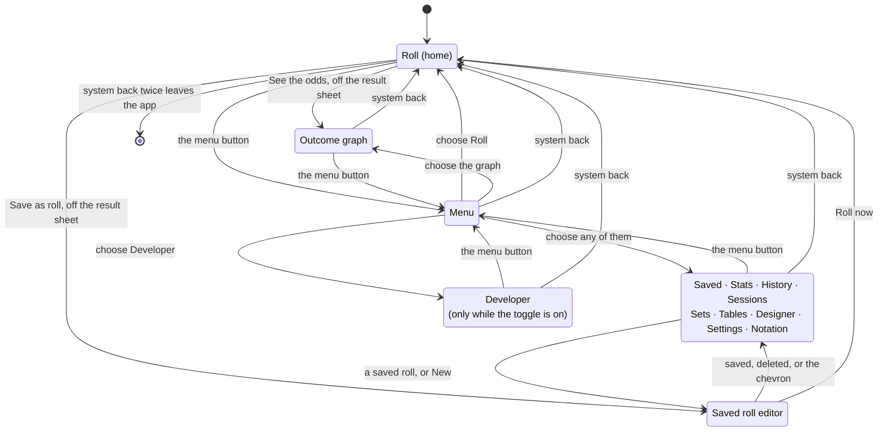
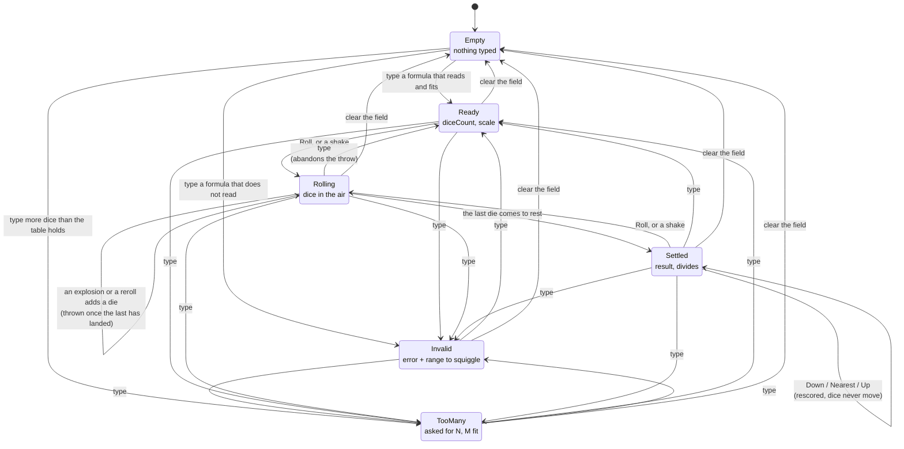
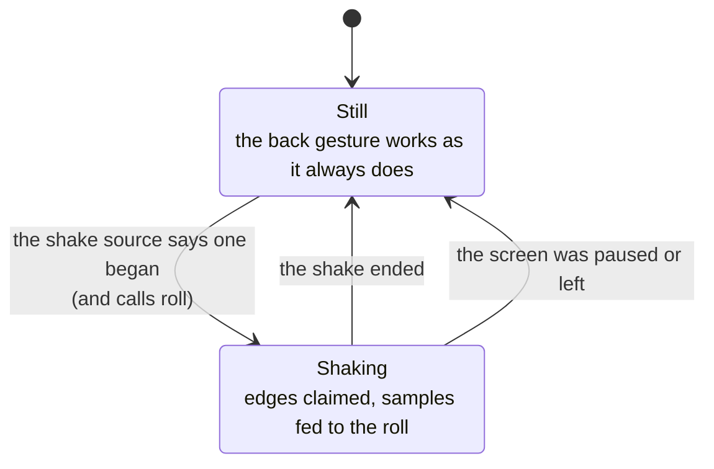
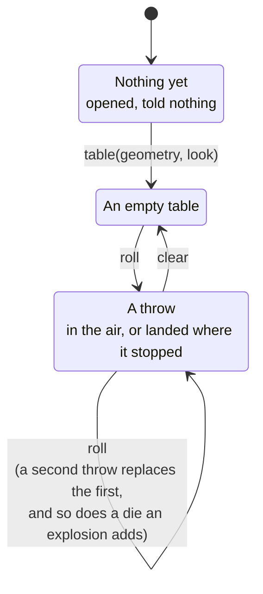
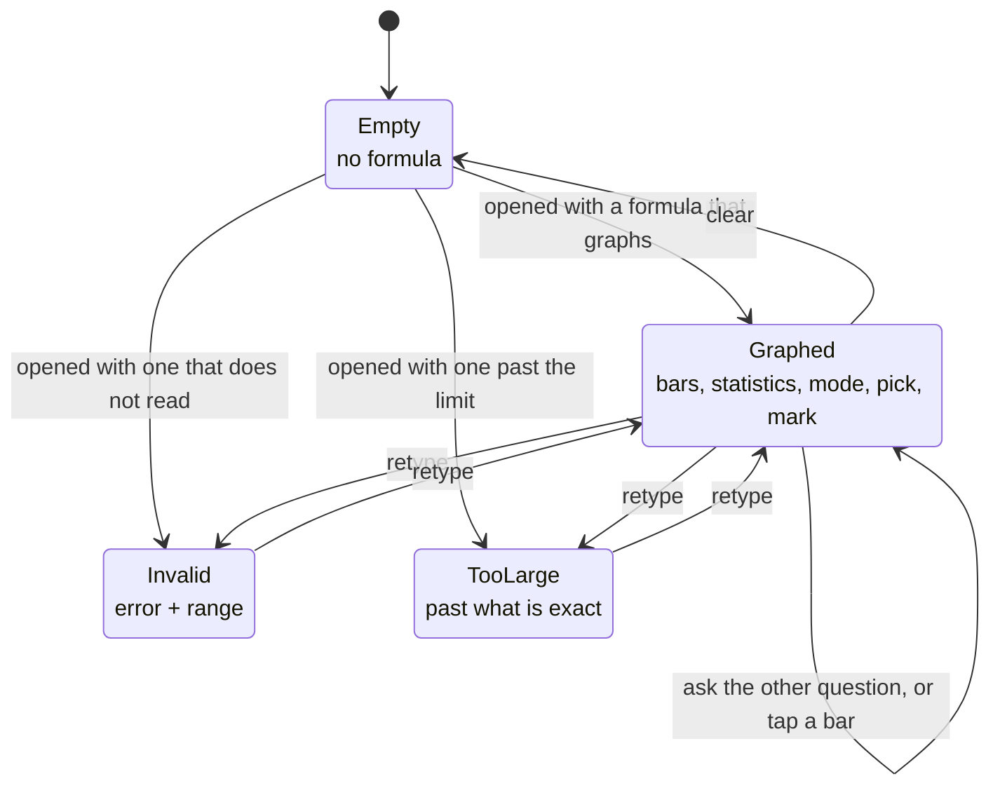
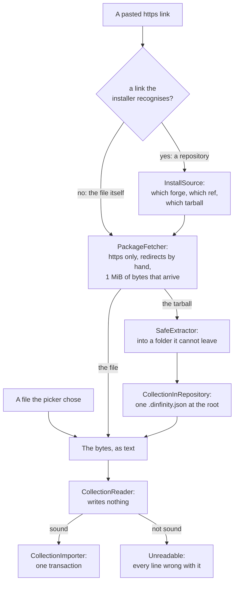
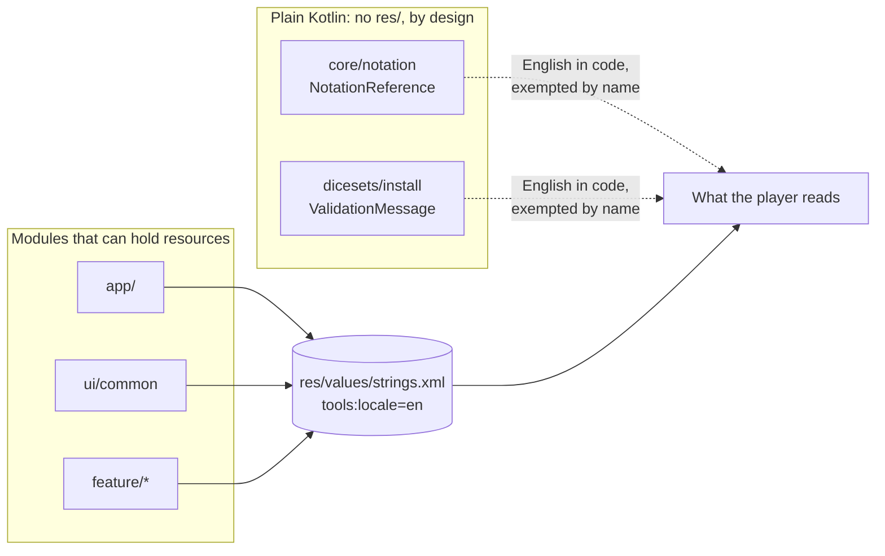
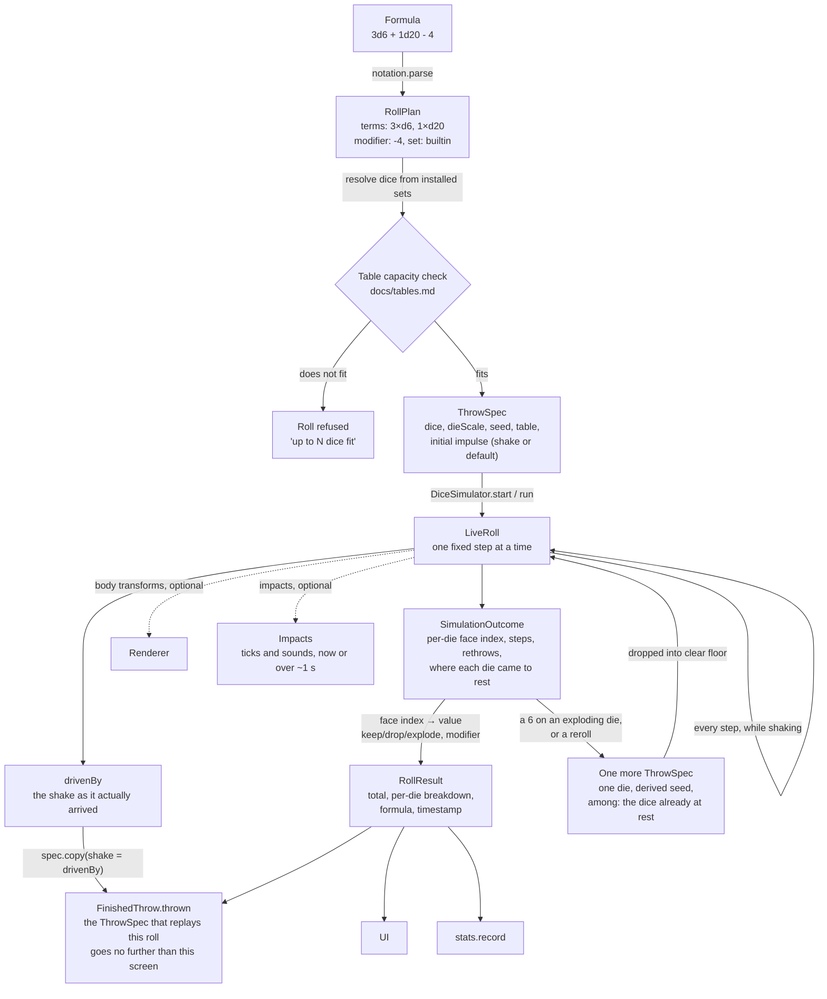

# Architecture

> **Design:** every screen this module map has to serve exists as a live
> prototype — open the [clickable design](../design/dInfinity.dc.html) or [design/](../design/).
> The menu (option 1q) and Settings (1y) show the navigation.

## Goals that shape the design

1. **The physics result is the roll.** There is no separate RNG path that
   decides the number. Rendering is a *view* of the simulation; turning it off
   must not change how rolls are produced.
2. **Dice sets are data, never code.** Anything downloaded from the internet
   is parsed, validated and rejected on error. It cannot execute, cannot reach
   outside its own folder, and cannot break other dice sets or the app.
3. **Offline first.** Everything except installing a dice set works with no
   network.
4. **Deterministic simulation.** Given the same seed and inputs, the
   simulation produces the same result on every device. This is what makes
   power-saving mode honest and makes bugs reproducible.

## Tech stack

| Concern | Choice | Notes |
| --- | --- | --- |
| Language | Kotlin | Native code (C++) only inside the physics/rendering bridge |
| UI | Jetpack Compose | Material 3 |
| 3D rendering | [Filament](https://github.com/google/filament) | PBR, Vulkan/OpenGL ES, Android-first, Kotlin bindings |
| Physics | [Jolt Physics](https://github.com/jrouwe/JoltPhysics) 5.3.0 via JNI | Decided by a spike, not by reading: see decision 37. Built with `CROSS_PLATFORM_DETERMINISTIC=ON`, which is what goal 4 needs and what Bullet does not offer. |
| Persistence | Room (SQLite), processed by KSP | Statistics, saved rolls, installed set registry. Schemas exported and checked in; migrations from version 1 (`docs/statistics.md`) |
| Settings | DataStore | Preferences |
| Dice set parsing | [tomlj](https://github.com/tomlj/tomlj) (TOML 1.0), read through its document tree | Reports the line and column of every key, which is what a validation report is made of. No reflection-based deserialization of untrusted input |
| Network | OkHttp | Only for installing dice sets, tables and saved-roll collections from a URL (`https` only) |
| Images | Android `BitmapFactory` with bounds check first | Textures decoded with explicit size limits |

The physics engine choice was the one most likely to change, and is now made
(decision 37). The interface the rest of the app depends on (`DiceSimulator`)
stays engine-agnostic anyway, so that swapping is contained to one module and
so that everything above it can be tested without an engine at all.

## Modules

```text
build-logic/         Gradle convention plugins — every module's build config lives here, once
app/                 Application: single activity, theme, navigation graph
core/
  model/             Die, DiceSet, Face, the shape catalogue and its atlas layout, a decoded atlas and which of its cells are empty, RollPlan, RollResult, SavedRoll — pure Kotlin, no Android deps
  notation/          Formula parser + evaluator (docs/dice-notation.md)
  probability/       Exact PMF computation (docs/probability.md)
  stats/             Statistics aggregation logic
  collection/        The saved-roll collection format: read, written, validated (docs/dice-notation.md)
  glyphs/            The built-in font, typesetting, where a label goes on a face, and outlines into a signed distance field (docs/physics-and-rendering.md, docs/face-designer.md)
dicesets/
  format/            TOML schema, validator, table definitions (docs/dice-sets.md, docs/tables.md)
  install/           Fetch from git forges / https archives / local files, verification, extraction into sandboxed storage, reading back what is installed, and decoding a die's artwork out of the package it was installed with (docs/dice-sets.md, "Textures"). The fetching and the extraction are shared with saved-roll collections (docs/dice-notation.md)
  builtin/           The bundled standard set and default tables as a normal package (eats its own dog food)
simulation/
  api/               DiceSimulator interface, the catalogue's solids — corners, face directions and which corners make up which face — table geometry + capacity check, settle/face-read logic, the frame clock
  jolt/              Jolt JNI bridge (C++), the roll loop and the roll in progress
  harness/           The Step 5 device harness off the device: what a run is asked for — a count of throws or a length of time — its JSON document, what it may say about frames, and the targets it is scored against (docs/TODO.md, Step 5.1)
render/
  filament/          Scene setup, materials, camera, die meshes, tray
  headless/          The Renderer contract, and the renderer that draws nothing (power-saving mode)
input/
  shake/             Sensor fusion → throw impulses
feedback/            Impacts → haptic ticks and impact sounds (docs/physics-and-rendering.md)
designer/            The personal package, "My dice": the drawing model behind the face designer (marks, drafts on disk, cell outlines), the die turned over in the hand (the projection, the culling and the depth sort behind the Solid tab), the photographs somebody has made tables of, and the export that turns both into an installable package (docs/face-designer.md, docs/tables.md)
data/                Room database, DAOs, DataStore
ui/
  common/            The design system's tokens, and the screen furniture more than one screen needs: the formula field and its squiggle, the die silhouettes, the button, the rule, the segmented control
feature/             One module per screen group; see docs/TODO.md Step 4
  roll/              Roll screen: tray, dice picker, formula field, result sheet, shake to roll
  graph/             Outcome graph
  saved/             Saved rolls: groups, list, editor, import/export
  sets/              Dice set browser, details, installer, and the "My dice" export behind a licence choice
  tables/            Table picker, and "use a photo"
  designer/          Face designer screen over the designer/ engine
  stats/             Statistics, history and sessions — the "Look back" screens
  settings/          Settings, the menu, the notation reference, and the developer screen (docs/physics-and-rendering.md)
test-fixtures/       Test data shared by every module: dice sets, collections, golden roll cases
```

Twelve screens in the menu — thirteen with the developer toggle on — and eight
`feature/` modules: statistics, history,
sessions and saved-roll statistics are one module because they are one screen
group over one set of data (`design/dInfinity.dc.html`, options 1w, 1x, 6c, 8b)
and splitting them would only split the queries.

`core/collection` is the saved-roll collection format, and it lives in `core/`
rather than in `feature/saved` for the same reason `dicesets/format` is not in
`feature/sets`: a file from a stranger is validated in one place, by code that
cannot write anything. Its shape is the import rule made structural —
`CollectionReader` hands back either a collection that is known to be sound or
a list of reasons it is not, never something in between, so whatever imports it
has no judgement left to make. That is how "an import can never damage what is
already there" stops being something every screen must remember.

`core/glyphs` is the font a die with no artwork is printed with, and it is
`core/` for the same reason `ShapeAtlas` is: more than one thing has to agree
about what a `6` looks like. The tray prints one, and the face designer stamps
one from the same font (`docs/face-designer.md`); two fonts that were meant to
be one would disagree, and the disagreement would be a die whose drawn faces do
not match its printed ones. Nothing in it knows what a die is beyond a face and
a label, and nothing in it draws — what comes out is a field of bytes, and the
only thing that needs a GPU is uploading it.

**It holds where the `6` goes as well as what it looks like**, for exactly the
same reason. `LabelRoom` solves the biggest box of a label's proportions that
fits inside a convex face and where on that face it sits, and `FaceLabel` says
what a face is printed with and whether it needs a dot after it; both are asked
by `render/filament`'s `DieNumbers`, about the polygon its mesh draws, and by
`designer`'s `FaceStamp`, about the polygon the canvas is masked into. What is
left on either side is the one thing only that side knows — which polygon it
is. Two solves would eventually disagree, and the disagreement would be a die
drawn from its own numbers that did not match the same die printed.

**`designer` depends on `:simulation:api`**, which looks like a drawing screen
reaching for a physics module and is the same argument one more time. The
designer's Solid tab turns the real polyhedron over, and `simulation/api` is
where a catalogue solid *is* — its corners, the direction of each readable
position, the face order every set file is read in and which corners make up
which face (`SolidFaces`). Nothing of the simulator comes with it: the
dependency is on the closed forms, which are plain Kotlin with no engine
behind them, and the alternative is a second account of a die's geometry in
the one module most likely to be looked at beside the first (decision 35).

`ui/common` is **not** a feature and is not a place for anything that is
merely shared. Nothing in it knows what screen it is on, and it depends on
`core/notation` and nothing else — so a piece of furniture cannot reach a
database, a simulator or the navigation graph. It exists because three screens
take a formula, validate it on every keystroke and have to say the same thing
about the same mistake: the tray, the outcome graph and the saved-roll editor.
Two copies of "the same thing" is one copy too many, and the disagreement
would eventually be about whether somebody's formula is valid.

The rule for putting something in it is the same rule: **more than one screen
needs it, and it needs no screen.** A control that navigates does not go in —
the menu button lives in `feature/settings` and is handed to each screen as a
slot, because where it goes is the navigation graph's business and the
navigation graph is `:app`'s.

**The design system's tokens live here too, and the reason is the dependency
arrow.** `Modernist` — the palette, both ramps, the spacing scale, the type
scale, the rule weights and the zero radius, transcribed from
`design/_ds/modernist-.../styles.css` — used to sit beside the theme in `app/`.
But `:app` depends on every feature module, so no feature could import it, and
six of them each kept their own transcription of the same numbers. Six copies
of one scale is six chances for it to drift from the stylesheet and from each
other. `ui/common` is the only module every screen is above, so it is the only
place the tokens can be. `:app` reads them from here as well, and `Theme.kt`
keeps the job it always had: turning them into Material's colour roles, type
slots and shapes. `ModernistTest` reads `styles.css` at test time and fails if
the transcription and the design system have come apart.

`feedback` is the other end of the wire `input/shake` is one end of, and it is
shaped the same way: the thresholds, the layout in time, the pitch, the tick and
the five waveforms are plain Kotlin, and only `SystemBuzzer` and `PcmSpeaker`
touch an Android API. It is not in `feature/roll` because it is not about a
screen — the tray plays through it, and the tray belongs to `render/filament`.

Rule: `core/*`, `dicesets/format`, `simulation/api`, `simulation/harness`,
`render/headless` and
`test-fixtures` are plain Kotlin modules with no Android dependency, so they
run on the JVM and stay fast; everything else is an Android library.
`simulation/jolt` and `render/filament` carry native code and are tested with
instrumented tests on a device. `simulation/harness` ships in nothing: it is on
the *test* classpath of `simulation/jolt` and nowhere else, and the arrow only
goes that way — it knows about a `SimulationOutcome` and about no engine at all
(decision 53). The golden determinism suite spans both tiers
from a source set they share, `simulation/jolt/src/sharedTest`
(decision 44). Most of `simulation/jolt` is *not* device-only,
though, and that is deliberate: everything it decides about a roll is Kotlin
over an interface, and only the two files that talk to the engine need a phone
(decision 40).

Build configuration is not repeated per module: `build-logic` provides four
convention plugins — `dinfinity.kotlin-jvm`, `dinfinity.android-library`,
`dinfinity.android-feature` (a library with Compose) and `dinfinity.android-app`
— and every module's build script is a plugin line plus its dependencies.

## Screens and the states behind them

Two state machines, and they are deliberately not the same one. **Which screen
is on** is navigation, owned by the `NavHost` and keyed by `Destination`.
**What a screen is doing** is that screen's own state, owned by its presenter
and never by the navigation graph. A screen left and returned to is built
again from scratch; nothing about a roll survives the trip, and that is the
point — a presenter owns a physics world and a scene, and leaving the screen
gives both back (decision 49). The roll *thread* and the Filament engine on it
are the exception, and belong to the application rather than to a visit
(decision 50).

**Every screen is wired in one place.** `Presenters` names a factory per
screen, with no optional fields and no defaults, so a destination that has been
added but not wired stops the activity compiling rather than drawing a
placeholder nobody notices — which is what happened to the sessions screen for
a whole step. `DInfinityApp` takes it as nullable, because drawing placeholders
for *everything* is a real mode: a Robolectric test of the navigation graph has
no GPU and no physics engine. What that mode may not be is partial.

**A visit is the back-stack entry, and nothing else.** A presenter is
remembered against that entry, never against the lambda that builds it: such a
lambda is built afresh on every recomposition, so remembering against one makes
a new presenter — and on the roll screen a new tray — every time any preference
changes. On a cold launch one always does, because the defaults stand in until
the settings file has been read. The surface is handed to the tray that is
there when the surface is *created* and to no other, so the discarded tray kept
it and the dice rolled where nobody could see them.

### Navigation

Every screen is a `Destination`, and the graph has had every one of them from
the start so that adding one is a change in a single place. `Roll` is home. The
**menu** is a destination too: it lists the other eleven and is not in the
list itself (`design/dInfinity.dc.html`, option `1q`).

One destination is listed conditionally. **Developer** is in the App section
beside Settings and appears only while `AppSettings.developerTools` is on,
which it is on no install until somebody turns it on. The *route* exists
either way — a route that came and went would be a back stack that could not be
restored — so what the toggle governs is whether anything offers it
(`docs/physics-and-rendering.md`, "Debug tooling").



**Every screen is now reachable, and every one of them by the same control.**
The menu button sits in the top corner of each, so wherever a player is, every
other screen is two presses away. Choosing a row takes the menu *off* the back
stack with it, so back from what it opened goes where the menu was opened
from — a menu you have to press back through twice reads as a detour. Choosing
the screen you are already on does not stack a second copy of it.

Nothing is undefined, and nothing is unreachable. `NavHost` answers back on
every destination, `Destination.home` is where the app opens, and a route that
does not resolve cannot be reached — `Destination.ofRoute` is the only way in
and it is total.

**Back off the roll screen is two presses, not one.** From anywhere else, back
goes to Roll and clears the stack, which is what the diagram has always said.
On Roll itself it *arms*: the first press raises a toast reading "Back again to
leave dInfinity", and a second press within **two seconds** leaves. After that
the arming lapses, so a stray swipe cannot close the app a minute later. The
design asked for it (2026-09-17) and the reason is the screen it guards — the
roll screen is where the app opens and where a result sits while somebody is
still reading it, and it is also the screen with the largest gesture surface in
the app.

The rule is `LeavingTheApp`, a state machine over "back was pressed at time
*t*" with **the clock handed in**, and it knows nothing about Compose. A timer
inside a composable would make the behaviour something only a phone could
observe, and the case that matters most — the press that arrives a millisecond
too late — would be a two-second sleep in a suite that runs on every commit.
What the screen adds is the press, the words and `finish()`; the handler is in
the composition only while the tray is, so it cannot fire on a screen it was
not written for. There is **no "closed app" screen**: the prototype draws one
because a web page cannot close, and an app that closes is closed.

The toast is `ui/common`'s `ModernistToast` — the design's inverted plate,
`--color-text` ground and `--color-bg` letters, `8`/`14` dp of padding and
`--shadow-md` — and it takes itself away after **2.6 s**. That is six tenths of
a second longer than the window it names, so a press in the gap arms again
rather than leaving. It is the failure worth having: an app that stays open
when it was asked twice is one press from closing, and one that closes when it
was asked once is gone.

**A chevron in a header always goes up, never back.** It takes the player to
the hub the screen was opened from, and from the hub to Roll, whatever path
they took to get there. It is not a second spelling of the system's back
button: one of them retraces steps and the other climbs, and a control that
sometimes does each is a control nobody can predict.

Where up *is* is `Destination.up`, and it is total: the menu for everything the
menu lists, the list it belongs to for the three screens that are about one of
something — the editor and an import go to Saved rolls, a set's details to Dice
sets — the tray from the menu, and nowhere from the tray, where leaving is back
twice. `NavHostController.climb` is the only way it is used, and it never pops:
it navigates, leaving the tray at the bottom of the stack and the screen
climbed to on top of it. So the editor opened from the tray's strip and the
same editor opened from the list leave by the same chevron to the same place,
which a `popBackStack` could not do.

Today one screen draws the chevron: the **saved-roll editor**, which is the
only screen with no menu button — it is about a roll rather than about a
subject — so without it the only ways out were saving, deleting and the
system's own back. Saving and deleting climb the same way. The `←` on
Statistics and the `Back` on saved-roll statistics are *not* chevrons in this
sense and do not navigate: they close a detail on the screen they are drawn on.

### One safe area, applied once

The window goes edge to edge, and what the system covers — the status bar, the
gesture bar, a cutout — is applied by the navigation graph, **once**, around
whatever it is about to draw.

It used to be each screen's own job, which works exactly as long as nobody
forgets. Settings forgot: on the Pixel 10a its title and menu button sat under
the clock, 58 dp above where the tray's menu button sat, and nothing could have
caught it because every screen's own test draws that screen in a window with no
status bar, where inset and not-inset look identical. A screen should not have
to know the window has edges.

`Destination.fullBleed` is the one way out and the tray is the one destination
that takes it: it is a single full-bleed table with everything floating on it,
and felt inset by 58 dp would be a grey stripe across the top of the screen.
The tray insets its *controls* instead — the menu button, the debug overlay,
the stack of controls along the bottom. Window-inset padding consumes what it
applies, so a screen that still insets something inside itself gets nothing
twice.

The menu button is **handed to each screen rather than built by it**. A screen
that knew what the menu was would be one feature module depending on another,
and the navigation graph belongs to `:app`. Each screen takes a `menu`
composable slot and draws it where it has room.

Three destinations are not in the menu, and for the same reason: they are
about something rather than about a subject. The menu *is* the list; the
saved-roll editor is about one roll, reached from that roll; and importing a
collection is about saved rolls, reached from their screen. A menu row for the
last of those would be a row that means nothing until somebody has a file.

**Five destinations are opened with arguments.** The outcome graph is about a
formula, and after a roll it also marks the total that came up, so its route
is `graph?formula={formula}&total={total}`. The tray takes a formula too —
`roll?formula={formula}` — which is what tapping a saved roll does, and the
editor takes the roll it is editing, or nothing for a new one: it puts
the formula in the field and leaves the throw to the player, because a saved
roll is a formula with a name rather than a roll waiting to happen. A set's
details screen takes the set. The face designer takes the die to draw on —
`designer?die={die}` — which is what "Doodle this die" carries out of the
breakdown: quick mode is the same screen on a different die rather than a
screen of its own (`docs/face-designer.md`, "Quick mode"). Two rules keep
arguments from spreading trouble:

- **Every argument is optional and defaults to empty.** A destination that
  could only be opened with an argument is a destination the menu could not
  open, and the menu opens every one of them. A bare `graph` is a graph with
  no formula, which says where a formula comes from, and a bare `designer` is
  the designer on the die it always opens on.
- **The formula is URI-encoded on the way in.** `+` and `/` are characters a
  formula is made of and a URI reserves; unencoded, `3d6 + 4` arrives as
  `3d6   4` and graphs a different roll.

A screen built from its arguments is a screen that comes back the same from a
restored back stack, which is the other half of "a screen left and returned to
is built again from scratch".

### The roll screen

`RollState` is what the roll screen is doing. It is a sealed interface, so the
screen's `when` over it is exhaustive by the compiler rather than by
inspection: a state nobody drew would not compile.



**The self-loop on `Rolling` is a roll adding dice to itself.** `8d6!` is not
eight dice: it is eight dice and then, for each six, another — and how many
that is cannot be known until the first eight have landed. So `settled` hands
back either the finished throw or the *next* throw to make (`Landed`), and the
screen goes on saying "Rolling…" while each added die is dropped into the tray
among the dice that set it off (`docs/physics-and-rendering.md`, "The dice an
explosion or a reroll adds"). Every one of those throws is an ordinary throw
down the ordinary path; there is no second way to get a number.

**Typing is the one input every state accepts**, which is why it reaches every
state in the diagram: the field is live on every keystroke and is never
disabled, including while the dice are in the air. That last edge is the one
worth reading twice. Typing during `Rolling` *abandons* the throw — the record
of it is dropped, so when the physics finishes, `settled` finds nothing waiting
for the outcome and discards it. The dice keep tumbling on screen, because
nothing touches a roll that is under way; what has gone is anybody's interest
in the answer. A result that arrived for a throw nobody is waiting for is
ignored rather than shown, and that is deliberate: a screen one stray callback
away from a total with no roll behind it would not be worth the rest of the
file.

### What each state puts on screen

| State | Total | Message | Sheet | Roll button | Formula field |
| --- | --- | --- | --- | --- | --- |
| `Empty` | — | what to do next | — | disabled | live |
| `Invalid` | — | the formula again, squiggled under what is wrong, and why | — | disabled | live, in error |
| `TooMany` | — | how many were asked for and how many fit | — | disabled | live, in error |
| `Ready` | — | that shaking also rolls | — | **enabled** | live |
| `Rolling` | — | "Rolling…" | — | disabled | live |
| `Settled` | the total | — | breakdown, and rounding if the formula divides | **enabled** (throws again) | live |

Neither blank cell in the first two rows is an accident: a tray with nothing
on it and a button that does nothing is a screen with no way in, and shaking —
the one input nobody would guess at — has nowhere else to be announced.

**Over all of it, once**, a new install shows the first-launch screen
(`design/dInfinity.dc.html`, option 9a). It is not a state of `RollState`: the
machine underneath is `Empty` like any other new screen, and the welcome is a
sheet on top with four ways out, all of them forward. Its "roll a d20 now"
types `1d20` into the field and asks for a roll — there is no demonstration
path and no canned number. That it has been seen is remembered on disk, and
also in the composition, so the screen changes when the button is pressed
rather than when a write comes back.

Two of the four go and fetch something — saved rolls from a file or a link,
dice sets from either — and **neither dismisses it**: coming back to a tray
that had forgotten it ever said hello would leave somebody wondering what to do
next, and the count line above the buttons has something new to say when they
return. That line counts dice sets, saved rolls and sessions. The first is the
roll screen's own; the other two arrive as a `WhatIsThere` from `:app`, because
`feature/roll` does not know what a saved roll or a session is — the same rule
the saved-roll strip follows, which is a slot rather than a screen. It is a
flow, watched only while the welcome is up, and it is built from the
repositories rather than from presenters: a sessions presenter would make the
default session as a side effect, and saying hello is not a reason to write to
a database.

**The formula sits on the tray as text, not as a field.** A dashed rule under
it says it can be typed into; a tap brings the field and the keyboard up, and
the keyboard's action key rolls (`design/dInfinity.dc.html`, option 2a). A
field is a thing to fill in and this is a thing somebody has written. The hint
stands in when nothing has been typed, so there is always something to tap, and
the line is marked when the formula does not read — *what* is wrong is said in
the editor, under the squiggle, because that is where somebody can fix it.
Whether the editor is open is the screen's, remembered across a rotation, and
`RollMachine` knows nothing about it.

**Two menus hang off the top edge, and only one of them can be open.** The
formula is one of them, on the right under the menu button; the dice picker is
the other, on the left. Both push what is under them down rather than floating
over it, so two open at once would be the top half of the table covered —
which is the thing the layout exists to stop
(`docs/physics-and-rendering.md`, "What is drawn over the table"). Which is
open is two booleans on the screen, remembered across a rotation, and opening
either shuts the other in one place rather than in each control.

The picker row is not in that table because it is reachable, and live, in
every state — for the same reason the formula is, and in fact for exactly that
reason: it is the formula edited with a thumb. It is *put away* rather than
absent: the pull-down's head carries the count of dice the formula asks for,
so a shut menu still says what is in the throw.

Every control on the screen is connected to exactly one of those transitions,
and none of them decides anything itself:

- **the formula line** opens the editor, and **the editor** calls `type` on
  every keystroke and `roll` on the action key;
- **the dice pull-down** puts the picker on screen and takes it away again,
  and decides nothing about the roll;
- **the dice picker row** calls `add` on a tap and `remove` on a long press,
  and both are `type` underneath — a tap *is* an edit to the formula, so it
  re-validates, re-checks the table's capacity and abandons a throw in the air
  exactly as a keystroke does (`docs/dice-notation.md`);
- **the Roll button** calls `roll`, which is one press for one throw — a
  settled roll is put away by the presenter rather than by a second press;
- **a shake** calls the same `roll`, which is why it had to be one act;
- **Down / Nearest / Up** call `round`, which rescores from subtotals that
  already landed and never moves a die;
- **the one-tap fix under an error** calls `type` with the formula the parser
  suggested, so a suggestion taken is indistinguishable from the same
  correction typed by hand;
- **pinch and two-finger drag** call `look`, which moves the camera and is not
  a state change at all — where a player is standing is not what the dice did;
- **See the odds** and **Save as roll** are the two controls that leave the
  screen. Neither changes any state here at all: the first carries the formula
  as typed and the total that landed (`design/dInfinity.dc.html`, option 7a),
  the second carries the formula alone to the saved-roll editor (option 3b).
  Both live at the foot of the result sheet, so both are offered in `Settled`
  and in no other state — a device session asked for them to be part of the
  result rather than plates standing on the felt. **That is a narrowing**: the
  odds used to be offered in `Ready` and `TooMany` as well, and the refusal
  was the case with the best argument, because a throw the table cannot hold
  is exactly when "what would it have been" is the only answer there is. What
  is left for that case is the menu, which reaches the graph from anywhere.
  Neither callback knows where it goes, because `feature/roll` may not depend
  on `feature/graph` or `feature/saved`.

In power-saving mode the tray is not there at all, and the list is otherwise
unchanged: the dice are thrown by the same `roll`, stepped by the same loop,
and the total arrives in the same `Settled`. Only pinch and pan have nothing
to move (`design/dInfinity.dc.html`, option 1z).

The tray is not in that list on purpose. It draws what the roll is doing and
has no way to change it: `Renderer` has no method that returns anything
(decision 48), so drawing a roll cannot alter one, and a one-finger tap on the
tray deliberately does nothing yet (`docs/physics-and-rendering.md`, "Starting
a roll").

### While the phone is being shaken

`RollState` is what the *roll* is doing, and it is not everything the screen
knows. There is one more piece of state, deliberately outside the sealed
interface: **whether a shake is going on right now**. It is owned by
`ShakeToRoll` and read by nothing that scores a roll.

It is separate because it is not about the dice. A shake begins, the dice are
thrown, `RollState` goes to `Rolling` — and the hand carries on moving through
all of that, and after the dice have settled too. What this state drives is the
phone, not the roll.



While it is `Shaking`, `HoldTheEdges` keeps the back gesture off a band down
each side, because a hand around a phone being shaken is a hand on both edges
of it. The edges are given straight back afterwards, and leaving the screen
mid-shake counts as afterwards — an app that kept the back gesture because it
never saw the shake end would be a worse citizen than the problem it solves.

Three more things hang off the screen's lifecycle rather than off any state,
and none of them is a control anybody presses:

| | Held while | Given back |
| --- | --- | --- |
| the accelerometer | the screen is resumed | on pause — a sensor left running behind a backgrounded app is a battery bill for nothing |
| the screen staying awake | the screen is on screen | on leaving it; a tray is something a table looks at between turns, and a phone that blanks after fifteen seconds has to be poked to read a roll |
| the orientation lock | the same | the same. The tray *is* the screen (`docs/tables.md`), so a *quarter* turn rebuilds the table — the right answer for a player who meant it, a surprise for one who is shaking it. A *half* turn gives the same table back and is allowed: pinning the display to one rotation also freezes what `PhoneAxes` is told about which way the hand went (`docs/physics-and-rendering.md`) |

### What the tray is drawing

The tray has a small state machine of its own, in `TrayLoop`, and it is worth
drawing because it is the one place where a transition nobody thought about
strands a roll — which it did, for real, on the phone.



A die an explosion adds is a `roll` like any other, and it replaces the throw
before it like any other. What keeps the tray from emptying is that the throw
*carries* the dice already down (`ThrowSpec.among`): the scene is rebuilt with
each of them back where the simulation left it, and only the new die moves
after that. The tray has no state of its own for "a roll that is still adding
to itself", and deliberately — that is the roll screen's question, one level up.

A surface arriving or going is **not** on that diagram, and that is the point:
it is not a state of the tray but of where the tray draws. The two are crossed,
not merged, and one rule decides who asks for the next frame:

| | A roll is in the air | Nothing is moving |
| --- | --- | --- |
| **a surface** | a frame every vsync | one frame, and only until a frame actually lands |
| **no surface** | a frame every vsync anyway | none — nothing to draw on, nothing owed that could be paid |

The top-right cell is the subtle one. The frame callback is what *steps the
simulation*, so a roll that stops being asked for frames is a roll that stops:
never read, never reported, never over, with the screen on "Rolling…" for good.
Drawing is the part that needs a surface; the physics is not, and must not wait
for anybody to be looking.

The bottom-right is the other half. A still picture — an empty table, a pinch,
a roll that has already landed — has nothing coming after it to cover for a
skipped frame, so it is *owed* one and goes on asking until one lands. With no
surface there is nothing to pay it with, so the debt is simply carried until a
surface arrives.

### The outcome graph

`GraphState` is a smaller machine of the same shape, and it is smaller for a
reason: the graph has no thread, no engine and nothing to wait for. A formula
goes in and a distribution comes out.



`TooLarge` is the state worth reading twice. The formula is legal and may even
be rollable; what cannot be done is working out its distribution exactly, and
the screen says so rather than drawing an approximation. An approximated curve
presented as the odds is a number somebody bets on
(`docs/probability.md`).

Tapping a bar and changing the question both stay in `Graphed` and redraw the
same distribution — neither is a new computation. Retyping drops the tapped
bar with it, because a bar at 14 on one distribution is not the same bar at 14
on the next.

### Saved rolls

`SavedState` is the third of these machines and the first that **watches**
rather than holds. Its groups and rolls come from the database as flows, so a
roll saved in the editor or arriving in an import appears without anybody
asking. The two flows are combined rather than collected apart: a list of
rolls and the groups they belong to arriving a frame apart is a list that
flickers through a state that was never true.

| | |
| --- | --- |
| `loaded = false` | the database has not answered yet — **not** the same as empty |
| `loaded && rolls.isEmpty()` | nothing saved in this group, which is a thing to say |
| `switching` | the group switcher is open over the list |

The first row is the one worth having a field for. "Nothing saved yet" drawn
under a list that has simply not arrived is the app telling a player their
rolls are gone.

Two things the screen does *not* decide. Whether a formula still resolves is
re-checked every time the list is drawn rather than stored, because the set it
names can be uninstalled between one drawing and the next; and the order — the
one the player dragged the list into, `sort_order` — is SQL's, because it is
what the list *is* (`docs/dice-notation.md`, "Saved rolls").

**A drag is the one thing the screen holds that the database does not yet.**
The list reorders live under the finger and is written down when the finger
lifts, so between those two moments the presenter is showing an order the
database has not been told about; `move` keeps it and `settle` writes it, in
one transaction. Until the database reports that order back, an emission
arriving for any other reason — a use count, an import — is drawn in the order
the drag left, because a row that snapped back under the finger moving it
would be the screen arguing with the player. What a reorder *comes to* is
`SavedOrder`, plain Kotlin with no Compose in it: the list, the row being
dragged and where the finger is, to the list to draw. The gesture and the
drawing are the screen's, and the row that moves is the one under the pointer
rather than the one the drag began on.

**The list is its own scroll box.** The title bar, the group switcher and the
line above the list stay where they are; only the rolls move. A list that
scrolled the whole screen would take the group name away exactly when somebody
is looking for it.

Reordering is offered twice, because a drag is not available to everybody: the
grip carries **Move up** and **Move down** as custom accessibility actions, so
a list that can be ordered with a finger can also be ordered with TalkBack
("Accessibility", below).

| Control | Calls | What changes |
| --- | --- | --- |
| the group name | `showGroups` | whether the switcher is open |
| a group in the switcher | `open` | which group's rolls are listed, and the stored active group |
| a group's **…**, or a long press on it | `GroupPresenter.edit` | the group sheet opens on that group |
| **New group**, at the foot of the switcher | `GroupPresenter.create` | the group sheet opens on a group that does not exist yet |
| **⤴** | the collections sheet | the two ways out — this group with its subgroups, or everything — and the one way in |
| a row, tapped | `used`, then navigation | one more use, and the tray with that formula in its field |
| a row, long-pressed | the editor | which screen is on, opened on that roll |
| **New** | the editor | the same, opened on a roll that does not exist yet |

### The group sheet

`GroupDraft` is a machine of its own but not a screen: a group is a name, a
mark, which group it sits in and the table its rolls land on, and four fields
do not deserve a destination
— nor a place in the navigation graph that the back button would then have to
mean something on. It is a dialog over whichever screen opened it, and both
the saved-rolls list and the editor open the same one, so a group made while
writing a roll is made the same way and refused for the same reasons.

It watches the same two flows the list does, which is what lets both of its
rules be answered *while the player types* rather than when they press Save.
The two flows come from two repositories: `SavedRollRepository` for the rolls
and `SavedRollGroupRepository` for the folders, joined by `SavedRollLibrary` —
the one place the two halves meet, in the sense `SetLibrary` is for dice sets.
A screen takes the library rather than the pair, and a rule that spans both
(deleting a group moves its rolls; a roll's table falls back to its group's)
is written there once rather than in each screen that needs it.

| Rule | Answered by | Why it is not only checked at import |
| --- | --- | --- |
| a group's name is its own | the group list, ignoring case | an import refuses a collection whose group name is taken (decision 15); a name the app itself let you duplicate would make that refusal arbitrary |
| groups nest exactly one level | `parents`, and `nestable` | checked from *both* ends — a group cannot go inside one that is already inside another, and a group with groups inside it cannot go inside anything |

The second is the one that was wrong until this sheet existed. Checking only
the parent lets a three-deep tree be built from the bottom: make the child,
then move its parent. `SavedRollGroupRepository.save` refuses both, because an
import writes without ever passing through the sheet.

| Control | Calls | What changes |
| --- | --- | --- |
| the name field | `name` | the name, and whether another group already has it — named, not merely reported |
| a mark | `choose` | that mark, or none when the chosen one is tapped again |
| **Inside** | `choose` | which group it sits in; the chooser is absent, with its reason, for a group that has children |
| **Table for this group** | `choose` | the table every roll in it lands on, unless the roll pins its own. "Default" means the app's (`docs/tables.md`) |
| **Save group** | `save` | the group is written, the sheet closes, and whoever opened it is handed the id |
| **Delete** | `delete` | the group goes, its rolls move to Unfiled and its child groups are lifted to the top level. Nothing a player wrote is deleted, and the sheet says how many rolls will move before it is pressed |
| **Cancel** | `dismiss` | the draft is thrown away |

Unfiled is the one group with no **Delete**: it is where a deleted group's
rolls go, so it has to be there to go to.

### Which table a throw lands on

The same shape rule as below, for the same reason: **the roll screen does not
know what a saved roll is**, so it cannot ask which table one is pinned to.

`RollMachine` takes a `(TablePin?) -> TableLook` rather than one fixed look,
and asks it with the pin the *throw* came with. Resolving a pin needs the
installed sets, which is `:app`'s to know: `RollWiring` turns a pin into a
look, falls back to the app default when the throw pins nothing, and falls back
again to the bundled package's first look when the chosen table's package is no
longer installed — leaving the setting alone, because the package may come
back.

Where the pin comes from is the other half. Precedence is *most specific
first*: the saved roll's pin, then the pin of the group it lives in
(`tablePinFor` in `core/model`, one function so two screens cannot come to
disagree). It is answered where both halves are already known — the saved-rolls
list and the strip each watch rolls and groups as one flow — and the answer
travels on `SavedRollSource` beside which roll and which group a throw was
made from. So a tap costs no query, and the pin drops when the attribution
does: typing over Fireball's formula puts the app's table back.

The tray is built when the screen opens, so a pinned table reaches it
afterwards. `RollPresenter` remembers the look it last announced and calls
`Tray.table` again only when it actually changes — a scene is rebuilt on that
call, and rebuilding one per keystroke is not a thing to do by accident.

The picker itself now draws, which nothing but the roll screen used to.
`TablesPresenter` takes a `TableThumbnails`, an interface with no graphics type
in it; `:app`'s `RenderedTableThumbnails` joins it to `render/filament`'s
`TrayThumbnails`, which posts onto the roll thread and draws with the roll
screen's engine. A row asks as it comes on screen, so a `LazyColumn` pays for
what fits rather than for everything installed, and a look that has no picture
— not yet, or not on this device, or not in power-saving mode — keeps the
swatch (decision 60).

### Making a table out of a photograph

The one screen that *adds* to a package rather than reading one
(`docs/tables.md`, "Your own photo"). Four things have to meet, and they are
deliberately in four places:

| | Where | Why there |
| --- | --- | --- |
| the picker | `:app` (`DInfinityApp`) | a content URI is reached through a `ContentResolver`; the same reason the dice-set screen's file picker is there |
| the arithmetic | `designer`'s `PhotoScaling`, plain Kotlin | what size to aim at, which power of two to subsample by, and how far the ladder goes are decisions a JVM test can assert on |
| the pixels | `designer`'s `BitmapPhoto` | the seam `AtlasPainter` draws, in the other direction: a decode, a scale and an encoder, which can fail but cannot be wrong (decision 55) |
| the writing | `designer`'s `MineSets`, `PhotoStore`, `PackageFolder` | the personal package is already written and validated here, and a photo is one more thing it is built from |

What crosses into `feature/tables` is a `TablePhotos` — the seam
`feature/roll`'s `ThrowRecorder` draws, and for the same reason: a screen that
lists tables has no business decoding a JPEG or running the validator. What
crosses into it is a *way of opening a stream* and the file's display name;
never a `Uri`, and never bytes, because the photo is opened **twice** — header
first, pixels second — and the second open must not have to rewind the first.

`:app`'s `TablePhotoLibrary` joins the four up, and does one thing besides:
after a photo lands it calls `SetLibrary.all()`, because the catalogue the
picker lists from is only re-read there. A table written and not re-read is a
table that is on disk and in no list.

The photos are kept **outside** `dicesets/`, in `filesDir/table-photos/`, for a
structural reason: everything in `dicesets/` is scanned as a package, so a
folder of loose pictures in it would be listed as a dice set that does not
validate.

`feature/tables` depends on `:designer`, which is the same dependency
`feature/sets` already takes and for the same reason — "My dice" is an ordinary
installed package built by that module, and a screen that adds to it needs its
rules rather than a second copy of them.

### Writing a roll down

The statistics tables have existed since database version 1 and nothing wrote
to them. This is the seam that does, and it has one shape rule: **the roll
screen cannot see a database.**

`RollMachine.settled` hands out a `FinishedThrow` — the result, the plan it
came from, and the throw itself, which is the `ThrowSpec` the dice were spawned
from with the shake that actually arrived written back into it. `feature/roll`
declares a `ThrowRecorder` interface and `:app` implements it over `data`'s
`RollRecording`. A roll screen that could reach a database is a roll screen
that will eventually query one mid-throw.

**The throw stops there.** What crosses the `ThrowRecorder` seam is the result,
the plan, the seed and where the roll came from; `RollRecording.record` has no
parameter a spec or a shake could be passed as, and nothing below it —
`FinishedRoll`, `RollHistoryRow`, `HistoryEntry`, the exports — has a field
that could hold one. That is asserted rather than remembered, in `:app`, which
is the one module that can see both ends of the seam. Reproducing a roll is a
developer action about a roll still on screen, not something a history row
offers (decision 13, `docs/statistics.md`).

The plan travels with the result because the two know different things: the
result knows which face came up, and only the plan knows which *die* it was and
which set supplied it — and the statistics are kept per die. A breakdown line
with no plan entry is not counted rather than counted wrongly, which keeps a
bug upstream visible instead of hiding it in a histogram.

The write is launched, not waited for. A roll is finished when the dice stop,
not when SQLite says so; a failure to record is a missing statistic, which is
much better than a roll that appears to hang.

Re-rounding a throw does not come back through `settled`, so a roll is recorded
once rather than once per rounding somebody tries. A history with a row per
button pressed is a history of the buttons.

The breakdown is stored **whole**, as JSON, rather than normalised into rows —
and not for convenience. A roll's breakdown means what it meant *then*.
Normalising it would let a set uninstalled last week quietly rewrite last
week's rolls, so everything the history screen draws is in the text: the labels
the faces carried, which dice were dropped, which came from an explosion, which
showed a natural maximum. Nothing has to be looked up to draw a past roll, which
also means nothing can be looked up wrong. Reading one back is deliberately
lenient: a breakdown written by an older version is still a record of a roll
somebody made, and the total is in its own column either way.

Every roll carries a session id, and there are no sessions yet (Step 4.9). It
is the name `default` rather than an empty string, because `""` in a history is
a value somebody will one day have to guess the meaning of — and because the
rolls filed there become a real session that can be renamed rather than a gap
to migrate.

### The saved-roll strip on the tray

The active group's rolls sit above the dice picker, as tiles: a roll somebody
named comes before a die they have to assemble.

**A tap here throws**, where a tap on the saved-rolls list only puts the
formula in the field. The two are not inconsistent. A saved roll *is* a named
formula rolled with one tap, and this is the one place in the app where the
tray is already on screen to roll it on; from the list you are somewhere else,
and arriving at the tray with a throw already finished would be a roll nobody
watched.

It is handed to the roll screen as a **slot**, the same way the menu button is,
and for the same reason: a roll screen that knew what a saved roll was would be
one feature module depending on another. The slot is given the callback that
rolls a formula, so the strip hands back text and the roll screen does the rest
— through the same `type` a keystroke goes through.

The invitation tile is last and is the only thing there when the group is
empty, which is what design option `9a` means by "the strip invites the first
save". A strip that vanished when there was nothing in it would never tell
anybody saved rolls exist.

### Exporting

Two halves, split where Android begins. `CollectionExport` decides what goes
into the file and what it is called — a group with its subgroups, or the lot;
the name slugged, because a group called `D&D / 5e?` is a fine group and a poor
path. `CollectionSharing`, in `app/`, hands that file to another application.

It is in `app/` rather than in `feature/saved` because the `FileProvider` it
needs is declared in the application's manifest and its authority is the
application's id. The screen hands its file up exactly the way it hands up a
request to navigate; what the app does with it is the app's.

The share sheet rather than a file picker, because "export" is not one action:
it is mailing a stat block to a player, saving it into Files, putting it in a
chat, or pushing it to a repository the group keeps. One sheet offers all of
them and the app does not have to have an opinion.

The copy goes into `cacheDir/collections`, which is emptied first — the sheet
offers one file, and a directory that only grows is a directory of everything
anybody ever exported. `res/xml/collection_paths.xml` lets the provider see
that directory and nothing else: a file-sharing provider that can reach the
database is one that will eventually be asked for it.

### Importing

Two steps, and the order of them is the whole of it. A file is **read** first,
by `core/collection`, which cannot write anything; only a file that came back
sound is offered to `CollectionImporter`, which writes it in one transaction.
Every way an import can fail has therefore already happened before anything is
at risk.

A collection arrives three ways, and only the first stretch of the journey
differs. Everything after "the bytes, as text" is one path, because a
collection is a collection however it travelled.



The repository half is deliberately not a second path. `InstallSource` decides
which repository a URL means — the same code, and the same forges, a dice set's
link goes through (`docs/dice-sets.md`) — and what it names is fetched by the
same `PackageFetcher` under the collection's own one-megabyte cap and unpacked
by the same `SafeExtractor`. Two things about that extractor were parameters
waiting to be named: `ArchiveLimits`, which is what may be written and how much
of it, and `PackageRoot`, which is which folder inside the archive counts. A
dice set asks for `diceset.toml` under 64 MiB and six extensions; a collection
asks for one `*.dinfinity.json` at the repository's root, under the megabyte it
is itself allowed, with `json` the only extension written at all. Everything
hostile about an archive — a path that climbs out, a link, an entry count, a
bomb — is refused by the same lines for both, which is the point: a second
extractor would be a second answer to "is this path safe", and two answers to
that is one too many.

Nothing a repository carries is kept. The archive and everything unpacked from
it live in a folder of that one fetch's own, deleted whether the import
succeeded or not, and the database is written only after the reader has passed
the collection — the same ordering as a file, one layer further out.

`CollectionDownload` and `CollectionInRepository` are in `:app` for the reason
everything else here is: a cache directory and an HTTP client are the
platform's, and `feature/saved` takes a `suspend (String) -> Fetched` and never
learns which kind of link it was. What a collection file is *called* is neither
of theirs — it is `core/collection`'s `CollectionFiles`, because the name the
app exports under and the name a repository is searched for have to be one
rule.

The importer's own rule is a refusal. A collection whose group name is already
taken is turned away outright, naming the clash, with nothing merged and
nothing deleted (decision 15). It is checked ignoring case, because two groups
a capital apart are one group to a person — the same rule the group sheet keeps
when somebody types a name by hand.

The file's own ids are not reused. A slug is stable *inside* a file, which is
what lets somebody edit one by hand; it says nothing about what this database
already uses, and an id taken from a stranger is an id that can collide with
one made here.

| State | What it means |
| --- | --- |
| `Waiting` | nothing chosen; what an import will and will not do is on screen |
| `Reading` | brief, but not instant for five hundred rolls |
| `Fetching` | a link is being followed, which is the one wait that is somebody else's speed |
| `Unreachable` | no collection came back: the server refused, or the repository held none, or held two. Apart from `Unreadable` on purpose — there is no file here to go and fix a line of |
| `Unopenable` | the file could not be opened at all — moved, or the permission withdrawn |
| `Unreadable` | it is not a collection, and **every** line wrong with it is listed, each saying where in the file it is |
| `Clash` | a group name is taken. Its own state, not another kind of problem: the file is fine and so is what is saved, and one of the two names has to change |
| `Imported` | it is in, with the counts and any roll whose dice are not installed |

| Control | Calls | What changes |
| --- | --- | --- |
| **Choose a file** | the picker, in `:app` | a content URI arrives, is read bounded, and becomes text |
| **Fetch** a link | `fetch`, then `CollectionDownload` in `:app` | a file or a repository is downloaded, and becomes text or a refusal |
| *(not a control)* the file's text | `offer` | the state, to one of the four above |
| **Choose another file** | `again`, then the picker | back to `Waiting` |
| **See the rolls** | *(navigation)* | climbs to the saved-rolls list, leaving the import behind |

The picker is in `:app` rather than on the screen, because a content URI is the
application's business. The screen takes text; the permission, the **bounded**
read — one byte past the limit and no further, which is what tells a file at
the limit from one over it — and the failure to open all happen on that side of
the seam.

### The saved-roll editor

`EditorState` is the fourth machine and the only one that can **refuse to
finish**. Saving is disabled while the formula does not read, because a saved
roll is a button somebody presses in the middle of a game and one that fails
then is worse than one that was never made.

When the formula does read, the editor says what it is *worth* — the exact
mean and range from `core/probability`, which is the thing a player is
choosing between when they write `2d6 + 3` or `1d12 + 2`, and which costs
nothing because nothing has to be thrown to know it (`docs/probability.md`).
A formula too large to graph exactly is still worth saving; it simply has no
numbers beside it.

| Control | Calls | What changes |
| --- | --- | --- |
| the name field | `name` | what it will be called; blank means the formula is its name |
| the formula field | `formula` | the formula, its error and its odds, all from one plan |
| icon, colour, group, table | `choose` | that one field and nothing else — none of them needs re-validating |
| **New group** | `GroupPresenter.create` | the group sheet opens; the group it writes becomes this roll's |
| **Save roll** | `save` | the roll is written down, and the editor leaves |
| **Roll now** | *(navigation)* | the tray, with this formula, **without saving** |
| **Delete** | `delete` | the roll is taken away, and the editor leaves |

The editor leaves by **climbing**, not by going back: saving, deleting and the
chevron in its header all land on the saved-rolls list. It is a detour from
that list however it was opened — from the list, from the tray's strip, from
the outcome graph's "Save as roll" — and finishing one is arriving at it
("Navigation").

### Sessions

A session is a label somebody puts on a stretch of rolls, not a thing that
happens. Nothing here starts one and nothing stops one: the app files what is
thrown under whichever is active, so there is no button to forget to press and
a session left running overnight is not a state that exists.

Database version 3 adds the table, and the migration inserts the first row
rather than leaving that to whichever screen first wants one. `roll_history`
has carried a `session_id` since version 1 and every row already has a value
— `RollRecording` files rolls under `default` — so the rolls made before
sessions existed belong to a session that can now be *renamed*, rather than to
a gap that had to be migrated. A history full of rows pointing at a session
that does not exist is a join that quietly drops them.

The same rule groups follow: **deleting a session moves its rolls to the first
one rather than deleting them**, in one transaction, and the first session has
no Delete at all because it is where they go.

Each row carries two numbers, both counted in SQL: how many rolls are in the
session, and how many of those had a die showing its highest face. The second
is read out of the stored breakdown rather than by joining anything, because a
breakdown means what it meant then and the set that threw it may be long
uninstalled.

The active session is a **preference**, like the active group: it outlives the
screen that chose it, and the roll screen reads it on every throw. `RollRecording`
asks for it per roll rather than capturing it, so an evening's rolls do not all
land in whichever session was current when the screen opened.

| Control | Calls | What changes |
| --- | --- | --- |
| a session in the list | `activate` | which session new rolls are filed under, and the stored preference |
| **New session** | `edit(SessionDraft())` | the naming sheet, on one that does not exist yet |
| **Rename** | `edit(draft)` | the same sheet, on one that does. The id does not move, so the rolls filed under it stay filed under it |
| **Save** | `save` | it is written, and a *new* one becomes active — making a session and then having to tap it is two acts where the player meant one |
| **Delete** | `delete` | the session goes, its rolls move to the first one, and if it was the active one the rolling moves too. Otherwise the next throw would be filed under a session that is gone |

### Statistics

Two screens in one destination: every die ever thrown, and one die opened.
Opened rather than pushed, because going back from a histogram to the list is
the same gesture as closing it, and a second destination for "the same screen
about one row" is a back-stack entry nobody wanted.

The list is ordered most recently used first, which is not a preference: a
player comes here about a die they have just been rolling.

**A die's values come from the installed set, not from its face count.** A die
labelled `1,2,3,1,2,3` is a d3, and a histogram drawn against a sixth would
show it as twice as lucky as it is on every value. `FaceHistogram` therefore
takes the values *with repeats* and weights the fair line by them; the
arithmetic is in `core/stats` rather than in a draw lambda, so it can be tested
directly.

When the set has been uninstalled since, the record is still the player's and
is still shown — but the values are taken from what has actually come up, and
the screen says the fair line is a guess. The alternatives were hiding somebody's
record or drawing it against a line that is wrong without saying so.

A value that has never come up is a bar of zero rather than a gap: *"this d20
has never rolled a 20"* is the single most interesting thing a histogram can
say, and a missing bar does not say it.

| Control | Calls | What changes |
| --- | --- | --- |
| a die in the list | `select` | that die opens, and its face counts start being watched |
| **←** | `close` | back to the list, and the watching stops |
| **Forget this die's record** | `confirm` | the confirmation, not the deletion |
| **Forget everything** | `confirm` | the same, for the lot |
| **Forget it** | `reset` | it happens. Nothing is forgotten without passing through here, and nothing reaches here without a confirmation |
| **Keep it** | `confirm(null)` | nothing |

### History

`HistoryState` watches, like the saved rolls do, so a throw made on the tray
appears here without anybody asking — which also means the screen has nothing
to refresh and no way to be stale.

**A past roll is a record, not something to re-run.** There is no replay action
and no seed anywhere on the screen, and that is not enforced by remembering it:
`HistoryEntry` has no seed on it to show. The row in the table does; the type
the screens are given does not. `HistoryRepository` is the line between them,
and it is a separate class from the one that writes rolls because they are
different jobs with different shapes — one transaction across three tables
going in, a flow of one table coming out.

Which row is open is held in the state rather than in the list, because it has
to survive the list being rebuilt when a roll lands: an expanded breakdown that
closed itself every time somebody rolled would be a breakdown nobody could
read. One at a time — fifty open breakdowns is not a list.

Session headings are drawn only when the list spans more than one session. A
heading repeated down a whole list says nothing, which is what a fresh install
would see.

| Control | Calls | What changes |
| --- | --- | --- |
| a row with a breakdown | `open` | that breakdown opens, and any other closes |
| the same row again | `open` | it closes |
| *(not a control)* a roll landing on the tray | — | the list, by itself |

### Settings, and the screens that are not built yet

`Settings` is the only screen besides `Roll` that does anything, and it is
built the other way round: no presenter, no state of its own. It takes an
`AppSettings` and a lambda. What it is showing is held *above* the navigation
graph, in the activity and backed by DataStore, because a preference outlives
the screen that changed it — which is the opposite of what a roll does, and
why the two are not built the same way (decision 49).

`Notation` goes further and has no state at all: it is `NotationReference` —
which lives in `core/notation`, beside the parser it describes — with a layout
on it. Every example on it is a button that puts that formula in the tray's
field, and `NotationReferenceTest` parses all of them, so the screen cannot
offer a formula the app would refuse (`docs/dice-notation.md`).

**Every setting is one row.** Its name and the sentence under it on the left,
the control on the right and centred against the text, a hairline between rows
and a 2 dp rule between blocks — which is what the design draws
(`design/dInfinityPhone.dc.html`, the Settings screen: a flex row of a
`min-width: 0` text column and a `flex: none` segmented control). The app used
to stack the three, so every setting was three blocks tall and the screen ran
to twice the length of the drawing. Where the app and the design disagree about
how something looks, the design wins. `SettingRow` is that layout — a two-slot
`Layout` rather than a `Row`, because the decision it makes cannot be made with
weights.

**The decision the drawing does not make is what happens when the control will
not fit beside the text.** A browser can let `flex: none` overflow the viewport
and a phone cannot, so the control goes **under** the text, at the left edge,
and the row grows. The threshold is the text column's own floor, 120 dp: the
control is measured first, at its natural width, because it is the half that
cannot be squeezed, and if what is left is narrower than that floor the row
stacks. The two alternatives are both worse — a sentence set in 60 dp is a
column of single words, and a squeezed control either clips an option's label
or drops it under the 48 dp touch target. The consequence worth knowing: below
roughly 300 dp of room *every* row stacks, so the screen degrades to what it
used to be rather than to something broken. That is narrower than any phone the
app ships against and is exactly what a split-screen pane is.

**Two things stay blocks rather than rows.** The accent grid is four columns of
swatches and would have nothing left of itself in half a row, and About is not
a control at all. Haptics and sound is the third shape — a section heading and
sentence with **two** rows under it — because the sentence is about both
switches, and because the design has no sound switch at all (`docs/TODO.md`,
"Does the sound go?").

**A boolean setting is a row like any other**, with the Off / On segmented
read-out where a picker has its options. The whole row is `toggleable`, so the
tap covers the sentence too. Its heading is its label now, which cost the three
switches that stood alone a second label each: "Power saving" above "Do not
draw the dice" was one row saying the same thing twice, and a screen reader
read both. What is left of that in the code is `SettingRow`'s `readAsOne`: the
name and the sentence are merged into one stop for a screen reader, **except**
where the row itself already merges, because a merging node inside a merging
node is withheld from it rather than joined to it — which made the power
switch announce its state without ever saying which setting it was. That is a
thing a test can see, and one does.

| Control | Calls | What changes |
| --- | --- | --- |
| System / Light / Dark | `onAppearanceSelected` | which palette every screen draws in, immediately. Three choices and no fourth: "automatic at sunset" would change colour halfway through somebody's game |
| one of the six accent presets, or a colour from the system picker | `onAccentSelected` | the stored accent, and with it every screen at once. The six are laid out four across, so six presets and a custom swatch come out 4 + 3 with nothing orphaned |
| Straight down / Angled | `onTableViewSelected` | how far the camera leans over the table, from the next visit to the roll screen. Straight down is the default (`docs/physics-and-rendering.md`, "Rendering (normal mode)") |
| the shake switch | `onShakeChanged` | whether the next visit to the roll screen registers the motion sensors **at all**. The only setting here that saves any power |
| the haptics switch | `onHapticsChanged` | whether a die landing ticks in the hand, from the next visit to the roll screen. The system's own touch-feedback setting still governs it: the effects go out under `VibrationAttributes.USAGE_TOUCH` and the app never asks whether that is on |
| the sound switch | `onSoundChanged` | whether a die landing makes a noise, on the same terms. Which noise is the table's (`docs/tables.md`) |
| Down / Nearest / Up | `onRoundingSelected` | which way division rounds on the next throw, and on every outcome graph. The per-throw override on the result sheet is still not remembered |
| the power-saving switch | `onPowerSavingChanged` | whether the next visit to the roll screen draws the dice at all |
| the developer-tools switch | `onDeveloperToolsChanged` | whether the menu offers the **Developer** screen, at once, and whether the next visit to the roll screen draws the debug overlay. Off on every install, and it changes nothing else: the history still has no replay and still never shows a seed (decisions 13 and 53) |
| **Source code and issues** | `onRepository` | a browser. The app's only outward link |
| *(not a control)* the first-launch screen | `onWelcomeSeen` | that it has been seen, so it is shown once |
| the menu button, on every screen | `navigate(Menu)` | which screen is on |

Seven of those take effect **when the roll screen next opens** rather than
where they are pressed — power saving, the shake, haptics, sound, the default
rounding, the table view and the debug overlay half of the developer toggle. A
renderer appearing under a roll in progress, sensors registering mid-throw, a
roll that starts buzzing half way down, an overlay appearing over a throw, a
camera leaning over while the dice are still moving, or a total changing its
arithmetic while the dice are in the air are not settings taking effect; they
are bugs (decision 16). The camera is the clearest of them: the tray a visit is
given is built with one answer and a rotation rebuilds the picture with the
same one, so the lean is fixed for as long as the screen is. The developer
toggle's *other* half — the menu row — appears at once, because a menu is not a
roll.

**The accent is no longer a closed palette, and the clamp is what makes that
safe.** `AccentColor` was six entries checked against both grounds by a test,
and its KDoc said why a free picker was refused: a slider that offers a pale
yellow produces an app whose most important control is invisible. The design of
2026-09-17 keeps six as presets — **Light blue `#38a8dc`** by default, then
Modernist red `#ec3013`, Magenta `#c2186f`, Cobalt `#1d5fd4`, Pine `#0f7a50`
and Amber `#c07000` — and adds a colour of the player's own behind **a contrast
clamp**. `AccentRamp.clamp` pushes whatever arrives away from the ground it
will be read against, in ten steps towards black on paper or white on a dark
page, and stops at the first that clears 3:1; that clamped value is what feeds
`--color-accent` and the ramp mixed from it. The swatch and the hex label still
show the colour the player actually chose, because a picker that silently shows
something else is a picker nobody believes. What used to be a test over six
fixed entries is a test over the clamp — the stronger statement, since it holds
for every colour rather than for six (`AccentRampTest`).

The clamp lives in the **theme** rather than in Settings, so there is no second
path to the screen: a preset and a picked colour arrive the same way and the
one that is too pale is deepened either way. Light blue itself is 2.41:1 on
paper, so the presets are not exempt and are not meant to be — they are the
design's colours, not six colours chosen for passing a test.

An accent is therefore **not one colour but a ramp on a ground**:
`color-mix(accent 16 %, bg)` and `28 %` at the pale end, `86 / 58 / 40 %`
towards `--color-text` at the deep one. Both ends are mixed from the accent the
player picked, against the ground's own page and ink rather than against black
and white, which is what makes one rule resolve on both grounds — and what
finally makes the filled accent tag drawable for an accent the design system
ships no ramp for (`ui/common`'s `TagKind.Accent`). The consequence worth
knowing: **Modernist red's pressed step is now the mix rather than the
stylesheet's `#ae1800`.** One rule with an exception in it for the one accent
that has a published ramp is a rule no test can hold, and the difference is a
shade.

**The stored ids changed, and four of the six are gone.** An unknown id falls
back to the default, which would have repainted every phone that had chosen
one of those four — in the same release that changed the default, with nothing
on screen to say why. So `AccentColor` carries a map from each retired id to
the surviving preset nearest it in CIE Lab: `coral` → Modernist red, `sky` →
Light blue, `moss` → Pine, `violet` → Cobalt. It is applied once, on read, and
the next write stores the survivor. The two ids that survived, `vermilion` and
`amber`, kept their *ids* while changing their *names* — an id is storage and a
name is language, and re-labelling a colour must not move anybody's choice.

**Android has no colour picker to send anybody to.** The prototype's
`<input type="color">` is the browser's, and there is no platform equivalent to
borrow, so Settings draws the picker the app already has: hue, depth and
brightness over `designer`'s `Ink`, which is what the face designer offers and
what a JVM test already holds (`docs/face-designer.md`, "A colour beyond the
twelve"). That is why `feature/settings` depends on `:designer` — the same
dependency `feature/sets` and `feature/tables` already take, and for the same
reason: a second transcription of what a hue is would be a second answer to one
question.

**There is no longer a sound switch in the design.** The prototype's Settings
has Appearance, Table view, Power-saving mode, Haptics, Division and Accent
colour, and nothing else; haptics is the only feedback toggle it offers. The
app has a `feedback/` module that generates an impact sound per table material
and pitches it by the die's size. Removing that is a product decision rather
than a drawing, so the row below stays until it is taken, and the decision is
in `docs/TODO.md`.

Haptics and sound are read there rather than per throw because **both ends of
them are built with the screen**: the thing that listens is the roll, which is
opened with `listening = haptics || sound`, and the thing that plays holds an
actuator, a handful of audio buffers and a thread. Reading them later would mean
a roll that recorded impacts nobody asked for, or a player rebuilt mid-throw.
The pair is also what the saving is measured against: with both off nothing is
measured, rather than measured and then thrown away.

`SettingsRepository` has one write, not one setter per setting. The list of
settings is still growing, and an interface with a method for each is an
interface that changes every time somebody adds a checkbox. `update` takes
what changed and the named operations are extensions beside it, so call sites
still read like English. The store writes every key on each change: `edit` is
one transaction either way, and writing the whole of what was decided means a
setting can never be half-applied.

The version comes from the **installed package** rather than a generated
constant, so it is what is on the phone rather than what some build thought it
was compiling.

The power-saving row is the one setting that does not take effect where it is
pressed. It is read when the roll screen opens and not watched, because a
renderer appearing or vanishing under a roll in progress is not a setting
taking effect — it is a bug (`docs/physics-and-rendering.md`, "Power-saving
mode").

## Accessibility

The rule the whole interface follows: **nothing is said by a colour alone, and
nothing that is drawn is silent.** It is the same rule the result sheet already
made about dice — "anything else a die has to say about itself is a note in the
breakdown, not a colour nobody can decode" — applied to every screen.

### The decision, then the drawing

What a screen reader says is worked out in plain Kotlin and only then looked
up, for the same reason the bar heights are: a `Canvas` draw lambda and a
semantics block are places a test cannot read, and the part that can be *wrong*
is the words, not the call that attaches them.

| What it decides | Where |
| --- | --- |
| which of three a landed die is — kept, highest face, dropped | `feature/roll`'s `DieReading` |
| what the tray has on it, per `RollState` | `feature/roll`'s `TrayReading` |
| how many dice are in each state on the debug plan | `feature/roll`'s `TrayPlan.tally` |
| the shape of the distribution: how many totals, their range, the likeliest, what is marked | `feature/graph`'s `ChartReading` |
| what the observed-against-expected chart claims | `feature/stats`' `TotalsReading` |
| whether two colours can be told apart, in WCAG's arithmetic | `core/model`'s `Contrast` |

The colour and the words then come from *one* answer rather than from two
`when`s that could drift: `ResultSheet` asks `DieReading` for both the tint and
the label, so a die cannot be painted as a natural maximum and announced as an
ordinary one.

### What was carrying meaning in colour alone, and what it says now

| Where | The colour | The second channel |
| --- | --- | --- |
| the result sheet | a natural maximum in the accent, a dropped die struck through | "18, highest face", "1, dropped" |
| the outcome graph | the rolled total marked in the accent | the chart's own description, and the line under it that names the total |
| the statistics histogram | the observed bar over the fair line | "Face 2 came up 3 times, 75.0 %; a fair die, 50.0 %" |
| the saved-roll chart | the exact distribution in the error colour across the ink bars | how many totals, their range, and how many ran ahead of the distribution |
| the history | a total with a natural maximum in the accent | "20, with a natural maximum"; the dropped line says it is dropped |
| the cuts, orders and table rows | the chosen one in the accent and in bold | `selected` in the semantics tree |
| the set details | a source you can open printed in the accent | a click label, "Open in a browser" |
| the menu | section names small, capitalised and in the accent | `heading()`, so the menu is jumped through by section |
| the debug overlay's tray plan | three tints, two of them red | "Tray plan: 3 dice, 1 at rest, 1 moving, 1 stacked" |

### Things that are drawn

Four surfaces have nothing under them for a screen reader to find, and each
says what it contains rather than nothing:

- **the tray** (`AndroidExternalSurface`) — how many dice, and what they came
  to. Never *which faces*: those are on the result sheet, die by die, and
  saying them twice makes every throw two announcements of the same thing;
- **the outcome graph** — the worst case of the lot, because the shape of the
  distribution is the whole purpose of that screen. Not every bar: a `d100` has
  a hundred, and a hundred spoken percentages is a minute nobody sits through;
- **the face histogram** — a row per value, each saying its own share and the
  fair one, because "is this die cursed" is a comparison and a count on its own
  is not one;
- **the download bar** — a bar is a picture of a number, and "downloading" with
  no idea how far is the state people give up in.

A control drawn as one glyph is labelled and given a target: the menu button,
the export mark, a group's **…**, the back arrow out of a die. Rows that are
one fact are merged with `mergeDescendants` so they arrive as one
announcement rather than three.

### Touch targets

48 dp, which is Android's own figure and WCAG 2.2's success criterion 2.5.8 at
level AA. The dice picker row was built to it from the start (`PickerRow`'s
`TARGET`); the controls that needed saying so afterwards are the ones whose
label is a single character, because a button sized to its text is a button the
size of one glyph.

### Contrast

Measured rather than looked at. `Contrast` is WCAG 2.2's arithmetic — relative
luminance, the ratio between two colours, and compositing a translucent one
over its ground — and it is `core/model`'s because it is arithmetic and nothing
else: no Android type, no composition, no screen. `AccentColorTest` and
`ModernistContrastTest` both measure with it, so the palette's two halves
cannot come to disagree about the same colour.

The bars are 4.5:1 for body copy, 3:1 for large text and for a control's own
boundary.

| Pair | Light | Dark |
| --- | --- | --- |
| text on background | 14.86:1 | 14.86:1 |
| text on surface | 13.70:1 | 12.60:1 |
| the accent on background | 3.76:1 | 3.95:1 |
| the accent on surface | 3.47:1 | 3.35:1 |
| accent body copy (`accentOnLightText`) on background | 6.41:1 | — |
| a filled button's label on its own accent | **3.76:1** | **3.95:1** |
| the divider at 40 % of the text colour | **2.41:1** | 3.51:1 |

The two in bold are short of their bar, and both would need the palette itself
to change — which is a design decision and not a test's to make. They are
written down in `docs/TODO.md` under "Open questions" with these numbers, and
`ModernistContrastTest` holds them at the measured value so a palette edit
cannot deepen the shortfall without failing.

**The accent's own claim is a property rather than a table**, because the
accent is whatever the player handed the app. `AccentRampTest` asserts it over
five hundred random colours on both grounds: what is painted clears 3:1 against
its ground, the pressed step clears 4.5:1 because that step is what body copy
in the accent uses, and the two ends of the ramp clear 4.5:1 *against each
other* because that pairing is what a filled accent tag is made of. The
measured worst cases are 5.00:1 and 6.56:1, both on `#D60000` over the dark
ground. Clamping twice is clamping once, so any layer may do it and the theme
always does.

### What a test cannot answer

The labels, the sizes and the ratios are asserted in Robolectric and on the
JVM. What is left is a person with a phone: whether the reading *order* through
a screen is sensible, whether the announcements are the right length arriving
one after another, and whether the tray is comprehensible with the screen
curtain on. That is the one line left in `docs/TODO.md`, Step 6, and it is left
there honestly rather than ticked.

## Text a person reads

Every word the app says is a **string resource**, in the `res/values/strings.xml`
of the module that says it. v1 ships English and only English, and that is a
decision about what is *in the APK* rather than about what the app could speak:
nothing in the code stands between here and a `values-de/` that somebody writes.
A caption typed into Kotlin is exactly such a thing, so there is a check that
stops the next one.

### Where the line is drawn

Not every string is text. The rule is **words a person reads**, and the three
questions that settle it are: does it reach the screen or TalkBack, does it have
words in it, and are those words the app's own?

| A resource | Stays in the code |
| --- | --- |
| a caption, a heading, a button's label | a test tag — `"saved:new"` is a handle, and no one reads it |
| a `contentDescription` or `stateDescription` — TalkBack reads it out loud | a `require`/`check`/`error` message, which reaches a crash report and never a screen |
| a menu row's name and the line under it | a TOML or JSON key, a file name, an extension, a MIME type, a URL |
| a sentence saying why something was refused, where the app wrote that sentence | a navigation route or a query argument: `"savedstats"` is an address |
| a count followed by a noun, as `<plurals>` — never as a string with a number in it | a formula, a die id, `"d20"`: dice notation is the same in every language |
| | a glyph with no words in it — `"←"`, `"…"`, `"★"`, `"●"`, an emoji somebody picked as an icon. Where a mark carries meaning it is given a spoken label, and *that* is a resource |
| | the shape a number is printed in — `"%.1f"`, `"%.2f"`, `"0 %"`, the `"—"` that stands for no value. `String.format` already follows the device's locale for the decimal point |

A string that borrows its words rather than saying them is not text either:
`"$groupName ▾"` is a marker after a name the player typed.

### What holds it

Android Lint has the rule already — `HardcodedText` — and it cannot help here.
It reads layout XML, and this app has no layouts: every screen is Compose, so
`Text("Roll")` is an ordinary function call no resource-aware check ever sees.
It is switched on all the same, by name in both convention plugins, for the
XML there is.

The check that covers Kotlin is **`verifyTextIsAResource`**, registered by
`dinfinity.quality` and so applied to every module, wired into `check`. It
scans each module's `src/main/kotlin` for a string literal handed to `Text(`,
`text =`, `contentDescription =`, `stateDescription =`, `placeholder =`,
`label =`, `supportingText =` or `title =`, and fails the build when that
literal has words of its own in it. Its scan is `TextIsAResource` in
`build-logic`, and it has unit tests of its own — a check nobody tested is a
check that passes everything.



The two dotted arrows are the gap, and it is named rather than hidden. Both
modules are plain Kotlin on purpose — the notation reference sits beside the
parser so one can be tested against the other, and a validator that reads a
stranger's file may not depend on Android — so neither can hold a resource, and
both write English that ends up on a screen. Their files are listed in their own
build scripts with the reason beside them, the same way the coverage exclusions
are, so the gap is a line in a diff. Closing it means giving each message a
typed reason the screen phrases, which is a design change rather than a string
move; it is recorded in `docs/TODO.md` under "Open questions".

The same is true of the sentences `app/`'s download and file-reading helpers
write — `PackageFileReading`, `CollectionFileReading`, `PackageDownload`,
`CollectionDownload`, `CollectionInRepository`, `TablePhotoLibrary` — and of the
two presenters that say a build cannot reach the network. They are halves of the
same pipeline: the other half of every one of those sentences comes from
`dicesets/install` or `core/collection`, and half a translated message reads
worse than none.

### The default locale

`values/` is English and says so: every `strings.xml` carries
`tools:locale="en"` on its `<resources>`, which is what tells Lint and any
translation tool what they would be translating *from*. The application module
sets `localeFilters += "en"`, so the seventy-odd languages AndroidX and Material
ship translations for do not travel in an APK that speaks one. Adding a language
is the same line as adding the folder.

## Data flow of a roll



The `DiceSimulator` runs at a fixed timestep. In normal mode it is stepped in
lockstep with the frame clock and the renderer interpolates. In power-saving
mode it is stepped as fast as the CPU allows on a background thread and only
the outcome is delivered. Same code path, same result for the same seed — and
"same code path" is literal: both are a `LiveRoll`, and the difference is who
calls it (decision 48).

Both dotted lines are watchers and neither has a way back: `Renderer` has no
method that returns anything and `Impacts` has none either, so drawing a roll
and hearing one are alike in being unable to change it (decisions 48 and 52).
The impacts are recorded only when something is going to play them, which is
what the two feedback settings decide when the screen opens.

The loop through `One more ThrowSpec` is an explosion or a reroll. A roll is
not always one throw, and how many it is cannot be known before the dice land,
so scoring says either "here is the total" or "throw one more of these first".
The added die goes round the same path — same simulator, same renderer, same
tray — carrying the dice already at rest so that it can be dropped clear of
them and drawn among them. No body is created for any of those: a die that has
come to rest is finished (`docs/physics-and-rendering.md`, "The dice an
explosion or a reroll adds").

The loop back into `LiveRoll` is a shake. The dice are spawned when the shake
is confirmed, so most of one arrives while they are already in the air; each
sample names the step it belongs to, and the roll is reproducible from the
record afterwards because the frame clock never runs the simulation faster
than real time (`docs/physics-and-rendering.md`, "Shake input").

The roll accumulates those samples as it takes them and reports them beside the
outcome, so a throw that has landed can be described by the spec that would
replay it rather than by the empty one it began with. That join happens once,
on the roll screen's own thread, and it is where the record ends: nothing below
`stats.record` has a field to put it in. A past roll is a record, not something
to re-run (decision 13).

## Threading

- **Main thread:** Compose UI only.
- **Roll thread:** owns the physics world *and* the Filament engine. Steps at
  the 120 Hz fixed timestep, off its own `Choreographer`, and draws each frame
  where it stands (`render/filament`'s `TrayDriver`). One thread rather than
  two, which is a change from the original design (decision 49).
- **Sensor thread:** `SensorManager` callbacks are batched and forwarded to the
  roll thread as impulse events.
- **Feedback thread:** one `HandlerThread` per player, which holds a cue until
  its moment and plays it there. It exists for two reasons. In normal mode every
  cue is due *now* and the thread does nothing but keep `AudioTrack.play` and
  `Vibrator.vibrate` off the roll thread, which is the thread stepping the
  physics and drawing the frame. In power-saving mode it is what "played back
  over about a second" is made of: the roll finished in eighty milliseconds and
  the cues are posted forward across the second after it. Nothing on it can
  reach the roll (`docs/physics-and-rendering.md`, "Impacts, haptics and
  sound").
- **IO dispatcher:** database, dice set installation.
- **The table picker's thumbnails are drawn on the roll thread too**, for the
  same reason and with the same engine: one picture per installed look, each in
  a swap chain made and given back inside a single post, with the frame read
  back off the GPU. It is the one place in the app that *waits* for a draw, and
  it is a screen that is not the tray (decision 60, `docs/tables.md`,
  "Thumbnails").
- **Texture decoding happens on the roll thread**, the first time a die asks
  for an atlas the engine has not uploaded yet, because a Filament texture may
  only be made on the thread that made the engine. It is bounded — one decode
  per package per engine, under the 2048-pixel and 4 MiB caps, with misses
  remembered — and it is paid once rather than per throw
  (`docs/dice-sets.md`, "How an atlas reaches the tray").

## Storage layout

```text
<filesDir>/
  dicesets/
    <set-id>/                 one folder per installed package (dice and/or tables), id is a sanitised slug
      diceset.toml
      textures/…
      .meta.json              source URL, commit hash / archive checksum + ETag, install time, validation report
    mine/                     the same again, generated from the drafts rather than downloaded (docs/face-designer.md)
    .mine.writing/            it being rebuilt; renamed into place, and never a package because of the dot
    .mine.previous/           the one it replaced, held until the swap is done
  drafts/…                    in-progress face drawings, one file per die
  table-photos/…              photographs made into tables: <id>.webp and <id>.name, two files each
                              (deliberately not inside dicesets/, where a loose folder would be scanned as a package)
  mine-physical.txt           what "My dice" is made of: size_mm, density, translucency, one per line
                              (the third record mine/ is built from; docs/dice-sets.md)
  savedrolls/
    imports/…                 imported collections kept for "re-import / diff"
<cacheDir>/
  collections/                one exported saved-roll collection, emptied before each share
  exports/                    one exported file of numbers, emptied before each share
  packages/                   one exported dice-set zip, emptied before each share
<databases>/dinfinity.db       Room: stats, saved rolls, roll history, set registry
```

Dice set folders are treated as read-only after installation, with one
exception the app owns end to end: `dicesets/mine/` is rewritten from the
drafts *and the photo tables* whenever the folder is read and either has
changed. Uninstall
deletes the folder and the registry row; statistics referencing that set are
kept (they are keyed by set id and die id, not by file path).

The three `<cacheDir>` directories are the only paths the app's `FileProvider`
can see (`app/src/main/res/xml/collection_paths.xml`). Each kind of export gets
one of its own rather than sharing a wider path, because the cache also holds
the archives an install is working through, and those came from a stranger.

## Key decisions log

| # | Decision | Reason |
| --- | --- | --- |
| 1 | Result comes from physics, always | Core value proposition; avoids "is the animation just theatre?" |
| 2 | Fixed-timestep, seeded, deterministic sim | Power-saving mode must be provably the same roll; reproducible bugs |
| 3 | TOML for dice sets | Human-editable, no code execution, comments allowed, simple to validate |
| 4 | v1's shape catalogue is closed: eight convex solids, no author-supplied meshes | Convex-convex collision is fast and robust, and eight known-fair solids need no fairness UI; sets vary values and artwork, not geometry |
| 5 | Dice sets installed into sandboxed per-set folders | Containment; a set cannot reference files outside its folder |
| 6 | Exact PMF via convolution, not a normal approximation | It is cheap for realistic formulas and correct for small dice counts |
| 7 | d100 is two d10s (tens + units) | Matches table convention; a 100-sided ball does not roll honestly in a tray |
| 8 | Stats keyed by (set id, die id), not by shape | A custom d20 with a skull on the 1 is still a d20 for statistics — but users may also want per-set stats |
| 9 | Table mesh is fixed; only its look is exchangeable | The tray *is* the screen; a fixed box keeps physics predictable and the capacity limit meaningful |
| 10 | Rolls that exceed table capacity are refused, not batched | Too many bodies in a small box produces tunnelling and jitter — that is not a roll, it is a bug generator |
| 11 | Downloads from any `https` archive URL, with first-class support for git forges | Not everyone is on GitHub; the safety comes from the validator, not from the host |
| 12 | GPL-2.0-or-later | Author's choice; user content (sets, tables, saved rolls) is explicitly not covered |
| 13 | Seeds and inputs are recorded but never surfaced; no replay in the app | Determinism is for testing and bug reports, not a feature; a past roll is a record, not something to re-run |
| 14 | Tables are global; a dice set never overrides the selected table | One tray on the screen, whatever mix of sets is in the throw |
| 15 | Saved-roll import refuses a duplicate group name instead of merging | No conflict UI to get wrong, and an import can never damage existing rolls |
| 16 | Power-saving is manual only | A roll that silently stops rendering because the battery dipped is a surprise |
| 17 | `minSdk` 36, `compileSdk`/`targetSdk` 37 | Robolectric cannot start API 37 and cannot run below `minSdk`; a `minSdk` of 37 would cost the whole Robolectric test tier for one API level of reach |
| 18 | Nothing touches a die at rest: prevention, then corrections while a die is still moving, then a visible re-throw of that one die | A settled die that twitches shows the player the result being arranged rather than rolled — worse than the stacked die it fixes. Re-throwing a cocked die is fair, and it is what a player does at a real table |
| 19 | The verdict on an instrumented run comes from its JUnit XML, not from AGP's own pass/fail | AGP 9.4.0 cannot pass a run on a device whose adb serial contains a colon — which is every device attached over WiFi debugging — so its verdict is unusable here (`docs/build-setup.md`) |
| 20 | Release APKs are signed v2+v3, not v1 or v4 | v3 carries the proof-of-rotation record, so a lost or compromised release key can be replaced without breaking updates for anyone who already installed the app; v1 is unread above API 24 and v4 only speeds up incremental `adb install` |
| 21 | The submitted dependency graph covers the runtime classpaths only | A graph of every configuration also carries the build's own toolchain, producing vulnerability alerts for transitives no file in this repository declares and that Dependabot therefore cannot patch; build-tool advisories ride in on the weekly AGP and Kotlin bumps instead |
| 22 | The accent is six presets **and** any colour the player likes, with a contrast clamp between the choice and the paint | The Modernist system spends colour in one place and relies on that colour carrying meaning, and a free picker lets somebody choose an accent that vanishes against the ground — which is why this used to be a closed palette of six asserted at 3:1 by a test. The clamp answers the same worry better: `AccentRamp.clamp` pushes any colour off the ground it is read against until it clears 3:1, so the guarantee becomes a property of every colour rather than a list of six, and a property is what a test can hold. It is in the theme, so a preset and a picked colour cannot take different paths. What is *shown* stays what was chosen — a swatch that answers a tap with a different colour is a control nobody can aim — and the deepening is explained in words above the grid instead |
| 23 | The identity's blue is fixed and does not follow the accent | The mark is the app's name, not its chrome, and a launcher icon cannot follow a runtime setting in any case (`docs/assets/README.md`) |
| 24 | SonarQube runs as the scanner in CI, not as automatic analysis | Automatic analysis cannot ingest a coverage report at all, and it ignores `sonar.issue.ignore.*`, so a reviewed finding could only be accepted by clicking it away in the web UI. It also reads a different file, so the repository had to carry two configurations that could silently disagree — and did (`docs/build-setup.md`) |
| 25 | Coverage is reported per module, not merged into one file | Each module has exactly one JVM test task, and SonarQube merges a list of reports itself. The Android modules' reports are built by AGP rather than by a hand-written `JacocoReport` task, so nothing depends on the paths of AGP's intermediate class directories, which are not API and have moved between versions |
| 26 | The coverage rule is a floor in `gradle.properties`, not a comparison against `main` | A floor fails the same way on a developer's machine as on CI, needs nothing cached or recomputed, and turns both directions into something a reader sees: raising it is a line in the diff, lowering it is an argument in the pull request |
| 27 | `build-logic` is linted by the ktlint CLI rather than its Gradle plugin | The plugin lints whole source sets, and Gradle generates its plugin accessors into that build's main source set — tens of thousands of violations in code nobody wrote, which no path filter would suppress. The CLI takes explicit patterns |
| 28 | Every dependency is pinned by SHA-256, not only by version | A version says which artifact was asked for; a checksum says which one arrived. The app installs downloaded dice sets, so a build that cannot tell the difference is the wrong foundation for one that must. The cost is that a dependency bump has to regenerate the metadata (`docs/build-setup.md`) |
| 29 | A release is refused unless the APK carries the expected certificate fingerprint | A signature that verifies is not the same as *our* signature. Without `keystore.properties` the build produces an unsigned APK rather than failing, and an APK signed with the debug key or a regenerated one installs as a different app and can never update anyone — a mistake that cannot be taken back once published (`SECURITY.md`) |
| 30 | Only one JaCoCo report is written at a time | JaCoCo's HTML formatter copies its static resources out of a jar reached through the class loader, and two reports running at once in the same daemon share that open archive — the first to finish closes it under the other (`ZipException: ZipFile closed`). It failed a build on `main` with nothing changed to explain it. Writing a report is milliseconds, so serialising costs nothing worth measuring |
| 31 | Typed notation names standard dice (`dN`, `d%`, `dF`), set-qualified or not; a set's own die ids are reached from the dice picker | A die id and a modifier are made of the same characters, so `brass:skull-d6kh1` has no unambiguous reading — the parser would have to ask the installed sets where the id ends, and the formula field re-validates on every keystroke on a thread that has never seen storage. Picked dice build the same `RollPlan` as typed ones, so nothing else in the app knows the difference (`docs/dice-sets.md`) |
| 32 | Everything a roll can fail on that does not need dice is decided at plan time | A roll is watched. A formula that turns out mid-throw to divide by zero, keep four of two dice or explode for ever would have to fail with dice on the table and nothing to show. `ResultBounds` proves the 64-bit promise the same way, which is also what lets the evaluator add in plain `Long` with no overflow checks |
| 33 | A dice set is parsed by tomlj and read field by field into plain data classes | Parsing TOML is the kind of thing that should not be hand-rolled, and this parser is the one that carries the line and column of every key — without which the validation report could not say `file:line` at all (`docs/dice-sets.md`). Its deserializer is never used: a downloaded file reaches a document tree and nothing else |
| 34 | A texture's dimensions are read from its own header, in plain Kotlin, before any decoder sees it | Refusing a 30,000-pixel image is only safe if the refusal happens before the decode, because the decoder is the part with the attack surface. It also means `dicesets/format` stays a JVM module and can be tested without an emulator |
| 35 | Every catalogue solid is computed from its closed form in `simulation/api`, and the hull, the mesh, the face reading and the face designer's Solid tab all come from that one place | Three descriptions of the same solid are three chances to be a hundredth of a degree apart, and the one that would show is a die whose printed face and scored face disagree. Face 0 is the face that is up in the reference orientation, which is what both the atlas and a settled reading expect. **Which corners make up which face** is part of that one place rather than of whoever needs it: `SolidFaces` groups the corners onto the face planes once, and both `render/filament`'s `DieMesh` and `designer`'s `SolidStage` are built from it — the grouping used to live in the mesh, and a second copy of it in the designer would have been decision 35 broken in the one place it is easiest to break it, since the two pictures of face 7 would look right until somebody changed a solid |
| 36 | `size_mm` is a die's nominal size — the edge length for a polyhedron, the diameter for the coin — not its bounding diameter | It is what a dice maker quotes, so "a d6 of 16 mm" means the same thing to an author as to the app. It is also the reading the capacity rule in `docs/tables.md` was worked out under: a 16 mm d6 covers 6.03 cm², and eighty of them are exactly what a phone-sized tray holds |
| 37 | Jolt Physics 5.3.0, not Bullet — decided by building both against the toolchain the app actually uses | Goal 4 is determinism, and Jolt offers cross-platform determinism as a supported build mode (`CROSS_PLATFORM_DETERMINISTIC=ON`) while Bullet offers no such guarantee at all. The spike settled the rest on evidence: Jolt configures and builds clean with the SDK's CMake 4.1.2 and NDK 30's Clang 21 in about three seconds, and a real slice of it — a convex-hull die, a box tray and fixed 1/120 s stepping — links to a 2.0 MB stripped `arm64-v8a` library. Bullet 3.25 does not configure at all: its `cmake_minimum_required(VERSION 2.4.3)` is below what CMake 4 still supports. An engine the build cannot even configure is not a fallback (`docs/build-setup.md`) |
| 38 | The `Renderer` contract lives in `render/headless`, and `render/filament` depends on it rather than the other way round | "No Filament engine is created at all" in power-saving mode is a claim about a whole dependency, and it is only true if the headless path can be built without that dependency present. A headless mode made out of the real renderer with the drawing switched off would still hold a GPU context and would quietly stop being free the first time somebody allocated in the wrong place. The contract also returns nothing anywhere, so a renderer cannot act on the simulation it is watching |
| 39 | The container's emulator is an automated-test image at the newest API that has one, even when that is a release below `targetSdk` | The same trade as decision 17, for the same reason and with the same floor: API 36 is the app's own `minSdk`, so it is a device the app must work on regardless, and the API it targets is covered by the phone. It is also not much of a choice — API 37's full image crashes `surfaceflinger` under headless software rendering and takes the framework with it, which surfaces as an install failing with "Can't find service: package" (`docs/build-setup.md`) |
| 40 | The physics engine is native; every decision about a roll is Kotlin. The bridge is a `PhysicsWorld` interface, and the native side only creates bodies, steps them and reports what they are doing | A roll is almost entirely judgement — where the dice start, which way the shake loads them, when a die has stopped, whether it may be touched, what it read, whether it has to be thrown again — and none of that is physics. Written in C++ it could only be checked by running it on a phone and looking; written in Kotlin over an interface, a test hands the loop a die that has stopped dead in the worst state a die can be in and asserts that nothing reaches it. A device can show that ten thousand rolls contained no post-rest correction; it cannot show that none is possible. The cost is a JNI call per step, which against 1,440 steps of a solver is nothing |
| 41 | The simulation runs in centimetres and grams, not metres and kilograms | Jolt's tolerances are absolute numbers tuned for objects about a metre across, and a die is sixteen millimetres. Most of them can be scaled by hand and some must be — its default penetration slop is 20 mm, larger than the die. One cannot: `MotionProperties::SetMassProperties` tests the inertia tensor for being "near zero" against a hard-coded 10⁻¹² on its *squared* length, and a 16 mm die's 2·10⁻⁷ falls under it, so Jolt silently substitutes the inertia of a sphere a metre across — nine thousand times too much to turn. Friction then cannot take the spin out of a die and rolls never end, which looks exactly like broken friction and is not. At one centimetre to the unit a die is 1.6 units across and Jolt's defaults mean what they were written to mean. Density needs no conversion either, which is the sign the unit is right: a set file quotes grams per cubic centimetre because that is what a dice maker quotes |
| 42 | Jolt is compiled optimised in every variant, the debug build included | An unoptimised solver is not a slower version of the same roll — it is too slow to step 120 Hz on a phone, so the emulator and device tiers would be judging something the release build never does. Nobody steps into Jolt with a debugger; the bridge's own bugs are in the Kotlin above it, which is built normally |
| 43 | Everything upstream of the engine does its trigonometry with `StrictMath`, through `simulation/api`'s `Exact` | `Math.sin` is only required to land within one ulp of the true result and is free to be a hardware intrinsic, so two runtimes may both be right and disagree in the last bit. That bit is a die's starting quaternion or a corner of the hull the engine collides, and a hundred steps of contacts later it is a different face — which would make the golden suite's recorded outcomes true of the machine that recorded them and nothing else. `StrictMath` is fdlibm and has no such freedom. No divergence was observed between the two on the JVM or on either ABI; what was removed is the licence to diverge, which is not something a test can be written against after the fact. `sqrt` and the four operators are correctly rounded by IEEE 754 and are left alone |
| 44 | The golden determinism suite is split where the engine begins, and the two halves compile the same code for turning a case into a throw | What CI can run and what only a device can run are different questions about the same roll: everything the engine is *handed* is Kotlin and belongs on the JVM, everything it *did* needs an ABI. Splitting it there means the part most likely to be changed by accident — a tuning constant, an extra random draw, a solid's closed form — is caught on every pull request rather than on whoever next runs a phone. Both halves assert the same digest of the throw, which is what makes the JVM half evidence about a real roll rather than about itself; the moment the two disagree about what a case even is, that is the failure, and it is a louder one than a wrong face. The shared source set exists because a JVM copy and a device copy of that definition would be two suites, and their first divergence would look exactly like a physics bug |
| 45 | A die's mesh is grouped onto `simulation/api`'s own face directions, and lives beside the shape catalogue's atlas layout in `core/model` | The mesh is the third description of a solid, after the hull the solver collides and the directions the reader reads, and decision 35 already says all three come from one construction. This is that rule carried out: a face of the mesh is not *matched* to a catalogue face afterwards, it is built by asking which corners lie on that face's plane, so face *i* of the picture is face *i* of the roll by construction. A die whose printed face and scored face disagree looks exactly like the physics cheating, and it is the one accusation this app cannot answer. The atlas grid moved out of `dicesets/format` for the same reason: both the validator that checks an author's image and the renderer that samples it have to mean the same grid, and a renderer that depended on a package validator to find out would be the wrong way round |
| 46 | Filament's materials are compiled on the device with `filamat-android`, not by `matc` at build time | Filament ships no default material: every surface needs one compiled from `.mat` source, and the two ways to get there are a host tool or the runtime compiler. `matc` would mean the devcontainer image and the CI action both gaining another pinned download, and the app build depending on a host binary — for a project whose whole build story is "it works in the container", that is a real cost. `filamat-android` is one dependency line, supports Vulkan as well as OpenGL ES and optimises what it compiles. It is paid for in APK size, because it bundles a shader compiler, and in some work at launch. If either turns out to matter on the Pixel 10a, the material source does not change — only who compiles it. It also leaves the door open to a dice set bringing its own material rather than only its own parameters, which `matc` at build time would have closed for good — but that door stays shut in v1, because a shader is code and `docs/dice-sets.md` says the app never runs anything from a package (`docs/TODO.md`, After v1) |
| 47 | `render/filament` draws through a `Stage` interface, and one file implements it | The same line decision 40 draws through the physics, for the same reason and with the same shape. Which meshes a throw needs, how big each die is at the capacity rule's scale, which numbers its material takes, when the camera stops framing the tray and starts framing the dice — all judgement, and none of it physics or GPU. Behind the seam a JVM test can say the dice were the right size, that the camera moved when they settled and that a second roll did not land on top of the first; in front of it a device can only say a frame was drawn. `FilamentStage` and `FilamentEngine` are the files that hold a context, and — with `RollThread`, the thread they are made on and the lifetime they are kept for (decision 50) — the ones excluded from the coverage figure. They are split along what a surface owns: a swap chain and a viewport die with the surface they were made from, while the engine and the material compiled on the device do not — rebuilding those for every rotation is a recompile the player watches as a black tray |
| 48 | A roll in progress is a `LiveRoll`: the loop steps one step at a time, and a `FrameClock` decides when. Power-saving mode is the same object with nobody calling the clock | The loop used to run to completion in one call, which meant a rendered roll could only be a second implementation of it — and two implementations of "the physics result *is* the roll" is one too many (goal 1). Splitting the loop at the step it was already taking costs nothing and buys the claim outright: normal mode asks for the time since the last frame, power-saving asks for the lot, and underneath it is one loop over one world taking the same steps in the same order. The clock is the other half. Handing a frame time to a solver would make the roll depend on the panel, the thermal state and whether the app was backgrounded, so the frame time stops at the clock: it is cut into whole fixed steps and the remainder becomes the moment a renderer interpolates at. That is also why a slow frame drops simulated *time* and never a step — the roll is unchanged, it simply arrives later. The dependency runs `simulation/jolt` → `render/headless`, the direction the data-flow diagram already showed: a renderer is handed frames and has no way back |
| 51 | A die's printed numbers are a signed distance field built on the phone, from outlines generated at build time from a real typeface | Three ways to get a number onto a face, and only one of them survives being looked at closely. **Live text** renders in whatever font the device happens to have, which makes a die a different die on a different phone. **A rasterised atlas** is a picture of a digit at one size, and the whole point of the pinch is that the player chooses the size — four times in, a 64-pixel cell is a blur. **A distance field** is the shape rather than a picture of it: one byte per pixel saying how far that pixel is from the edge of the ink, and a `smoothstep` across one fragment's worth of it recovers a crisp edge at any magnification. It costs one extra sampler and a build-time step that runs about once in the life of the project (`tools/generate-font.py`, the same generator the mark uses). The outlines are flattened to polygons there rather than kept as curves, because the field is built once per die and a cubic on the phone would buy arithmetic nobody can see. Which faces are printed, how big each number is on the face it is on, where it sits and which ones need a dot after them are all Kotlin over plain polygons, so all of it is tested on a JVM — the same line decisions 40 and 47 draw, in the same place and for the same reason. `DieNumbers` says what a die carries and `core/glyphs`' `LabelRoom` says how much room a face has for it — asked about the polygon the mesh draws, which `FaceRoom` reads off the same texture coordinates the renderer samples, and asked again by the face designer about the polygon its canvas is masked into, so that a drawn die and a printed one put a `6` in the same place (`docs/face-designer.md`). The test that matters is the one that says no number, on any solid in the catalogue, reaches past the edge of the face it is printed on |
| 52 | Impacts are derived in Kotlin from the change in a die's speed, not reported by the bridge; and there is one player over them with the clock as a parameter | The same line decisions 40 and 47 draw, for the third time. What an impact *is* — how hard is worth feeling, what counts as a hit rather than a slide, how many of a hundred simultaneous ones a phone can play — is judgement, and none of it is physics. Deriving it from the scalar speed the bridge already reports also keeps the wire format still: a velocity vector per die per step is three more floats crossing JNI a hundred and forty thousand times a roll, for something the scalar says. The subtraction is what makes it honest — gravity can change a free die's speed by one step's worth of its own acceleration and no more, so what it does not explain is what something else did, and a die sliding or at rest therefore reports nothing without a rule saying so. The second half is the same argument as decision 48 one level up: normal mode and power-saving mode are one list of impacts with a different spread over it, not two players, so "the recorded impacts are played back over about a second" cannot drift from what a watched tray does. It costs one branch per die per step when nothing is listening, and nothing at all when something is |
| 50 | The roll thread and the Filament engine on it outlive a visit to the roll screen; the physics world and the scene do not | `FilamentEngine` already keeps the engine and the compiled material across every surface made from it, because compiling the dice material happens on the device for the driver that is actually there (decision 46) and costs long enough that rebuilding it per rotation *was* the black tray. A driver per visit put that cost straight back: leaving the roll screen for the menu and returning compiled the material again, and the player watched it happen. So the line is drawn one level further out — what a *visit* owns is a roll, and a roll the player walked away from never landed, so the world and the scene still go. The thread is kept with the engine rather than instead of it, because Filament only takes calls from the thread that made the engine, and an engine outliving its thread is an engine nothing may touch. What it costs is an idle thread and one engine held while the player is on another screen, against a black tray every time they come back |
| 49 | The physics and the Filament engine share one thread, driven by that thread's own `Choreographer` | The design started with a simulation thread publishing transforms to a render thread through a lock-free double-buffer. Written down, the render side turns out to have exactly one thing it can do with a transform, which is draw it — so the buffer would be eighty entries copied across a boundary neither side wanted, and a class of bug (torn reads, a frame drawn from two different steps, a stage closed while the other thread is mid-draw) bought in exchange for overlapping a copy with a draw. Filament also insists every engine call comes from the thread that made the engine, and the physics world is single-threaded for determinism, so both halves already wanted one owner each; giving them the same owner removes the hand-off rather than synchronising it. The thread is still not the main one — eighty convex bodies at 120 Hz does not belong where the UI is drawn. What it costs is that a long physics step delays that frame, which is the same trade the frame clock's four-step catch-up cap already makes visible |
| 53 | The device harness's arithmetic — what a run was asked for, what its rolls added up to, and whether they met Step 5's targets — is a plain Kotlin module, and the instrumented test only rolls, times and writes | It is decision 40 applied to the thing that *judges* the physics rather than to the physics. A harness whose own percentile, whose own share of dice corrected and whose own pass/fail comparison can be checked only by running it on a phone is a harness nobody can trust: when it says a run failed, the first question is whether the run failed or the harness did, and there would be no way to answer it. Split here and the answer is a JVM test — including the boundary cases a phone would have to misbehave to produce, like a correction landing on a die at rest. The same split is what lets the shell script print a table it did not render: the device writes the table the Kotlin produced, and a second copy of the comparison written in awk cannot drift from the one the tests hold |
| 54 | A die an explosion or a reroll adds is thrown into a world of its own, into the clear floor the settled dice leave, and drawn among them | Three rules meet here and only one arrangement keeps all three. The result must be the physics, so the added die is really simulated. Nothing may touch a die that has come to rest, so the settled dice cannot be bodies in that throw — a die dropped onto them would shove them, and a face the player has already read would change, which is the failure this project cares most about. And the player has to see it happen, so it cannot stay in the tray nobody is looking at. Putting the settled dice in as immovable furniture would need the native side to grow a second kind of body, untestable on the JVM and unverifiable without a phone; leaving them out entirely costs nothing and makes the rule true by construction rather than by tuning — there is no body in that world to shove. What is left is the picture, and `ClearSpace` answers it above the bridge, where a test can reach it: the point of the tray furthest from every die already down, on a fixed grid so the same roll replays to itself. The residue is honest and small — a die that rolls a long way could still be *drawn* crossing a settled one, which is why it is dropped rather than thrown, and why the drop needs eyes on a phone (`docs/TODO.md`, Step 5.6) |
| 55 | A drawn face becomes an atlas in two halves: plain Kotlin decides what goes where, and one file puts the pixels down | The same line decisions 40, 47 and 51 draw, in the same place and for the same reason. How big the image is, which cell a face occupies, where every point of every mark lands in it and which cells are left out so they stay transparent are all arithmetic, and all of it can be wrong; `Bitmap`, `Canvas` and the PNG encoder cannot be *wrong*, only unavailable. So `Atlas` is a plan a JVM test asserts on — including that no catalogue shape passes the 2048-pixel texture limit and that every cell comes out exactly square — and `AtlasPainter` is an interface with one file behind it, which Robolectric's native graphics still exercises a tier below a device. It buys the failure mode too: a painter that cannot allocate answers with nothing, the die loses its artwork and keeps its labels, and the package still installs. The other half of the decision is that **the package the app writes goes through `DiceSetValidator`** before it is put in `dicesets/` and again before its zip is offered to anybody. The app's own output is not a privileged path, exactly as the bundled set is not — and it means `dicesets/format` is tested against a second writer rather than only against its own fixtures |
| 56 | The debug overlay is a Compose plan of the tray, not lines drawn behind `Stage`; and the anomaly log lives in memory and shares by itself | The overlay's whole job is to say what the rendered picture cannot — which die is standing on another, which is against a wall, which has not stopped — and none of that is a projection problem. Registering a wireframe to the dice would mean reproducing the perspective camera, the pinch and the pan on the far side of `Stage`, where no JVM test can reach, in order to draw outlines over pictures that already show where the dice are. Drawn as a plan in Compose it costs no GPU code at all, and the one piece of judgement in it — millimetres to a place on the plan — is `TrayPlan`, plain Kotlin with a unit test, the same line decisions 40, 47 and 52 draw. The log is the same argument about storage: an anomaly carries the seed that reproduces it, so a stored one is a replay waiting to be written into a screen a player can reach, which is exactly what decision 13 forbids. In memory it is bounded, it goes when the app does, and it is shared as text from the developer screen — never with the statistics export, whose files are built from `HistoryEntry` and have no seed to leak |
| 57 | A harness target that nothing was measured for is a third outcome — not measured — rather than a pass, and the figure behind it is absent from the document rather than zero | Step 5.7's bar is about *drawing*, and a headless run draws nothing. The two ways to score it with two outcomes are both wrong: "pass" is the harness claiming a frame rate nobody saw, and "FAIL" stops every run that was never about frames. The third outcome is also what makes the *partial* measurement sayable — a paced run times the simulation half of a frame, prints it, and says it is a half — and it keeps the verdict line honest, because a run that passed with a gap in it says how big the gap was. Zero would be worse than either: it is not a missing measurement but the best one there could be, and it would score as such |
| 58 | A die's artwork is addressed by a key of package and path, decoded outside the renderer, and cached on the Filament engine | Three separate things forced the shape. A `texture` is relative to *its own* set's folder, so the path alone names nothing — two packages may both ship `textures/d20.png` — and the renderer therefore needs the set id, which is why `DieAtRest` now carries one and why it is not defaulted: a die drawn against the wrong package wears somebody else's picture, and that is not a thing to get by forgetting an argument. `render/filament` may not read a disk, so the key crosses `(String) -> Texture?` and `:app` joins it to `dicesets/install` — the same seam, and the same reason, as decisions 40 and 47. And a `Texture` is a native handle, so *where it is cached* is the whole of whether it leaks: a decoded atlas belongs to a package, which outlives every surface and every visit, so it is held beside the material compiled on the device (decision 50) and given back with it. The key's separator is `::` rather than `/` so that a path arriving with no package in front of it — which is what a table look's floor texture is today — is refused instead of being read as a package called `textures` |
| 59 | Every die is printed, and its artwork is composited over the printing by alpha | `docs/dice-sets.md` has always promised that an atlas may leave a cell transparent and the label shows through, and the old material could not keep it: `baseColor *= atlas` over a transparent pixel is black, not the die, and the printed field was suppressed for any die with a `texture` at all. Deciding it per *cell* instead would mean the renderer knowing which cells came out empty, which is a fact about pixels that live on the far side of `Stage` — so it is decided per *pixel*, in the material, where the alpha already is. The cost is a distance field built for dice that may not need one, which is cached per die and is eighty kilobytes; what it buys is that a die with no artwork and a die whose artwork covers every face are the same code path with different alpha, rather than two. Where the artwork is opaque the result is the old multiply exactly, which is what keeps a table's floor tinted by its floor colour |
| 60 | The table picker's thumbnails are drawn by the roll screen's renderer, on the roll screen's thread and engine; everything that decides what one is a picture of is plain Kotlin | It is the first thing in the app to want the renderer somewhere that is not the tray, and there were three ways to get it and only one that keeps the promises already made. A private engine on the main thread is simply wrong — Filament takes calls only from the thread that made the engine (decision 49). A second engine on a second thread works and pays, again, the cost decision 50 exists to avoid: the dice material is compiled on the device for the driver that is actually there (decision 46) and takes long enough to watch, so a second one is that compile twice over and two graphics contexts held for one app. `RollThread` already outlives every visit to every screen and already has one engine on it, and a handler serialises what reaches it, so the picker posts. What a thumbnail owns is a swap chain and a scene, and both are given back before the post returns. The other half is decision 40 and 47 applied again: how big a picture is, what tray it is a tray of, where the camera stands, which face of the die is up, how high that leaves the die sitting, which looks are kept and which are dropped are all arithmetic and judgement, and all of them fail as *a slightly odd picture* rather than as an error — so all of them are `ThumbnailPlan` and `ThumbnailCache`, with JVM tests, and only the draw call and the buffer of pixels are behind `Stage`. The seam back out is the same one `TablePhotos` uses: `feature/tables` asks for a picture of a look and cannot name an engine, `render/filament` draws a frame and cannot name a bitmap, and `:app` joins them. The fallback is the screen's existing swatch, kept for exactly that — an engine that will not open, a driver that will not read a frame back, and power-saving mode, which promises that no engine is created *at all* |
| 61 | Every word a screen says is a string resource, and a check of the project's own — not Android Lint's — is what keeps it that way | Lint has the rule and cannot apply it: `HardcodedText` reads layout XML, and there is no layout in this app to read. Left at that, "nothing prevents a translation" would be a claim maintained by whoever last remembered it, which is the kind of rule that decays quietly — a caption typed into a `Text(` is invisible in review and invisible in CI. So the rule is enforced by `verifyTextIsAResource`, which reads what a composable is *handed*. It is a heuristic over source text rather than a type-resolved analysis, and that shapes what it asks: only the handful of call sites that put words on a screen, and only literals with words of their own in them, so that a test tag, a route, a `require` message and `"%.1f"` are all left alone. The gaps are the two plain-Kotlin modules that write English on purpose — the notation reference beside its parser, and the validator that may not depend on Android — and they are exempted by file name in their own build scripts rather than by a directory nothing looks in, so the hole stays visible and small |
| 62 | Which die a finger is on is arithmetic in `render/filament`, the inverse of the camera; whether that die may be thrown again is arithmetic in `core/notation`, over the breakdown | The same line decisions 40 and 47 draw, applied to the only gesture the tray had left. A touch point becomes a die by a ray through the frustum `TrayCamera` framed, against the ball around each die at the scale the capacity rule threw it — so it belongs beside that camera, where a JVM test can project a die through the picture it was drawn in and ask for it back, and not inside a `pointerInput` lambda where the only test is a person tapping a phone and the only symptom is a die they did not touch. The second half is a different question and deliberately not in the same place: *may* a die be thrown again is about the **formula**, not about the physics or the picture. A die that another die was thrown because of is spent — `8d6!` threw a seventh die because the sixth came up six — and throwing it again would leave the roll holding a die nothing asks for, which can only be resolved by taking a die off the table or keeping one whose reason has gone. Both are the app moving dice behind the player, which is what the whole stacking ladder exists to avoid. So the rule sits beside `GroupRoller`, which is what builds the chains, and it is coarse on purpose: a group carrying `!` or `r n` offers nothing at all rather than a per-die guess reconstructed from a flat list the chains were flattened out of. A die it refuses is a die the player throws again by pressing **Roll**; a die it wrongly allowed would be a roll the app had rearranged |
