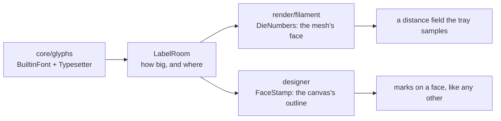

# Face designer

> **Design:** the designer is options 1v (d6 with a skull on the 1), 4c
> (colour picker) and 8d (d20, triangular face mask) of the
> [clickable design](../design/dInfinity.dc.html) ([design/](../design/)); the
> export is 8c, on the "My dice" details screen reached like any other
> package's (6a).

The face designer lets a user draw the faces of a die with a finger and roll
the result immediately. Its output is a normal dice set (see
`docs/dice-sets.md`), so a designed die can be exported, shared on any git forge or web server and
installed by other users like any other set.

## Flow

1. **Pick a base die.** Any catalogue shape or any installed die. The designer
   copies its `faces` and `labels`, so face *values* are inherited; the user
   is only drawing what the face looks like.
2. **Draw.** The screen shows one face at a time as a large square canvas
   with the face's outline (triangle, square, pentagon, kite for the d10…)
   masked in. Swipe left/right or use the strip at the bottom to move between
   faces. The number that belongs on the face is shown faintly under the
   drawing as something to trace, and can be hidden ("The guide").

   **A d4 is the exception and needs three guides, not one.** Its numbers
   belong to corners rather than to faces, so each of its four triangles
   carries the values of its three corners, one at each corner of the canvas
   (`docs/dice-sets.md`, "The d4"). Which corner of the canvas carries which
   of the three is read off the solid rather than off the face order ("The d4
   rule is derived, not checked"). The guide shows all three in place, and
   the two triangles sharing an edge have to agree along it — a die drawn
   otherwise reads as a different number depending on which way it is looked
   at, which the designer should make hard to do by accident rather than
   merely warn about afterwards.
3. **Turn it over.** The **Solid** tab beside the flat editor shows the real
   polyhedron with each authored face on the face it was drawn for, turning on
   its own until a drag takes over ("The solid, not just the face").
4. **Roll it.** The footer's filled button throws the die into the tray to see
   how it looks in motion (`docs/physics-and-rendering.md`, "Starting a
   roll"). It opens the tray with the die in the formula field and **does not
   throw it**: the throw is the player's to make, which is the same answer
   every other way into the tray gives.

   **It saves before it names.** The drafts are the record and
   `dicesets/mine/` is a *view* of them, so until that view is written there
   is no package for a formula to name and no atlas for the renderer to
   sample. Pressing Roll it therefore writes the drawing down, builds the
   personal package, and hands the tray the die **in the set that now carries
   it** — `mine:1d20` rather than a bare `1d20`, which would mean whichever
   set is the default and so would throw a plain die. A save that comes to
   nothing still throws: the plain spelling is a die the tray can throw, and
   what is lost is the artwork rather than the roll.

   **And it is a round trip.** The throw carries the die it was drawing, and
   the tray draws a banner over the table that goes back to the designer on
   *that* die (`design/dInfinityPhone.dc.html`, the `fromDesigner` banner;
   "The way back" below).
5. **Save to set.** Every drawing is a draft on disk the moment the finger
   lifts, so nothing is ever *lost*; what the footer's other action does is
   turn the drafts into the installed package ("Save to set" below). It is
   the same step Roll it takes, offered on its own for somebody who wants the
   set without the throw.

## What is built

The canvas, and the taking-back. One face at a time with its outline masked
in, the guide under it, three pen widths and an eraser, undo/redo and clear per
face, the twelve presets, and the strip that moves between faces. Strokes are
vectors in fractions of the canvas, so they survive a rotation and can be
re-rendered at export resolution.

**The body scrolls; the header, the strip and the footer stay.** A square
canvas and three rows of controls do not fit above the fold on a short phone,
so everything from the base-die chooser down to the palette scrolls. Three
things are pinned: the app bar at the top (the title, which face is in front
of the player, undo and redo, the menu), the face strip above the footer —
which face is in front of the player is where the screen is steered from —
and the footer with **Save to set** and **Roll it** in it, which is where the
prototype puts the one filled button on the screen. The tool, clipboard and
colour rows **wrap** rather than scroll sideways: a tool hidden off the edge
of a row is a tool nobody finds. Only the face strip scrolls sideways, because
twenty faces have to go somewhere.

**The strip has that row to itself.** The three "fill all with…" buttons used
to share it, and a row shared between a scroller and three buttons gives the
scroller whatever is left — which on a phone is about one face of a d20, so the
control for choosing a face was a scroller the width of a thumb. They wrap onto
the row below now. They stay *outside* the scroll either way, because they are
about every face and a control that scrolls away with the twentieth one is a
control nobody finds.

The toolbar the design asks for is there: the **fill bucket**, **copy face →
paste with a turn and a mirror**, a **colour picker past the twelve presets**
(`4c`), and the **stamp** with the "fill all with numbers" beside the face
strip. Each of them is arithmetic over the stored vectors and lives in
`designer/` where a plain test can reach it; what is left in the screen is a
path and a mask.

**The d4 rule is derived, not checked — and derived from the solid.** A cell's
three numbers are read from the three corners that cell meets, and *which of
them goes at which corner of the canvas* is asked of `simulation/api`:
`SolidFaces` says which corner of the real triangle is which readable position
(`SolidFace.cornerReads`) and where that corner lands in the cell, and the
guide, the stamp and the tray's own printed numbers all come from that one
answer. Two cells sharing an edge are asking about the same two corners of one
tetrahedron, so they draw the same value at each end of it; there is no second
copy to disagree with and so nothing to warn about.

It was derived from the *face order* until v0.1.2 — the three face indices that
are not this cell's, handed to the three corners of the canvas as they came —
which is a rule about arithmetic rather than about a tetrahedron. It agrees
with the solid on one edge in six, so a d4 drawn from the guide met its
neighbour's number along one edge and two strangers along the other five.

**Changing the base die changes the drawing, and keeps both.** A different die
has different faces, a different number of them, and different values under the
guide, so nothing carries over from one canvas to the other — but nothing is
lost either. Each die has a draft of its own, written down as its canvas is
left and read back when it is opened, so a row of dice is a row of drawings
rather than one canvas the next tap overwrites.

It used to ask before changing die, because changing die threw the drawing
away. A dialog that warns about a loss that cannot happen is worse than no
dialog, so it is gone.

The pen, its colour and whether the guide is showing all stay put across the
change: those are how somebody is working rather than what they are working
on.

**Roll it throws the drawing.** The button hands the tray the die being drawn
and follows the chooser, so it throws the die in front of the player rather
than the one the screen opened on — and the die it throws is the one with the
atlas on it, because pressing it builds the personal package first and names
the die in that package (Flow, step 4). It is **absent rather than dead** for a
die plain notation cannot name: a set's own `skull-d6` has no spelling a
formula could carry (`docs/architecture.md`, decision 31).

**And it lands the right way round.** The exporter used to copy the canvas
into the cell square on, while the die samples that cell in the face's own
frame with its up taken as `+z` flattened onto it (`docs/dice-sets.md`, "Up
is `+z`"). Those are not the same polygon — the canvas outline is turned by
15° on a d4, 36° on a d12, 60° on a d8 and a d20, 154° on a d10 and 166° on
a d18, and drawn at 0.96 of the size the die shows — so a drawing came out
turned and a fill of a whole face came out covering part of it, with the
printed number showing through the rest. Each cell now carries its own turn
and size, from the same solve the Solid tab uses (`FaceOnSolid`), and the
two halves of the designer show the same die. What is left of it is the kite,
under "The way back" below and in `docs/TODO.md`, 4.6.

## The way back

> **Design:** the `fromDesigner` banner over the roll screen of the
> [phone prototype](../design/dInfinityPhone.dc.html).

**Roll it is a round trip.** It used to be a one-way street: the button took
the player to the tray and left them there, and the only route back was the
menu's *Customise → Face designer*, which opens on whichever die the designer
last opened rather than on the one being tested. A device session's verdict
was that testing a roll from the face designer offers no way back to the face
designer.

The throw therefore carries the die it was drawing, as a `die` argument on
the tray's own route beside the formula (`docs/architecture.md`,
"Navigation"). A tray opened with one draws a banner over the table saying
what is being tested, and a press on it opens the designer on that die.

**A banner rather than a header chevron**, and the reason is this app's
navigation rule rather than taste. A chevron *climbs*: the same control lands
on the same screen every time, whatever path was taken to it. The tray is
home, so it has no up and can never grow one, and a chevron that appeared
only on some visits and led somewhere different each time would be the one
control in the app nobody could predict. A banner is the other kind of
control — it belongs to *this* visit, it is only drawn because this visit
came from the designer, and it can say so in words.

The press itself still climbs. What it leaves behind is the tray with the
designer on it, which is the stack opening the designer from the tray would
leave — rather than the pile of tray, designer, tray, designer that going
back and forth by navigating would build up.

It is drawn on a plate like every other run of words on the tray, rather than
in the prototype's accent tint: the table is lit and its colour is the
player's, and the accent is never drawn on it
(`docs/physics-and-rendering.md`, "What is drawn over the table").

**The Solid tab is built**, and with it the designer's other half: the real
polyhedron generated from the same solid the solver collides, each authored
face on the face it was drawn for, spinning until a drag takes over ("The
solid, not just the face").

**Which set the formula names.** Ordinarily it is decided by what would
resolve, not by where the die came from — the chooser lists dice by id across
every installed set and so has no answer to "which set is this one": a bare
`1d20` when the set a plain `d20` already means has one, and `brass:1d18` when
it does not and `brass` does. **Roll it is the exception**, and asks for the
personal set by name, because the whole point of the press is to throw the
drawing (Flow, step 4).

**The chooser does not offer the personal set.** A die of "My dice" is not a
shape to draw *on* — it is a drawing already, the same `d20` with an atlas over
it. It used to be offered *instead* of the plain one: the bundled set comes
first in the catalogue, so taking dice by distinct id kept the untextured copy
and silently dropped the personal one.

The export is built: "My dice" is a real installed package, and the details
screen behind it offers it as a zip once a licence has been chosen ("Export
details" below).

## Drawing tools

Deliberately small:

- Pen with three widths, eraser, fill bucket
- Colour palette (the set's default colours + 12 presets + a picker)
- Undo/redo (per face, unlimited within the session)
- Copy face → paste onto another face, with optional turn/mirror (for making
  all faces share a border, for example)
- Stamp: place a digit or a sign from the built-in font, in three sizes, so
  people who cannot draw a legible "8" still get an "8" — and "fill all with
  numbers", the one tap that puts every face's own number on it ("The stamp")

### The tools are pictures

The glyph on each tool is the **prototype's own**
([`design/dInfinityPhone.dc.html`](../design/dInfinityPhone.dc.html), the
inline sprite of `<symbol>`s at the head of the phone frame). The `d`
attribute is copied across verbatim and parsed at run time, and a test reads
the prototype to hold the two equal — the same bargain the design tokens
strike with the stylesheet. Re-import the sprite with a different pencil and
the test fails, rather than the app going on drawing an older one.

**Which shape a control is drawn in is decided by what it is**, and deciding
that for all twenty-one of them is what the row needed before it could be
drawn at all:

| Kind | Drawn as | Which ones |
| --- | --- | --- |
| Option — the state the canvas is in | a bordered square that inverts when chosen | three pens, eraser, bucket, stamp; the guide; the paste mirror and turn; the stamp sizes; the base die |
| Action — a thing that happens | an icon button, dead when there is nothing to do | undo, redo, clear, copy, paste |
| Sentence about every face | a lettered button | fill all with numbers, fill all with eyes, clear eyes, Save to set, Roll it |

The three pens are **one glyph at three widths** — what separates three pens
is how wide they draw, so it is the one thing that separates their pictures,
and the medium pen is the sprite's `#ic-pencil` exactly as drawn.

**Four controls keep their words on purpose.** `Turn 3/4` is a count and a
picture of a rotation cannot say which of four turns the next paste lands on;
Small / Medium / Large are the same picture at three sizes and three boxes
differing by a few pixels is a row nobody reads at arm's length; a die's id
(`d18`) is its own word; and "fill all with numbers" is a sentence there is no
picture of.

**Every picture is named.** The words that came off the faces are the labels a
screen reader now says — the resources did not go anywhere — and every control
is at least a 48 dp target whatever the glyph inside it measures.

**Undo and redo are in the app bar**, with "face 3 of 20" under the title.
They are not tools, they are what undoes a tool, and a taking-back that
scrolls away with the canvas is one nobody reaches while they are drawing.

**The face strip is 52 × 52 dp thumbnails**, each the face itself — the same
three steps the canvas takes (mask to the outline, paper, marks) at a
fiftieth of the area. The label stays under the picture: a set may call a face
`crit` and no thumbnail says that. The guide is left off, because a strip in
which every undrawn face carried its numeral could not be told from a drawn
one at a glance.

### The fill bucket

**A fill is a shape added to the drawing, not a flood of pixels.** There are no
pixels here to flood: a face is a list of vectors in fractions of the canvas,
so the bucket's whole job is to decide *which region* and add it as another
mark. It picks the region a raster flood fill would have looked as though it
picked — **the smallest closed stroke the tap landed inside**, and **the face
itself** when it landed on bare paper. Shapes nest, and a tap in the eye of a
drawn skull means the eye rather than the skull.

A stroke counts as closed when its two ends come back within eight hundredths
of the canvas of each other; a finger never lands on the pixel it started from,
and demanding that it did would make the bucket useless. An eraser stroke is
not a boundary — it takes ink away rather than drawing a line to fill against —
and neither is an existing fill, because filling inside the paper is what
filling the face already does.

The whole-face region is stored as **the canvas square** rather than a copy of
the cell's outline. Every renderer already clips the drawing to that outline —
the screen and the exporter both do — so a fill of the square *is* a fill of
the face, and a fill carrying its own copy of the polygon could come to
disagree with the mask.

**Fills sink under the ink.** The marks on a face are kept with every fill in
front, oldest first, and every stroke behind them, so a later fill covers an
earlier fill and never the drawing. A bucket colours the paper, not the line:
a fill that landed on top would hide the drawing it was aimed at, and the way
to cover ink is the eraser. A fill is one mark, so it is one press of undo, it
counts against the two-hundred limit like a stroke, and it round-trips through
the draft file with its region and its colour.

### The stamp

> **Design:** the stamp is in the tool row of option `1v` and "fill all with
> numbers" sits under the face strip — "the strip scrolls on its own; the
> global actions sit in a non-scrolling wrapping row below it".

**The font is the tray's, and so is the placement.** `core/glyphs` holds the
outlines a die with no artwork is printed with, and `LabelRoom` solves how big
a label may be on a face and where on that face it goes. The tray asks it about
the polygon its mesh draws; the designer asks the same object about the polygon
the canvas is masked into. A die drawn from its own numbers and the same die
printed therefore agree about where a `6` sits, which two solves could not be
relied on to do (`docs/architecture.md`, decision 45 and decision 51).

**A stamp is a mark like a stroke, and one mark however many rings it has.**
What the typesetter hands back is closed outlines — the outside of the ink, and
a counter for every hole in it — and they are kept together and drawn as one
shape under the **even-odd rule**, which is what leaves the hole in a `0` open.
Each ring as a fill of its own would paint that hole in. `10` is one press of
undo, one mark against the face's two hundred, and one thing a turn or a mirror
carries whole.

**Three sizes, measured against the face rather than the canvas.** Small,
medium and large are 0.6, 1 and 1.4 times what *this die's own* number would be
printed at, because a number that fills a d6's square runs off a d20's
triangle. The middle one is therefore the printed size exactly, and the largest
still fits inside the face when it is stamped in its middle. Where it goes is
where the finger went; a stamp put down near an edge is clipped by the mask
like a turned paste, because what falls outside the outline belongs to no face.

The stamp is **loaded with the face's own number** and follows the face until
somebody types something, and then it is theirs — the commonest stamp of all is
the number that belongs there, and the second commonest is a small edit of it
that moving to the next face should not undo. What the font cannot draw is
**said before the tap rather than swallowed by it**: it draws `0`–`9`, the two
signs, a times, a per cent and a full stop, and a word is refused whole rather
than stamped as the half of it the font happens to have.

**A stamp does not move once it is down.** There is no dragging it about and no
handle to turn it by: it is a mark like every other mark, and the way to change
one is undo and stamp again. A drawing where one kind of mark can be picked up
again and the others cannot is two drawings. The prototype does let one be
dragged, and whether that is worth the difference is a question for a phone
(`docs/TODO.md`, "Open questions").

### Fill all with numbers

One tap puts every face's own number on it, in the ink in the pen: the number
the tray would print, where the tray would print it, marked where the tray
would mark it — a `6` on a die that also has a `9` gets its **trailing dot**,
`6.`, and a d6's `6` does not (`docs/physics-and-rendering.md`, "What is drawn
over the table"). It is the starting point for somebody who wants a numbered
die to decorate rather than a blank one to letter.

**The numbers go on in pairs, and each pair sums to n + 1.** A real die is
numbered so that opposite faces add up: a d6 has 2 across from 5, a d20 has 1
across from 20, a d12 has 1 across from 12. That is a fact about the *die*
rather than about this button — the pairing is worked out from the shape's own
normals and the bundled set's `faces` lists are written from it
(`docs/dice-sets.md`, "Numbering") — so the stamp gets it right by copying the
face's own number, which is all it has ever done. A tetrahedron has no opposite
faces at all and keeps 1–4 at its corners.

**Where a numeral sits on its face** is the face's own centroid, at a size
taken from that face's inradius. In the design's authored 320-unit face, as
`[centre x, centre y, size]`:

| Die | Numeral |
| --- | --- |
| d2 | `[160, 160, 190]` |
| d6 | `[160, 160, 180]` |
| d8 | `[160, 200, 118]` |
| d10 | `[160, 146, 146]` |
| d12 | `[160, 168, 172]` |
| d18 | `[160, 152, 124]` |
| d20 | `[160, 200, 104]` |
| d% | `[160, 200, 104]` |

The app does not carry that table: `LabelRoom` in `core/glyphs` solves the same
question from the face's real geometry, which is where those numbers came from
in the first place. It is here because it is the design's answer to "how big,
and how far up" and because a solve that disagreed with it by much would be
wrong.

**The d10's tenth face reads `0`.** Its *value* is 10 and every total, every
graph and every statistic says 10; what is printed on the face is the `0` a
real d10 carries, so that a d10 beside a d10-tens reads as the percentile pair
it is.

**It leaves a stamped face alone**, so pressing it twice changes nothing and a
face somebody has already lettered by hand is not written over. A face that was
*drawn* on but not stamped is filled, and the number lands over the drawing the
way a paste does.

**It is one undoable step per face, not one for the die.** Undo belongs to the
face it was made on, so the number comes off the face in front of the player
with one press and off the others as they are reached. A single step spanning
twenty faces would be an undo stack that reached across faces, which is not
what the button on this screen has ever meant.

**A d4 gets three, one at each corner**, each turned to face its own corner,
because its values belong to corners rather than to faces (`docs/dice-sets.md`,
"The d4"). They land exactly where the guide already showed them: which corner
carries which number is `SolidFaces`' one answer and how far in from the corner
a number sits is one number in `core/glyphs`, and the guide and the stamp both
read both, so tracing the guide and stamping the number cannot come out in two
places.

A face an author left blank stays blank, and a face whose label the font cannot
draw gets its **value** — the one thing about a face the app can always write
down, which is the rule the tray already follows.

### Fill all with eyes

A d6 and only a d6 can be pipped instead of numbered. One tap lays the standard
pip patterns on all six faces in the ink in the pen, on a 3 × 3 grid at
`96 / 160 / 224` of the 320-unit face with each pip at `r = 24`. `Clear eyes`
takes them off again, which is the undo for somebody who pressed it to see, and
is dead until there is something to clear.

**A pip is a mark like any other** — closed rings drawn under the even-odd
rule, the way a stamped glyph is (`designer`'s `Eyes`). That is what makes a
pipped die look pipped everywhere without anything being taught what a pip is:
the canvas, the exported atlas and everything later built over the same
drawing — the strip's thumbnails, the Solid tab — draw the marks a face
carries, and the pips are among them. One face's pips are **one mark**: one
press of undo, one against the two hundred, one thing a turn or a mirror
carries whole.

**A d6 and only a d6**, and the test is what the die *scores* rather than what
solid it is. A pip pattern is a way of writing one to six and there is no
pattern for a 7, for a d20's 17 or for a Fudge die's minus — so the two buttons
are on the screen for a cube carrying exactly 1–6 and **absent** for everything
else, which is the answer "Roll it" already gives for a die notation cannot
name.

**Pips and numerals are mutually exclusive**, and filling one clears the other,
in the same step. A face carrying both is not a die anybody makes, and the two
are solved against the same face centre and would land on top of each other.
One press of a button is one press of undo, so the swap is one step and not a
clear and a fill.

Like "fill all with numbers" it is **one undoable step per face**, it leaves a
face that already has what it would put there alone, and it lands *over* a
drawing rather than taking it away.

### The guide

**It is the numeral, not a dot where the numeral goes.** It was a dot for as
long as nothing on the phone could measure a piece of text: drawing a string
inside a `Canvas` wants a measurer, and the screen had no reason to hold one.
`core/glyphs` is that measurer — it holds the outlines the tray prints with and
`LabelRoom` solves how big a number may be on a face and where on that face it
sits — so the guide is now the very shape "fill all with numbers" would put
down, at the same size, in the same place, with the same dot after a `6` that
needs one.

That is the point of it rather than a nicety. A guide and a stamp that were
solved separately could drift apart, and then tracing the guide and pressing
the button would put ink in two different places; there is one solve
(`designer`'s `FaceStamp.printed`) and both read it. A d4 gets three, one at
each corner, for the same reason the stamp does.

**A face with nothing printed on it still gets its dot.** Half a Fudge die is a
blank side an author asked for, and printing a `0` on it would be the app
arguing with the set file — so there is no numeral to trace and the guide falls
back to marking the place. The screen is not told which case it is looking at:
what reaches the draw lambda is a list of closed rings either way.

The guide can still be turned off, and the face's value is still on the strip
under the canvas while it is.

### Copy and paste

Copying takes what is on the face — the drawing, not its undo stack, which
belongs to the face it was made on. Pasting **merges**: the copy lands on top
of whatever is already there, which is what "make every face share this
border" needs. A face that should be replaced is cleared first, two presses,
both undoable — whereas a paste that replaced would take away work nobody
asked it to. A paste is **one** step however many marks it carried, and a
paste that would carry the face past the limit is refused whole, because half
of what was copied is not what was copied.

**The turn is the cell's own**: a third of a turn on a triangle, a quarter on a
square, a fifth on a pentagon, and quarters on the d2's disc, which has every
turn there is. A turn that did not carry the cell onto itself would carry the
drawing off the face and under the mask. A kite — the d10's and the d18's cells
— has no such turn at all, so those dice are offered the mirror and the turn is
disabled rather than removed: a row whose buttons come and go as the base die
changes is a row nobody learns.

**There is one mirror, the vertical one**, left for right. It is the only axis
every cell outline here shares; a triangle standing on its base does not
survive being flipped top for bottom. The mirror goes on first and the turn
after it, which is the order that makes "mirror, then turn twice" mean what it
says.

The clipboard outlives the face and the die. Marks are fractions of the canvas,
so a border copied off a d6 lands on a d20's triangle as readily as on another
square, and a dot the turn carries off the canvas is clipped by the mask like
any other ink rather than squashed back inside — squashing would change the
shape that was copied.

### A colour beyond the twelve

The twelve presets stay the fast path: twelve is what a finger can hit without
a dialog, and the picker sits after them, which is where the design puts it
(`4c`). It opens on the colour already in the pen and offers **hue, depth and
brightness** — three numbers somebody can move one at a time and mean
something by, which red-green-blue is not. The swatch and the hex are shown
next to the row, so what is in the pen can be read off rather than guessed at,
and the chosen colour is stored per stroke, so it round-trips through the draft
file like any other ink.

**The picker is not this screen's own.** It is `ui/common`'s `ColourPicker`,
the one sheet Settings' accent and the saved-roll editor open too, over
`core/model`'s `Hsv` (`docs/architecture.md`, "Modules" and decision 63). This
screen supplies the title, the colour it opens on and what to do with the
answer, and nothing else — what a hue is has one definition in this app.

**Ink is always opaque.** Alpha is forced rather than offered: a
half-transparent stroke is a stroke whose colour depends on what is behind it,
and what is behind it is the die's own material, which the set decides and the
designer never sees.

**There is no contrast rule on ink, and that is deliberate.**
`core/model/AccentRamp` pushes any accent to 3:1 against both grounds because
those grounds are the app's own — it knows what the surface behind a button is.
A die face is not the app's ground: the cell is transparent in the atlas and
the colour under it comes from the dice set, so a ratio computed against the
designer's white paper would be a promise about a surface that is not there.
The rule that applies here is the other one — the drawing is shown at the size
it will be drawn and the judgement is the player's, which is also why white is
one of the twelve even though it is invisible on the canvas and perfect on a
black die.

### The draft file

Marks are recorded as vector paths in a draft file so that the canvas can be
re-rendered at export resolution and so drafts survive process death.

**One file per die, under the app's own files.** The file holds the marks and
not the undo stack — undo is unlimited *within a session*, and a history
restored from disk would rewind a drawing past the point somebody opened it.
It is written after every stroke, undo and clear rather than when somebody
remembers to save, because the moment a draft is most likely to be lost is the
one where nobody is thinking about it; the write is launched off the drawing
thread, so a line never waits on a disk.

The file names its die by **id** rather than carrying a copy of it: a draft is
a drawing *on* a die, and the die belongs to a dice set that can be updated
under it. A draft whose die is not installed is not offered, and its file is
kept rather than deleted — re-installing the package brings the drawing back,
which is the rule the default set and the default table already follow. A cell
the die no longer has is dropped and the rest of the drawing is kept; losing
six faces over one is not a trade worth making.

It is read through the JSON DOM with every field taken by hand, the way
`core/collection` reads a collection. A draft is the app's own file rather than
a stranger's, so the reason is the other one: a deserializer's idea of the file
is the class shape of the day, and a drawing has to survive the class changing
under it. Anything that does not read is simply not a draft, and the canvas
opens blank.

**The format number was not bumped for fills, nor for stamps.** Each is a new
kind of entry in the list of marks that was already there, told apart by a
field a stroke never carries — `fill` for one, the ring lengths for the other —
so every draft written before them reads exactly as it did and a build that
predates them drops what it cannot draw rather than losing the drawing around
it. Bumping the number would blank every drawing on the device to spare an
older build one shape, which is not a trade.

A stamp's dots are written the way every other mark's are, every ring end to
end, with the lengths beside them; a stamp whose lengths do not add up to the
dots it carries is not a stamp this wrote and is dropped.

## The solid, not just the face

> **Design:** the Solid tab is in the designer of the
> [phone prototype](../design/dInfinityPhone.dc.html) (`design/`), beside the
> flat editor of option `1v`.

Until the design pass of 2026-09-17 the answer to "what does it look like as a
die" was **roll it**, and the hand-over recorded that as deliberate. The design
asked the other way and it is built: a **Solid** tab beside the flat editor,
for the one thing rolling cannot do — a roll shows you one face at a time,
chosen by physics, and a person lettering a d20 wants to turn it over.

The two tabs are two views of one drawing. The base-die chooser, the face strip
and the way out to the tray are the same underneath both; which face is in
front of the player, which die is being drawn on, how the die is turned and
where the pen was all survive moving between them, and so does a change of base
die.

**The polyhedron is generated, not modelled.** `simulation/api` already owned
every catalogue solid — its corners, the direction of each readable position
and the face order the whole app agrees on — and now owns the one thing that
was written down twice: **which corners make up which face**. `SolidFaces`
groups the corners onto the face planes, winds each polygon anticlockwise as
seen from outside and hands back the frame its atlas cell is drawn in. The
renderer's mesh is built from it and so is this stage, so face 7 is the same
polygon in the tray and in the hand by construction rather than by inspection
(`docs/architecture.md`, decision 35).

**The picture is drawn in Compose, not in the renderer.** This is a drawing of
a die on a drawing screen; the engine belongs to the roll screen. The corners
are turned, projected through one eye, the faces pointing away are dropped and
what is left is sorted furthest-first and filled — all of it plain Kotlin in
`designer`'s `SolidStage`, where a JVM test holds it, with nothing left in the
draw lambda but paths and colours (`docs/architecture.md`, decision 55).

**The die is the size it is, whatever way up it is.** How much of the stage a
die radius reaches is worked out from the widest a point of a unit sphere can
ever project to rather than tried until it stopped clipping, so a die turning
is a die turning rather than a die breathing.

**The silhouette is drawn under the faces**, and for one solid it is the only
thing there: a coin's rim belongs to no face at all, so without it a d2 leaned
over would be a disc with nothing behind it. For every other shape the faces
cover it exactly.

**The whole stage is one drag surface.** Faces, numerals, pips and strokes are
pointer-transparent: nothing on the die is selectable, because a tap that
sometimes rotates and sometimes selects is a tap nobody trusts. The face strip
is how a face is chosen, on this tab exactly as on the other. The die spins on
its own at a turn every sixteen seconds until a drag takes over, and **the drag
unticks Spin** — a die that went on turning under the finger holding it would
be a die fighting back. The tick puts it back.

**Both the spin and the drag turn the die about the reader's axes, not its
own.** The die's orientation is one free rotation rather than a pitch and a
yaw, and every turn is composed onto it from the *outside*: a sideways drag and
the spin swing it about the upright of the screen, a drag down tips it about
the horizontal, and the spin carries on from wherever a drag left the die
rather than from a pose of its own.

That is a correction rather than a refinement. The spin used to be a yaw
applied *before* a lean, which is the same thing as an axis the die carries
with it: tip the die towards you and its spin axis tipped too, so a die looked
at nearly edge-on span like a coin on a table instead of turning in the hand.
The drag had the same fault from the other end — on a die already a quarter
round, a sideways drag rolled it rather than swinging it.

**A die can now be turned right over.** The lean used to stop 5° short of
edge-on, because a pitch and a yaw go strange at the poles; a free rotation has
no poles, so the clamp went with them. Turning a die over is the point of
holding one.

**The selected face reads as selected** — a 4 dp outline in the accent's deep
step and a 16 % accent tint in its fill — so moving between the two tabs never
loses the player's place.

**A face is drawn on the die's paper, not the screen's.** The flat editor draws
every face on white, so a solid drawn on the theme's surface is the same
drawing in two colours depending on which tab is in front — and on a dark page
it is black ink on a dark grey face, which is a numeral nobody can read. That
is what the first look at this tab on a phone showed. A die is a white thing in
a room whichever page it is being drawn on, and a face turned away from the
lamp is that paper in shadow rather than the colour of the page's ink. Whether
the *canvas* should follow the theme is a separate question and still open
(`docs/design-handover.md`); what matters here is that the two tabs cannot
answer it differently.

**The shading is not the spec.** One lamp over the viewer's left shoulder and a
floor under it, so that the same rule lights a die on either page. How a die is
really lit is `docs/physics-and-rendering.md`'s business.

### What the Solid view shows, and what it does not

Where the drawing goes on the face is one solve, `designer`'s `FaceOnSolid`:
the turn and the size that carry the canvas's own outline onto the real polygon
with the least left over. The design describes that answer shape by shape — "a
square face puts an edge up, a kite puts the short tip on its own symmetry
axis, a regular face takes its most upright far vertex" — and every one of
those falls out of matching the two polygons corner for corner. A square's
edges land on edges because that is the turn that fits; a kite's tip lands on
the tip because a kite is the one outline here whose corners are not all the
same distance from the middle; a regular face has no such handle and every turn
of it fits equally well, so the tie goes to the one that stands the drawing
most upright. The disc of a d2 has no corners at all and is laid on the face's
own frame.

It draws:

- **the face itself**, its real polygon, shaded by which way it is pointing;
- **its background** — every region the bucket coloured in, including a fill of
  the whole face, clipped to the outline;
- **its numerals and its pips** — a stamp and a face of eyes alike, in the ink
  they were put down in, at the place and the size they were put down at.

It does not draw **the strokes of the pen**. The line is drawn here: a fill, a
stamped numeral and a face of pips are *closed shapes*, and a closed shape
under a projection is still a closed shape with its corners where they belong,
so what the stage puts down is the mark itself rather than an impression of it.
A stroke is not a shape but a line of a *width*, and a width on a tilted face is
wider one way than the other; a `Canvas` draws a line of one width, so drawing
one would be the picture telling a lie about the die. The tab says so in as many
words under the stage rather than leaving somebody to wonder where their line
went, and the flat editor is where a stroke is looked at. Whether it is worth
drawing strokes as thin filled outlines instead is an open question
(`docs/TODO.md`).

**Nor does it promise the atlas's own turn of a cell.** The atlas draws every
cell with the face's up taken as `+z` flattened onto it (`docs/dice-sets.md`,
"Up is `+z`") while the canvas masks every cell into one canonical outline, and
those two are not the same turn — an octahedron's top face sits fifteen degrees
off the triangle the canvas draws, a d20's faces up to sixty, a d12's up to
thirty-six, and a d6's not at all. What the Solid tab shows is
the drawing the way the canvas shows it, put on the face it belongs to; which
way round it will come out of the exporter is the other question, and it is
written down as one (`docs/TODO.md`).

### Save to set

The footer action is **Save to set**, and it opens a sheet rather than saving
where it stands. The sheet lists the sets that can be written to — which is
**My dice** and any other personal set, never an imported one
(`docs/dice-sets.md`, "Weight, translucency and size").

**What a save actually does** is turn the drafts into the installed package:
the drawing on the canvas is written to disk where the caller waits — every
other write is launched and not waited for, and a package built from the files
a moment before the last stroke reached them is a package missing that stroke
— and then `dicesets/mine/` is rebuilt from every drawing and re-scanned. That
is the only thing that builds it, and before this existed nothing outside the
sets list ever did.

**The sheet stays open on the answer.** A save that was refused has a reason
worth reading and one that worked has a set worth naming; "something happened"
is not what somebody pressing Save is asking. There are three answers: the set
it went into, *nothing drawn yet*, and *could not be written* — the last
meaning the package did not validate or the disk refused, with nothing left
half-done either way.

There is **one writable set today**. `MinePackage.ID` is fixed to `mine` and
the exporter is built on one folder, so several personal sets is a change to
the model rather than to this screen — and with it the field that names a new
one. The sheet is a list all the same, because what it answers is *which set*,
and a screen that answers that by not asking is one that has to be rebuilt
when the second set arrives. The rest of the item stands in `docs/TODO.md`,
4.6.

A set created here will start at the average weight, translucency and size,
and be in the set list, the picker and notation immediately. There is nothing
to install and nothing to confirm: it is a package this phone wrote, and the
validator has already seen it, like every other package this phone writes.

## Export details

> **Design:** the export is option `8c` of the
> [clickable design](../design/dInfinity.dc.html) — the "My dice" details
> screen, reached like any other package's (`6a`).

- Atlas resolution: **256 px per face cell**; a d20 atlas is therefore
  1280×1024 (5×4 cells) and a d6's is 768×512. Every catalogue shape stays
  well inside the 2048-pixel texture limit, and every cell comes out exactly
  square, so the validator's "does not divide into square cells" warning can
  never fire on the app's own output (`docs/dice-sets.md`, "Textures").
- The grid is the shape catalogue's, not the designer's: face *i* is cell *i*
  of `ShapeAtlas`'s grid, which is the same grid the renderer samples and the
  validator checks. Two answers to "where is face 7" would be a die whose
  faces are in the wrong places on somebody else's phone.
- Background of each cell is transparent; the die colour and material come
  from the set defaults, so the same drawing works on a black or a white die.
  **A cell nobody drew on is not written at all**, which is what lets the
  printed label show through it.
- **Each cell is painted with its own turn and size.** The canvas masks every
  face into one canonical outline — a triangle on its point, a square on an
  edge, a kite with its short tip up — and the die samples the cell in the
  face's own frame, which is that outline turned by however the solid's
  construction left the face (`docs/dice-sets.md`, "Up is `+z`"). The
  exporter asks `FaceOnSolid` for the turn and the size that carry one onto
  the other, which is the same solve the Solid tab draws with, so the flat
  editor, the solid and the tray agree. **It moves the drawing, not the
  atlas**: which cell a face is and how a cell is read are the file format's
  and cannot change, because every published set is painted to them.
- The size is the one that **covers** the face rather than the one that fits
  it best. For every outline but the kite those are the same number, the
  canvas being the face's own shape. A kite is not — the d10's and the d18's
  faces are differently proportioned kites and the canvas draws one shape for
  both — so a best fit would leave a rim of bare resin round every face with
  the printed number showing through it, and covering instead costs a drawing
  that is a little large and clipped at the tip (`docs/TODO.md`, 4.6).
- Strokes are rasterised with anti-aliasing from the vector draft, clipped to
  the **face outline** rather than to the cell — a turned paste puts marks
  outside the outline on purpose, and what falls outside belongs to no face.
- **The eraser clears rather than paints.** On the canvas the paper is white
  and the eraser is a white pen; in the atlas the paper is nothing at all, and
  a white stroke there would be a mark on a black die that nobody drew.
- "Share" produces a **zip of the set folder**, handed to another application
  through the share sheet, which can be uploaded to a git repository as-is.
  The entries are in name order with a fixed timestamp, so a drawing nobody
  has touched exports to the same file twice.

**The decision and the pixels are separated**, the way the physics and the
renderer are (`docs/architecture.md`, decisions 40, 47 and 55). `Atlas` says
how big the image is, which cell each face occupies and where every point of
every mark lands in it, in plain Kotlin a unit test asserts on; `AtlasPainter`
puts the ink down, and one file behind it touches a `Bitmap`. A painter that
cannot allocate answers with nothing, and a die with no atlas prints its labels
— one unlucky allocation does not cost somebody the other nineteen dice.

## "My dice"

The drawings on the phone **are** a dice set, id `mine`, in `dicesets/mine/`
like any other installed package. Nothing that reads dice sets knows it is
special: it is on the sets list, its details screen shows what is in it,
notation resolves `mine:d20`, and it can be switched off or removed with the
same tap as anybody else's package.

It is **built, not accumulated**. The drafts are the record and the folder is a
view of them, so there is nothing to keep in step by hand: a drawing deleted is
a die gone from the package at the next reading. Rasterising every drawn face
is far too much to do after every stroke, so it is rebuilt when the sets folder
is read and only when a drawing has actually changed — once per sitting at
worst, and not at all while nobody is looking at the list.

The drawings are not the only thing in it. A photograph somebody has made a
table of is written into the same package, as a `[[table]]` entry and a
`tables/<id>.webp` beside the atlases (`docs/tables.md`, "Your own photo") —
so the same package is rebuilt from two records rather than one, and a phone
with photos and no drawings has a `mine` that is a table pack.

The third record is **what the dice are made of**: the weight, translucency and
size the details screen's steppers set, kept in `filesDir/mine-physical.txt`
and written into the package as its `[defaults]` table (`docs/dice-sets.md`,
"Weight, translucency and size, as a person sets them"). It is a record rather
than a line in the generated `diceset.toml` for the same reason the drafts are:
the folder is a view, and a number kept only there would be rewritten away by
the next stroke.

A draft whose die is not installed is not in the package, and its file is kept:
re-installing the package that defines the die brings the drawing back.

## The licence, and why it is a gate

The export is **shut until the author picks a licence** (design `8c`). A dice
set is something a stranger installs and rolls, and `license` is the only field
in the file that says what they may do with it (`docs/dice-sets.md`, "What a
licence means"). Offering "share" first and asking afterwards would be asking
about a file that had already gone.

What is offered is a short closed list rather than a text box — the point of
the field is that the reader *recognises* what it says, and a box fills up with
sentences nobody can act on:

| Shown | Written into `diceset.toml` |
| --- | --- |
| CC0 1.0 (public domain) | `CC0-1.0` |
| CC BY 4.0 | `CC-BY-4.0` |
| CC BY-SA 4.0 | `CC-BY-SA-4.0` |
| MIT | `MIT` |
| GPL-2.0-or-later | `GPL-2.0-or-later` |
| All rights reserved | `LicenseRef-All-Rights-Reserved` |

The first five are the prototype's, in its order. The sixth is the honest
answer for a drawing somebody wants to hand to one friend rather than to the
world; it is written in the `LicenseRef-` form SPDX reserves for everything it
has no identifier for, because "All rights reserved" spelled out in a field of
identifiers is a sentence pretending to be a name. The names are not
translated: a translated `CC BY 4.0` would be a licence nobody could look up.

Until somebody chooses, the field says `unspecified` — written down rather than
left out, because a missing field cannot be told from one an older version of
the app never wrote. **The choice is written into the installed folder as well
as into the zip**, so the details screen goes on saying it after the share
sheet has closed and the next stroke somebody draws does not un-answer it.

**No name is written.** `author` is left out rather than filled in: there is no
device user name an app can read without asking for the contacts permission,
and a field saying "You" would be a name on somebody else's phone. Whether the
export should ask for one is an open question (`docs/TODO.md`).

**The package goes through `DiceSetValidator` before the file is offered.** The
app's own output is not a privileged path, exactly as the bundled set is not: a
package that does not validate is a bug caught on this phone rather than an
install failure on somebody else's.

## Quick mode

> **Design:** the breakdown a long press lands on is option `1f` of the
> [clickable design](../design/dInfinity.dc.html); what it opens is the
> designer itself, `1v`.

**Long-press a die in the breakdown and it offers "Doodle this die."** Taking
the offer opens the face designer on that die, with that die's own draft
already on the canvas. It is the same screen the menu opens and it does nothing
the menu cannot: what it saves is the hunt through the chooser for the die
already in front of the player, which is the whole of "draw a skull on the 1 in
ten seconds".

**The dice that landed, not the picker row.** The obvious place is the picker —
it is a row of dice on the roll screen — but a long press there already takes a
die off the formula (`docs/dice-notation.md`, "Picking dice without typing"),
and that is a fast edit made in twos and threes. Putting a menu in front of it
to make room for something somebody does once a month would slow down the
common thing for the rare one. The dice in the breakdown had no gesture at all,
and they are the better subject anyway: a die that has just landed is the one
being looked at when "this d6 is boring" is thought. A dropped die offers it
like any other — a `4d6dl1` whose 1 is the dull one is exactly the case — and
so does a die plain notation cannot name, which the picker row cannot even
show (`docs/architecture.md`, decision 31). Whether the picker row should offer
it too, through a menu, is an open question (`docs/TODO.md`).

**It offers rather than opens.** The press puts up a one-line menu and the menu
navigates. Leaving the tray on a gesture that announced nothing would be a
screen that vanishes when a finger rests on it, and the menu is also the only
thing that tells anybody the shortcut is there. TalkBack is told what the long
press does rather than left to say "double tap and hold".

**Nothing is saved and nothing is switched.** An earlier plan had the designer
make a variant die — the same id suffixed `-doodle` — and switch the current
roll to it. There is nothing left of that to build: a drawing *is* a draft on
disk under the die's own id and the drafts together already *are* "My dice", so
the variant would be a second copy of a drawing that exists, and the switch
would be a roll whose dice a screen changed behind the player. The ways back to
the tray are Back and "Roll it", which hands the tray the die being drawn
("Flow", step 4).

Which die the screen opens on is one rule with the menu's
(`designer`'s `OpeningDie`): the die the long press named, and the usual d6
when it named none — or when it named a die that is no longer installed, which
can happen to a result still on the tray after its package has been removed.
The route carries the id and nothing else (`docs/architecture.md`,
"Navigation").

## Constraints

- Drafts are limited to 50 per device and 200 marks per face — strokes, fills
  and stamps alike — to keep storage and export time bounded. A stamped `10` is
  one mark, not one per ring.
- The mark limit **warns and then refuses**: the face stops taking marks and
  says so twenty strokes before it does, because a canvas that silently stops
  drawing reads as a broken screen. A paste that would not fit is refused
  whole rather than in part.
- The draft limit **makes room**: drawing on a fifty-first die drops the draft
  nobody has touched for longest. Refusing it would be a dead end — a cap that
  cannot be reached is not a cap — and it is the same answer the history's
  fifty thousand rows already take. The draft being worked on is never the one
  dropped, whatever the filesystem's clock says.
- A drawing with nothing on it is not a draft and is not kept, so opening the
  designer and leaving it cannot push a real drawing over the limit.
- Everything is on-device; nothing leaves the phone unless the user shares
  the zip, and nothing can be shared until a licence has been chosen for it.
