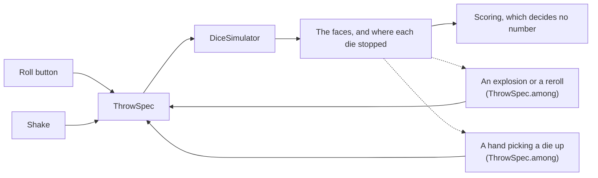

# Physics and rendering

> **Design:** the tray, a settled roll and the power-saving result are
> options 1a and 1z of the [clickable design](../design/dInfinity.dc.html) ([design/](../design/)).
> The dice there are flat silhouettes standing in for the 3D render.

## Overview

Each roll is a rigid-body simulation of dice inside a tray. The number on a
die is read from whichever face normal points closest to "up" once the die has
come to rest. Rendering is a passive observer of the simulation.

## Coordinates

One right-handed system, shared by the tray, the solver and the renderer:
**`+z` is up**, the tray's long side runs along `+x` and its short side along
`+y`, and the origin is the middle of the floor. Distances are millimetres
everywhere above the bridge; the solver runs in centimetres on the far side of
it and converts in one place (decision 41).

Nothing is turned over on the way between the three. A renderer that used a
different up would have to flip every transform it was handed, and the first
thing to go wrong would be a die drawn resting on the face it did not land on.
It is also what "up" means everywhere else in this document: the face reading,
the reference orientation a shape's face order is numbered in, and the
direction a face's texture is drawn the right way up in
(`docs/dice-sets.md`).

## The table

The table (tray) is a fixed rectangular box whose floor is the phone's screen:
its aspect ratio and apparent size match the visible area, and its walls sit
at the screen edges like the rim of a dice box. See `docs/tables.md` for the
geometry, the capacity rule and how the *look* of the table can be swapped.

- The mesh never changes. Only textures, colours, material and sound profile
  are exchangeable.
- Wall height is generous and there is an invisible ceiling. The *collision*
  walls run all the way up to that ceiling rather than stopping at the rim the
  renderer draws, because a box open at the sides between the two is a box dice
  leave (`docs/tables.md`).
- **The table is horizontal, whatever the phone is doing.** Gravity in the tray
  is straight down and stays there; the hand moves the dice, the table does not
  tip under them. It used to follow the phone, and the cost was worse than the
  feature was worth — see "Shake input".
- Floor and walls have a slightly higher friction than the dice-on-dice
  contact so the pile spreads instead of stacking.
- Because the table cannot grow, **dice shrink** when there are many of them
  (`dieScale` in the `ThrowSpec`), down to a minimum. Below that minimum the
  roll is refused before any body is created. Smaller dice that roll honestly
  beat big dice that jam.

## Dice bodies

Every die is a **convex** rigid body:

- Built-in shapes come from the shape catalogue (see `docs/dice-sets.md`):
  tetrahedron, cube, octahedron, pentagonal trapezohedron (d10), dodecahedron,
  icosahedron, enneagonal trapezohedron (d18), coin (d2), etc.
- The catalogue is closed in v1 (`docs/dice-sets.md`), so every body is one
  of eight known solids. A set changes a die's size, material, face values and
  artwork, never its geometry — which is what makes the tuning below hold for
  every installed set.
- Mass is uniform density over the hull volume; inertia tensor from the hull.
  Standard sets use realistic sizes (a d6 of 16 mm) and density (~1.2 g/cm³,
  roughly acrylic).
- Restitution around 0.3, friction around 0.5. These are tunable per die in
  the set file within clamped ranges. The solver stops applying restitution
  below 1 unit/s, which is Jolt's own default and a centimetre a second here.
  It was 150 mm/s for a while, chosen as "about where a die lands and stays" —
  which it is, and which also gave every contact after the first landing a
  restitution of exactly zero, so a die bounced once and then dead-dropped.
- Rounded edges: shapes with sharp corners (d4 especially) get a hull margin of
  3 % of the die's nominal size, so they tumble instead of catching on the
  floor. A share rather than a fixed millimetre, so a die shrunk by the
  capacity rule keeps the proportions it was tuned at.

## Timestep and determinism

- Fixed timestep of **1/120 s**, up to 4 sub-steps per rendered frame. Every
  threshold below is counted in *steps* rather than seconds — 30 steps to rest,
  1,440 to the cap — because a count of fixed steps is exact where a running
  total of doubles is not, and two devices that disagreed by one step about
  when a die stopped would disagree about the roll.
- The simulation is seeded per roll. The seed and every input impulse are
  recorded in the `RollResult` so a roll can be replayed exactly.
- **Every random number in a roll comes from `Seeds`, and the seed is stirred
  before it becomes a generator.** A seed handed straight to
  `kotlin.random.Random` becomes an xorwow state by way of sixty-four warm-up
  steps, and sixty-four is not enough to separate two seeds that differ only in
  their low bits: 200,000 d18 throws seeded `0, 1, 2, …` start in orientations
  spread *more* evenly than chance allows, χ² of 0.73 against 17 degrees of
  freedom. Too even is a correlation like any other, and a die is only fair
  because its starting turn is drawn evenly and independently of everything
  else about the throw. Rolls the app starts are seeded from `SecureRandom` and
  were never affected; an **exploding die was** — its extra throws used to be
  seeded one, two, three more than the throw that set them off. SplitMix64's
  finaliser fixes it in three lines: a bijection, so two seeds are still two
  streams, and pure arithmetic, so a roll still replays to itself on every
  device.
- The engine is configured in deterministic mode — Jolt built with
  `CROSS_PLATFORM_DETERMINISTIC=ON` (`docs/build-setup.md`) — stepped by a
  single-threaded job system, and no `System.nanoTime()` takes part in any
  simulation decision. Single-threaded because a roll is at most eighty small
  convex bodies, where the threads would cost more than they save, and because
  it removes a whole class of question about what "deterministic" depends on.
- The simulation runs in **centimetres and grams**, converted from the app's
  millimetres at the bridge and nowhere else. That is not cosmetic: at metre
  scale a die's inertia tensor falls under a hard-coded "near zero" test inside
  Jolt and is replaced by that of a sphere a metre across, which friction cannot
  slow (`docs/architecture.md`, decision 41).
- Everything that decides a throw *before* the engine sees it — the spawn
  layout's orientations and spins, the catalogue's hull vertices, the threshold
  a face is read against — is computed with `StrictMath` through
  `simulation/api`'s `Exact`. `Math.sin` may be an intrinsic and is allowed to
  be an ulp out; one ulp in a starting quaternion is a different face a hundred
  steps later (`docs/architecture.md`, decision 43).
- Golden tests: a fixed list of (seed, formula, input) triples with their
  recorded outcomes, in
  `test-fixtures/src/main/resources/fixtures/golden/cases.tsv`. They are
  asserted in two halves, split where the engine begins. The JVM half runs on
  every CI build and checks everything the engine is *handed* — which dice the
  formula resolved to, how far the capacity rule shrank them, every die's
  starting placement and hull, and the gravity of every step of the shake, as
  one digest. The device half runs on the emulator and the phone and checks
  what the engine *did* with it: the faces, the steps to rest, the corrections
  and the re-throws, exactly. Both halves assert the digest, which is what
  makes the CI half worth running: it is only evidence about a real roll while
  the device still agrees with it about what the roll was. Any diff is a bug —
  re-recording is deliberate and reviewed (`docs/build-setup.md`).

### The simulation clock

A roll is a loop over fixed steps, and the only question is who turns it. That
is the whole difference between a roll on screen and a roll in power-saving
mode; there is no other one.

- **A frame time never reaches the solver.** `FrameClock` accumulates the time
  a frame actually took, cuts it into whole 1/120 s steps and carries the
  remainder to the next frame, where it becomes the interpolation a renderer
  blends the last two states with. The world is advanced by a fixed step or it
  is not advanced.
- **A frame that ran long is not paid in full.** At most four steps are taken
  for one frame and the time behind the rest is dropped with them. Carrying it
  would mean the next frame owed more than this one did and the one after that
  more again — the spiral where a phone that fell behind once never catches up.
  Dropping it costs nothing but wall-clock time: the roll takes the same steps
  in the same order and comes to the same faces, it simply arrives there later.
  A number here is a smoothness problem, and Step 5.7 is where it stops being
  acceptable (`docs/TODO.md`).
- **A re-throw takes no simulated time.** Rung 3 picks a die up and puts it
  back at the spawn point between one step and the next, so there is nothing to
  interpolate across and the renderer is told so: the die is drawn at its new
  place, not sliding smoothly back through the air towards it. An invisible
  hand with an animation on it is still an invisible hand.
- **Watching is passive, and the type says so.** A roll in progress hands the
  renderer a frame and takes nothing back. It cannot be stepped, reached into
  or asked for another go from the far side of `Renderer`, so turning the
  renderer off cannot change what a roll comes to — which is what makes
  power-saving mode the same roll rather than a second implementation
  (`docs/architecture.md`, decision 48).

## Starting a roll

Two ways to start, and only two:

1. **The Roll button.** Dice are spawned in a cluster above the tray with a
   randomised (seeded) orientation, angular velocity and a modest downward
   plus lateral impulse. This is the "drop from the hand" throw.
2. **Shake.** See below. The dice are spawned when the shake begins and are
   driven by the phone's motion until the user stops shaking, then released.

In both cases the initial angular velocity is large enough that the outcome is
not predictable from the starting orientation. (A die dropped from 2 cm with
no spin *would* be predictable. We do not do that.)

**Tapping the tray does not roll.** It is the largest target on the screen and
the most tempting one, which is exactly why it is not spent here: the tray is
where the camera will be moved and where individual dice will be picked up and
re-thrown, and a surface that throws the whole formula the moment it is touched
has nowhere left to put either. A roll is also not something to start by
accident — it replaces a result somebody may still be reading. Two deliberate
gestures, one of them a button and the other a shake of the whole phone, are
enough.

## Picking a die up and throwing it again

A player who does not like how a die landed picks it up and throws it again.
That is the third way a die can be thrown, and it is the only one that is not
the app's idea. The tray's **one-finger touch is being kept for it** — which is
what the paragraph above is about, and why a tap on the biggest target on the
screen deliberately does nothing.

**It is not the invisible hand.** The rule further down — *nothing touches a
die that has come to rest* — is about the **app** reaching into a finished roll,
and what makes that intolerable is that nobody sees it happen: the player is
shown a number that was arranged rather than rolled. A hand is the opposite in
every particular. The player chooses the die, watches it go, watches it land,
and the face that comes back is the physics' exactly as the first one was. The
die is still never shoved, never tilted and never snapped to a face. It is
thrown, in front of everybody, which is what a person does at a table.

That is the easy half. The hard half is that a feature like this can *become*
the invisible hand by accident, and the rest of this section is what stops it.

### It is the throw an explosion already makes

There is one way to throw dice in this app and one path to a number
(`docs/architecture.md`, goal 1), and the throw a hand asks for already exists:
it is the one `8d6!` makes when a six comes up. One die, into a tray that
already has dice at rest in it, seeded from the roll's own seed through
`Seeds.derived`, dropped rather than hurled into the floor `ClearSpace` picks
out — and **with none of the settled dice in its world**. That is how the rule
is kept here, exactly as it is kept there: not by tuning a spawn until it
usually misses the pile, but because there is nothing in that world for a die
to hit (see "The dice an explosion or a reroll adds"). The settled dice travel
as `ThrowSpec.among` so the picture is honest too, and the renderer puts them
back where the simulation left them and never moves them again.



So there is nothing to invent, and nothing new to keep in step with
power-saving mode: a hand re-throw is a throw, and it settles, is read and is
scored the way every other throw is.

### What happens to the face the die already showed

**It stands, and it counts.** The die is not picked up in the literal sense —
nothing moves it — so it stays where it fell, and its face stays in the
breakdown, struck through, with the new die listed beside it. That is not a
special presentation invented for this: it is exactly what `r n` already does
(`docs/dice-notation.md`, "The order modifiers are applied in"), and a player
who has seen `4d6r1` has seen it.

It also stays in the statistics. `docs/statistics.md`'s rule for a dropped die
is that it is still counted, "the die was thrown and landed on that face", and
a die thrown again is the same case: **two throws happened, so two throws are
counted**. A die that was counted once would be a histogram quietly missing the
rolls somebody did not like, which is the exact shape of a lie about fairness.

The roll itself is **rescored, not re-rolled**. Scoring is pure — the same
faces always give the same total — so it is run again from the beginning with
the new face in hand, which is what the tray already does every time an
explosion lands (`RunningScore`). Nothing about the other dice changes, because
nothing about the other dice happened.

### Which die, and whether it may be thrown again at all

Two decisions, and neither of them belongs inside a gesture.

**Which die the finger is on** is arithmetic over the camera and the places the
dice stopped: a ray through the touch point, against the ball around each die
at the scale the capacity rule threw it, nearest to the camera first. It is the
inverse of `TrayCamera` and it lives beside it, as `TrayPick`, with JVM tests
that project a die through the frustum it was drawn in and ask for it back
(`docs/architecture.md`, decision 62). Where two dice lie against each other,
the answer is the one the player can see, and the answer to *that* ambiguity is
the pinch: looking closer separates them on screen.

**Whether that die may be thrown again** is a question about the formula, and
it is the one that keeps this from becoming the invisible hand. `8d6!` threw a
seventh die because the sixth came up six; `4d6r1` threw a fifth because the
second came up one. Those dice are lying in the tray, their faces have been
read, and they are in the statistics. Throwing the die that called for them
again would leave the roll holding a die the formula no longer asks for — and
the only two ways out of that are to take a die off a table nobody threw it
off, or to keep a die whose reason has gone. Both are the app moving dice
behind the player's back.

So the offer stops at the **group**: a group carrying `!` or `r n` offers
nothing, and every other group offers all of its dice, including the ones
`kh`/`dl` struck through — which are the dice a player most wants to throw
again, and which cost nothing, because which die a keep/drop leaves out is
arithmetic over the faces and is redone from whatever faces there are. That is
`PickUp`, beside `GroupRoller`, which is what built the chains it refuses to
guess at. It is conservative on purpose: a die it refuses is a die the player
throws again by pressing **Roll**, and a die it wrongly allowed would be a roll
the app had rearranged.

### Can this be used to roll until you like the answer

Yes, and **it is deliberately the player's business**, exactly as it is at a
table. The app is not a referee and has no way to be one: it cannot see who is
at the table, what was agreed, or whether the die went off the mat. What it can
do — and what makes a hand at a table tolerable in the first place — is make
sure the throw is *visible* and that the record does not flatter it:

- every face is in the breakdown, the replaced one struck through beside its
  replacement, so the sheet in front of the player says how the total was
  reached;
- every face is in the statistics, counted once per time it was actually
  thrown, so "are my dice fair" is answered from every roll and not from the
  ones somebody kept;
- and no number anywhere comes from anything but the simulation. A player who
  throws a die five times has rolled five times. There is no version of this
  where the app decides the fifth.

What the app must never do is let a re-throw *cost* nothing to the record. That
is the part that is not decided yet.

### What is built, and what is waiting on a decision

`TrayPick` and `PickUp` are built and tested: the app can say which die a
finger is on and which dice a hand may go near. **The gesture is not wired up
yet**, and the reason is one question with no obvious answer — *what the
history says about a roll a die was thrown again in* (`docs/TODO.md`, "Open
questions").

A roll is written down the moment its dice stop, one `RollHistory` row and a
face count for every die (`docs/statistics.md`). A hand re-throw happens after
that, and it changes the total. Amending the row, writing a second one, and
moving when a roll is written down are three different products, not three
spellings of one, and each of them changes what the history *means*. Until that
is answered the gesture stays unspent — which is what it has been all along.

## What a shake's spread currently rests on

Measured on the Pixel 10a and worth knowing, though it is now history rather
than advice: while there was still a correction ladder, the reason a shaken
throw ended up spread across the tray rather than packed into one end was
**not** prevention. It was two accidents.

The first was the bias. A bias always carried a little upward, so it was what
lifted a die out of a pile; take it away and the dice stayed where the shake put
them. It has been taken away — there is no bias any more — and the dice do now
stay where the shake puts them. That is no longer treated as a failure: a
cluster of dice that can all be read is what a sideways shake looks like, and a
heap that cannot be read is counted, cleared and thrown again rather than
spread by a hand nobody can see.
The second is the solver's own error. At 1/120 s a die travelling a metre a
second crosses half its own width between collision checks, so two dice are
first seen already deep inside each other and are pushed apart hard. Resolve
collision in sub-steps and that stops happening — and the dice were expected to
pack, because the popping apart was doing the spreading.

**That expectation has now been measured, and it was too pessimistic.** The
solver takes two collision steps per simulation step, and on 200 rolls of
20d20 on the Pixel 10a it costs nothing that shows: no die is left standing on
another either way, and what it buys is the deepest die-into-die overlap
falling from 9.9 mm to 6.6 mm and the re-throw share from 3.1 % to 2.8 %. It
does take 17 % off how far the middle die turns after it lands — 1.72 turns to
1.43 — which is the packing the old reasoning feared, showing up as less
tumbling rather than as a heap. The throw buys that back
("How hard the dice are thrown" below). A step costs 0.37 ms against a budget
of 8.33.

Both are measured, with numbers, in `docs/TODO.md` (Step 5.5). The point for
anyone changing this file is that **the correction rate and the overlap depth
cannot be fixed independently of deciding what a sustained sideways shake should
do to a tray of dice**, which is an open question below. A tray of dice under a
1.8 g lateral drive packing against the far wall may well be right — it is what
a hand does — but until that is decided, a change that improves the overlap will
look like a regression in how a shaken roll reads.

## Shake input

- Sensors: linear acceleration (gravity removed) and gyroscope, at
  `SENSOR_DELAY_GAME`. Registered while the roll screen is resumed and let go
  when it is not — an accelerometer running behind a backgrounded app is a
  battery bill for nothing.
- **The display's rotation has to stay truthful, which is why the roll screen
  is not pinned to one.** `PhoneAxes` maps a sensor vector into the tray using
  `Display.getRotation()`, so a screen held at the rotation it opened at
  reports an upright phone while it is being shaken upside down. The map is
  right and is handed a lie, and the dice pool at the end away from the hand
  rather than the end towards it. The screen asks to keep its *shape* instead —
  a quarter turn still refused, because that rebuilds the table; a half turn
  allowed, because it does not (`docs/tables.md`).
- **Shaking a phone hard can trip Android's Theft Detection Lock.** It watches
  for the motion of a phone being snatched, and a good throw is not far off.
  Nothing in the app can suppress it and nothing should try: it is a security
  feature doing its job, and the player can turn it off in their own settings.
  Worth knowing about before it is reported as a crash — the app is not
  involved and carries on where it left off.
- **The dice are spawned when the shake begins**, and every moment after that
  reaches them while they are already in the air. What the player sees is dice
  answering their hand, not dice thrown once the hand has stopped.
- That works without a clock between the two because the samples name their
  own step. `ShakeRecorder` counts steps from the start of the shake at the
  simulation's own 120 Hz, and the frame clock never runs the simulation
  *faster* than real time — it drops steps when it falls behind and never
  gains any. So the step a sample names is always still ahead of the step the
  world is on: every sample is in place before it is needed, and replaying the
  record afterwards drives exactly the same steps. No gate, no waiting, and the
  live roll and its replay are the same roll.
- **A second shake at dice still in the air keeps them moving.** A hand that
  shakes again has not waited for the dice to stop, so that shake starts no
  throw: nothing is spawned, nothing replaces the roll in progress, and its
  moments simply join the ones already driving it. The roll also cannot end
  while it lasts, because the settle rule waits on the last sample and there is
  now a later one.

  The mechanism is one thing, and it is the thing that was wrong. A sample's
  step index is counted from the first moment its recorder saw, and that moment
  is when the dice were spawned — so **the recorder's clock is the roll's
  clock**. A second shake that restarted that clock numbered its moments from
  zero, naming steps the running roll had taken a second earlier, and
  `ShakeDriver` never reached them: shaking the phone at moving dice did
  nothing at all. So a shake that begins while a roll is running goes on
  numbering from where the first one left off, and only a shake that actually
  throws dice starts the clock over. `SensorShakeSource` is told which it is —
  whether a roll is in the air is the app's question, asked per sample because
  a roll may settle between two readings.

  What it deliberately does **not** do is replace the roll. The dice are the
  ones already tumbling; a second shake is more of the same throw, which is
  what it is at a table.
- **The hand's force is held between readings.** `SENSOR_DELAY_GAME` is about
  50 Hz and the simulation runs at 120, so most steps have no reading of their
  own. A step with no reading keeps the last one rather than falling back to
  plain gravity: an arm does not stop between two moments of a shake, and
  letting the force go on every step without a sample drove the dice on two
  steps in five and let them coast through the rest. The hold lasts a tenth of
  a second, which is long against the gap between readings and short against a
  shake — so a shake that has actually ended stops driving and the dice come
  down.
- The samples are handed to the roll on the thread the roll lives on. A shake
  written into a world that is mid-step is a race with a physics engine on the
  other end of it.
- **A roll cannot end while the phone is still being shaken.** Dice that look
  still for a moment under a hand that is still going are not a roll that is
  over; they are a roll caught at the top of a swing. The settle rule is the
  dice's answer and this is the hand's, and both have to agree before a throw
  is read. A shake is not the signal to tumble the dice — it is what is
  throwing them, for as long as it lasts.
- A sample that arrives after the dice have stopped is dropped. Nothing touches
  a die that has come to rest, and a hand is not an exception. That is not in
  tension with the rule above: the dice only come to rest once the hand has
  stopped, so by then there is nothing left to drop.
- **The roll keeps the shake that threw it, and hands it back with the
  result.** A shake-driven throw's `ThrowSpec` goes into the world empty — the
  dice are spawned the instant the shake is confirmed and the moments arrive
  afterwards — so the spec a roll *started* as is not the spec that would
  replay it. The moments are accumulated where they land, in `ShakeDriver`,
  which is also where they are deduplicated by step and kept in step order; the
  roll reports them as `drivenBy`, the tray hands them back beside the outcome,
  and the roll screen writes them into the spec it kept: `spec.copy(shake =
  drivenBy)`. What comes out is one object that rolls these dice again, rather
  than a spec and a list of samples that somebody has to join up.
  - Dropped samples are not in it. The record is what *drove* the roll, so a
    moment the roll refused — after the dice had stopped, or past the cap below
    — shaped nothing and would replay a different throw.
  - It dies with the roll. A throw the player walked away from never reports an
    outcome, so nothing asks for its record and nothing keeps it.
  - **It stops at the roll screen.** A past roll is a record, not something to
    re-run: `HistoryEntry` has no seed on it to show and the exports have no
    column for one, so neither has anywhere to put a shake
    (`docs/architecture.md`, decision 13, and `docs/statistics.md`). The record
    is for a bug report about a roll that is still in front of you.
- **The record is capped at 1,440 samples**, which is the twelve-second cap at
  the simulation's own 120 Hz — every step a roll can possibly take, and a step
  holds one sample. It is not a number picked to feel safe: a moment naming a
  later step has no step to drive and never will, so keeping it would grow the
  record of a thirty-second shake without adding anything a replay could use.
  Both `ShakeRecorder` and `ShakeDriver` stop there.
- **The cap is also the hand's limit on the roll.** A shake holds a roll open,
  but not past twelve seconds: the safety valve is not something the hand gets
  a vote on, and steps counted past it would be a roll nothing can describe.
- A shake session starts when acceleration magnitude stays above 3,500 mm/s²
  (about 0.35 g) for more than 80 ms, and ends after 400 ms below 1,500 mm/s².
  Two thresholds rather than one, with a gap between them: a single threshold
  would flicker on and off through the quiet moment at the top of every swing.
  A session that runs past 30 s is ended anyway — it has stopped being an
  input.
- During the session the phone's acceleration is applied **inverse**, added to
  gravity. The dice slam into the walls the same way they would in a cupped
  hand, because that is what a hand yanking a tray sideways is: in the frame
  the player is looking at, everything inside gets thrown the other way. It
  feels far more physical than applying random impulses to the dice, and it is
  the same thing a moving tray would do without the tray having to move.
- **The tray never moves.** It is the phone's screen, so in that frame it is
  nailed down — and it has to stay that way for a second reason: a tray carried
  at the speed a hand shakes crosses more than its own wall thickness in one
  simulation step, and continuous collision detection sweeps a fast *die*
  against the world, never a fast wall against a die. The wall then arrives
  already inside a die and the solver pushes that die out of whichever face is
  nearer, which half the time is the outside. It was built with a moving tray
  first and the dice escaped.
- **Every sensor vector is turned into the tray's frame before it is used.**
  Android reports in the device's own: `+x` across the screen to the right,
  `+y` up it, `+z` out of the glass. The tray's long side is the screen's long
  side and runs along `+x`, its short side along `+y` — so the two frames are a
  quarter turn apart before the phone is turned at all, and the roll screen
  holds its shape but not its rotation, so the map follows the display's.
  Used straight,
  a sideways shake loads the dice along the length of the tray and the dice
  move in a direction with nothing to do with the hand. `PhoneAxes` is the one
  place that map lives, and both the accelerometer and the gyroscope go through
  it.
- **The gyroscope no longer turns the world.** It did, and a tray that tips
  with the phone is a nice idea that does not survive being shaken:
  `GravityTracker` starts each shake at "straight down relative to the screen"
  and integrates rates with nothing to re-anchor them, so a vigorous shake
  could leave down pointing sideways in the tray — and it stayed there for the
  rest of the roll, because the last sample's direction is the one that sticks.
  A tray whose down points at a wall is a chute: the dice slide into it, pack
  against it and stop tumbling, which is what a hundred d6 heaped into one
  corner looked like on the Pixel 10a. Twenty dice shaken along the tray's own
  length end in a heap at every seed tried with the tilt and at none without
  it.
- The direction is still **recorded** with every sample. It costs nothing, it
  is what a replay would need if this is revisited, and the question of what a
  tilted phone should mean is deferred rather than answered
  (`docs/TODO.md`, Step 5.6).
- An acceleration above 40,000 mm/s² — about four gravities, harder than anyone
  shakes a fistful of dice — is clamped. Past that it is a sensor fault or a
  dropped phone, and no thickness of wall survives it.
- Sensor samples are quantised — acceleration to 1 mm/s², direction components
  to 1/4096 — and indexed by *simulation step* rather than by wall-clock
  moment. Both are what make a roll reproducible from its own record: a
  quantised value survives being written down, stored and read back, and a
  record indexed by step feeds the same steps in normal mode, where it is
  consumed as it arrives, and in power-saving mode, where the session is
  replayed as a batch afterwards.
- A shake raises the bar an impact has to clear before it is felt or heard,
  and deliberately: the allowance a change in speed is forgiven is measured
  against the gravity of the step, and under a hand that is throwing four
  gravities at the dice only real slams get through ("Impacts, haptics and
  sound").

## How hard the dice are thrown, and how anyone can tell

A roll is only honest if the dice *roll*. `v0.1.1`'s did not: they arrived,
gripped the felt and stopped, which reads as a number being placed on the
table rather than thrown onto it.

**Nothing could see it, and that was the real fault.** Every bar the harness
scored was met by those rolls — they settled fast, never stacked, never ran
out the cap — because settle time cannot tell a die that tumbled from a die
that landed flat and slid to a halt. So the measurement came first.

`Tumble` (`simulation/api`) counts how far a die turns **after it first
touches the table**, in whole turns, and the harness scores the middle die of
each roll against a floor of one turn — its only target that is a floor rather
than a ceiling, for the reason above. The spin a die is given in the air is a
constant somebody chose, so counting that would be marking our own homework;
what nobody sets directly is how much of it survives the landing. One turn is
the bar because that is about what it takes to watch a die topple off the face
it landed on onto the one it is read from.

Like `RollDiagnostics`, it is **a reading and never an input**: nothing it
computes reaches the solver, so the same seed comes to the same faces whether
or not anybody is counting turns. A die thrown again starts again, and a die
that has been read and lifted off stops counting, so one slow neighbour cannot
make a throw look worse than it was.

**And it is a throw, not a drop.** A die leaves the hand at up to 1100 mm/s
sideways with 30–75 rad/s of spin, from 60 mm above the floor. Those numbers
were chosen against the figure above rather than by eye: at the 250 mm/s it
used to be, a die travelled about 34 mm before it landed — it came down
roughly where it was let go, with nothing left to turn into tumbling.

**A handful is thrown; a hundred is tipped in.** The sideways speed tapers
with how many dice are in the tray, from the full throw at one die to a
quarter of it at the capacity rule's hundred. A tray that is already full has
no floor to tumble across, and throwing each of a hundred dice at a metre a
second piles them against a wall: a hundred coins, the flattest shape in the
catalogue, stacked 28 deep at a bound of 10 before the taper existed.

The taper reads the **count**, not the room in a die's cell, and that was
measured the wrong way round first. Cell slack sounds like the better
measure, because it is what actually says whether a die has anywhere to go;
but twenty d20 have barely a third of a radius of slack each and throw
perfectly well, so tapering on slack throttled the ordinary roll to under
half speed and gave back most of the tumbling, while a hundred coins — whose
slack is a rounding error — stayed stacked either way. What separates the two
cases is how many dice are in the tray.

Measured on the Pixel 10a, 200 rolls of 20d20, before and after the four
changes (the throw, the taper, the restitution floor and two collision steps):

| | `v0.1.1` | now |
| --- | --- | --- |
| turns after landing (middle die) | 0.89 | 1.52 |
| deepest die-into-die overlap | 9.02 mm | 5.04 mm |
| dice re-thrown | 3.20 % | 2.20 % |
| median settle | 0.78 s | 0.81 s |
| p99 settle | 1.48 s | 1.47 s |
| p99 step time | 0.32 ms | 0.37 ms |

Every bar is better than it was or unchanged; the dice simply roll now. The
two that still fail — the re-throw share and the overlap depth — fail by less
than they did, and both were failing before any of this.

None of it touches a die that has come to rest. What changed is what a die is
given *before* it lands and how well the solver resolves what happens after —
which is the only half of this the app is allowed to work on.

## Settling and reading the result

A die is **at rest** when both its linear speed is below 1 cm/s and angular
speed below 0.05 rad/s for 250 ms of simulated time.

The roll is **finished** when every die is at rest, or when a hard cap of 12
simulated seconds is hit (then all still-moving dice are force-settled by
zeroing velocity, which is logged as an anomaly).

Reading a face: for each face of the die, take the dot product of its outward
normal (in world space) with the up vector. The face with the largest dot
product is the result **if** that dot product is at least `cos(15°)`.
Otherwise the die is *cocked* — see below.

The face normals come from `simulation/api`'s shape geometry, which computes
every catalogue solid from its closed form. The renderer's mesh and the
solver's hull are built from the same arithmetic, so all three agree about
which way a face points by construction rather than by inspection. The face
order — from the top of the reference orientation down, anticlockwise around
each ring — is the same order a set file's `faces` list and its texture atlas
use (`docs/dice-sets.md`).

Special cases:

- **d4:** a tetrahedron never has a face pointing up. The value is read from
  the vertex pointing up, following the common "top number" convention. In the
  set file a d4 declares `read = "vertex-up"` and the values are mapped to
  vertices rather than faces; the cocked check then uses the vertex direction
  instead of a face normal.
- **d2 (coin):** two faces; landing on the edge counts as cocked.
- **d100:** two d10s rolled together; one is flagged as the tens die in the
  `RollPlan`. 0 + 0 reads as 100.

## Are the dice fair

The app's central claim is that the physics *is* the roll: no generator decides
a face. That claim is worth nothing unless the physics turns out honest dice,
and the only way to know is to throw a great many and count.

`FairnessTest` in `simulation/jolt` is that count. It throws every catalogue
shape headlessly — no renderer, no frame clock, no screen — and checks the
histogram two ways, because a loaded die can fail either:

- **chi-squared at p = 0.001**, which catches a die that is skewed overall;
- **a worst-face bound of 1 %**, which catches one face that is wrong while the
  others cover for it.

Headless, but the same simulation a watched roll steps: the only difference is
who asks for the steps ("Power-saving mode"), so a fairness result here is a
fairness result for the app.

The roll count is an instrumentation argument, because the honest number and
the affordable number are not the same. The default is small enough to sit in
the ordinary device suite and still catch a die that is grossly loaded; the
claim above needs the hundred thousand and is run deliberately:

```sh
./gradlew :simulation:jolt:connectedDebugAndroidTest \
  -Pandroid.testInstrumentationRunnerArguments.class=de.drehtuer.dinfinity.simulation.jolt.FairnessTest \
  -Pandroid.testInstrumentationRunnerArguments.rolls=100000
```

**The seeds are stirred, not counted.** A roll's seed becomes a
`kotlin.random.Random`, and two seeds differing only in their low bits do not
give two independent streams — throws seeded `0, 1, 2, …` start in orientations
spread *more* evenly than chance allows. Throws that are not independent break
the assumption chi-squared rests on, in both directions, so the harness puts
each roll number through SplitMix64 first. The roll number still decides the
seed, so a run is as repeatable as it was. That the seeds themselves need
stirring is a bug of its own, and has its own task (`docs/TODO.md`, Step 5.2).

### What it measured

100,000 rolls of each shape on the Pixel 10a, 800,000 in about fifteen minutes:

| shape | χ² | limit | worst face off |
| --- | --- | --- | --- |
| coin | 0.80 | 10.83 | 0.141 % |
| tetrahedron | 0.34 | 16.27 | 0.062 % |
| cube | 1.99 | 20.52 | 0.136 % |
| octahedron | 12.83 | 24.32 | 0.286 % |
| pentagonal trapezohedron (d10) | 5.29 | 27.88 | 0.135 % |
| dodecahedron | 12.73 | 31.26 | 0.239 % |
| **enneagonal trapezohedron (d18)** | **197.34** | **40.79** | 0.455 % |
| icosahedron | 21.35 | 43.82 | 0.131 % |

The seven that pass sum to χ² 55.33 against 55 degrees of freedom, which is as
close to "exactly as fair as chance predicts" as a number gets. That is also
what makes the eighth worth believing.

### The d18 is not fair, and the shape is not why

197 against a limit of 41 is not an unlucky run. The bias is reproducible: the
same faces are heavy across three independent seed schemes, the deviation
patterns of separate runs correlate at +0.6 to +0.9 where independent samples of
a fair die would sit near ±0.24. Some faces come up 6 % more often than their
share; no single face passes 1 %, which is why the worst-face bound does not
catch it and the chi-squared test does. Both are in the harness for this reason.

**An enneagonal trapezohedron is isohedral** — its symmetry group carries any
face onto any other — and the dice start in an orientation drawn evenly over all
of them (`SpawnLayout`, Shoemake's method). Turning the starting orientation by
one of the solid's own symmetries gives a physically identical throw with the
face labels permuted, so a fair sample of orientations has to produce a fair
sample of faces whatever happens in between. A bias means the die the engine
collides is not the solid the arithmetic describes. What has been ruled out, each
measured on the phone rather than argued:

- **not the seeds** — three independent schemes favour the same faces;
- **not Jolt's convex radius** — rebuilt with hull shrinking off entirely, the
  same faces stayed heavy;
- **not a dropped corner** — every corner of the d18 protrudes 35–70× Jolt's
  hull tolerance, so none is being merged away;
- **not a loaded die** — a dipole fit explains 12 % of the variance, so the
  centre of mass is not off-centre.

What the pattern does say: the deviations pair up antipodally. A face and the
face opposite it move together, and they are the two readings of the same
landing, so it is certain *axes* that finish vertical too often rather than
certain faces that are sticky. Nine axes, spread from −4.4 % to +6.5 %.

The d10 is the same family of solid and is fair (χ² 5.29 against 27.88), so
whatever this is, it bites when the kites get narrow. Finding it is Step 5.2.

**The body is not it, and neither is the engine.** Two things were suspected
first and both have been measured rather than argued:

- `DieBodyTest` asks the solver what it built. Every catalogue shape comes back
  with exactly the faces it should have — the d18 with eighteen — every face at
  the same inradius to six decimal places, the centre of mass on the origin,
  and an inertia tensor with the solid's own symmetry: isotropic for the
  Platonic solids, two matching moments and one apart for the trapezohedra and
  the coin. The die the engine collides *is* the die the arithmetic describes.
- The engine is even-handed about it. Turning the d18 by one of its own
  symmetries — the same solid, its faces relabelled — and throwing the same
  twenty thousand seeds gives a histogram that is the **exact permutation** of
  the untuned one, χ² 35.83 either way. Reversing the order the hull's corners
  are handed over moves nothing but the last digits.

So the solid is right and the solver treats it evenly. The throw was suspected
next — a starting turn and the force it is thrown with come out of one stream,
one after the other, and the symmetry argument assumes they are independent —
and that is now measured rather than assumed:

- the streams are stirred (`Seeds`, above), and the harness re-run on top of
  that still gives the d18 **χ² 135.86**, against 197.34 before. The other
  seven still pass, summing to 57.63 against 55 degrees of freedom;
- the starting turn is independent of the force: over 400,000 throws, which
  face is up at the moment of release against the sign of each other draw —
  the lateral throw, the drop speed, the spin, the height — gives χ² between
  12 and 27 against 17 degrees of freedom, which is what independence looks
  like;
- and the turns themselves are evenly spread: two million of them land on the
  d18's eighteen faces with χ² 5.9 to 23.9 against 17, whether they come from
  a fresh xorwow stream per roll, one long xorwow stream, or SplitMix64.

Three runs of a hundred thousand — two ABIs, three seed schemes — put the same
faces on top: their deviation patterns correlate at 0.86 to 0.90, where
independent samples of a fair die would sit near ±0.24. It is one fixed bias,
not three unlucky samples.

### Where the d18's bias actually sits

The sharpest clue, and the one to start from next. A d18's eighteen faces fall
into **two orbits of nine** under the solid's own ninefold turn, and the bias is
almost entirely *within* those orbits rather than between them: χ² 94.2 and
40.5 against 8 degrees of freedom each, and only 1.34 against 1 between the two
rings.

That is the combination symmetry forbids. A ninefold turn maps the solid onto
itself, so it maps the throw onto the same throw with its faces relabelled; with
starting turns drawn evenly, the nine faces of an orbit have to come up equally
often. They do not, by a margin of one in 10¹⁶.

Every premise of that argument holds to the precision it was measured at — and
precision turns out to be the answer. The hull is exactly symmetric in double
arithmetic and reaches the engine as **float32**, where it is symmetric to about
one part in 10⁷; Jolt's `ConvexHullShape` stores its points as `Vec3`, which is
single precision whatever `JPH_DOUBLE_PRECISION` does to body positions, so
there is no double-precision hull to compare against.

What can be done instead is to make the asymmetry *bigger* and watch what
happens. Twenty thousand throws of each, with every corner of the hull moved by
a random fraction of the die's radius:

| hull | d18 | d10 |
| --- | --- | --- |
| exact | χ² **52.2** | χ² 9.6 |
| every corner nudged by up to 10⁻⁶ | χ² 50.7 | — |
| every corner nudged by up to 10⁻⁴ | χ² **293.7** | χ² 19.8 |
| the limit at p = 0.001 | 40.8 | 27.9 |

Three things fall out of that.

**Hull asymmetry is what biases a trapezohedron.** A ten-thousandth of a radius
takes the d18 from 52 to 294, and two different nudges of the same size give
biases that are unrelated to each other (their deviation patterns correlate at
−0.21) — so the *pattern* is an arbitrary consequence of the particular
asymmetry, which is why the exact hull's pattern is stable: float32 rounding is
deterministic, so it is the same asymmetry every time.

**The d18 amplifies it about five times harder than the d10.** The same nudge
costs the d18 5.6× its baseline and the d10 2.1×, and only the d18 crosses its
threshold. That is the narrow-basin argument measured rather than asserted: the
d18's adjacent faces are 28.4° apart where a d10's are 51.8°.

**And a nudge at the float32 scale changes the pattern without changing the
size.** At 10⁻⁶ — ten times the hull's own rounding — the magnitude is
unmoved (50.7 against 52.2) while the pattern shifts (correlation falls from
0.80 to 0.42). A bias that is regenerated, the same size but differently
shaped, by a perturbation the size of the representation itself is a bias made
of the representation.

So the d18 is as fair as a single-precision rigid-body engine can make a solid
with basins that narrow. In the terms that matter to a player it is very fair
indeed — **no face is off its share by more than 0.455 %**, against the 1 % this
project set itself and against the 1–2 % a moulded plastic d20 manages. What it
cannot pass is a chi-squared test at one in a thousand over a hundred thousand
throws, which detects a bias far below anything anybody could play with.

### The bar the d18 is held to

That was a judgement rather than a measurement, and it has been taken: **the
d18 is held to the worst-face bound and not to chi-squared.**

It is not exempt from being fair. It is held to the bound it can meet and that
a player would recognise — no face off its share by more than one percent,
where a moulded plastic d20 manages one to two — rather than to a test that
detects a bias far below anything anybody could play with, and that no
single-precision rigid-body engine can pass for this solid.

The exemption is **one shape, by name**, in `FairnessTest.HELD_TO_THE_FACE_BOUND`
with the reason beside it. It is a set rather than a rule about basin widths, so
a second shape landing in it is a deliberate edit rather than a threshold
quietly swallowing something nobody measured. Its chi-squared is still computed
and still printed on every run, so a regression shows up in the table even
though it no longer fails the build; the figures to compare against are the two
in the sections above.

**The app says nothing about this to the player.** A warning would be a worse
answer than the limitation: it would put a number a player cannot act on in
front of somebody who came to roll dice, about a die that is fairer than the
plastic one in their hand. It is written down here, where somebody choosing to
trust the app can find it, and that is the right audience for it.

## Avoiding stacked and cocked dice

On a real table dice practically never stay stacked on top of each other or
balanced on an edge. In a small simulated tray with many dice this *can*
happen, it looks wrong, and it makes the result unreadable.

There are two ways to get this wrong, and the second is worse than the first:

- A die left resting on top of another, or balanced on an edge. Nobody
  believes it, and there is no face to read.
- **A die shoved by an invisible hand after everything has stopped.** That
  destroys the whole point of the app: if the player can see the app move a
  die, the result was not rolled, it was arranged. A visible twitch on a
  settled die is a bug, not a fix.

So the rule is: **nothing touches a die that has come to rest.** Everything
below happens either before the dice are thrown or while they are still
moving, except the last resort, which is an honest re-throw the player can
see.

It is a rule about the **app**, and a player's own hand is not an exception to
it but the other side of it: a die a player throws again is chosen, watched and
recorded, and it is still thrown rather than moved (see "Picking a die up and
throwing it again").

1. **Prevention — where the work goes.** Dice-on-dice friction is lower than
   dice-on-floor friction. Dice are scaled down so the table always keeps
   free floor area (capacity rule in `docs/tables.md`). Spawn positions are
   spread and staggered in height so dice do not fall onto each other. The
   throw carries enough energy that a die landing on another slides off it
   while it still has speed.

2. **Counting.** When the dice have stopped, every die that came to rest
   showing a face is **read** — and that reading is its answer for the rest of
   the roll. Nothing leaves the table yet.

   A die standing on another one is not counted even when its own face is
   perfectly readable: it is resting on something that is about to be taken
   away, and a reading taken from a die that is about to fall is not a reading
   of anything.

3. **Clearing the table, but only for a throw that needs it.** If that same
   pass has something left to throw again, every die read so far comes off
   first — all of it, before a single placement is aimed — and the floor it was
   standing on is free for the dice that still have to land. If the pass has
   nothing left to throw, the roll is over and **nothing comes off at all**.

4. **Throwing the rest again.** Whatever could not be read is picked up and
   thrown again, visibly, onto a table with more room on it than it had. Then
   the dice are counted again, and again, until there is nothing left to throw.
   Each pass reads most of what is on the table, so what remains shrinks fast.

**There is no other rung, and that is the point.** Nothing biases a die, nudges
one, pops a pair apart or places one anywhere. The share of dice needing a
correction is not a number to tune any more: there is no code in the loop that
could correct one, so it is zero by construction, and "it does not look like it
cheats" stops being a separate claim from "it does not cheat".

**Taking a counted die off the table is not moving it.** Its face has been read
and nothing about it can change again; it is out of play, which is the one
thing the rule above allows.

**But being counted is not what takes it off.** A re-throw is. The two used to
be one act, and the cost of that was a roll which went perfectly clearing
itself off the felt: the dice were read, lifted, and the player was left
looking at an empty tray with a total floating over it. Most rolls are one or
two dice that settle on the first pass, so most rolls looked like that, and
what the app is *for* is watching dice land.

They are two acts now. Every die that can be read is read; only a pass that is
going to throw something again lifts anything, and then it lifts everything
read so far at once, before any placement is aimed at the floor it freed.

Leaving them is safe precisely because of when counting happens. A die is only
read once the whole table has settled, so no reading can be knocked out of date
by a die still in flight. The one thing that could put a second die where a
counted one stands is a die thrown again — and a die thrown again is exactly
what lifts them. Measured on the Pixel 10a before the renderer took counted
dice out at all: 33 pairs of dice sharing a spot across 8 seeds of 20, the
worst overlapping by 10.9 mm of a 16 mm die. Every one of those rolls had
re-throws in it, and every one of them still lifts.

So a roll that settles first time leaves every die where it landed, and a roll
that had to throw something again shows the dice of its last pass with the
total (`docs/TODO.md`, Step 5.5).

**A roll that cannot finish says so, and offers its dice back.** There used to
be a twelve-second cap that ended a roll by force-settling every die still
moving and reading it off whatever face it was nearest — a number nobody
rolled, which is the one thing this app may not produce. A roll now runs until
its dice have stopped, and a die is thrown again as often as it takes.

What is left of the twelve seconds is a **backstop**, and it is visible rather
than silent. The dice that could be read are read and taken off the table; the
screen says how many never settled and offers to throw **those and only those**
again. A headless run — the harness, where there is no screen to walk away from
— fails instead of answering, because a roll whose dice never stopped has no
faces to report.

It costs nothing at ordinary loads: **2,000 rolls of 20d20 on the Pixel 10a,
and not one of them gave up.** Where it bites is where the throw was never
settling in the first place — `100d4`, the flattest shape at the capacity
limit, a sustained sideways shake — and there it replaces a fabricated answer
with an honest refusal.

**What it costs is time, and once in a while all of it.** Measured on the
Pixel 10a over sixteen seeds of twenty dice under a hard sideways shake:
fifteen resolve in 243 to 709 steps — two to six seconds — with nought to five
re-throws between twenty dice, none left standing on another, and none read off
a face it had not landed on. The sixteenth runs the twelve-second cap out
with **no re-throws at all**, which says where it goes wrong: the dice never
came to rest, so the roll never reached the point where anything is counted.
That is a settling problem rather than a counting one, the same family as
`100d4`, and it is bounded in the device suite at today's worst case so that
the next change to the shake or the settle rule improves it or is noticed.

## The dice an explosion or a reroll adds

`8d6!` does not know how many dice it is until the first eight have landed, and
`4d6r1` does not know whether it is four dice or five. So a roll is not always
one throw: every die an explosion or a reroll adds is a throw of its own, made
once the last one has come to rest, into the same tray and in front of the
player.

It is a real simulation of one die. There is no branch anywhere that picks a
number for the second die of an exploding six (`docs/architecture.md`, goal 1),
and the throw is seeded from the roll's own seed through `Seeds.derived`, so a
formula with explosions in it replays like any other.

- **The dice already down are not in the added die's world.** Their faces are
  read and they are finished; the world the added die is thrown in holds exactly
  one body. That is how the rule above is kept here — not by tuning a spawn
  until it usually misses the pile, but because there is nothing in that world
  for a die to hit. A settled die cannot be shoved by an explosion for the same
  reason it cannot be shoved by a nudge.
- **It is dropped into the floor they leave clear.** The physics cannot put the
  new die through a settled one, but the *picture* can, and a die drawn sliding
  through a die that is lying there is a picture claiming the physics did
  something it did not. `ClearSpace` picks the point of the tray furthest from
  every die already down, and among the points that are as clear as each other,
  the one nearest the middle — the clearest spot in a tray with one die in it is
  a corner, and a corner is the worst place to tumble. It is a fixed grid of
  points rather than a search, so the same tray always gives the same answer and
  a roll replays to itself.
- **And it is dropped, not thrown.** The same low, gentle, spinning drop a
  die thrown again is given, for the same reason: a die hurled across the tray is a
  die that arrives somewhere nobody made room for.
- **The tray is drawn with them still in it.** The added throw carries the
  settled dice as `ThrowSpec.among`; the renderer puts one renderable per die
  back exactly where the simulation left it and never moves it again. What the
  player sees is the six they rolled, and then a die landing beside it.
- **A chain stops when the tray runs out of floor.** There are two ends to a
  chain of explosions: the depth limit (`docs/dice-notation.md`), and this one —
  no clear floor left for another die, or a hundred dice in the tray, which is
  the engine's cap (`docs/tables.md`). The die that would have exploded is
  marked in the breakdown either way. A reroll with nowhere to land does not
  happen either, and the die stands as it fell.

In power-saving mode the added throws happen exactly as they do here, with
nobody watching: the same loop over the same world, the same seeds, the same
faces. The only difference is that the dice `among` are not drawn, because
nothing is.

## Impacts, haptics and sound

A roll that lands in silence is a number appearing. What makes it read as dice
is the two things a table gives back — the knock in the hand and the clatter —
and both of them come from the same place: a list of **impacts** the roll
reports as it goes.

### What an impact is, and where it is decided

`Impact` is one moment where a die hit something: which step, which die, what it
struck, how hard, and how big the die was at the scale the capacity rule threw
it. It is a *reading* of the roll and never an input to it. Nothing about an
impact reaches the solver, nothing that decides a roll consults it, and the
same seed comes to the same faces with something listening and with nothing —
which `ImpactRecorderTest` asserts rather than assumes, on a roll driven through
counting, clearing and being thrown again.

It is decided in Kotlin over the `PhysicsWorld` seam, like everything else about
a roll that only looks like physics (`docs/architecture.md`, decision 40).
Nothing was added to the JNI wire format for it: a velocity *vector* per die per
step would be three more floats across the boundary a hundred and forty thousand
times a roll, to say something the scalar speed already says.

**The rule is subtraction.** Between one step and the next, gravity alone can
change a free die's speed by `|g| × 1/120 s` and no more, and friction on a
sliding die takes away less than that again. So the part of a change that
gravity does *not* explain is the part something else did — and that is an
impact. Two consequences fall straight out of it, and they are exactly what
Step 5.6 asks for:

- **a die sliding reports nothing**, because friction cannot take more out of it
  in a step than the allowance covers; and
- **a die at rest reports nothing**, because its speed does not change at all.

The allowance is *twice* the step's gravity rather than once, because a shake
can reverse which way the force points between one step and the next, and a die
falling through that reversal changes speed by twice the allowance without
touching anything. Under ordinary gravity that is 163 mm/s, which no landing
comes near; under a four-gravity shake it rises to about 830 mm/s and only real
slams are reported, which during a shake that hard is the right answer anyway.

What a die struck is read off the contacts the bridge already reports: a wall,
the floor, or — when it is touching nothing the tray owns and has just lost
speed — another die.

Three bounds keep it cheap and keep it honest. A die is left alone for six steps
after an impact, so one landing is one event rather than the burst of contact
steps it actually is. The record stops at 4,096 impacts, an order of magnitude
above the worst case measured, so a physics bug cannot turn it into a leak. And
when **neither** haptics nor sound is on, the roll records nothing at all rather
than recording and then muting: that is the one thing those two settings save.

### One list, two clocks

The same list of impacts is played in both modes, and the only difference is the
clock laid over it.

- **On a watched tray** the frame callback is the clock. Each frame hands over
  the impacts the steps it just took produced, with no time to spread them
  across, because they have already happened.
- **In power-saving mode there are no frames.** The throw finishes in under a
  tenth of a second of wall time, so the whole list is handed over once the dice
  have stopped and played across about a second — which is what the design has
  always said this mode does.

Both go through `ImpactTrack.cues`, which is one function with one parameter for
the spread, so there is no second player to keep in step with the first. That is
the same argument `LiveRoll` makes about the two modes one level down
(`docs/architecture.md`, decision 48).

It also thins. A hundred dice landing together are a hundred impacts inside a
few steps, and a phone can neither tick nor speak a hundred times in that
window — it would be one long buzz and one smeared noise. At most one cue
survives per 45 ms, and the one that survives is the hardest of them: the sound
of a roll is its loudest moments, not its average. A second of playback is
therefore at most twenty-two cues however many dice were thrown.

### Haptics

A tick, never a buzz: 8 ms at the faintest impact worth feeling and 22 ms at the
hardest, with the amplitude following the same curve. A die landing is an event
rather than a state.

- `VibratorManager` and `VibrationEffect`, through `SystemBuzzer`, which is the
  only file in the app that names a vibration API.
- **The system's own haptic setting governs them and the app does not check
  it.** Effects go out under `VibrationAttributes.USAGE_TOUCH`, which is the
  usage Android's touch-feedback switch applies to — so a player who has turned
  haptic feedback off in their phone gets none from here without this app having
  an opinion about it.
- **It degrades rather than failing.** No vibrator at all and every tick is a
  no-op; no amplitude control and the system's own `EFFECT_TICK` is used instead
  of a one-shot the phone would round to "on" anyway.
- `android.permission.VIBRATE` is declared by `feedback`'s own manifest rather
  than the application's, because that is the module that calls the API. It is a
  normal permission, granted at install, with nothing to ask the player at
  runtime.

### Sound

A table names one of five presets — `felt`, `wood`, `glass`, `stone`,
`plastic` — rather than shipping audio, because an audio file is large and every
decoder is an attack surface (`docs/tables.md`). The app therefore has to have
the five, and there are two ways to have them: ship them as assets and decode
them, or generate them.

**They are generated**, in plain Kotlin, and written straight into a static
`AudioTrack` buffer as sixteen-bit mono PCM. So **no decoder takes part at
all** — not on a stranger's file and not on ours. That is the format's own
argument carried one step further than it had to be, and it is also what makes
the five testable: a decoded asset would be a file to trust, and this is
arithmetic with an answer.

A die hitting a table is a short burst that dies away: some ringing at a pitch
the surface decides, and some noise in a mix the surface also decides. Four
numbers per preset say the whole of it — a base frequency, a decay time, a noise
share and a second partial that is deliberately not a whole multiple, because a
struck plate or block is not a tone generator. Felt is almost all noise and gone
in a fiftieth of a second; glass is almost all ring and hangs on ten times as
long. The noise comes from a `Seeds`-stirred stream keyed by the preset and the
ringing from `Exact`, so a table sounds the same on every launch and on every
phone.

**Pitch tracks impulse and die size** (`docs/TODO.md`, Step 5.6), and both
halves are physical rather than decorative. A small solid rings higher than a
big one of the same stuff in inverse proportion to its size, so a die shrunk by
the capacity rule comes up brighter and a 25 mm d20 comes down — which is what a
handful of real dice sounds like. A harder knock excites more of the high
partials of whatever it hits, so strength lifts the pitch a little as well as
the volume. The whole range is clamped to an octave either way, which is as far
as a short impact sound stays recognisable.

**Dice hitting each other sound like dice**, whatever the table is made of, so
they take the plastic preset — which is what a set of acrylic dice is. The table
decides everything else, which is what a `sound` preset means.

`PcmSpeaker` keeps a pool of three voices per sound in play — the table's, and
the plastic that dice use on each other — and plays round-robin, cutting the
oldest tail short to make room, which is what a real pile of dice does to
itself. An audio device that will not give it a track is a phone that plays no
impact sounds rather than a crash in the middle of a roll.

## Rendering (normal mode)

- Filament scene: tray mesh, one renderable per die, a key directional light
  casting soft shadows, a dimmer fill from the other side, and a flat ambient.
  The dice cast; the tray does not (below). Everything receives.
- **The ambient is not decoration.** Two directional lights and nothing else
  leave every surface facing away from both at exactly black, and the surfaces
  facing away from both are the inner walls: the tray showed its lit rim, a
  shadow across the floor, and nothing in between casting it. A tray is lit by
  a room.
- **The room has a ceiling and a floor.** It used to be one
  spherical-harmonic band — the constant term, the same irradiance from every
  direction — which is a room with neither. It is now two bands: a cool bright
  sky overhead, a warm dim bounce underfoot, and the linear blend between them
  (`RoomLight`). That is what makes a die's top face brighter than its sides
  for a reason rather than because a lamp happens to point at it, and what
  keeps the inner wall that faces the camera from matching the one that faces
  away.

  The coefficient that carries it is the one Filament multiplies by `n.z`,
  because this app's up is `+z` in the tray, in the physics and in the
  renderer. **Which axis that is was the reason the gradient did not exist**,
  and the answer is not a comment now: `RoomLightTest` evaluates the harmonic
  the way the shader does and asserts that looking up finds the sky. A sign
  error there is invisible in review and looks, on a screen, like a perfectly
  plausible table lit from the floor.
- **A polished surface reflects the room, so there is a room to reflect.** The
  irradiance says what a matte surface integrates; it says nothing about what a
  glossy one mirrors, and an `IndirectLight` with no reflections has dice whose
  shine comes from two lamps in a void. So the same sky-to-ground gradient is
  also a 32-pixel cubemap, generated rather than shipped.

  **One level, not six.** A reflection's blur normally follows a surface's
  roughness by reading a coarser level, which is worth having when the
  environment is a room with things in it; this one is a gradient, and a
  gradient blurred is the same gradient nearer its own average. It is also the
  only shape of upload the Pixel 10a's driver accepts — a six-level cubemap is
  refused at level one with a buffer overflow against a region whose arithmetic
  checks out on both sides, and `RoomLightUploadTest` is what pins that down
  (`docs/TODO.md`, Open questions).
- **The ambient's brightness is an average, and it is divided out.** Filament's
  intensity multiplies every coefficient, so a room that is bright above and
  dim below is a *darker* room than a flat white one at the same setting. The
  intensity is divided by the room's own average brightness, which keeps the
  tray exactly as bright as it was when the ambient was flat and changes only
  where the light comes from.
- **Dice are lacquered; the table is not.** A die is a moulded thing with a
  varnish on it, and a varnish is a thin smooth layer over a body that is not
  smooth at all — which is exactly what a clear coat is. Without one the only
  way to make a die shine is to make the resin itself glossy, and glossy resin
  reflects its own colour where a varnish reflects the room. The coat is not a
  mirror either (`DIE_COAT_ROUGHNESS` is 0.12): a die has been in a bag with
  other dice. Felt with a clear coat is a table nobody owns, so the tray has
  none, and the shader skips the whole path when there is none to apply.
- **Only the dice cast a shadow.** The one shadow-casting light stands off to
  one side, so the wall and the six-millimetre band of rim on top of it threw
  a hard-edged stripe down the inside of their own felt — and a stripe down
  the table is not a rim, it is a smear. The first device session said so
  twice, and the second said it again: *there should be no shadow on the
  table.* So the three tray renderables are built with `castShadows(false)`
  and every die with `castShadows(true)`; **everything still receives**,
  because a die's shadow on the felt is the only shadow that says anything.
  It is a flag per renderable (`Stage.add`'s `casts`) rather than a setting
  on the scene, so the promise the app makes — "the dice are still drawn in
  perspective and still cast their shadows" — is kept by construction and not
  by remembering.

  Two things are **not** the tray's cast shadow and are deliberately left
  alone. The contact darkening where a die meets the felt is screen-space
  ambient occlusion (below), which has no per-renderable switch in Filament
  and is what stops every die floating a millimetre; and the wall being
  darker than the floor is the lighting, not a shadow — a surface turned away
  from the key light is simply less lit.

- **The shadow map is given the tray, not five metres of nothing.** A
  directional shadow map covers the camera's whole frustum, and this camera can
  see 5,000 mm because a `far` plane has to be somewhere. The tray is 240 mm
  long. So Filament's default 1,024-pixel map was spread over twenty times the
  scene, at about 5 mm a texel — a third of a die's face — and what a phone
  showed was a wall's shadow with a visibly stepped edge standing a few
  millimetres clear of the wall that cast it, which is what a shadow biased
  away from its own caster looks like.

  Four times the map, and a shadow distance that stops just past the tray,
  puts a texel at about a twentieth of a millimetre. The biases come down with
  it, because they are in world units too and Filament's default normal bias
  of 1.0 is a whole millimetre of push on a die 16 mm across.

- **What says a die is *on* the table rather than over it** is the darkening
  where the two meet. A cast shadow puts a die above the felt; contact occlusion
  puts it down on it, and without it every die floats a millimetre however good
  the shadow is. Filament's screen-space ambient occlusion does it, at a radius
  of 8 mm — about half a die — which is enough to read as contact without the
  whole tray dimming.
- The tray mesh is a function of the tray's geometry and nothing else — no
  package supplies one (`docs/tables.md`). Only the **inside** is modelled:
  the floor, the inner walls up to the 60 mm rim, and a 6 mm band across the
  top of it. The camera looks down into the tray, so the outside of the walls
  is never in shot, and the near wall's inner face points away and is culled —
  which is what lets the player see over it rather than at the back of it. The
  rounded corners are drawn as six segments to the quarter, which is under a
  pixel of a 12 mm arc at any size this is drawn at.
- The renderer draws through a `Stage` interface. `FilamentStage` is the one
  file in the module that talks to Filament, and everything that *decides*
  what a roll looks like sits on the near side of it and is tested on a JVM
  (`docs/architecture.md`, decision 47).
- **The camera frames the whole tray, and only the player moves it.** It never
  closes in on its own, not even when the dice settle: a camera on the dice
  takes the table away, and a player cannot then tell four dice from two.
  Looking closer is theirs to do — **pinch to zoom, two fingers to pan** — and
  what that produces is a `TrayView`, which cannot leave the table. At the
  whole tray there is nowhere to pan to; every step closer earns exactly as
  much room to move as it took away, so a fling cannot end up looking at the
  void beside the tray. A new throw goes back to the whole table, because the
  dice can land anywhere in it. A rotation does not: where the player was
  looking is part of the picture that is rebuilt. One finger is left alone, for
  picking a die up and for the tap that deliberately does not roll — and
  which die a finger is on is `TrayPick`, the inverse of this camera
  ("Picking a die up and throwing it again").
- **How far it leans is the player's, and it leans less than it did.**
  `TrayCamera.TILT_DEGREES` was 22° and not a setting. It is **Table view** in
  Settings now, with two positions: *straight down*, which is the **default**
  and puts every die square to the screen, and *angled*, which is the 22° shot
  and shows the top and left walls. The reason is what a phone showed: at
  411 × 923 dp a 22° shot spends a large share of the frame on the rim and
  leaves the felt a tall trapezoid inside it, and the furniture is not what
  anybody is looking at. The argument the other way is in `TrayCamera`'s own
  KDoc and still holds — straight down is a diagram, and the point of rolling
  real dice is watching them tumble — which is exactly why it is two positions
  rather than a new constant. **It is a camera, not a projection:** straight
  down still draws the dice in perspective and still casts their shadows, it
  just stops leaning; the tray is framed with the same margin either way, and
  at 0° the camera stands directly over the middle of the table instead of off
  its near end.

  The lean is an argument to the framing rather than a constant in it, so
  `TrayCamera` stays what it was — arithmetic about a frustum, tested on a JVM
  at both positions. It is read **when the roll screen opens** and never
  watched, like power saving, the shake, the haptics, the sound and the
  rounding (`docs/architecture.md`, decision 16): the tray a visit is given is
  built with one answer, a rotation rebuilds the picture with the same one, and
  changing it while dice are in the air changes nothing until the next visit.
  A finger is read against the shot the screen is actually taking —
  `TrayPick.through` takes the same lean — because a pick worked out against
  the other one lands on the die next door. What does *not* follow the setting
  is the table picker's thumbnails: those are pictures of a table rather than a
  roll in progress, and the angled shot is what shows a look's walls
  (`docs/tables.md`, "Thumbnails").
- **The table is drawn before anything is thrown onto it, and after.** A tray
  is a table, not a roll: the screen says *there is a table* as soon as it
  opens, and the floor, the walls and the rim are built and drawn with nothing
  standing on them. Putting a result away takes the dice off it and leaves the
  table. Only giving the tray up entirely takes the table away too.
- **A picture that is not moving still has to land.** A roll produces a frame
  sixty times a second and a skipped one is covered by the next; an empty
  table and a roll that has come to rest produce none at all, and there is no
  next frame to cover for a skip. So a still picture is *owed* a frame — when
  the table is named, when a surface arrives, and when the last die stops —
  and is asked for again until Filament actually draws one. It is one frame
  each time, not a loop: nothing is moving, so nothing more is worth drawing.
- **The surface comes and goes; the roll does not.** Filament fixes its swap
  chain and viewport when a stage is made, so a resize, a rotation or the app
  coming back from the background is a *new* stage. A roll being drawn on the
  old one is still going, and restarting it to get a picture back would be a
  different roll wearing the same seed's name — with the player watching the
  dice they were already watching begin again. So the picture is rebuilt
  instead: `TrayRenderer` remembers the throw, the tray and the last frame, and
  replays them onto the new stage. **The roll is not paused with it either.**
  The frame callback is what steps the simulation, so a roll that stops being
  asked for frames is a roll that stops — and one stopped half way is never
  read, never reported and never over, leaving the screen on "Rolling…" for
  good. A roll therefore asks for frames whether or not there is anywhere to
  draw; only the still pictures need a surface before they are worth one.
  **The engine is not rebuilt with it, and not with a visit either.** The
  material is compiled on the device for the driver that is actually there, and
  that costs long enough that doing it again for every rotation was itself the
  black tray: what a surface owns is its swap chain and its viewport, and
  `FilamentEngine` keeps the rest across all of them. The same line is drawn
  once more around a *visit* to the screen — leaving for the menu and coming
  back rebuilt the engine and showed the same black — so the engine and the
  thread it lives on belong to the application (`RollThread`,
  `docs/architecture.md`, decision 50). The world and the scene still go: a
  throw the player walked away from never landed. With no stage at all it
  draws nothing, which
  is the right thing to be while the app is in the background — the roll goes
  on and the dice are where they should be the moment there is somewhere to put
  them.
- **An interrupted roll finishes or is given up, and never stops half way.** A
  call, the home button and the lock screen all reach the app as the screen
  stopping, and the roll runs on through all three: the frame callback that
  steps it is on the roll thread's own `Choreographer`, which goes on
  delivering to a backgrounded process. That was an assumption the whole design
  rested on and nothing had checked; `InterruptedRollTest` checks it on the
  phone, including that the dice land *while* the app is away rather than only
  once somebody looks again. A rotation is not an interruption at all — the
  activity declares the config changes and the roll screen pins its shape — and
  an activity that is recreated loses the roll on purpose, which is the same
  rule as walking away. **Low memory is the process being killed**, which
  nothing survives to handle: what makes it safe is that a roll is written in
  one transaction or not at all, so the worst it can cost is a statistic that
  is missing rather than a history that disagrees with itself
  (`docs/statistics.md`).
- **The screen going off is what takes the surface away, and it has to be
  watched for.** A withdrawn surface announces itself, and for a rotation or a
  resize that announcement is the whole story. The lock screen is not so
  reliable: on the Pixel 10a it stops the screen without always taking the
  surface with it, so nothing was announced, the old stage stayed, and the roll
  thread went on drawing frames at a display nobody could see. `DiceTray`
  therefore holds its stage only while the screen is **started** — not while it
  is *resumed*, because a sheet over the tray pauses without hiding it and
  blacking the tray behind the sheet somebody just opened is the wrong answer —
  and hands the surface over again on the way back in. The roll is not stopped
  with it, for the reason above: it asks for frames either way.
- The thread that steps the roll is the thread that draws it, off its own
  `Choreographer` (`docs/architecture.md`, decision 49). `TrayDriver` is that
  thread and the surface it draws to; `TrayLoop` is what it does each frame,
  and is tested on a JVM.
- **The renderer also draws for a screen that is not the tray.** The table
  picker shows each look as a picture of the tray it makes, and it is drawn by
  this renderer, on this thread, with this engine — `TrayThumbnails` posts to
  `RollThread`, opens a readable swap chain with no surface behind it, builds
  the scene with `FilamentDiceRenderer` exactly as a throw does, reads one
  frame back and gives the stage up again. Nothing about it is a roll: no
  physics world, no step, and the die placed where the arithmetic says. A frame
  that comes back all one colour is discarded rather than shown, because some
  drivers render correctly to a screen and hand back an empty buffer when asked
  to read one — and the picker's swatch is a better answer than a black
  rectangle (`docs/tables.md`, "Thumbnails"; `docs/architecture.md`,
  decision 60).
- `Stage.capture` is the only thing on that seam that waits for the GPU, and no
  frame of a roll ever calls it. Reading a frame back means blocking until the
  driver has finished; a still picture drawn once, off screen, can afford it
  and a tray at 120 Hz cannot. The rows come back the way a driver counts them,
  from the bottom, and are turned over in plain Kotlin — "is the picture upside
  down" is not a question worth a phone.
- `FilamentStage` and `TrayDriver` are the two files excluded from the coverage
  figure — a GPU context and a thread. Neither is excluded from static
  analysis (`.claude/CLAUDE.md`).
- The engine is created, the material compiled and the scene built in that one
  file.
  Everything it is *told* (where the camera stands, what shape a die is, how
  its mesh packs, which numbers its material takes, where it is between two
  simulation steps) is decided elsewhere and tested on a JVM
  (`docs/architecture.md`, decision 40). Filament hands out native handles
  rather than objects a garbage collector knows about, so everything made
  there is destroyed in reverse; a roll's own entities go at the end of the
  roll, and the engine and the compiled material stay.
- **One material** draws every surface of a roll: a lit, opaque, physically
  based one with a base colour, a roughness and a metalness, with an atlas laid
  over it. Dice are dice and a tray is a tray. Everything a package may vary is
  a number going into it rather than a line of it changing (`docs/tables.md`,
  "Table looks"; `docs/TODO.md`, After v1).
- **The artwork is composited, not multiplied.** The body colour is worked out
  first, with the die's printed label mixed into it, and the atlas is then laid
  over that by its own alpha. Where the artwork is opaque the result is
  `baseColor × atlas`, which is what it always was and what keeps a table's
  floor tinted by its floor colour; where the author left the cell clear the
  label shows through. A multiply could not do the second half — multiplying by
  a transparent pixel gives black, not the die (`docs/dice-sets.md`,
  "Textures").
- **A die's artwork is decoded once per package and destroyed with the
  engine**, not with a surface or a throw. Filament hands out native handles,
  so an atlas re-uploaded on every rotation is a leak the JVM cannot see. Which
  atlas a die wants is a key — the package and the path — and what fills it is
  on the far side of `Stage`, in `:app` over `dicesets/install`
  (`docs/dice-sets.md`, "How an atlas reaches the tray").
- **Colours are converted out of sRGB before the renderer sees them.** A
  package writes `#1f5e3a`, which is the space a screen shows and a person
  picks colours in; light adds up in linear space. Handing a renderer sRGB
  makes every midtone too bright — mid grey is 21 % of the light, not 50 % —
  in a way nobody can point at and everybody sees. Alpha is coverage rather
  than light and is left alone.
- Every surface carries a **tangent frame**, not a bare normal: which way it
  faces and which way its texture runs, as one quaternion, because that is what
  a vertex buffer holds and what a lit surface needs. It comes from the same
  arithmetic that laid the texture out rather than being guessed back from the
  mesh afterwards. Corners are not shared between surfaces — two faces of a die
  meet at the same point but disagree about which way they face and where they
  sit in the texture — which is what makes a die read as a solid with edges.
- Floor and wall textures repeat as `floor_tiling` and `wall_tiling` ask. On
  the walls the texture walks continuously around the tray — a stretch running
  along the long side repeats as often as the look asks for that side, one
  along the short side as often as it asks for that, and a corner takes the
  rate of whichever it is nearer — so a change of rate stretches the pattern
  rather than cutting it.
- Camera looks down at the tray straight or at a slight angle — **Table view**
  decides, 0° or 22° off straight down, 40° field of view, and at 22° it stands
  off the near end of the tray ("How far it leans is the player's"). Straight
  down is the default and a leaning shot is the one that shows the walls. While
  a roll is running it frames the whole tray, because a die can be anywhere in
  it; once the dice settle it frames *them* — each as the box around its
  bounding sphere, so a die at the edge of the group is wholly in shot rather
  than centred and clipped — and eases in with a smoothstep, because a camera
  that starts and stops dead reads as a glitch rather than as attention.
- The distance is solved, not guessed: each framed corner names the nearest the
  camera may stand for it to be inside the frustum, and the camera takes the
  furthest of those. That is what makes "the dice are in shot" a test rather
  than a judgement.
- Die meshes come from the shape catalogue — the same closed forms the solver
  collides, grouped onto the same face directions the reader reads, so face *i*
  of the picture is face *i* of the roll by construction
  (`docs/architecture.md`, decision 45). Face textures are applied via a
  per-face UV atlas (see `docs/dice-sets.md`); a coin's rim belongs to neither
  face and carries no cell: it is drawn in the die's own colour.
- **Every die prints its labels**, in the set's `number_color` on the set's
  body colour, laid out in that same per-face atlas grid — so a printed die and
  a painted one are the same surface with the same coordinates and the renderer
  samples them the same way. A die with artwork is printed too, and the artwork
  covers the printing wherever it is opaque: which of the two a face shows is
  the alpha's to say, per pixel, and nothing above the material decides it. A
  d4 draws three numbers per triangle, one at each corner, because its values
  belong to corners rather than to faces (`docs/dice-sets.md`, "The d4").
- **How big a number is, is solved rather than chosen.** A cell is the circle
  drawn round a face, and how much of one a face fills depends on what polygon
  it is: a dodecahedron's pentagon nearly all of it, a d20's triangle half, a
  d18's kite a quarter — and a d18's kite is long enough that the middle of the
  cell is not inside the face at all. So the label is the largest box of its
  own proportions that fits inside *this* face, times one fraction that is the
  same for every die. One straight-line condition per edge, three unknowns —
  how big and where — and the answer is where three of them meet, the same
  shape of arithmetic as the camera's standing distance. Ties, which are what a
  narrow `1` on a square face produces, are averaged, so it comes out in the
  middle rather than against an edge.
- **The numbers are a distance field, not a picture of a number.** A rasterised
  digit is a digit at one size and a die is looked at from wherever the player
  pinches to, so what is uploaded is the *shape*: one byte per pixel saying how
  far that pixel is from the edge of the ink and which side of it it is on. The
  shader recovers a crisp edge from it at whatever size the die is drawn
  (`core/glyphs`). It is built once per die rather than once per body, because
  `20d20` is twenty of the same die.
- **A die you can see into is a second material, not a second parameter.**
  Blending is baked into a material when Filament compiles it — a blended
  surface is drawn in another pass, in another order, against a depth buffer it
  does not write — so a translucent die cannot be the opaque material with its
  alpha turned down. The same source is compiled twice, once opaque and once
  transparent, and which one a surface gets is decided by whether its set
  called it translucent at all (`docs/dice-sets.md`).

  **Transparent rather than fade**, which is the difference between a die made
  of clear stuff and a ghost: fade takes a surface's own lighting out in
  proportion to how clear it is, and the sheen down a die's edge is part of the
  picture. Filament's transparent blending wants the colour already multiplied
  by its coverage, so the shader does that rather than leaving it to the blend
  — a half-clear die otherwise glows wherever the felt behind it is bright.

  **What is printed stays opaque.** The shader tracks how much of a pixel is
  ink or artwork rather than body, and the coverage it writes is the die's
  opacity where the face is bare and one where something is printed on it. Ink
  is paint on the outside of the resin, and paint does not go clear because the
  die did — which is the whole of `docs/dice-sets.md`'s promise that a face you
  cannot read is not a die.

- **Every image in this app counts its rows from the top, and the shader is
  told so.** A die's printed numbers, a package's artwork atlas and a table's
  floor are all built top-down, and `setImage` uploads them as they stand, so
  buffer row 0 is `v = 0` and `DieMesh.TextureFrame` computes `v` growing down
  the image to match. Filament's `MaterialBuilder` would otherwise turn that
  over a second time — `flipUV` defaults to true, as a kindness to assets
  authored for a bottom-left origin — so it is switched off explicitly. With
  it on, every glyph on every die is drawn reflected, which is what `v0.1.0`
  shipped. The readback goes the other way and is put right in
  `Snapshot.fromBottomUp`, where a JVM test can hold it.
- The font is **real Archivo outlines**, converted by `tools/generate-font.py`
  — the same source and the same licence note as the mark
  (`docs/assets/README.md`). Live text would render in whatever font the device
  happens to have, and a traced approximation would be somebody's guess at a
  typeface.
- Transforms are interpolated between the last two simulation states based on
  render time, so 120 Hz physics looks smooth at any display refresh rate. A
  renderer is handed both states and how far between them the moment falls,
  and blends them itself: positions in a straight line, turns spherically and
  the short way round. The arithmetic is on `RenderFrame` rather than in each
  renderer, so two of them cannot disagree about where the same die was.
- Results are overlaid as labels near each die once settled; tap a die to
  highlight its contribution in the breakdown.

Target: 60 fps with 20 dice on the Pixel 10a with headroom; the capacity rule
caps a roll at what the table can hold, which on a phone-sized table is in
the region of 60–80 small dice. Beyond ~40 dice the renderer drops shadows.

## What is drawn over the table

The prototype used to draw this screen as a column of bands with the tray as
one of them; the app draws one full-bleed table with the formula, the hint, the
picker and the buttons floating on it. **The app's shape won**, and the design
of 2026-09-17 made it a design rather than an accident
(`design/dInfinityPhone.dc.html`, and `docs/design-handover.md`, "What was
answered").

**Every control over the table is a plate**: opaque `--color-bg`, no radius, no
border, `--shadow-sm`, 7 / 11 / 8 dp of padding, hugging its content rather
than filling the width. A plate is what keeps a control legible over a lit 3D
table whose colour the player picked, and it is the answer to two of the faults
the first device session found — a formula whose dashed rule ran the full width
of the screen, so the text read as struck through rather than underlined, and a
bordered box of controls sitting on bare felt.

It is one component, `ui/common`'s `Plate`, because a plate is a token rather
than a layout: six of them on one screen, each drawing its own shadow and its
own padding, is six chances for the numbers to drift.

**The top of the screen is a column of three things, and the bottom is two.**
That is the layout the second device session asked for, and the whole of what
it is for is the felt: with the straight-down table view, a plate over the
tray is a place a die can land and not be seen.

Along the top, 14 dp in and 12 dp down, in one column that pushes downwards as
it opens:

1. **Dice**, a pull-down. Shut, it is one plate with the word `Dice`, the
   count of dice the formula is asking for, and a chevron. Open, it is the
   picker row and the set chooser on a plate under it. The row scrolls
   sideways and has nothing under it — ten dice at a touch target worth
   pressing do not fit across a 360 dp phone, and a row that reflowed to two
   lines when a set defined one more die would be a row whose dice move
   about.
2. **The menu button**, in the same row, at the end of it. The room it takes
   is the row rather than a constant the formula had to remember to leave.
3. **The formula**, under the menu button and aligned to the same edge, as an
   expanding menu of the same kind. Shut, it is the line somebody has written
   with a dashed rule under it, hugging its words. Open, it fills the width
   and is the field, the squiggle and the keyboard — *what* is wrong with a
   formula is said in there, because that is where it can be acted on.

**Only one of the two can be open.** Both hang off the top edge and both push
what is under them down, so two open at once is the top half of the table
covered, which is the thing this layout exists to stop. Opening either shuts
the other, in the screen rather than in each control.

What is left along the bottom is the saved-rolls strip and the Roll button.
The picker has gone to the top, and the two things to do with a result have
gone onto the result itself (below).

**Accent never touches felt.** Accent appears only *on* a plate, which is how
an accent the player chooses freely and a shelf of tables stop being a pair
anybody has to check — a green accent on green felt cannot happen if the accent
is never on the felt, and with a colour picker there is no list of pairs to
check in the first place (question 10). So the Roll button, a
refusal and both asking plates are each on one — and the result sheet, which is
not a plate but an opaque surface of its own, keeps the same rule for the same
reason, which is what lets "See the odds" and "Save as roll" sit on it. The pairing that has to be legible is accent-on-`--color-bg`: one
pairing rather than a matrix.

Where a plate wants the accent it wants its **700 step**, because a kicker is
10 dp and a `+` is 13 and the accent as chosen only clears the contrast bar for
large text. That step is *mixed* from the accent in use rather than looked up —
`ui/common`'s `Ink.accentDeep`, over `AccentRamp`, which is the same rule the
filled tag mixes the ramp's other two ends by (`docs/architecture.md`,
"Settings").

| Plate | Where | What it carries |
| --- | --- | --- |
| Dice | top left, 14 / 12 dp in | the word, the count and a chevron; the picker row and the set chooser behind it |
| Formula | top right, under the menu button | the formula, dashed underline as wide as the text, tap to edit; the field and the squiggle behind it |
| Hint | bottom left, 13 dp / 600 | only while the table is idle |
| Counting | across the bottom | how far through the reading a roll is |
| Another throw earned | across the bottom | a chain that stopped, and the shake it wants |
| Could not settle | across the bottom | how many dice never stopped, and what to do about them |

**The result is a pull-up sheet, not a plate in the stack**
(`design/dInfinity.dc.html`, options 1e–1g; the prototype draws it as
`position:absolute;bottom:0` with `animation:dz-up`). It comes up from the
bottom edge by itself once the dice have been read, can be pushed back down
until the whole table is visible, and can be pulled up again.

It used to be the first plate of the column of controls: a full-width band
across the middle of the tray that nothing could move. That did not matter when
the tray was a leaning shot with a small patch of felt; with the straight-down
table view it is most of the table, and **a die can land under it**.

Three things are fixed about it:

- **It arrives on its own.** Nobody reaches for the number they have just
  rolled, so the sheet slides up from below the bottom edge as soon as there is
  a total.
- **It never goes away while the roll is on the screen.** Pushed all the way
  down it still shows its grip — the 2 dp top rule, the handle and the total —
  so the number stays readable and the sheet stays grabbable. A result that
  could be dismissed is a result somebody can lose, and the only way back to it
  would be to throw the dice again, which is the one act this app cannot undo.
  There is therefore no close button, where the prototype has one.
- **The column of controls is lifted by the parked height**, so the Roll
  button and the saved rolls sit above a sheet that has been pushed down
  rather than under it. Up, the sheet covers them, which is what the
  prototype does too: a result being read is the thing in front of the player,
  and it is one push out of the way.
- **What is done with a result is on the result.** `See the odds` and `Save
  as roll` sit at the foot of the breakdown, which is what the second device
  session asked for. They are in the sheet's **body** and not in its grip,
  and that is the whole of the difference between the two halves: the grip is
  what survives a push down, so anything in it is a plate over the felt for as
  long as a total lasts. `See the odds` used to be a plate of its own in the
  column of controls, offered in `Ready` and in a refusal as well as after a
  throw; it is now offered once the dice have landed and not before. `Save as
  roll` is new here and is the pair the outcome graph already offers at the
  foot of its bars — the two screens are about the same formula, so they end
  the same way. Neither knows where it goes: the roll screen may not depend on
  `feature/saved`, so both are callbacks `:app` fills in
  (`docs/architecture.md`, "Modules").

**What is dragged is the grip; what is tapped is the handle.** The bar is 4 dp
of ink and a thumb is not, so the whole band above the breakdown takes the
drag. The tap is narrower on purpose — the total is the one number the screen
exists to show, and a tap on it moving the sheet would be a control nobody
asked for sitting on top of the result. So the handle alone is the button, 48
dp tall and the width of the sheet, and every rest is reachable from it without
a drag: a gesture is not an interface. It carries its own name, the label of
what a tap will do and which rest the sheet is in, because the bar looks
identical up and down and a screen reader has nothing else to go on.

Where the sheet rests, what a drag does to that and what a flick settles to are
arithmetic in `feature/roll`'s `SheetSlide`, under JVM tests; Compose is left
with the gesture and the drawing. A flick wins over a position — a sheet thrown
at the bottom edge from an inch below the top means down — and "a flick" is
measured in sheet heights per second rather than pixels, so it is the same
gesture on every phone and for a one-line breakdown as for a twenty-die one.

**The counting plate is the home the running readout did not have.** It was the
most important unstyled thing in the app: one line of text, sitting where
"Rolling…" used to be because there was nowhere else. It is now a plate across
the bottom carrying, in order, the kicker `COUNTING` at 10 dp / 600 with .1em
tracking at 65 % opacity; the count as `14` at 17 dp / 800 in tabular figures
followed by `of 20 read`; the range the finished roll can still come out in,
right-aligned, carrying the formula's constant offset and ordered low to high;
and a 3 dp progress rule, `--color-neutral-200` track and `--color-text` fill.
An open exploding chain puts a `+` at the top of the range in
`--color-accent-700` — which answers the hand-over's fifth question in passing:
the `+` is accent, at body size, on a plate, so it is the 700 step like every
other accent-coloured run of text at 10–14 dp.

It says the whole line **once** to a screen reader rather than four times. A
row of figures an eye takes in at a glance is four disconnected fragments read
aloud, so the plate carries one sentence of its own and merges what is under it
(`docs/architecture.md`, "Accessibility").

**Two states the prototype did not have live on that same plate.** *Another
throw earned* is a chain that has stopped and is one shake short: an
accent-700 kicker, a line of copy, `Throw 3 more` as the primary and `Stop the
chain` as a ghost. *Could not settle* is the refusal: an alert icon, an
accent-700 kicker, copy naming how many dice never stopped, then `Throw those 3
again` and `Cancel the roll`. Both are reachable in the prototype through its
`rollState` tweak, which is the quickest way to see them.

Neither is a new state. They are `RollState.ShakeAgain` and `RollState.Stalled`
— which the roll has reached all along, with one line of text between them —
and what was missing was the drawing. `Throw 3 more` is the throw the Roll
button and a shake already make, so a chain is continued by the same call
whichever of the three asks for it.

**`Stop the chain` puts the roll away with no total**, which is what `Cancel
the roll` does and is not what the button says. Scoring what is on the table
instead needs a reason a chain ended that is not the tray's: `RunningScore`
stops one only when there is no room for another die, and the breakdown then
says so in as many words. Giving the player's own refusal a note of its own is
`core/notation` work and is on the list (`docs/TODO.md`, Step 4.1).

**The total is drawn once.** The result sheet keeps a subtotal per group,
because that is how its rows add up to the total — but a formula with one group
and nothing added to it has a subtotal that *is* the total, and printing it put
the roll's number at the display size in the middle of the screen and again at
20 dp hard against the right edge, where the first device session read it as
clipped. So a subtotal is drawn unless it is the whole of the result
(`Subtotals`, and `docs/design-handover.md`).

**A die from a later pass says so.** A roll that had to throw something again
shows the dice of its last pass only, so a total counting twenty dice can stand
over a table holding three. Those dice get a 4 dp `--color-accent-700` outline
and a `pass 2` label in the slot the `dropped` marker already uses, and the
number on the felt stops looking like a mistake.

**6 and 9 carry a trailing dot.** A die on a table lies at whatever angle it
landed at, and `6` and `9` are the same glyph turned over, so the ambiguous one
is marked — `6.` and `9.`, on the felt and in the designer both. It replaces
the bar underneath this used to draw: a bar is a second horizontal in a system
whose dice already have edges. Which numbers are marked is unchanged and still
derived (`docs/dice-sets.md`, "Labels"), so a d% reads its units digit dotted
and its tens pair undotted, and a number set upright in the result sheet is not
dotted at all because nothing there is ambiguous.

**It is what is printed on a die**, so it is in `core/glyphs` rather than in a
Compose layout, and in the one solve the tray and the designer share: the mark
is a character of the built-in font that `Typesetter` writes after the label,
and `LabelRoom` measures the numeral *with its dot on*, because `6.` is wider
than `6` and a `6` sized as though it were bare would hang its dot over the
edge of its face.

**The dice arrive one at a time.** Each falls from above where it lands, 85 ms
after the one before it, and the result sheet waits for the last of them:
`min(2400, 950 + (n − 1) × 85)` ms. In the prototype the shove a landing die
gives the dice already down is an animation — three passes along the collision
normal, a randomised overshoot, a ±35° spin — because the prototype has no
solver. **In the app it is not to be built at all.** A die landing among
settled dice already moves them: they are rigid bodies and it hit them. What
the app takes from this is the *stagger*, dice spawned across a beat rather
than in one cluster; what it must not take is the shove, which written in
Kotlin would be precisely the invisible hand this project refuses
(`.claude/CLAUDE.md`). A settled die moved by another die is physics. A settled
die moved by code is a bug. The stagger stays inside the seed either way — the
schedule is part of the throw, so a replay replays it — and it is still one
world, so the capacity rule is unchanged.

## Power-saving mode

- No Filament engine is created at all — **on any screen**, not only on this
  one. The table picker draws its thumbnails on a Filament engine, so in this
  mode it is given none and falls back to its swatch: the promise is about the
  app rather than about the tray, and a picture of a table is not worth
  breaking it for (`docs/tables.md`, "Thumbnails").
- The `headless` renderer is used. The
  screen goes further and puts **no surface on the screen**, rather than a
  surface nothing draws to: a surface is a buffer the compositor keeps, and
  what this mode claims is that none of it exists. `PowerSavingTray` is the
  other implementation of `Tray`, and there is no Filament type in it.
- **It says so, where the table would be.** A grey panel with "Power-saving
  mode" over "Same physics, no rendering. The result is identical to what the
  tray would show." — the prototype's panel and the prototype's words
  (`design/dInfinityPhone.dc.html`, option `1z`). It has to be said, because
  the alternative was an empty screen with a total arriving on it, which is
  indistinguishable from a renderer that has failed: the first device session
  spent twenty minutes believing that was what it was looking at.

  The sentence that matters is the second one. A player who thinks this mode is
  a cheaper *kind* of roll is a player who will not use it, and the whole claim
  of the mode is that the number is the same one the pictures would have shown.

  It is not a plate. A plate is a ground for a control drawn **over** the
  table; this stands **instead of** it, which is why it fills the space the
  tray would and carries the tray's own grey rather than the page's colour.
- The simulation runs on a worker thread as fast as possible, still at
  the same fixed timestep, still with the same seed, correction logic and
  settle rules. Typical roll finishes in well under 100 ms of wall time.
- The mode is read **once, when the roll screen opens**, and not watched. A
  renderer appearing or vanishing under a roll in progress is not a setting
  taking effect, it is a bug; turning it on takes effect the next time the
  screen is opened.
- **The screen gives the tray back on the way out, in this mode as in the
  other.** It used to be the tray *view* that did it, which meant it happened
  only where there was something to draw — so a power-saving roll the player
  walked out on ran to the end on its worker thread, reported, and was written
  into the history for a screen nobody was on. A throw the player walked away
  from never landed, and that goes for the mode with no pictures in it too. The
  worker thread goes with it: one per visit, given back at the end of the visit
  rather than kept for the life of the app.
- It is the *same* roll, not an equivalent one: the same loop over the same
  world, with nobody calling the clock. The difference between the two modes
  is one call — a frame callback asking for the time since the last frame, or
  a worker thread asking for the lot — and no frames are shown, because there
  is nobody to show them to (see "The simulation clock").
- The UI shows the formula, a short progress indicator, then the result and
  breakdown as plain text/graphics.
- Shake input still works: the shake session is recorded, then fed to the
  simulation as a batch.
- Haptics and sound stay on, and are the one thing this mode has to do
  differently: there are no frames to pace them, so the impacts the dice
  actually made are handed over once the throw has landed and played across
  about a second rather than in real time. It is the same list and the same
  player as a watched tray uses, with a different clock over it ("Impacts,
  haptics and sound").
- Power-saving is a setting the user turns on or off. It is never switched
  automatically — not on a low battery, not by the system's battery saver.
  A roll that silently stops being rendered because the battery dipped is a
  surprise, and the mode is one tap away in Settings.

## Debug tooling

Behind one setting — **Developer tools**, in Settings, **off on every
install**. With it off nothing about the app is different: no snapshot is
built, no menu row is drawn, and no seed exists anywhere a screen could show
one. With it on there are three things, and they are a *separate surface*
rather than fields unhidden on screens a player uses. The history still has no
replay and still never shows a seed (`docs/architecture.md`, decisions 13
and 56; `docs/statistics.md`).

There is no screen for it in the prototype and there is not meant to be:
`design/dInfinity.dc.html` is what a player sees, and this is a tool for
whoever is debugging the physics.

### The overlay

A panel over the tray, drawn while the roll screen is open. It shows, per
frame:

- the step the roll is on, and how many dice have come to rest;
- how many dice have been counted — read, which is not the same as taken off
  the table — how many have been thrown again, and how many contacts have been
  recorded;
- a **plan of the tray** with one footprint per die — its collision size at the
  scale the capacity rule threw it — filled in proportion to that die's **rest
  timer**, coloured differently for a die standing on another, and dotted where
  the dice have hit something recently;
- and, only if one has happened, a line in the error colour naming the forced
  settles and post-rest corrections. Either number above zero is a **bug**, and
  the line says so.

Two things about it are decisions rather than details.

**It is a view and cannot change the roll.** The snapshot is a `RollDiagnostics`
built from state the loop already keeps, handed over through a `DebugWatch`
that returns nothing — the same promise `Renderer` makes and for the same
reason (`docs/architecture.md`, decision 38). `RollDiagnosticsTest` in
`simulation/jolt` runs one seed twice, taking a snapshot on every single step
of one run and none of the other, and asserts not only the same faces but the
same biases on the same steps. The snapshot is also built **on demand**:
`DebugWatch.watching` is asked before one is made, so a tray with the toggle
off walks no dice per frame.

**It is a plan, not a wireframe over the dice.** The picture is drawn by
Filament in perspective from a tilted camera; the overlay is Compose, from
straight above. Registering a wireframe to the picture would mean reproducing
the projection, the pinch and the pan on the far side of `Stage` — new code
behind the line no JVM test can reach, in order to draw outlines over pictures
that already show where the dice are. A plan says what the pictures cannot:
which die is standing on another, which is against a wall, and which has not
stopped yet. So nothing was added to `Stage`, and `TrayPlan` — the arithmetic
that turns a position in millimetres into a place on the plan — is plain Kotlin
with a JVM test (decision 56).

The overlay is read when the roll screen opens and not watched, like power
saving, the shake, the haptics and the sound, and for the same reason: an
overlay appearing over a roll in progress is not a setting taking effect
(decision 16). There is no overlay in power-saving mode, because there is no
tray to draw it over.

### Replay

On the **Developer** screen in the menu, which is listed only while the toggle
is on. Both actions replay the **last throw made this run**, and the only
difference between them is whose seed it carries:

- **Replay the last roll** runs its own `ThrowSpec` again — the dice, the
  table, the scale, the seed *and* the shake that drove it — and says whether
  it came to the same faces. It should, and a screen saying it did not is a
  release blocker (`docs/architecture.md`, goal 4).
- **Replay those dice from that seed** runs the same throw under a seed typed
  into the box. It is not "the roll that seed produced somewhere else": a seed
  on its own describes no throw, and the screen says so.

What is replayed is `FinishedThrow.thrown` — the spec the roll actually ran,
with the shake written back into it — rather than a spec rebuilt from the plan
afterwards. A replay is run headlessly through the same `DiceSimulator` a
power-saving roll takes; there is no second path to a number here either. It
is not written to the history, the statistics or anywhere else.

### The anomaly log

Forced settles and post-rest corrections, with the seed and the counters of
the throw that produced them. Both are supposed to be impossible, so the log is
**evidence rather than a statistic**: there is no rate on it, no average and no
chart, and the empty state reads *"No anomalies. This is what a working build
looks like."* A line in it is a bug to report, and the screen says that too.

It is kept **in memory**, bounded to the most recent fifty, and goes when the
app does. It is not in the database, because it carries seeds and a stored seed
is a replay waiting to be written into a screen a player can reach — which is
what decision 13 exists to prevent. It is filled whatever the toggle says, so
an anomaly from the throw *before* somebody went looking is still there; it is
only ever read from the developer screen.

It is shared as **plain text from that screen only**, and deliberately not with
the statistics export: that file is built from `HistoryEntry`, which has no
seed on it and cannot grow one, and a single share path that could carry either
would be the place the two got mixed up (`docs/statistics.md`).

- The Step 5 harness, which is the same numbers gathered over thousands of
  rolls rather than shown for one: `tools/harness.sh`
