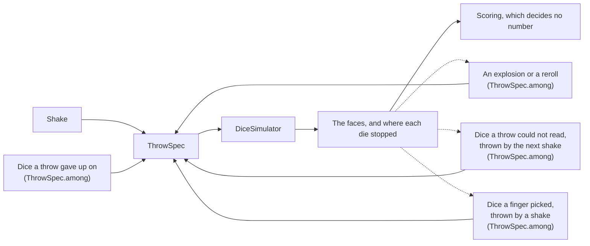
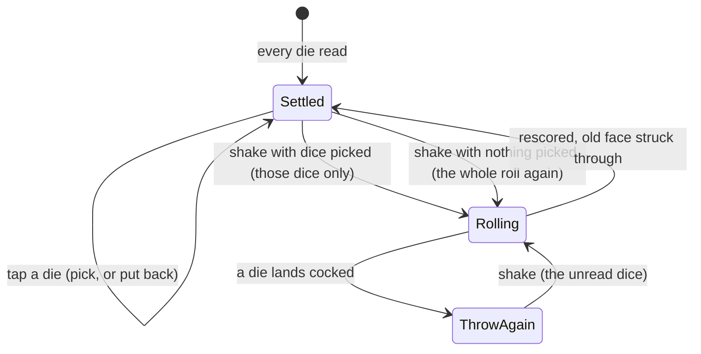
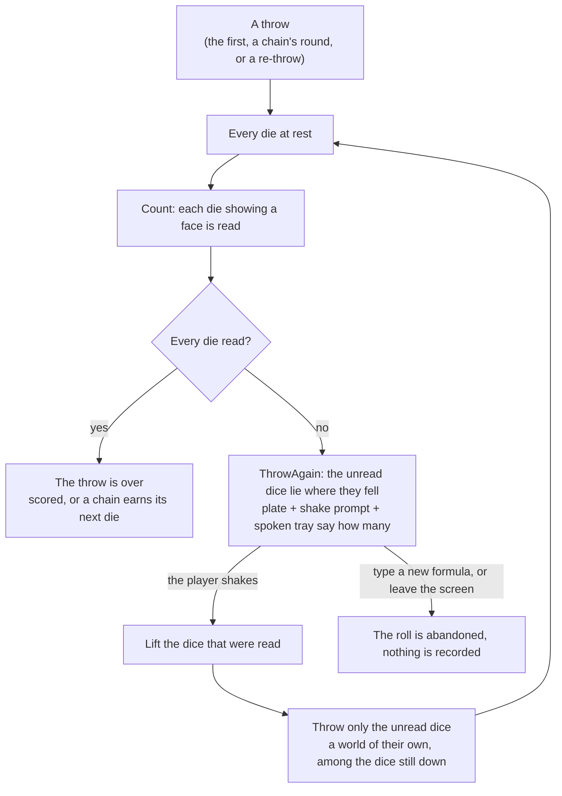
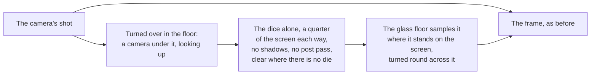
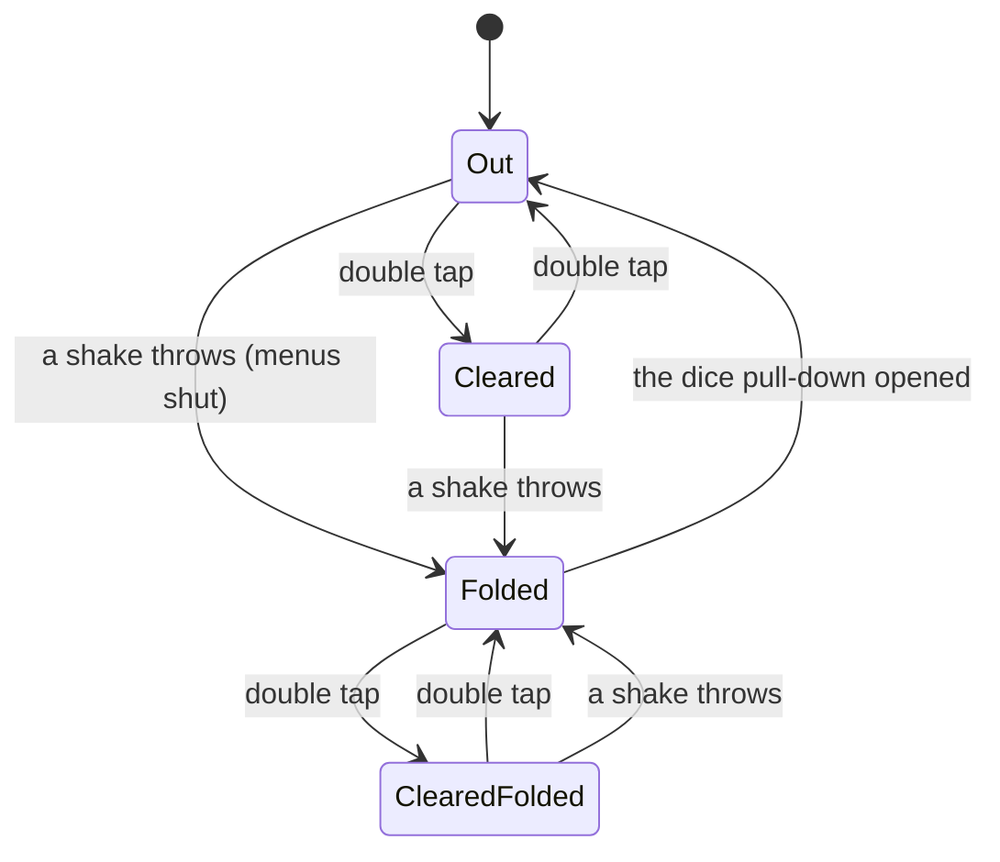

# Physics and rendering

> **Design:** the tray, a settled roll and the power-saving result are
> options 1a and 1z of the [clickable design](../design/dInfinity.dc.html) ([design/](../design/)).
> The dice there are flat silhouettes standing in for the 3D render.

## Overview

Each roll is a rigid-body simulation of dice inside a tray. The number on a
die is read from whichever face normal points closest to "up" once the die has
come to rest. Rendering is a passive observer of the simulation.

## Coordinates

One right-handed system, shared by the tray, the solver and the renderer:
**`+z` is up**, the tray's long side runs along `+x` and its short side along
`+y`, and the origin is the middle of the floor. Distances are millimetres
everywhere above the bridge; the solver runs in centimetres on the far side of
it and converts in one place (decision 41).

Nothing is turned over on the way between the three. A renderer that used a
different up would have to flip every transform it was handed, and the first
thing to go wrong would be a die drawn resting on the face it did not land on.
It is also what "up" means everywhere else in this document: the face reading,
the reference orientation a shape's face order is numbered in, and the
direction a face's texture is drawn the right way up in
(`docs/dice-sets.md`).

## The table

The table (tray) is a fixed rectangular box whose floor is the phone's screen:
its aspect ratio and apparent size match the visible area, and its walls sit
at the screen edges like the rim of a dice box. See `docs/tables.md` for the
geometry, the capacity rule and how the *look* of the table can be swapped.

- The mesh never changes. Only textures, colours, material and sound profile
  are exchangeable.
- Wall height is generous and there is an invisible ceiling. The *collision*
  walls run all the way up to that ceiling rather than stopping at the rim the
  renderer draws, because a box open at the sides between the two is a box dice
  leave (`docs/tables.md`).
- **The rounded corners are fillets, flat-faced and exactly where they are
  drawn**: six wedges to the quarter, at the six segments the tray mesh uses.
  They were a round post 24 mm across that the mesh did not draw, and dice
  leaning on it never came to rest ("Why a die could rock for ever").
- **The table is horizontal, whatever the phone is doing.** Gravity in the tray
  is straight down and stays there; the hand moves the dice, the table does not
  tip under them. It used to follow the phone, and the cost was worse than the
  feature was worth — see "Shake input".
- Floor and walls have a slightly higher friction than the dice-on-dice
  contact so the pile spreads instead of stacking.
- Because the table cannot grow, **dice shrink** when there are many of them
  (`dieScale` in the `ThrowSpec`), down to a minimum. Below that minimum the
  roll is refused before any body is created. Smaller dice that roll honestly
  beat big dice that jam.

## Dice bodies

Every die is a **convex** rigid body:

- Built-in shapes come from the shape catalogue (see `docs/dice-sets.md`):
  tetrahedron, cube, octahedron, pentagonal trapezohedron (d10), dodecahedron,
  icosahedron, enneagonal trapezohedron (d18), coin (d2), etc.
- The catalogue is closed in v1 (`docs/dice-sets.md`), so every body is one
  of eight known solids. A set changes a die's size, material, face values and
  artwork, never its geometry — which is what makes the tuning below hold for
  every installed set.
- Mass is uniform density over the hull volume; inertia tensor from the hull.
  Standard sets use realistic sizes (a d6 of 16 mm) and density (~1.2 g/cm³,
  roughly acrylic).
- Restitution 0.55, friction 0.5 by default. These are tunable per die in
  the set file within clamped ranges. Jolt combines a contact's two
  restitutions by taking the larger and its two frictions by their geometric
  mean, so a table's restitution only matters where it is above the die's.
  Restitution was 0.3 until it was measured as the reason a die stopped
  turning soon after it landed: every edge a tumbling die rolls over is an
  impact, and at 0.3 each of them took most of what was left. Measured on the
  Pixel 10a over 1,000 rolls of 20d20, raising it to 0.55 took the turns after
  landing from 1.67 to 2.70 and the re-throw share from 2.76 % to 1.18 %,
  for 0.13 s more median settle ("How hard the dice are thrown"). Die-on-felt
  friction moved neither figure (0.5 and 0.65 within 0.01 turn), and the
  bodies' damping is 0.02, too small to be what stopped them.
  The solver stops applying restitution
  below 1 unit/s, which is Jolt's own default and a centimetre a second here.
  It was 150 mm/s for a while, chosen as "about where a die lands and stays" —
  which it is, and which also gave every contact after the first landing a
  restitution of exactly zero, so a die bounced once and then dead-dropped.
- Rounded edges: shapes with sharp corners (d4 especially) get a hull margin of
  3 % of the die's nominal size (`HullMargin.SHARE`, 0.48 mm on a 16 mm die),
  so they tumble instead of catching on the floor. It is Jolt's *convex
  radius*: the hull's face planes are pulled in by it and the smaller solid is
  grown back out by a ball of the same size, so the die that collides has
  every edge a strip of a cylinder and every corner a patch of a sphere. Jolt
  gives less than is asked where a corner is sharp — no rounded corner may
  stand more than 0.5 mm inside the sharp one (`HullMargin.MAX_ERROR_MM`),
  which cuts a d4 to 0.25 mm — and never more than half the die's thinnest
  width. The share is of the *nominal* size, clamped to the set file's limits,
  and not of the size the capacity rule shrank the die to: a die thrown at
  half size asks for the same radius in millimetres. The renderer draws the
  same rounding ("Rounded edges", under Rendering).

## Timestep and determinism

- Fixed timestep of **1/120 s**, up to 4 sub-steps per rendered frame. Every
  threshold below is counted in *steps* rather than seconds — 30 steps to rest,
  1,440 to the cap — because a count of fixed steps is exact where a running
  total of doubles is not, and two devices that disagreed by one step about
  when a die stopped would disagree about the roll.
- The simulation is seeded per roll. The seed and every input impulse are
  recorded in the `RollResult` so a roll can be replayed exactly.
- **Every random number in a roll comes from `Seeds`, and the seed is stirred
  before it becomes a generator.** A seed handed straight to
  `kotlin.random.Random` becomes an xorwow state by way of sixty-four warm-up
  steps, and sixty-four is not enough to separate two seeds that differ only in
  their low bits: 200,000 d18 throws seeded `0, 1, 2, …` start in orientations
  spread *more* evenly than chance allows, χ² of 0.73 against 17 degrees of
  freedom. Too even is a correlation like any other, and a die is only fair
  because its starting turn is drawn evenly and independently of everything
  else about the throw. Rolls the app starts are seeded from `SecureRandom` and
  were never affected; an **exploding die was** — its extra throws used to be
  seeded one, two, three more than the throw that set them off. SplitMix64's
  finaliser fixes it in three lines: a bijection, so two seeds are still two
  streams, and pure arithmetic, so a roll still replays to itself on every
  device.
- The engine is configured in deterministic mode — Jolt built with
  `CROSS_PLATFORM_DETERMINISTIC=ON` (`docs/build-setup.md`) — stepped by a
  single-threaded job system, and no `System.nanoTime()` takes part in any
  simulation decision. Single-threaded because a roll is at most a hundred
  small convex bodies (`TableCapacity.MAX_DICE`), where the threads would cost
  more than they save, and because it removes a whole class of question about
  what "deterministic" depends on.
- The simulation runs in **centimetres and grams**, converted from the app's
  millimetres at the bridge and nowhere else. That is not cosmetic: at metre
  scale a die's inertia tensor falls under a hard-coded "near zero" test inside
  Jolt and is replaced by that of a sphere a metre across, which friction cannot
  slow (`docs/architecture.md`, decision 41).
- Everything that decides a throw *before* the engine sees it — the spawn
  layout's orientations and spins, the catalogue's hull vertices, the threshold
  a face is read against — is computed with `StrictMath` through
  `simulation/api`'s `Exact`. `Math.sin` may be an intrinsic and is allowed to
  be an ulp out; one ulp in a starting quaternion is a different face a hundred
  steps later (`docs/architecture.md`, decision 43).
- Golden tests: a fixed list of (seed, formula, input) triples with their
  recorded outcomes, in
  `test-fixtures/src/main/resources/fixtures/golden/cases.tsv`. They are
  asserted in two halves, split where the engine begins. The JVM half runs on
  every CI build and checks everything the engine is *handed* — which dice the
  formula resolved to, how far the capacity rule shrank them, every die's
  starting placement and hull, and the gravity of every step of the shake, as
  one digest. The device half runs on the emulator and the phone and checks
  what the engine *did* with it: the faces, the steps to rest, the corrections
  and the re-throws, exactly. Both halves assert the digest, which is what
  makes the CI half worth running: it is only evidence about a real roll while
  the device still agrees with it about what the roll was. Any diff is a bug —
  re-recording is deliberate and reviewed (`docs/build-setup.md`).

### The simulation clock

A roll is a loop over fixed steps, and the only questions are who turns it and
how fast. That is the whole difference between a roll on screen and a roll in
power-saving mode; there is no other one.

- **A watched roll does not run at real time.** `RollPace` scales the time a
  frame is worth before `FrameClock` sees it, so the same roll is shown over
  more wall clock than the physics took: `RollPace.WATCHED` of a second of real
  time per second of simulated time, which at the current **0.4** means a roll
  takes two and a half times as long to watch as it takes to happen. It was
  0.5 until the owner judged the livelier tumble on the Pixel 10a: the spin
  read right, the dice still crossed the tray a little too fast. At 0.4 the
  median 20d20 (0.96 s) takes 2.4 s to watch and the ninety-ninth (1.76 s)
  4.4 s; a single die stops well inside the median, so `1d20` still answers
  in about two seconds. Impacts are played on the frame whose steps produced
  them and the result is read when the simulated roll settles, so sound,
  haptics and the result sheet follow the pace without a number of their
  own.

  It is a presentation change and nothing else. The seed, the steps, their
  order, the corrections, the re-throws and the faces are all exactly what they
  were; what changes is when the steps are asked for. Nothing here reaches the
  solver.

  It exists because the physics has nothing left to give. Measured on the
  Pixel 10a over 200 rolls of 20d20, the die/table friction pair moves the
  median settle from 0.73 s (0.34/0.42) through 0.81 s (0.5/0.6, what is
  shipped) to 0.85 s (0.7/0.85), and the turns a die makes after landing from
  1.45 to 1.59 — and the high end also pushes the dice into one another, from
  5.04 mm of overlap to 5.59 mm. Restitution was the one physical number with
  room in it ("Dice bodies"): at 0.55 the median 20d20 settles in 0.96 s
  rather than 0.83 s, and spends it tumbling rather than sliding. Twenty d20 in
  a tray the size of a phone genuinely stop in about a second. Two or three
  seconds of tumbling would mean energy a hand does not put into dice, and
  would push `100d4` further into the twelve-second cap.

  **A roll stops being paced once it stops landing.** The pace holds for
  `RollPace.WATCHED_SECONDS` of simulated time and then gives the frame back
  whole. The reason is `100d4`: the twelve-second cap counts *simulated* time,
  so pacing cannot change when a roll gives up, only how long somebody waits
  to be told — and a flat 0.4 would turn that into thirty seconds of
  watching dice that were never going to stop. Three seconds is chosen against
  the measurements: the median 20d20 settles in 0.96 s and the ninety-ninth in
  1.76 s, so a roll that is behaving is paced from first step to last and
  never meets the bound at all. What meets it is a roll that is not landing,
  and a roll that is not landing is being *waited for* rather than watched.

  **A big roll's tail is quickened** (decision 88). A hundred d4 settle in a
  median 1.29 s of simulated time, but their slowest one in a hundred takes
  3.09 s (Pixel 10a, 200 throws) — 7.7 s on the screen at 0.4, nearly all of
  it a few dice rocking while ninety-odd lie still. So for a roll of at least
  `RollPace.TAIL_FROM_DICE` (10) dice the pace follows the share still unread:
  `WATCHED` while a quarter or more is moving, real speed once a tenth or less
  is, and a straight line between (`RollPace.paceFor`). It is a gradual climb
  rather than a jump, so it does not read as a dropped frame; it never passes
  real speed, so the last dice still move the way dice move; and it decides
  only when steps are taken, so the faces are the same at any pace. A smaller
  roll is watched at `WATCHED` to its last die, because there the last die
  tumbling *is* the roll.

  Otherwise **`RollPace.WATCHED` is one constant.** The other place the speed
  changes is the moment the hand lets go, which is a moment the player caused
  and at which the dice's motion changes character anyway — the tray stops
  hauling them about and there is nothing but gravity left. A slower roll is
  also a slower *answer*, so the number is meant to be judged on a phone and
  changed.
- **A roll being driven is never paced.** While a hand is throwing the dice the
  player is not watching the roll, they are steering it, and dice that answer a
  hand a beat late are the only way this could make the app worse. The question
  asked is `WatchedRoll.driven`, which is `ShakeDriver.stillShaking` — the same
  question the roll asks before it is allowed to end. So the part of a roll
  that may not be declared over because the hand is on it is exactly the part
  that is not slowed down for somebody to look at, and the two can never
  disagree. Every throw now starts with a hand on it, because a shake is the
  only way to start one ("Starting a roll").
- **The pace is applied where real time becomes simulated time**, which is
  `TrayLoop.frame` and nowhere else. Power-saving mode asks for a fixed helping
  of simulated time and has no frame clock at all, so it never passes through
  that line and cannot be paced by accident — a stronger promise than a flag
  somebody has to remember to clear ("Power-saving mode").
- **A frame time never reaches the solver.** `FrameClock` accumulates the time
  a frame actually took, cuts it into whole 1/120 s steps and carries the
  remainder to the next frame, where it becomes the interpolation a renderer
  blends the last two states with. The world is advanced by a fixed step or it
  is not advanced.
- **A frame that ran long is not paid in full.** At most four steps are taken
  for one frame and the time behind the rest is dropped with them. Carrying it
  would mean the next frame owed more than this one did and the one after that
  more again — the spiral where a phone that fell behind once never catches up.
  Dropping it costs nothing but wall-clock time: the roll takes the same steps
  in the same order and comes to the same faces, it simply arrives there later.
  A number here is a smoothness problem, and Step 5.7 is where it stops being
  acceptable (`docs/TODO.md`). `LiveRoll.droppedSteps` counts them, but
  nothing in the app shows the count yet — putting it on the debug overlay is
  an open item in `docs/TODO.md`.
- **A die thrown again is a throw of its own.** A die that could not be read
  is not picked up between one step and the next: the throw ends with it lying
  where it fell, and the shake that throws it again opens a new world and a
  new picture. Nothing moves between the two, so there is nothing to
  interpolate across — and an invisible hand with an animation on it has no
  frame left to appear in ("Avoiding stacked and cocked dice").
- **Watching is passive, and the type says so.** A roll in progress hands the
  renderer a frame and takes nothing back. It cannot be stepped, reached into
  or asked for another go from the far side of `Renderer`, so turning the
  renderer off cannot change what a roll comes to — which is what makes
  power-saving mode the same roll rather than a second implementation
  (`docs/architecture.md`, decision 48).

## Starting a roll

**A shake is the throw.** It is the only way to put dice in the air, and every
other control in the app stops at filling the formula field. That is absolute
(`docs/architecture.md`, decision 66): no button, no key, no accessibility
action and no setting that switches shaking off. The dice are
spawned when the shake begins and are driven by the phone's motion until the
hand stops, then released ("Shake input", below).

There was a Roll button, and it is gone. It was not a second way to throw so
much as a way of making the shake optional: a tap on a saved roll threw, the
button threw, the welcome threw, and a player could use the app for a week
without discovering the thing it is for. The button also owned the one line of
the screen that said what a throw would be worth, which is now the ready plate
(see "What the screen says before the throw").

The initial angular velocity is large enough that the outcome is not
predictable from the starting orientation. (A die dropped from 2 cm with no
spin *would* be predictable. We do not do that.)

**A shake finishes what it starts.** Three states leave a roll part-way
through — a chain that earned a throw, a throw that left dice it could not read,
and a throw that gave up on dice that never stopped — and the same shake
answers all three. None has a button, and the screen says how many dice the
next shake will throw, both on the plate across the bottom and in an accent
**shake prompt** over the tray that announces itself to a screen reader and
stays until the shake (`docs/architecture.md`, decision 84). They never compete for one shake: the
dice nobody could read come first, because a throw earns a chain's next die
only once every die of it has a face.

**Tapping the tray does not roll** — decided, not pending. It is the largest
target on the screen and the most tempting one, which is exactly why it is not
spent here: the tray is
where the camera is moved and where individual dice are picked up for the next
shake to throw again ("Picking a die up and throwing it again"), and a surface
that threw the whole formula the moment it is touched would have nowhere left
to put either. A roll is also not something to start by
accident — it replaces a result somebody may still be reading.

### No way in that is not a hand

There used to be two: a custom accessibility action on the table, *Throw the
dice*, and Enter in the formula editor. **Both are gone** (`docs/architecture.md`,
decision 66). The editor's key says Done and only closes the editor; the
table carries a spoken description of what is on it and no action. Nothing in
Settings turns shaking off either, because with it off nothing could roll.

The cost is stated rather than hidden: somebody who cannot shake the phone —
including a TalkBack user who cannot also shake it — cannot start a roll. The
owner accepted that as the price of the throw being the hand's
(`docs/architecture.md`, "Accessibility").

### What the screen says before the throw

A button said "Roll". With no button, the plate in its place says what rolling
would get you: **the lowest the formula can come to, the highest, and the exact
average**. The ends are `RollBounds`, the same calculation the counting plate
draws mid-roll, asked of a throw that has read no dice at all; the average is
`core/probability`'s exact distribution (`docs/probability.md`). A formula too
large to graph exactly keeps its range and loses only its average.

**It is on the screen for as long as a shake is the next thing that happens**,
and in exactly one place at a time. Before the throw it is on the ready plate;
while the dice are moving it is the counting plate's live range; on the three
plates a roll can wait on — a chain that earned a throw, dice nobody could
read, a throw that gave up — it is that same live range under a `STILL TO
COME` kicker; and once the dice
have landed it is in the **result sheet's grip**, beside the total, where it
survives the sheet being pushed down.

That last move is the fix for what the second device session found: during a
chain of re-rolls the figures appeared for an instant and were then covered by
the result. They were under the breakdown, so they went away with it, and a
player deciding whether to shake again was left with nothing to decide with
(see "What is drawn over the table").

## Picking a die up and throwing it again

A player who does not like how a die landed picks it up and throws it again.
That is the third way a die can be thrown, and it is the only one that is not
the app's idea. The tray's **one-finger tap is spent on it**, and on nothing
else — which is why a tap on the biggest target on the screen still does not
roll. **The finger picks; the shake throws** (`docs/architecture.md`, decision
68): a finger that threw would be a throw no shake started, which decision 66
rules out for a roll.

**It is not the invisible hand.** The rule further down — *nothing touches a
die that has come to rest* — is about the **app** reaching into a finished roll,
and what makes that intolerable is that nobody sees it happen: the player is
shown a number that was arranged rather than rolled. A hand is the opposite in
every particular. The player chooses the die, watches it go, watches it land,
and the face that comes back is the physics' exactly as the first one was. The
die is still never shoved, never tilted and never snapped to a face. It is
thrown, in front of everybody, which is what a person does at a table.

That is the easy half. The hard half is that a feature like this can *become*
the invisible hand by accident, and the rest of this section is what stops it.

### It is the throw an explosion already makes

There is one way to throw dice in this app and one path to a number
(`docs/architecture.md`, goal 1), and the throw a hand asks for already exists:
it is the one `8d6!` makes when a six comes up. One die, into a tray that
already has dice at rest in it, seeded from the roll's own seed through
`Seeds.derived`, dropped rather than hurled into the floor `ClearSpace` picks
out — and **with none of the settled dice in its world**. That is how the rule
is kept here, exactly as it is kept there: not by tuning a spawn until it
usually misses the pile, but because there is nothing in that world for a die
to hit (see "The dice an explosion or a reroll adds"). The settled dice travel
as `ThrowSpec.among` so the picture is honest too, and the renderer puts them
back where the simulation left them and never moves them again.


```mermaid
flowchart LR
  shake["Shake"] --> spec["ThrowSpec"]
  chain["An explosion or a reroll<br/>(ThrowSpec.among)"] --> spec
  unread["Dice a throw could not read,<br/>thrown by the next shake<br/>(ThrowSpec.among)"] --> spec
  stalled["Dice a throw gave up on<br/>(ThrowSpec.among)"] --> spec
  hand["Dice a finger picked,<br/>thrown by a shake<br/>(ThrowSpec.among)"] --> spec
  spec --> sim["DiceSimulator"]
  sim --> faces["The faces, and where each die stopped"]
  faces --> score["Scoring, which decides no number"]
  faces -.-> chain
  faces -.-> unread
  faces -.-> hand
```

So there is nothing to invent, and nothing new to keep in step with
power-saving mode: a hand re-throw is a throw, and it settles, is read and is
scored the way every other throw is.

### What happens to the face the die already showed

**It stands, and it counts.** The die is not picked up in the literal sense —
nothing moves it — so it stays where it fell, and its face stays in the
breakdown, struck through, with the new die listed beside it. That is not a
special presentation invented for this: it is exactly what `r n` already does
(`docs/dice-notation.md`, "The order modifiers are applied in"), and a player
who has seen `4d6r1` has seen it.

It also stays in the statistics. `docs/statistics.md`'s rule for a dropped die
is that it is still counted, "the die was thrown and landed on that face", and
a die thrown again is the same case: **two throws happened, so two throws are
counted**. A die that was counted once would be a histogram quietly missing the
rolls somebody did not like, which is the exact shape of a lie about fairness.

The roll itself is **rescored, not re-rolled**. Scoring is pure — the same
faces always give the same total — so it is run again from the beginning with
the new face in hand, which is what the tray already does every time an
explosion lands (`RunningScore`). Nothing about the other dice changes, because
nothing about the other dice happened.

### Which die, and whether it may be thrown again at all

Two decisions, and neither of them belongs inside a gesture.

**Which die the finger is on** is arithmetic over the camera and the places the
dice stopped: a ray through the touch point, against the ball around each die
at the scale the capacity rule threw it, nearest to the camera first. It is the
inverse of `TrayCamera` and it lives beside it, as `TrayPick`, with JVM tests
that project a die through the frustum it was drawn in and ask for it back
(`docs/architecture.md`, decision 62). Where two dice lie against each other,
the answer is the one the player can see, and the answer to *that* ambiguity is
the pinch: looking closer separates them on screen.

**Whether that die may be thrown again** is a question about the formula, and
it is the one that keeps this from becoming the invisible hand. `8d6!` threw a
seventh die because the sixth came up six; `4d6r1` threw a fifth because the
second came up one. Those dice are lying in the tray, their faces have been
read, and they are in the statistics. Throwing the die that called for them
again would leave the roll holding a die the formula no longer asks for — and
the only two ways out of that are to take a die off a table nobody threw it
off, or to keep a die whose reason has gone. Both are the app moving dice
behind the player's back.

So the offer stops at the **group**: a group carrying `!` or `r n` offers
nothing, and every other group offers all of its dice, including the ones
`kh`/`dl` struck through — which are the dice a player most wants to throw
again, and which cost nothing, because which die a keep/drop leaves out is
arithmetic over the faces and is redone from whatever faces there are. That is
`PickUp`, beside `GroupRoller`, which is what built the chains it refuses to
guess at. It is conservative on purpose: a die it refuses is a die the player
throws again by shaking the whole roll again, and a die it wrongly allowed
would be a roll the app had rearranged.

### Can this be used to roll until you like the answer

Yes, and **it is deliberately the player's business**, exactly as it is at a
table. The app is not a referee and has no way to be one: it cannot see who is
at the table, what was agreed, or whether the die went off the mat. What it can
do — and what makes a hand at a table tolerable in the first place — is make
sure the throw is *visible* and that the record does not flatter it:

- every face is in the breakdown, the replaced one struck through beside its
  replacement, so the sheet in front of the player says how the total was
  reached;
- every face is in the statistics, counted once per time it was actually
  thrown, so "are my dice fair" is answered from every roll and not from the
  ones somebody kept;
- and no number anywhere comes from anything but the simulation. A player who
  throws a die five times has rolled five times. There is no version of this
  where the app decides the fifth.

What the app must never do is let a re-throw *cost* nothing to the record, and
that is decided (below).

### How it works on the screen

**Once a roll has a total, one finger on a die picks it up.** A tap — one
finger, down and up again within the touch slop and before a long press would
fire — is read through `TrayPick` against the camera, the pinch and the lean
the picture was drawn with, and `PickUp` says whether that die may go; the
machine keeps the pick (`RollMachine.pick`). **A second tap on the same die
puts it back** (`docs/architecture.md`, decision 76). A finger that wanders, a
finger held down and any gesture a second finger joins are not taps: the last
of those is the camera's. **A tap is a tap only once the double-tap timeout has
passed without a second** — two taps in quick succession clear the controls off
the table instead ("Clearing the table", decision 83) — so a pick shows about
300 ms after the finger lifts, and the first half of a double tap never picks. A tap on the bare floor, on a die no hand may go
near, or before the roll has a total does nothing.

**Picking moves nothing.** The die stays exactly where it lies; what changes is
a ring drawn round it over the picture, in the accent on a halo of the plates'
ground, and a shake prompt over the tray — "Shake to throw the 2 picked
dice", and under it "Tap a ringed die again to put it back" — announced as it
changes, and gone with the shake (`docs/architecture.md`, decisions 76 and
84). The tray's spoken description says the count too.
A pick that would need more clear floor than the tray has left is refused, for
the reason a chain stops at `TrayFull`: the new die is dropped into clear floor
and there would be none.


```mermaid
stateDiagram-v2
  [*] --> Settled: every die read
  Settled --> Settled: tap a die (pick, or put back)
  Settled --> Rolling: shake with dice picked (those dice only)
  Settled --> Rolling: shake with nothing picked (the whole roll again)
  Rolling --> ThrowAgain: a die lands cocked
  ThrowAgain --> Rolling: shake (the unread dice)
  Rolling --> Settled: rescored, old face struck through
```

**The next shake throws the picked dice, and only those**
(`RollMachine.throwPicked`), through the path the unread dice and an
explosion's die already take: a world of its own, seeded from the roll's seed
and the count of hand throws (`Seeds.byHand`), every die still down carried as
`ThrowSpec.among` — the picked one among them, drawn where it lies — and the
new die dropped into the clearest floor. A shake with nothing picked throws the
whole roll again, as it always has.

**Unread dice come first.** Nothing can be picked until every die of a throw is
read: a roll waiting on dice that landed cocked (decision 70) has no total, so
it offers nothing to pick, and the shake it is owed throws those. A throw by
hand that lands a die cocked waits the same way before it is scored.

**The roll is rescored, not re-rolled.** When the new dice are read their faces
replace the old ones in the faces the roll is scored from, the scoring runs
again from the beginning, and `PickUp.withEarlierThrows` puts each replaced
face back in front of its replacement, struck through, exactly as `r n` shows
a reroll. A die thrown again lies on the felt beside the one it replaced, and
only the newer of the two can be picked again.

**The history keeps every throw of the die and one total for the roll.** The
roll is written down when it first lands; a throw by hand amends that same row
with the new total and breakdown and counts only the dice thrown again, once
more each (`docs/statistics.md`, "A die thrown again by hand"). A `d6` that
went `6, 6, 6, 4` contributes four readings to its own fairness figure, because
it really did land on those faces four times, and the roll contributes one
total.

## What a shake's spread currently rests on

Measured on the Pixel 10a and worth knowing, though it is now history rather
than advice: while there was still a correction ladder, the reason a shaken
throw ended up spread across the tray rather than packed into one end was
**not** prevention. It was two accidents.

The first was the bias. A bias always carried a little upward, so it was what
lifted a die out of a pile; take it away and the dice stayed where the shake put
them. It has been taken away — there is no bias any more — and the dice do now
stay where the shake puts them. That is no longer treated as a failure: a
cluster of dice that can all be read is what a sideways shake looks like, and a
heap that cannot be read is counted and left for the player's shake to throw
again rather than spread by a hand nobody can see.
The second is the solver's own error. At 1/120 s a die travelling a metre a
second crosses half its own width between collision checks, so two dice are
first seen already deep inside each other and are pushed apart hard. Resolve
collision in sub-steps and that stops happening — and the dice were expected to
pack, because the popping apart was doing the spreading.

**That expectation has now been measured, and it was too pessimistic.** The
solver takes two collision steps per simulation step, and on 200 rolls of
20d20 on the Pixel 10a it costs nothing that shows: no die is left standing on
another either way, and what it buys is the deepest die-into-die overlap
falling from 9.9 mm to 6.6 mm and the re-throw share from 3.1 % to 2.8 %. It
does take 17 % off how far the middle die turns after it lands — 1.72 turns to
1.43 — which is the packing the old reasoning feared, showing up as less
tumbling rather than as a heap. The throw buys that back
("How hard the dice are thrown" below). A step costs 0.37 ms against a budget
of 8.33.

**Four and eight were tried against the livelier throw, and two stays**
(`docs/architecture.md`, decision 77). On the Pixel 10a, 2026-10-04, the
harness's 20d20 over seeds 1–3 (1,000 + 5,000 + 5,000 rolls) and 60d20 over
1,000:

| collision steps | 2 (kept) | 4 | 8 |
| --- | --- | --- | --- |
| deepest overlap, 20d20 | 6.94–7.90 mm | 4.66–4.98 mm | 2.51–2.67 mm |
| dice re-thrown, 20d20 | 1.19–1.23 % | 1.20–1.22 % | 1.20–1.38 % |
| median / p99 settle, 20d20 | 0.95–0.96 s / 1.94–1.96 s | 0.98 s / 1.98 s | 0.98 s / 2.00–2.03 s |
| turns after landing, 20d20 | 2.69–2.72 | 2.62 | 2.79–2.80 |
| p99 step, 20d20 / 60d20 | 0.18–0.23 / 0.46 ms | 0.23–0.27 ms / — | 0.37–0.42 / 1.63 ms |
| 60d20 overlap / re-thrown / median settle | 6.17 mm / 2.62 % / 1.67 s | — | 2.45 mm / 2.87 % / 1.75 s |
| shaken 20d6 seeds ending clustered | 7 of 16 | 7 of 16 | 7 of 16 |

The packing that sub-stepping was feared for **did not happen**: the same
seven of sixteen shaken throws ended in one end of the tray at every count, and
the dice turned no less. What eight steps cost is small but the same on every
seed — two to four steps more to settle at twenty dice, ten at sixty, and a
quarter of a point more re-throws at sixty — and it still leaves the overlap at
twelve times the 0.2 mm bar. So the count was not changed: a change that moves
every golden case and wants the fairness run again has to meet a target, and
this one cuts a miss to a third and still misses. Eight is one constant away
in `World::Step` if the owner, watching the tray, finds the overlap visible
(`docs/TODO.md`, 5.4).

Both are measured, with numbers, in `docs/TODO.md` (Step 5.5). The point for
anyone changing this file is that **the re-throw rate and the overlap depth
cannot be fixed independently of deciding what a sustained sideways shake should
do to a tray of dice**, which is an open question below. A tray of dice under a
1.8 g lateral drive packing against the far wall may well be right — it is what
a hand does — but until that is decided, a change that improves the overlap will
look like a regression in how a shaken roll reads. (Collision sub-steps no
longer do: at the current throw they leave the shaken heap exactly where it
was, as the table above says.)

## Shake input

- Sensors: linear acceleration (gravity removed) and gyroscope, at
  `SENSOR_DELAY_GAME`. Registered while the roll screen is resumed and let go
  when it is not — an accelerometer running behind a backgrounded app is a
  battery bill for nothing.
- **The roll screen holds the display on while it is in front.** A shake takes
  both hands and puts neither of them on the glass, and reading the dice
  afterwards puts nothing on it either, so the display timeout counts a throw
  as idle and blanks mid-roll. `KeepTheScreenAwake` (`HoldTheScreenStill.kt`)
  sets `View.keepScreenOn` for as long as the screen is composed and clears it
  on the way out — the view's flag rather than the window's, so leaving the
  screen gives it back by itself. Only this screen: the rest of the app is
  reading and scrolling, which is what the system timeout is for. It is not a
  wake lock, needs no permission, and does not keep the display on once the
  app is not in front. There is no setting for it, because the only thing a
  setting could offer is a display that goes out in the middle of a throw.
- **The display's rotation has to stay truthful, which is why the roll screen
  is not pinned to one.** `PhoneAxes` maps a sensor vector into the tray using
  `Display.getRotation()`, so a screen held at the rotation it opened at
  reports an upright phone while it is being shaken upside down. The map is
  right and is handed a lie, and the dice pool at the end away from the hand
  rather than the end towards it. The screen asks to keep its *shape* instead —
  a quarter turn still refused, because that rebuilds the table; a half turn
  allowed, because it does not (`docs/tables.md`).
- **Shaking a phone hard can trip Android's Theft Detection Lock.** It watches
  for the motion of a phone being snatched, and a good throw is not far off.
  Nothing in the app can suppress it and nothing should try: it is a security
  feature doing its job, and the player can turn it off in their own settings.
  Worth knowing about before it is reported as a crash — the app is not
  involved and carries on where it left off.
- **The dice are spawned when the shake begins**, and every moment after that
  reaches them while they are already in the air. What the player sees is dice
  answering their hand, not dice thrown once the hand has stopped.
- **A live sample drives the step the world is about to take**, whatever its
  own clock says. `ShakeRecorder` counts steps from the start of the shake at
  the simulation's own 120 Hz, which is a *wall* clock; the world counts the
  steps it has actually taken. The two are not the same clock — a watched roll
  is paced ("The simulation clock"), and a frame that ran long drops steps
  either way — so `ShakeDriver.add` files each arriving sample on the step the
  world will take next and **rewrites the sample to that step**. The record it
  hands back is therefore what actually drove the roll, and replaying it drives
  exactly the same steps. No gate, no waiting, and the live roll and its replay
  are the same roll.
- Filing them by arrival is what makes the hand immediate rather than merely
  eventual. A sample kept on the recorder's number would reach the dice as late
  as the two clocks had drifted, and once the world had gone past that number
  it would never reach them at all — which is what shaking a phone at tumbling
  dice used to do.
- **A second shake at dice still in the air keeps them moving.** A hand that
  shakes again has not waited for the dice to stop, so that shake starts no
  throw: nothing is spawned, nothing replaces the roll in progress, and its
  moments simply join the ones already driving it. The roll also cannot end
  while it lasts, because the settle rule waits on the last sample and there is
  now a later one.

  The mechanism is one thing, and it is the thing that was wrong. A second
  shake that numbered its moments from zero named steps the running roll had
  taken a second earlier, and `ShakeDriver` never reached them: shaking the
  phone at moving dice did nothing at all. Two things keep it reaching them
  now. A shake that begins while a roll is running goes on numbering from
  where the first one left off, and only a shake that actually throws dice
  starts the clock over — `SensorShakeSource` is told which it is, asked per
  sample because a roll may settle between two readings. And the driver files
  every arriving sample on the step the world is about to take, whatever
  number it came with, so no amount of drift between the two clocks can put
  the hand out of reach.

  **The pace comes off the moment the hand is back.** A roll being watched is
  slowed so the dice can be seen to land; a roll being driven is not, and a
  second shake makes it driven again on the frame it starts
  ("The simulation clock"). The dice answer the hand immediately, and the slow
  motion returns a tenth of a second after the last reading.

  What it deliberately does **not** do is replace the roll. The dice are the
  ones already tumbling; a second shake is more of the same throw, which is
  what it is at a table.
- **The hand's force is held between readings.** `SENSOR_DELAY_GAME` is about
  50 Hz and the simulation runs at 120, so most steps have no reading of their
  own. A step with no reading keeps the last one rather than falling back to
  plain gravity: an arm does not stop between two moments of a shake, and
  letting the force go on every step without a sample drove the dice on two
  steps in five and let them coast through the rest. The hold lasts a tenth of
  a second, which is long against the gap between readings and short against a
  shake — so a shake that has actually ended stops driving and the dice come
  down.
- The samples are handed to the roll on the thread the roll lives on. A shake
  written into a world that is mid-step is a race with a physics engine on the
  other end of it.
- **A roll cannot end while the phone is still being shaken.** Dice that look
  still for a moment under a hand that is still going are not a roll that is
  over; they are a roll caught at the top of a swing. The settle rule is the
  dice's answer and this is the hand's, and both have to agree before a throw
  is read. A shake is not the signal to tumble the dice — it is what is
  throwing them, for as long as it lasts.
- A sample that arrives after the dice have stopped is dropped. Nothing touches
  a die that has come to rest, and a hand is not an exception. That is not in
  tension with the rule above: the dice only come to rest once the hand has
  stopped, so by then there is nothing left to drop.
- **The roll keeps the shake that threw it, and hands it back with the
  result.** A shake-driven throw's `ThrowSpec` goes into the world empty — the
  dice are spawned the instant the shake is confirmed and the moments arrive
  afterwards — so the spec a roll *started* as is not the spec that would
  replay it. The moments are accumulated where they land, in `ShakeDriver`,
  which is also where they are deduplicated by step and kept in step order; the
  roll reports them as `drivenBy`, the tray hands them back beside the outcome,
  and the roll screen writes them into the spec it kept: `spec.copy(shake =
  drivenBy)`. What comes out is one object that rolls these dice again, rather
  than a spec and a list of samples that somebody has to join up.
  - Dropped samples are not in it. The record is what *drove* the roll, so a
    moment the roll refused — after the dice had stopped, or past the cap below
    — shaped nothing and would replay a different throw.
  - It dies with the roll. A throw the player walked away from never reports an
    outcome, so nothing asks for its record and nothing keeps it.
  - **It stops at the roll screen.** A past roll is a record, not something to
    re-run: `HistoryEntry` has no seed on it to show and the exports have no
    column for one, so neither has anywhere to put a shake
    (`docs/architecture.md`, decision 13, and `docs/statistics.md`). The record
    is for a bug report about a roll that is still in front of you.
- **The record is capped at 1,440 samples**, which is the twelve-second cap at
  the simulation's own 120 Hz — every step a roll can possibly take, and a step
  holds one sample. It is not a number picked to feel safe: a moment naming a
  later step has no step to drive and never will, so keeping it would grow the
  record of a thirty-second shake without adding anything a replay could use.
  Both `ShakeRecorder` and `ShakeDriver` stop there.
- **The cap is also the hand's limit on the roll.** A shake holds a roll open,
  but not past twelve seconds: the safety valve is not something the hand gets
  a vote on, and steps counted past it would be a roll nothing can describe.
- A shake session starts when acceleration magnitude stays above 6,000 mm/s²
  (about 0.6 g) for 100 ms, and ends after 400 ms below 1,500 mm/s². The start
  was 0.35 g once and was raised because picking the phone up, setting it down
  or handing it over registered as a shake (`ShakeThresholds`).
  Two thresholds rather than one, with a gap between them: a single threshold
  would flicker on and off through the quiet moment at the top of every swing.
  A session that runs past 30 s is ended anyway — it has stopped being an
  input.
- During the session the phone's acceleration is applied **inverse**, added to
  gravity. The dice slam into the walls the same way they would in a cupped
  hand, because that is what a hand yanking a tray sideways is: in the frame
  the player is looking at, everything inside gets thrown the other way. It
  feels far more physical than applying random impulses to the dice, and it is
  the same thing a moving tray would do without the tray having to move.
- **The tray never moves.** It is the phone's screen, so in that frame it is
  nailed down — and it has to stay that way for a second reason: a tray carried
  at the speed a hand shakes crosses more than its own wall thickness in one
  simulation step, and continuous collision detection sweeps a fast *die*
  against the world, never a fast wall against a die. The wall then arrives
  already inside a die and the solver pushes that die out of whichever face is
  nearer, which half the time is the outside. It was built with a moving tray
  first and the dice escaped.
- **Every sensor vector is turned into the tray's frame before it is used.**
  Android reports in the device's own: `+x` across the screen to the right,
  `+y` up it, `+z` out of the glass. The tray's long side is the screen's long
  side and runs along `+x`, its short side along `+y` — so the two frames are a
  quarter turn apart before the phone is turned at all, and the roll screen
  holds its shape but not its rotation, so the map follows the display's.
  Used straight,
  a sideways shake loads the dice along the length of the tray and the dice
  move in a direction with nothing to do with the hand. `PhoneAxes` is the one
  place that map lives, and both the accelerometer and the gyroscope go through
  it.
- **The gyroscope no longer turns the world.** It did, and a tray that tips
  with the phone is a nice idea that does not survive being shaken:
  `GravityTracker` starts each shake at "straight down relative to the screen"
  and integrates rates with nothing to re-anchor them, so a vigorous shake
  could leave down pointing sideways in the tray — and it stayed there for the
  rest of the roll, because the last sample's direction is the one that sticks.
  A tray whose down points at a wall is a chute: the dice slide into it, pack
  against it and stop tumbling, which is what a hundred d6 heaped into one
  corner looked like on the Pixel 10a. Twenty dice shaken along the tray's own
  length end in a heap at every seed tried with the tilt and at none without
  it.
- The direction is still **recorded** with every sample. It costs nothing, it
  is what a replay would need if this is revisited, and the question of what a
  tilted phone should mean is deferred rather than answered
  (`docs/TODO.md`, Step 5.6).
- **The wrist's swing is taken out of the shake before it is recorded**
  (`SwingCorrection`, `docs/architecture.md`, decision 87). The owner, on the
  Pixel 10a: "Dice tend to group at the top of the phone. When shaking up and
  down, left and right, and back and forth." A hand does not only carry the
  phone, it swings it about the wrist, and the wrist is below the sensor.
  Anything turning about a point it is not on is pulled towards that point by
  `ω × (ω × p)`, `p` running from the pivot to the sensor — a pull that goes
  with the *square* of the rate of turn, so it does not reverse with the
  stroke: left or right, up or down, towards the player or away, every stroke
  pulls towards the bottom of the phone. Applied inverse, it is a steady push
  up the tray. The tray here does not turn ("The gyroscope no longer turns the
  world", above), so the one part of a swing only a turning tray would feel
  does not belong in it.

  The pivot depends on the grip, so it is estimated from the shake itself: the
  gyroscope gives `ω`, each acceleration sample is one equation
  `a ≈ (ωωᵀ − |ω|²I)·p`, and `p` is their least-squares answer, started afresh
  with each shake's first hard moment and weighted by the time each sample
  stands for, so a faster sensor is not more certain. The carrying and the
  tangential part of the swing reverse every stroke and fall out of the fit;
  what is subtracted is the pull for the rate of turn *now*. A phone that has
  stopped turning has nothing taken away — which is why this is not a
  high-pass filter, which would answer the hand stopping with a kick the other
  way. The detector still hears the shake as it was, so nothing about what
  counts as a shake changes, and the record holds the corrected moments, so a
  roll replays from its record as before.

  Measured off the phone, through `ShakeSession` and the linux-x86_64 build of
  the bridge the coin replay used ("Why a die could rock for ever"): 300 throws of 10d6 per row, each a different
  synthetic hand — 2.5–4.5 Hz, four to seven strokes, carried 20–50 mm, swung
  10–25° about a pivot 70–150 mm below the sensor, sampled at 50 Hz. "Where"
  is the dice's mean position along the tray, −1 at the bottom wall and +1 at
  the top; one die in three in the top third is an even spread.

  | shake | where, before | top third, before | where, after | top third, after |
  | --- | --- | --- | --- | --- |
  | none | −0.01 | 35.5 % | −0.01 | 35.5 % |
  | carried only, any of the three directions | −0.02 to −0.01 | 31.6–35.0 % | the same | the same |
  | swung, left and right | +0.22 | 51.6 % | +0.02 | 36.2 % |
  | swung, up and down | +0.16 | 45.3 % | −0.01 | 34.6 % |
  | swung, back and forth | +0.16 | 47.4 % | +0.01 | 36.2 % |
  | swung, any direction and axis | +0.28 | 55.1 % | +0.00 | 33.4 % |
  | swung 20–50°, any direction and axis | +0.51 | 74.3 % | +0.01 | 34.0 % |

  A shake that only carries the phone was never the problem: it leaves the
  dice spread with and without the correction, and is passed through
  unchanged. The stiffness of the estimate (`SwingCorrection.DAMPING`) was
  picked from these runs: a tenth of it pushed the up-and-down shake's dice
  towards the bottom, three times it left a sixth of the pull in and thirty
  times two thirds. The hands are synthetic; with a real one, on the Pixel
  10a, the owner found the dice no longer pool at the top of the screen.
- An acceleration above 40,000 mm/s² — about four gravities, harder than anyone
  shakes a fistful of dice — is clamped. Past that it is a sensor fault or a
  dropped phone, and no thickness of wall survives it.
- Sensor samples are quantised — acceleration to 1 mm/s², direction components
  to 1/4096 — and indexed by *simulation step* rather than by wall-clock
  moment. Both are what make a roll reproducible from its own record: a
  quantised value survives being written down, stored and read back, and a
  record indexed by step feeds the same steps in normal mode, where it is
  consumed as it arrives, and in power-saving mode, where the session is
  replayed as a batch afterwards.
- A shake raises the bar an impact has to clear before it is felt or heard,
  and deliberately: the allowance a change in speed is forgiven is measured
  against the gravity of the step, and under a hand that is throwing four
  gravities at the dice only real slams get through ("Impacts, haptics and
  sound").

## How hard the dice are thrown, and how anyone can tell

A roll is only honest if the dice *roll*. `v0.1.1`'s did not: they arrived,
gripped the felt and stopped, which reads as a number being placed on the
table rather than thrown onto it.

**Nothing could see it, and that was the real fault.** Every bar the harness
scored was met by those rolls — they settled fast, never stacked, never ran
out the cap — because settle time cannot tell a die that tumbled from a die
that landed flat and slid to a halt. So the measurement came first.

`Tumble` (`simulation/api`) counts how far a die turns **after it first
touches the table**, in whole turns, and the harness scores the middle die of
each roll against a floor of one turn — its only target that is a floor rather
than a ceiling, for the reason above. The spin a die is given in the air is a
constant somebody chose, so counting that would be marking our own homework;
what nobody sets directly is how much of it survives the landing. One turn is
the bar because that is about what it takes to watch a die topple off the face
it landed on onto the one it is read from.

Like `RollDiagnostics`, it is **a reading and never an input**: nothing it
computes reaches the solver, so the same seed comes to the same faces whether
or not anybody is counting turns. A die that has been read stops counting, so
one slow neighbour cannot make a throw look worse than it was; a die the player
throws again is a throw of its own and is counted there. A roll of several
passes reports its first pass's figure, which threw every die.

**And it is a throw, not a drop.** A die leaves the hand at up to 1100 mm/s
sideways with 60–120 rad/s of spin, from 60 mm above the floor. Those numbers
were chosen against the figure above rather than by eye: at the 250 mm/s it
used to be, a die travelled about 34 mm before it landed — it came down
roughly where it was let go, with nothing left to turn into tumbling.

**A handful is thrown; a hundred is tipped in.** The sideways speed tapers
with how many dice are in the tray, from the full throw at one die to a
quarter of it at the capacity rule's hundred. A tray that is already full has
no floor to tumble across, and throwing each of a hundred dice at a metre a
second piles them against a wall: a hundred coins, the flattest shape in the
catalogue, stacked 28 deep at a bound of 10 before the taper existed.

The taper reads the **count**, not the room in a die's cell, and that was
measured the wrong way round first. Cell slack sounds like the better
measure, because it is what actually says whether a die has anywhere to go;
but twenty d20 have barely a third of a radius of slack each and throw
perfectly well, so tapering on slack throttled the ordinary roll to under
half speed and gave back most of the tumbling, while a hundred coins — whose
slack is a rounding error — stayed stacked either way. What separates the two
cases is how many dice are in the tray.

Measured on the Pixel 10a, 200 rolls of 20d20, before and after the four
changes (the throw, the taper, the restitution floor and two collision steps):

| | `v0.1.1` | now |
| --- | --- | --- |
| turns after landing (middle die) | 0.89 | 1.52 |
| deepest die-into-die overlap | 9.02 mm | 5.04 mm |
| dice re-thrown | 3.20 % | 2.20 % |
| median settle | 0.78 s | 0.81 s |
| p99 settle | 1.48 s | 1.47 s |
| p99 step time | 0.32 ms | 0.37 ms |

Every bar is better than it was or unchanged; the dice simply roll now. The
two that still fail — the re-throw share and the overlap depth — fail by less
than they did, and both were failing before any of this.

**Then the owner held it and said it stopped too soon.** "The tumble feels a
bit too quick and stops too early; the dice do not have enough initial spin."
Each candidate was measured on the Pixel 10a over 1,000 rolls of 20d20 (seed
1), and the spin turned out to be the smaller half of the answer:

| | turns after landing | median / p99 settle | re-throws | overlap, deepest / p99 roll |
| --- | --- | --- | --- | --- |
| 37.5–75 rad/s, restitution 0.3 (before) | 1.55 | 0.82 s / 1.53 s | 2.65 % | 5.29 / 4.67 mm |
| 60–120 rad/s | 1.67 | 0.83 s / 1.50 s | 2.76 % | 5.86 / 5.12 mm |
| 60–120 rad/s, restitution 0.4 | 2.01 | 0.84 s / 1.57 s | 1.87 % | 6.75 / 5.47 mm |
| 60–120 rad/s, restitution 0.5 | 2.42 | 0.91 s / 1.70 s | 1.47 % | 6.68 / 5.45 mm |
| **60–120 rad/s, restitution 0.55 (shipped)** | **2.70** | **0.96 s / 1.76 s** | **1.18 %** | **7.76 / 5.68 mm** |
| 60–120 rad/s, restitution 0.6 | 2.97 | 1.01 s / 1.85 s | 0.93 % | 6.30 / 5.62 mm |
| 37.5–75 rad/s, restitution 0.55 | 2.55 | 0.95 s / 1.77 s | 1.38 % | 6.98 / 5.31 mm |

More spin on its own is mostly spent in the air and on the first contact;
what had been ending the tumble was the bounce. A die that rolls over an edge
lands on the next face, and at 0.3 each of those landings took most of what
was left. At 0.55 it keeps enough to roll over the next one. The dice also
come apart better — the re-throw share halves — at the cost of about a
millimetre on the typical roll's deepest overlap. 0.55 rather than 0.6
because the larger throws pay for the last tenth: at sixty d20 one roll in a
thousand took 10.5 s against a twelve-second cap (none gave up), where 0.5
kept its slowest at 2.4 s.

Two other things were tried and dropped. Die-on-felt friction (0.5 against
0.65) moved nothing. A forward roll added to the spin in the direction of the
throw — what a hand puts on a die it bowls — gained nothing at half the rolling
rate and, at the full rate, gave a roll enough energy to run out the cap.
`RollPace.WATCHED` stayed at 0.5 for this table: the roll lasts longer
because the dice are doing more, and slowing the picture as well was a
judgement for the phone, not one this table could make. Judged there, the
tumble was right and the travel still a little fast, so the pace went to 0.4
("The simulation clock") and none of the numbers above moved.

None of it touches a die that has come to rest. What changed is what a die is
given *before* it lands, what it is made of, and how well the solver resolves
what happens after — which is the only half of this the app is allowed to work
on.

## Settling and reading the result

A die is **at rest** when both its linear speed is below 1 cm/s and angular
speed below 0.05 rad/s for 250 ms of simulated time.

The roll is **finished** when every die is at rest. A die is never
force-settled: if the 12-second backstop is reached first, the roll gives up
without an outcome for the dice still moving, and the screen offers those dice
back ("A roll that cannot finish says so", below).

Reading a face: for each face of the die, take the dot product of its outward
normal (in world space) with the up vector. The face with the largest dot
product is the result **if** that dot product is at least `cos(15°)`.
Otherwise the die is *cocked* — see below.

The face normals come from `simulation/api`'s shape geometry, which computes
every catalogue solid from its closed form. The renderer's mesh and the
solver's hull are built from the same arithmetic, so all three agree about
which way a face points by construction rather than by inspection. The face
order — from the top of the reference orientation down, anticlockwise around
each ring — is the same order a set file's `faces` list and its texture atlas
use (`docs/dice-sets.md`).

Special cases:

- **d4:** a tetrahedron never has a face pointing up. The value is read from
  the vertex pointing up, following the common "top number" convention. In the
  set file a d4 declares `read = "vertex-up"` and the values are mapped to
  vertices rather than faces; the cocked check then uses the vertex direction
  instead of a face normal.
- **d2 (coin):** two faces; landing on the edge counts as cocked.
- **d100:** two d10s rolled together; one is flagged as the tens die in the
  `RollPlan`. 0 + 0 reads as 100.

### Why a die could rock for ever

Two `60d20` rolls in 10,000 (`tools/harness.sh -n 10000 -c 60`, seed 1:
rolls 7196 and 8091) ran the whole twelve seconds without a re-throw — the
dice never came to rest, so nothing was ever counted. Replayed on the Pixel
10a with every die's motion logged over the last second, each had **one die
moving and fifty-nine stopped dead** (0.000 rad/s):

| roll | the die | what it was doing |
| --- | --- | --- |
| 7196 | 8.8 mm up, touching the tray but not the floor, on no die | rocking with a fixed beat of about 0.2 s: up to 7.4 mm/s and 5.9 rad/s, ±3°, between a readable face and 15–21° cocked |
| 8091 | 10.9 mm up, against the tray and on another die | trembling in place: under 1.4 mm/s, 0.1–0.8 rad/s, ±0.5°, cocked 18–19° |

Both were **5 mm from the surface of the post that stood in each corner**. The
rounded corner was built as a whole cylinder tangent to both walls, which is
not a fillet but a post 24 mm across, standing on floor the tray mesh draws as
open. A die leaning on it and on a neighbour has one contact on a curve and
nothing flat to settle into. The third-slowest roll of that run, 8926 at 1,153
steps against a median of 106, was the same picture.

The evidence that it was the post and not the throw: those dice's positions,
rebuilt at rest in a fresh world, did it again — roll 8091's die trembled to
the cap. On that frozen scene, applying restitution only above 50 mm/s instead
of 10 and doubling the solver's iterations did **not** stop it; a flat-faced
post stopped it in eight steps. So the corners are now what `docs/tables.md`
says they are — six flat wedges to the quarter, the outline the mesh draws —
and the three rolls are kept in `StuckRollTest`, which throws them as the
harness does and wants them settled. All three now are.

Measured on the Pixel 10a, 10,000 rolls of each at seeds 1–5 (50,000 a
count), before and after (decision 81):

| | 20d20 before | 20d20 after | 60d20 before | 60d20 after |
| --- | --- | --- | --- | --- |
| rolls that gave up | 1 | 2 | **9** | **2** |
| rolls of 600 steps or more | 1 | 2 | 13 | 7 |
| dice re-thrown | 1.19–1.23 % | 1.03–1.06 % | 2.62–2.67 % | 2.20–2.22 % |
| settle, median / p99 | 0.95 / 1.95 s | 0.96 / 1.95 s | 1.67 / 2.01 s | 1.65 / 2.00 s |
| turns after landing | 2.70 | 2.66 | 2.09 | 2.10 |
| deepest overlap, by seed | 6.9–7.9 mm | 7.2–7.9 mm | 6.4–7.4 mm | 6.1–8.3 mm |

The re-throw share falls with the post because a die propped on it was
cocked. Every golden case moved and was re-recorded, and `FairnessTest` at
20,000 a shape passes on the new tray with no throw given up (χ² 4.73 for the
d6, 20.36 for the d20, 0.03 for the coin; the d18 0.91 % off at its worst
face, inside its 1 % bound).

**The coin `FairnessTest` lost was the same post.** One coin throw ran out the
cap before the fillets (seed 5897839758308530927, throw 14,476 of the run). It
was replayed on the JVM against a linux-x86_64 build of the bridge, made from
the same sources with Jolt's deterministic flags. That build reproduces all ten
golden cases exactly, and the first coin it gives up in `FairnessTest`'s seed
sequence is this one, the seed the phone printed. The trace:

- The coin hits the far short wall, drops, and by 0.75 s is leaning 43° from
  flat, centre 6.7 mm up at (111, 24) mm. Its rim is on the floor, and its upper
  rim rests on the side of the +x, +y corner post that faced into the tray. The
  fillet does not reach that spot.
- From there to the cap it swings like a door on a hinge. Its angular velocity
  lies in the coin's own plane: under 0.03 rad/s about the coin's axis, against
  up to 1.7 rad/s about a line in the face. That line is the hinge through its
  two contacts, and the sign flips about every 0.14 s. The centre moves
  ±0.15 mm and the speed peaks at 3 mm/s, so it was under the 10 mm/s linear
  bar the whole time and never under 0.05 rad/s for long.
- The swing does not shrink, because both contacts sit on the hinge. Nothing
  slips, so friction has no work to do, and the 0.02 damping is all that is
  left. It is the "spins on an axle" picture below in a pendulum's form: the
  coin's weight hangs off the hinge and keeps bringing it back.

The other coin give-up in that 100,000, `-5535098112695128242`, is the same
lean on the -x side of the same post, centre at (90, 46) mm. On the tray as it is now,
both coins land and are read: the first in 89 steps, face 1. Over the same
100,000 throws (`FairnessTest`'s SplitMix64 seeds 0–99,999) **none gives up**
(faces 50,145 / 49,855); the slowest throw takes 1,014 steps over three passes.
`StuckRollTest` keeps the seed and wants it settled within three seconds. So the
coin needs no physics of its own: what held it up was a surface the tray no
longer has.

**What still never settles is a die that spins on an axle.** Every one of the
four rolls that gave up after the change, and the four others traced from
before it, is the same picture: one die with its centre still to a hundredth
of a millimetre, turning at 1–31 rad/s while the rest have stopped — mostly
against a wall or up on other dice. Where its contacts were logged (roll 4518
of seed 2's `60d20`), it was held at two single points by two neighbours and
spinning about the line through them, and its spin was falling at exactly the
bodies' angular damping and nothing more. Contact points on the axis do not
slip, so friction has nothing to work on; Jolt models no rolling or drilling
friction, and a damping of 0.02 a second would take minutes to stop it.
A real die cannot do this — its contacts are patches, not points, and its
corners knock — so the missing physics is drilling friction, and the open
question is how to give a die some without slowing the tumble it is thrown
with (`docs/TODO.md`, Step 5.5). Calling it at rest is not an answer: it is
visibly turning.

## Are the dice fair

The app's central claim is that the physics *is* the roll: no generator decides
a face. That claim is worth nothing unless the physics turns out honest dice,
and the only way to know is to throw a great many and count.

`FairnessTest` in `simulation/jolt` is that count. It throws every catalogue
shape headlessly — no renderer, no frame clock, no screen — and checks the
histogram two ways, because a loaded die can fail either:

- **chi-squared at p = 0.001**, which catches a die that is skewed overall;
- **a worst-face bound of 1 %**, which catches one face that is wrong while the
  others cover for it.

Headless, but the same simulation a watched roll steps: the only difference is
who asks for the steps ("Power-saving mode"), so a fairness result here is a
fairness result for the app.

**A throw that gives up is a figure, not a crash.** A throw that is still
moving at the twelve-second backstop has no face to count
(`SettleRule.HARD_CAP_SECONDS`). Before the corner fillets, that was about one
coin in 50,000, leaning on the corner post ("Why a die could rock for ever").
On today's tray, 100,000 coin throws replayed on the JVM have given up none.
The run used to stop on a give-up and lose everything it had counted. Now each
one is a **give-up**: it is left out of both judgements above, because a
give-up is not a face and counting it as one would be the made-up number the
backstop exists to refuse, and it is reported per shape with its seed so the
throw can be replayed and watched. A run fails on give-ups only
past **one in ten thousand throws, and never fewer than one**
(`FaceTally.GIVE_UP_SHARE` in `simulation/harness`, tested on the JVM) — over
three times the worst the Pixel 10a has shown, and loose enough that the quick
run does not trip on the one it meets about once in sixty runs.

The roll count is an instrumentation argument, because the honest number and
the affordable number are not the same. The default is small enough to sit in
the ordinary device suite and still catch a die that is grossly loaded; the
claim above needs the hundred thousand and is run deliberately:

```sh
./gradlew :simulation:jolt:connectedDebugAndroidTest \
  -Pandroid.testInstrumentationRunnerArguments.class=de.drehtuer.dinfinity.simulation.jolt.FairnessTest \
  -Pandroid.testInstrumentationRunnerArguments.rolls=100000
```

**The seeds are stirred, not counted.** A roll's seed becomes a
`kotlin.random.Random`, and two seeds differing only in their low bits do not
give two independent streams — throws seeded `0, 1, 2, …` start in orientations
spread *more* evenly than chance allows. Throws that are not independent break
the assumption chi-squared rests on, in both directions, so the harness puts
each roll number through SplitMix64 first. The roll number still decides the
seed, so a run is as repeatable as it was. That the seeds themselves need
stirring is a bug of its own, and has its own task (`docs/TODO.md`, Step 5.2).

### What it measured

100,000 rolls of each shape on the Pixel 10a, 800,000 in about fifteen minutes:

| shape | χ² | limit | worst face off |
| --- | --- | --- | --- |
| coin | 0.80 | 10.83 | 0.141 % |
| tetrahedron | 0.34 | 16.27 | 0.062 % |
| cube | 1.99 | 20.52 | 0.136 % |
| octahedron | 12.83 | 24.32 | 0.286 % |
| pentagonal trapezohedron (d10) | 5.29 | 27.88 | 0.135 % |
| dodecahedron | 12.73 | 31.26 | 0.239 % |
| **enneagonal trapezohedron (d18)** | **197.34** | **40.79** | 0.455 % |
| icosahedron | 21.35 | 43.82 | 0.131 % |

The seven that pass sum to χ² 55.33 against 55 degrees of freedom, which is as
close to "exactly as fair as chance predicts" as a number gets. That is also
what makes the eighth worth believing.

### The d18 is not fair, and the shape is not why

197 against a limit of 41 is not an unlucky run. The bias is reproducible: the
same faces are heavy across three independent seed schemes, the deviation
patterns of separate runs correlate at +0.6 to +0.9 where independent samples of
a fair die would sit near ±0.24. Some faces come up 6 % more often than their
share; no single face passes 1 %, which is why the worst-face bound does not
catch it and the chi-squared test does. Both are in the harness for this reason.

**An enneagonal trapezohedron is isohedral** — its symmetry group carries any
face onto any other — and the dice start in an orientation drawn evenly over all
of them (`SpawnLayout`, Shoemake's method). Turning the starting orientation by
one of the solid's own symmetries gives a physically identical throw with the
face labels permuted, so a fair sample of orientations has to produce a fair
sample of faces whatever happens in between. A bias means the die the engine
collides is not the solid the arithmetic describes. What has been ruled out, each
measured on the phone rather than argued:

- **not the seeds** — three independent schemes favour the same faces;
- **not Jolt's convex radius** — rebuilt with hull shrinking off entirely, the
  same faces stayed heavy;
- **not a dropped corner** — every corner of the d18 protrudes 35–70× Jolt's
  hull tolerance, so none is being merged away;
- **not a loaded die** — a dipole fit explains 12 % of the variance, so the
  centre of mass is not off-centre.

What the pattern does say: the deviations pair up antipodally. A face and the
face opposite it move together, and they are the two readings of the same
landing, so it is certain *axes* that finish vertical too often rather than
certain faces that are sticky. Nine axes, spread from −4.4 % to +6.5 %.

The d10 is the same family of solid and is fair (χ² 5.29 against 27.88), so
whatever this is, it bites when the kites get narrow. Finding it is Step 5.2.

**The body is not it, and neither is the engine.** Two things were suspected
first and both have been measured rather than argued:

- `DieBodyTest` asks the solver what it built. Every catalogue shape comes back
  with exactly the faces it should have — the d18 with eighteen — every face at
  the same inradius to six decimal places, the centre of mass on the origin,
  and an inertia tensor with the solid's own symmetry: isotropic for the
  Platonic solids, two matching moments and one apart for the trapezohedra and
  the coin. The die the engine collides *is* the die the arithmetic describes.
- The engine is even-handed about it. Turning the d18 by one of its own
  symmetries — the same solid, its faces relabelled — and throwing the same
  twenty thousand seeds gives a histogram that is the **exact permutation** of
  the untuned one, χ² 35.83 either way. Reversing the order the hull's corners
  are handed over moves nothing but the last digits.

So the solid is right and the solver treats it evenly. The throw was suspected
next — a starting turn and the force it is thrown with come out of one stream,
one after the other, and the symmetry argument assumes they are independent —
and that is now measured rather than assumed:

- the streams are stirred (`Seeds`, above), and the harness re-run on top of
  that still gives the d18 **χ² 135.86**, against 197.34 before. The other
  seven still pass, summing to 57.63 against 55 degrees of freedom;
- the starting turn is independent of the force: over 400,000 throws, which
  face is up at the moment of release against the sign of each other draw —
  the lateral throw, the drop speed, the spin, the height — gives χ² between
  12 and 27 against 17 degrees of freedom, which is what independence looks
  like;
- and the turns themselves are evenly spread: two million of them land on the
  d18's eighteen faces with χ² 5.9 to 23.9 against 17, whether they come from
  a fresh xorwow stream per roll, one long xorwow stream, or SplitMix64.

Three runs of a hundred thousand — two ABIs, three seed schemes — put the same
faces on top: their deviation patterns correlate at 0.86 to 0.90, where
independent samples of a fair die would sit near ±0.24. It is one fixed bias,
not three unlucky samples.

### Where the d18's bias actually sits

The sharpest clue, and the one to start from next. A d18's eighteen faces fall
into **two orbits of nine** under the solid's own ninefold turn, and the bias is
almost entirely *within* those orbits rather than between them: χ² 94.2 and
40.5 against 8 degrees of freedom each, and only 1.34 against 1 between the two
rings.

That is the combination symmetry forbids. A ninefold turn maps the solid onto
itself, so it maps the throw onto the same throw with its faces relabelled; with
starting turns drawn evenly, the nine faces of an orbit have to come up equally
often. They do not, by a margin of one in 10¹⁶.

Every premise of that argument holds to the precision it was measured at — and
precision turns out to be the answer. The hull is exactly symmetric in double
arithmetic and reaches the engine as **float32**, where it is symmetric to about
one part in 10⁷; Jolt's `ConvexHullShape` stores its points as `Vec3`, which is
single precision whatever `JPH_DOUBLE_PRECISION` does to body positions, so
there is no double-precision hull to compare against.

What can be done instead is to make the asymmetry *bigger* and watch what
happens. Twenty thousand throws of each, with every corner of the hull moved by
a random fraction of the die's radius:

| hull | d18 | d10 |
| --- | --- | --- |
| exact | χ² **52.2** | χ² 9.6 |
| every corner nudged by up to 10⁻⁶ | χ² 50.7 | — |
| every corner nudged by up to 10⁻⁴ | χ² **293.7** | χ² 19.8 |
| the limit at p = 0.001 | 40.8 | 27.9 |

Three things fall out of that.

**Hull asymmetry is what biases a trapezohedron.** A ten-thousandth of a radius
takes the d18 from 52 to 294, and two different nudges of the same size give
biases that are unrelated to each other (their deviation patterns correlate at
−0.21) — so the *pattern* is an arbitrary consequence of the particular
asymmetry, which is why the exact hull's pattern is stable: float32 rounding is
deterministic, so it is the same asymmetry every time.

**The d18 amplifies it about five times harder than the d10.** The same nudge
costs the d18 5.6× its baseline and the d10 2.1×, and only the d18 crosses its
threshold. That is the narrow-basin argument measured rather than asserted: the
d18's adjacent faces are 28.4° apart where a d10's are 51.8°.

**And a nudge at the float32 scale changes the pattern without changing the
size.** At 10⁻⁶ — ten times the hull's own rounding — the magnitude is
unmoved (50.7 against 52.2) while the pattern shifts (correlation falls from
0.80 to 0.42). A bias that is regenerated, the same size but differently
shaped, by a perturbation the size of the representation itself is a bias made
of the representation.

So the d18 is as fair as a single-precision rigid-body engine can make a solid
with basins that narrow. In the terms that matter to a player it is very fair
indeed — **no face is off its share by more than 0.455 %**, against the 1 % this
project set itself and against the 1–2 % a moulded plastic d20 manages. What it
cannot pass is a chi-squared test at one in a thousand over a hundred thousand
throws, which detects a bias far below anything anybody could play with.

### The bar the d18 is held to

That was a judgement rather than a measurement, and it has been taken: **the
d18 is held to the worst-face bound and not to chi-squared.**

It is not exempt from being fair. It is held to the bound it can meet and that
a player would recognise — no face off its share by more than one percent,
where a moulded plastic d20 manages one to two — rather than to a test that
detects a bias far below anything anybody could play with, and that no
single-precision rigid-body engine can pass for this solid.

The exemption is **one shape, by name**, in `FairnessTest.HELD_TO_THE_FACE_BOUND`
with the reason beside it. It is a set rather than a rule about basin widths, so
a second shape landing in it is a deliberate edit rather than a threshold
quietly swallowing something nobody measured. Its chi-squared is still computed
and still printed on every run, so a regression shows up in the table even
though it no longer fails the build; the figures to compare against are the two
in the sections above.

**The app says nothing about this to the player.** A warning would be a worse
answer than the limitation: it would put a number a player cannot act on in
front of somebody who came to roll dice, about a die that is fairer than the
plastic one in their hand. It is written down here, where somebody choosing to
trust the app can find it, and that is the right audience for it.

## Avoiding stacked and cocked dice

On a real table dice practically never stay stacked on top of each other or
balanced on an edge. In a small simulated tray with many dice this *can*
happen, it looks wrong, and it makes the result unreadable.

There are two ways to get this wrong, and the second is worse than the first:

- A die left resting on top of another, or balanced on an edge. Nobody
  believes it, and there is no face to read.
- **A die shoved by an invisible hand after everything has stopped.** That
  destroys the whole point of the app: if the player can see the app move a
  die, the result was not rolled, it was arranged. A visible twitch on a
  settled die is a bug, not a fix.

So the rule is: **nothing touches a die that has come to rest.** Everything
below happens either before the dice are thrown or while they are still
moving, except the last resort, which is a re-throw the player makes, by
shaking, and can watch.

All of this is about the dice of a roll. **The dice waiting on the board before
a throw are not dice of a roll**: no face of theirs is read, so nothing here is
applied to them, and a board die that lands cocked or on another stays that way
until the shake throws everything ("The dice waiting to be thrown").

It is a rule about the **app**, and a player's own hand is not an exception to
it but the other side of it: a die a player throws again is chosen, watched and
recorded, and it is still thrown rather than moved (see "Picking a die up and
throwing it again").

1. **Prevention — where the work goes.** Dice-on-dice friction is lower than
   dice-on-floor friction. Dice are scaled down so the table always keeps
   free floor area (capacity rule in `docs/tables.md`). Spawn positions are
   spread and staggered in height so dice do not fall onto each other. The
   throw carries enough energy that a die landing on another slides off it
   while it still has speed.

2. **Counting.** When the dice have stopped, every die that came to rest
   showing a face is **read** — and that reading is its answer for the rest of
   the roll. Nothing leaves the table.

   A die standing on another one is not counted even when its own face is
   perfectly readable: it is resting on something that is about to be taken
   away, and a reading taken from a die that is about to fall is not a reading
   of anything.

3. **Stopping, and saying so.** If every die was read, the throw is over.
   If some could not be — cocked against a wall, on an edge, standing on
   another die — **the throw stops there too**. Nothing is thrown again by
   the app: the dice that were read stay read, the ones that could not be
   lie exactly where they fell, and the screen says how many need another
   throw and that a shake throws them — on a plate over the tray, in an
   accent prompt over the felt ("Shake to re-throw 2 dice") a screen reader
   announces and that stays until the shake, and in the tray's own spoken
   description
   (`SimulationOutcome.unread`, `RollState.ThrowAgain`; `docs/architecture.md`,
   decision 70). The player looks at the heap as it lies until they shake.

   This used to throw them again by itself, as often as it took, and the
   player on the Pixel 10a saw dice go back up into the air with nobody's hand
   on them. It was an honest re-throw — visible, physical, never a nudge — but
   it was the app's, and a throw is the player's to make
   (`docs/architecture.md`, decision 66).

4. **The shake throws those, and only those.** The next shake is a throw of
   the unread dice in a world of their own — the same path a die an explosion
   adds takes (`ThrowSpec.among`, `Passes.next`). The dice the last pass read
   are lifted off the table by that throw, which is the moment they leave the
   picture: their faces stay in the result, and their floor is the room the
   throw needs. Dice that were already down before the throw began — a chain's
   earlier rounds — stay where they are and are carried as `among`, drawn and
   avoided, with no body in the new world. The shake drives the new dice like
   any throw, and they are counted again; whatever still cannot be read waits
   for the shake after that. Each pass reads most of what is on the table, so
   what remains shrinks fast — at the share measured on the Pixel 10a, a pass
   leaves under 3 % of its dice.

   **Where they are thrown from depends on what is on the table.** With
   nothing else down, the unread dice are thrown from the spawn grid like any
   first throw — it *is* a first throw of those dice, and the shake is what
   throws them. Into a tray that already holds a chain's earlier dice they are
   dropped into the clearest floor, as an explosion's die is. Either way the
   placement is drawn from the pass's own seed (`Seeds.again`, the throw's seed
   and the pass number), so a roll still replays to itself, re-throws and all.

   **And the lift outlives the throw.** A die lifted in step 4 has left the
   table for good, and the floor it stood on may be under the die that was
   thrown again onto it. So what a roll reports is where the dice *still on
   the table* stopped and not where the lifted ones did
   (`SimulationOutcome.restingAt`, which is empty for a pass that left dice
   unread and therefore shorter than `faces` for a roll of several passes). A
   lifted die keeps its face — it is part of the result — but the next throw
   of a chain is neither drawn over it nor aimed around it.


```mermaid
flowchart TD
  throw["A throw<br/>(the first, a chain's round, or a re-throw)"] --> rest["Every die at rest"]
  rest --> count["Count: each die showing a face is read"]
  count --> all{"Every die read?"}
  all -->|yes| done["The throw is over<br/>scored, or a chain earns its next die"]
  all -->|no| wait["ThrowAgain: the unread dice lie where they fell<br/>plate + shake prompt + spoken tray say how many"]
  wait -->|"the player shakes"| lift["Lift the dice that were read"]
  lift --> again["Throw only the unread dice<br/>a world of their own, among the dice still down"]
  again --> rest
  wait -->|"type a new formula, or leave the screen"| gone["The roll is abandoned, nothing is recorded"]
```

**There is no other rung, and that is the point.** Nothing biases a die, nudges
one, pops a pair apart or places one anywhere. The share of dice needing a
correction is not a number to tune any more: there is no code in the loop that
could correct one, so it is zero by construction, and "it does not look like it
cheats" stops being a separate claim from "it does not cheat".

**The order is fixed: unread dice before a chain.** A throw is scored — and an
explosion or a reroll earns its next die — only once every die of it has a
face, so a throw that leaves dice unread asks for them first and the chain
waits for the shake after. Both cannot be owed at once. A die a chain added
that lands cocked waits the same way, and comes back as the chain's die rather
than the plan's.

**The roll is written down once**, when the last die is read: one total, one
history entry, its re-thrown dice counted in `rethrows`. A die's statistics
count the face it was read on and nothing else, because a die that landed
cocked was not read on anything (`docs/statistics.md`).

**Taking a counted die off the table is not moving it.** Its face has been read
and nothing about it can change again; it is out of play, which is the one
thing the rule above allows.

**But being counted is not what takes it off.** A re-throw is. The two used to
be one act, and the cost of that was a roll which went perfectly clearing
itself off the felt: the dice were read, lifted, and the player was left
looking at an empty tray with a total floating over it. Most rolls are one or
two dice that settle on the first pass, so most rolls looked like that, and
what the app is *for* is watching dice land.

They are two acts now, and the second waits for the player: every die that can
be read is read, and nothing comes off until a shake throws the dice that
could not be — and then everything read so far comes off at once, before any
placement is aimed at the floor it freed.

Leaving them is safe precisely because of when counting happens. A die is only
read once the whole table has settled, so no reading can be knocked out of date
by a die still in flight. The one thing that could put a second die where a
counted one stands is a die thrown again — and a die thrown again is exactly
what lifts them. Measured on the Pixel 10a before the renderer took counted
dice out at all: 33 pairs of dice sharing a spot across 8 seeds of 20, the
worst overlapping by 10.9 mm of a 16 mm die. Every one of those rolls had
re-throws in it, and every one of them still lifts.

So a roll that settles first time leaves every die where it landed, a throw
that left dice unread leaves every die where it landed until the shake, and a
roll that needed another shake shows the dice of its last pass with the
total (`docs/TODO.md`, Step 5.5).

**A roll that cannot finish says so, and offers its dice back.** There used to
be a twelve-second cap that ended a roll by force-settling every die still
moving and reading it off whatever face it was nearest — a number nobody
rolled, which is the one thing this app may not produce. A pass now runs until
its dice have stopped, and a die the player throws again is thrown as often as
they shake.

What is left of the twelve seconds is a **backstop, and it is a pass's**: each
throw of a roll — the first, every re-throw, every die a chain adds — has its
own twelve seconds, and the time the roll spends waiting for a shake is no time
at all to the simulation. When a pass reaches it, the backstop is visible
rather than silent. The dice that could be read are read; the screen says how
many never settled and offers to throw **those and only those** again, with the
same shake that throws a cocked die (the two waits differ only in their words).
A headless run — the harness, where there is no screen to walk away from —
fails instead of answering, because a roll whose dice never stopped has no
faces to report.

It costs nothing at ordinary loads: **2,000 rolls of 20d20 on the Pixel 10a,
and not one of them gave up.** Where it bites is where the throw was never
settling in the first place — `100d4`, the flattest shape at the capacity
limit, a sustained sideways shake — and there it replaces a fabricated answer
with an honest refusal.

**What it costs is time, and once in a while all of it.** Measured on the
Pixel 10a over sixteen seeds of twenty dice under a hard sideways shake, while
the roll still threw unread dice again by itself: fifteen resolve in 243 to
709 steps — two to six seconds — with nought to five re-throws between twenty
dice, none left standing on another, and none read off a face it had not
landed on. The sixteenth runs the twelve-second cap out with **no re-throws at
all**, which says where it goes wrong: the dice never came to rest, so the roll
never reached the point where anything is counted. That is a settling problem
rather than a counting one, the same family as `100d4`, and it is bounded in
the device suite at today's worst case so that the next change to the shake or
the settle rule improves it or is noticed.

**Headless, a scripted hand shakes.** The harness, the golden suite and every
device test that wants a whole roll go through `JoltDiceSimulator.run`, which
follows each pass that leaves dice unread with the throw of those dice at once,
with no shake in it — exactly the passes and seeds the screen would make, minus
the wait (`Passes.scripted`). So the harness still measures the share of dice
that needed another throw, and a die that never comes good gives a headless run
up after sixteen passes rather than holding it for ever.

## The dice waiting to be thrown

Tapping a saved roll, or a die in the picker, puts dice **on** the table rather
than throwing them. The board follows the formula as it is typed and as the
picker adds to it, so what a player is looking at before they shake is what
they are about to throw (`docs/dice-notation.md`, "Picking dice without
typing").

**A die that is new to the board is dropped onto it and tumbles to a stop,
under real physics.** It used to appear in a laid-out spot, and then to fall
into that spot along a scripted path; dice spaced evenly over a table do not look
like dice somebody dropped there. Then it was let go over a random clear spot,
and a player adding five dice could not tell which five were new. Now **every
die is let go over the same spot, one after another**, and the engine brings
them down among the dice already there (`docs/architecture.md`, decisions 67
and 69):

- **One spot.** Every added die is let go over `BoardDrops.DROP_SPOT`, the
  middle of the tray, within `SPOT_JITTER_MM` (1.5 mm) of it — enough that two
  dice do not come down centre on centre, too little for the eye to see the
  spot move. The middle rather than the end by the dice pull-down, because the
  pull-down lies over the top of the table while it is open, which is exactly
  when dice are being tapped in. The eye stays on one point and follows each
  die as it leaves it; the dice spread out by knocking into each other and into
  the dice already down, which is physics.
- **In quick succession.** Several dice added at once — a saved roll put on
  the table, a formula typed, `40d6` — are let go in index order,
  `DROP_INTERVAL_SECONDS` (0.1 s, `DROP_INTERVAL_STEPS` = 12 steps) apart: the
  first at once, each of the others a tenth of a second after the one before,
  by which time that one is most of the way down. A bigger handful than fits
  in `LONGEST_STREAM_SECONDS` (4 s, forty-one dice) at that pace is let go
  closer together so that it does (`intervalFor`), never two in one step.
  Single taps in quick succession get the same stream through the board
  being simulated again on every tap (below), and a die tapped while others
  are still falling is let go over the same spot.
- **Never inside another.** Where a die actually starts is settled at its
  step, against the dice in play at that moment, in three dimensions: the die
  before it may still be falling through the spot, or a heap may have formed
  under it. It is lifted straight up over whatever is in the way
  (`BoardDrops.letGo`, `CrowdedFloor.stackedHeight`), keeping the gap the
  biggest die on the board needs. **Every die the player adds is let go**,
  because the shake that follows counts it — so only when the lift would put
  it through the lid does it go somewhere else: over the least crowded point
  of the tray, lifted the same way (`CrowdedFloor.spot`).
- **How it is let go.** `DROP_HEIGHT_MM` (60 mm) above the felt, beyond its own
  radius and always under the lid; turned evenly over every orientation;
  drifting sideways at `LEAST_SLIDE_MM_PER_SECOND`–`MOST_SLIDE_MM_PER_SECOND`
  (40–150 mm/s) in a random direction — the drift is what sends each die of a
  stream its own way off the spot — and downwards at up to
  `MOST_DOWNWARD_MM_PER_SECOND` (150 mm/s); and spinning about a random axis at
  `LEAST_SPIN_RADIANS_PER_SECOND`–`MOST_SPIN_RADIANS_PER_SECOND` (9–18 rad/s).
  One height for every die: the stream already staggers the landings.
- **Simulated once, off the roll thread, and played back.** When the board
  changes, `BoardSettler` opens a short-lived headless Jolt world on the visit's
  board thread: every die on the board as a dynamic body where it is drawn now
  and moving as it is moving, plus the new dice. A new die is a body from the
  start — the bridge only adds bodies before the first step — but until its
  step (`BoardBody.dropStep`) it is parked a metre under the tray, in a row of
  its own, where it touches nothing (`PARKED_BELOW_MM`); at its step it is put
  over the spot once (`PhysicsWorld.respawn`), and from then on it is a die
  like the others. Gravity is the throw's (`ShakeDriver.GRAVITY_MM_PER_SECOND2`),
  the world is stepped at `SettleRule.TIMESTEP_SECONDS` until the last die has
  been let go and `RestTracker` says every die has stopped, or three seconds
  after the last die was let go (`MOST_BOARD_STEPS`); one pose per die per step
  is written down, and the world is closed before the recording (`BoardTrack`)
  is handed back. Playback maps the board's clock to a step and a fraction and
  draws between the two, as a roll is drawn — so 60 Hz and 120 Hz see the same
  drop, and nothing is running between frames.
- **A die waiting its turn is not drawn.** The recording says, for every die,
  the step from which it is on the table (`BoardTrack.inPlay`). A frame leaves
  out every die not yet let go, the renderer takes a die a frame leaves out out
  of the scene and puts it back the frame it is let go (`Stage.put`), so it is
  built with the rest of the board and appears at the spot, never in the
  middle of the floor.
- **The dice already on the board can be bumped.** They are bodies in that
  world like the new one, so a die dropped next to another may knock it; that
  is what dropping a die among dice does, and the player asked for physics.
  A die still in the air when the next tap arrives keeps its momentum: it is
  carried into the next drop at the pose and speed the recording had for it at
  that moment (speeds by finite difference between two recorded steps). A die
  still waiting its turn is not on screen, so it is not carried over: the next
  board lets it go again, over the same spot.
- **A die nothing touches is drawn exactly where it stood.** A die that started
  dead still and moved less than 0.05 mm or turned less than 0.002 rad is
  recorded at its starting pose on every step, verbatim
  (`BoardTrack.STILL_DRIFT_MM`, `STILL_TURN_RADIANS`). That is a drawing
  decision, not a force: a resting die must not shiver by a solver's few
  microns each time another is dropped beside it.

**And none of it is a roll.** This is the one thing that has to be true, and it
is held by structure rather than by care:

- **A board reports poses, never faces.** `BoardSettler.settle` returns a
  `BoardTrack`, which is positions and orientations and nothing else, and the
  board code never calls `FaceReader`. Nothing on the board is scored or
  recorded, and the shake that follows throws every die from a spawn of its own,
  exactly as before — the board's poses are not where a throw starts.
- **Its randomness is its own.** The jitter about the spot, turns, drifts and spins come
  from `Seeds.waiting(board, die)`, which is the board's number within the
  visit under the purpose `Seeds.WAITING`, a purpose no throw uses. A board
  built between two throws therefore cannot move a number in either of them,
  and the golden fixture does not shift ("Timestep and determinism"). The number
  is a per-visit counter rather than the spec's seed, which every board shares,
  so a d6 taken off and put back does not land the same way every time.
- **There is no correction on the board.** The correction ladder belongs to a
  roll. A board die that lands cocked against a wall or on top of another stays
  as it landed; the shake throws everything, so nothing about a board has to be
  read or put right ("Avoiding stacked and cocked dice").

**Every change is a new drop of what is on screen.** Adding a die, removing one
— a die resting on it may fall — and a capacity rescale that shrinks every die
all snapshot the dice as they are drawn at that moment and simulate again.
Which dice carry over is matched by what each die *is* and the size it is drawn
at rather than by where it sits in the formula, so taking the d6 out of
`2d6 + 1d20` leaves the d20 where it was; a rescale changes every die's size,
so every die is dropped afresh (`docs/tables.md`, "Capacity rule").

**Only the latest board is ever drawn.** Tapping out `8d6` quickly asks for
boards faster than they may come back. Each request is numbered and built
against what is on screen; a drop that comes back for a board that is no longer
the pending one is thrown away, and a drop that comes back late starts as far
in as the board on screen has moved since it was asked for. A throw, a new
table or a cleared tray forgets the pending board altogether, so a late drop
never paints over a roll. A drop that fails to be worked out at all — the
bridge would not open — never takes the app down: it is logged and the board is
stood still instead, each moving die straight below where it was, square on the
felt — or at the clearest point of the tray when a die already stands there,
since every die being added is over the same spot (`settleOrStand`,
`BoardTrack.standing`).

The frames it costs are the only frames it costs. A board whose drop is playing
wants one per vsync, and a board whose drop has ended wants none, which is what
`TrayLoop.wantsFrames` says; a drop with nowhere to draw wants none either. A
throw takes the board away when it starts — the dice that were waiting have
been thrown, and a half-finished drop belongs to a board that no longer exists.

The drop height is deliberately higher than the 25 mm a die an explosion adds
is dropped from (`SpawnLayout.ADDED_DROP_HEIGHT_MM`): that drop happens among
dice whose faces are being read and should not upstage them, and this one *is*
the thing the player is looking at. What is still open is a question only a hand
can answer — whether the release constants above read as a die dropped and
tumbled on a table, and whether the spot, the jitter and the interval make a
stream the eye can follow (`docs/TODO.md`).

## The dice an explosion or a reroll adds

`8d6!` does not know how many dice it is until the first eight have landed, and
`4d6r1` does not know whether it is four dice or five. So a roll is not always
one throw: every die an explosion or a reroll adds is a throw of its own, made
once the last one has come to rest, into the same tray and in front of the
player.

It is a real simulation of one die. There is no branch anywhere that picks a
number for the second die of an exploding six (`docs/architecture.md`, goal 1),
and the throw is seeded from the roll's own seed through `Seeds.derived`, so a
formula with explosions in it replays like any other.

- **The dice already down are not in the added die's world.** Their faces are
  read and they are finished; the world the added die is thrown in holds exactly
  one body. That is how the rule above is kept here — not by tuning a spawn
  until it usually misses the pile, but because there is nothing in that world
  for a die to hit. A settled die cannot be shoved by an explosion for the same
  reason it cannot be shoved by a nudge.
- **It is dropped into the floor they leave clear.** The physics cannot put the
  new die through a settled one, but the *picture* can, and a die drawn sliding
  through a die that is lying there is a picture claiming the physics did
  something it did not. `ClearSpace` picks the point of the tray furthest from
  every die already down, and among the points that are as clear as each other,
  the one nearest the middle — the clearest spot in a tray with one die in it is
  a corner, and a corner is the worst place to tumble. It is a fixed grid of
  points rather than a search, so the same tray always gives the same answer and
  a roll replays to itself.
- **And it is dropped, not thrown.** The same low, gentle, spinning drop a
  die thrown again among dice already down is given, for the same reason: a die
  hurled across the tray is a die that arrives somewhere nobody made room for.
  It is the same throw — an unread die of a chain's round is thrown by the next
  shake through exactly this path, into the clearest floor — and it used to be
  dropped at a point drawn at random from the whole tray, which is how a
  re-throw inside an added throw came down through a die that was lying there.
- **The tray is drawn with them still in it.** The added throw carries the
  settled dice as `ThrowSpec.among`; the renderer puts one renderable per die
  back exactly where the simulation left it and never moves it again. What the
  player sees is the six they rolled, and then a die landing beside it.
- **And only the ones that are still in it.** A throw whose unread dice the
  player threw again lifted the dice it had already read when that shake came,
  to free the floor for them — so those dice are off the table and their floor
  may be under the die that came
  down there. They are not in `among`: they keep their faces and they are not
  drawn back, because drawing a die where another die is standing is the very
  picture this section exists to forbid, and counting their floor as taken
  would hide the room the lift made ("Avoiding stacked and cocked dice",
  step 4).
- **A chain stops when the tray runs out of floor.** There are two ends to a
  chain of explosions: the depth limit (`docs/dice-notation.md`), and this one —
  no clear floor left for another die, or a hundred dice in the tray, which is
  the engine's cap (`docs/tables.md`). The die that would have exploded is
  marked in the breakdown either way. A reroll with nowhere to land does not
  happen either, and the die stands as it fell.

In power-saving mode the added throws happen exactly as they do here, with
nobody watching: the same loop over the same world, the same seeds, the same
faces. The only difference is that the dice `among` are not drawn, because
nothing is.

## Impacts, haptics and sound

A roll that lands in silence is a number appearing. What makes it read as dice
is the two things a table gives back — the knock in the hand and the clatter —
and both of them come from the same place: a list of **impacts** the roll
reports as it goes.

### What an impact is, and where it is decided

`Impact` is one moment where a die hit something: which step, which die, what it
struck, how hard, and how big the die was at the scale the capacity rule threw
it. It is a *reading* of the roll and never an input to it. Nothing about an
impact reaches the solver, nothing that decides a roll consults it, and the
same seed comes to the same faces with something listening and with nothing —
which `ImpactRecorderTest` asserts rather than assumes, on a roll driven through
counting and left with dice for the player to throw again.

It is decided in Kotlin over the `PhysicsWorld` seam, like everything else about
a roll that only looks like physics (`docs/architecture.md`, decision 40).
Nothing was added to the JNI wire format for it: a velocity *vector* per die per
step would be three more floats across the boundary a hundred and forty thousand
times a roll, to say something the scalar speed already says.

**The rule is subtraction.** Between one step and the next, gravity alone can
change a free die's speed by `|g| × 1/120 s` and no more, and friction on a
sliding die takes away less than that again. So the part of a change that
gravity does *not* explain is the part something else did — and that is an
impact. Two consequences fall straight out of it, and they are exactly what
Step 5.6 asks for:

- **a die sliding reports nothing**, because friction cannot take more out of it
  in a step than the allowance covers; and
- **a die at rest reports nothing**, because its speed does not change at all.

The allowance is *twice* the step's gravity rather than once, because a shake
can reverse which way the force points between one step and the next, and a die
falling through that reversal changes speed by twice the allowance without
touching anything. Under ordinary gravity that is 163 mm/s, which no landing
comes near; under a four-gravity shake it rises to about 830 mm/s and only real
slams are reported, which during a shake that hard is the right answer anyway.

What a die struck is read off the contacts the bridge already reports: a wall,
the floor, or — when it is touching nothing the tray owns and has just lost
speed — another die.

Three bounds keep it cheap and keep it honest. A die is left alone for six steps
after an impact, so one landing is one event rather than the burst of contact
steps it actually is. The record stops at 4,096 impacts, an order of magnitude
above the worst case measured, so a physics bug cannot turn it into a leak. And
when **neither** haptics nor sound is on, the roll records nothing at all rather
than recording and then muting: that is the one thing those two settings save.

### One list, two clocks

The same list of impacts is played in both modes, and the only difference is the
clock laid over it.

- **On a watched tray** the frame callback is the clock. Each frame hands over
  the impacts the steps it just took produced, with no time to spread them
  across, because they have already happened.
- **In power-saving mode there are no frames.** The throw finishes in under a
  tenth of a second of wall time, so the whole list is handed over once the dice
  have stopped and played across about a second — which is what the design has
  always said this mode does.

Both go through `ImpactTrack.cues`, which is one function with one parameter for
the spread, so there is no second player to keep in step with the first. That is
the same argument `LiveRoll` makes about the two modes one level down
(`docs/architecture.md`, decision 48).

It also thins. A hundred dice landing together are a hundred impacts inside a
few steps, and a phone can neither tick nor speak a hundred times in that
window — it would be one long buzz and one smeared noise. At most one cue
survives per 45 ms, and the one that survives is the hardest of them: the sound
of a roll is its loudest moments, not its average. A second of playback is
therefore at most twenty-two cues however many dice were thrown.

### Haptics

A tick, never a buzz: 8 ms at the faintest impact worth feeling and 22 ms at the
hardest, with the amplitude following the same curve. A die landing is an event
rather than a state.

- `VibratorManager` and `VibrationEffect`, through `SystemBuzzer`, which is the
  only file in the app that names a vibration API.
- **The system's own haptic setting governs them and the app does not check
  it.** Effects go out under `VibrationAttributes.USAGE_TOUCH`, which is the
  usage Android's touch-feedback switch applies to — so a player who has turned
  haptic feedback off in their phone gets none from here without this app having
  an opinion about it.
- **It degrades rather than failing.** No vibrator at all and every tick is a
  no-op; no amplitude control and the system's own `EFFECT_TICK` is used instead
  of a one-shot the phone would round to "on" anyway.
- `android.permission.VIBRATE` is declared by `feedback`'s own manifest rather
  than the application's, because that is the module that calls the API. It is a
  normal permission, granted at install, with nothing to ask the player at
  runtime.

### Sound

A table names one of five presets — `felt`, `wood`, `glass`, `stone`,
`plastic` — rather than shipping audio, because an audio file is large and every
decoder is an attack surface (`docs/tables.md`). The app therefore has to have
the five, and there are two ways to have them: ship them as assets and decode
them, or generate them.

**They are generated**, in plain Kotlin, and written straight into a static
`AudioTrack` buffer as sixteen-bit mono PCM. So **no decoder takes part at
all** — not on a stranger's file and not on ours. That is the format's own
argument carried one step further than it had to be, and it is also what makes
the five testable: a decoded asset would be a file to trust, and this is
arithmetic with an answer.

A die hitting a table is a short burst that dies away: some ringing at a pitch
the surface decides, and some noise in a mix the surface also decides. Four
numbers per preset say the whole of it — a base frequency, a decay time, a noise
share and a second partial that is deliberately not a whole multiple, because a
struck plate or block is not a tone generator. Felt is almost all noise and gone
in a fiftieth of a second; glass is almost all ring and hangs on about four
times as long (`ImpactWaveform`: a decay of 0.018 s against 0.075 s). The noise
comes from a `Seeds`-stirred stream keyed by the preset and the ringing from
`Exact`, so a table sounds the same on every launch and on every
phone.

**Pitch tracks impulse and die size** (`docs/TODO.md`, Step 5.6), and both
halves are physical rather than decorative. A small solid rings higher than a
big one of the same stuff in inverse proportion to its size, so a die shrunk by
the capacity rule comes up brighter and a 25 mm d20 comes down — which is what a
handful of real dice sounds like. A harder knock excites more of the high
partials of whatever it hits, so strength lifts the pitch a little as well as
the volume. The whole range is clamped to an octave either way, which is as far
as a short impact sound stays recognisable.

**Dice hitting each other sound like dice**, whatever the table is made of, so
they take the plastic preset — which is what a set of acrylic dice is. The table
decides everything else, which is what a `sound` preset means.

`PcmSpeaker` keeps a pool of three voices per sound in play — the table's, and
the plastic that dice use on each other — and plays round-robin, cutting the
oldest tail short to make room, which is what a real pile of dice does to
itself. An audio device that will not give it a track is a phone that plays no
impact sounds rather than a crash in the middle of a roll.

## Rendering (normal mode)

- Filament scene: tray mesh, one renderable per die, a key directional light
  casting the shadows, and a photographed room for image-based light that also
  carries a dimmer fill from the other side (below). The dice cast; the tray
  does not (below). Everything receives.
- **The ambient is not decoration.** A lamp and nothing else leaves every
  surface facing away from it at exactly black, and the surfaces facing away
  are the inner walls: the tray showed its lit rim, a shadow across the floor,
  and nothing in between casting it. A tray is lit by a room.
- **The fill is part of the room, because Filament draws one directional
  light.** The tray had a key at 80,000 lux and a fill at 25,000 from the
  other side since its first lit version, both directional. Filament shades
  exactly one directional light per scene — the brightest; its frame uniforms
  carry a single light direction and colour — and drops the rest without a
  word, so **the fill was never drawn**. The device showed it once the felt
  could be measured: felt the key did not reach (across the rim band below)
  came out at 0.40 of the lit felt, where key, fill and room predict 0.50 and
  key and room alone 0.43, and the felt came out at about three quarters of
  the light the exposure had been worked out for. The fill is now added to the
  room's irradiance as the three-band spherical harmonics of a distant lamp of
  25,000 lux from the fill's side (`FillLight.harmonics`): Filament's diffuse
  ambient *is* three bands, a lamp's clamped cosine in three bands is exact to a few per
  cent, and the arithmetic is a JVM's to check (`TrayLightingTest`). It is
  turned into the studio's frame with the studio, and divided by the room's
  intensity, which Filament multiplies the whole room by. A fill has no
  highlight and casts no shadow, which is what a fill is for. The key's colour
  is scaled to a luminance of one before it is given to Filament, so 80,000
  lux is what lands whatever its colour-temperature conversion normalises to.
- **The room is a real one** (`docs/architecture.md`, decision 89). It was
  first one spherical-harmonic band — the same light from every direction —
  then a generated gradient, a cool sky over a warm floor (`RoomLight`). The
  gradient got the *direction* of the light right and nothing else: a lacquered
  die mirrors whatever is around it, a gradient has nothing in it to mirror,
  and the render gallery showed dice that read as matte plastic under a grey
  sky. So the room is now a photograph — Poly Haven's **Brown Photostudio 02**,
  a bright studio with a big window and ceiling lights, CC0 (`StudioLight`,
  `docs/assets/README.md`).

  *Why that one.* Of the seven indoor and studio panoramas compared, it is the
  one that is both **neutral** — its average is within 2 % of grey in every
  channel, so a table look's colour is not tinted by the room — and
  **structured**: a window and lamps for a polished face to catch, brighter
  overhead than underfoot (about three to one, close to the gradient's 2.8),
  and no single sun-like source (its brightest pixel is 120 times its average,
  where a lounge with a bare bulb is 19,000). The small studios with only
  softboxes were either lit from the floor or nearly featureless. **1k**
  (1024 × 512) is the smallest Poly Haven makes and exactly enough: a quarter
  of its width is the 256 pixels a cube face needs, and a die's lacquer blurs
  its reflections well below that. It is 1.6 MB, 1.3 MB in the APK.

  *How it reaches Filament.* As a cubemap for reflections and as three bands
  of irradiance for matte surfaces. The cubemap is made in three steps, two
  of them small enough to own and one borrowed:

  1. **decoded** by `Radiance`, a Radiance `.hdr` reader of about a hundred
     lines — the header, the run-length code and a shared exponent — that
     reads the file as if it were downloaded: every count is checked against
     the row and the file, the size is bounded, and anything that does not add
     up is the gradient rather than a crash (`RadianceTest`, which also holds
     it to TwelveMonkeys' reading of the shipped file);
  2. **folded** into six 256-pixel faces by `StudioCube.faces`: each texel
     looks along the GPU's own cube mapping and takes the panorama pixel that
     `StudioLight.direction` says looks that way, blended between the nearest
     four. That is the mapping the irradiance is projected on, so the window a
     die mirrors and the window that lights it are in the same place, and
     `StudioLightTest` checks it by reading the folded cube back and projecting
     it again;
  3. **prefiltered** for every roughness by Filament's own
     `Texture.generatePrefilterMipmap` — the part that is genuinely hard, and
     the same CPU prefilter the gradient has always gone through, spread over
     the engine's worker threads — at 32 samples a texel rather than its
     default 8, which leaves a bright window speckled, and with Filament's
     mirroring off because the faces are folded the right way round already.

  Filament's `HDRLoader` and `IBLPrefilterContext` do steps one and two on
  the GPU, and were used at first; they live in `filament-utils-android`,
  whose native library links against gltfio's, and the pair cost 17.5 MB of
  native code over the four ABIs the APK carries — for a header, a run-length
  code and a texture lookup (`docs/architecture.md`, decision 89). The
  irradiance is nine numbers, projected from the same file and written into
  `StudioLight.IRRADIANCE`: nine numbers need no work on the device, and
  `StudioLightTest` projects the shipped file again on every build, so a
  panorama swapped without its numbers fails rather than lighting the felt
  with a room that is not there. The room is built **once per engine, on the
  roll thread's first draw** (`FilamentEngine.room`), and shared by every
  stage made from it, so a rotation re-lights with the same room for nothing.

  **The fold is kept on disk** (`StudioCache`). Decoding and folding is Kotlin
  over half a million pixels — about 10 and 40 ms on a desktop JVM, and most
  of the 558 ms the Pixel 10a spent building the room on every cold start,
  which `MaterialCache` had just brought down to 0.8 s. The six faces depend
  only on the file and the face size, so the first launch of a version folds
  them and writes them to `codeCacheDir/studio` — 4.7 MB of floats and a
  CRC-32 — and every launch after reads them straight into the buffer the
  prefilter takes, with no conversion. Like the material cache it lives in
  the directory Android empties on every update; its name still carries a
  hash of the panorama, the face size, a fold version and the byte order, and
  **anything wrong with the disk folds again**: no directory, an unreadable
  file, the wrong length, a checksum that does not match. The prefilter still
  runs every launch: Filament's JNI cannot upload a cube level by level
  (`RoomLight.LEVELS`), so its result cannot be kept. `StudioLightDeviceTest`
  builds the room twice against an empty cache directory: the first launch,
  which folds, must stay under a second, and the second must have **read**
  the cube and stay under half a second. A missing or undecodable panorama
  lights the tray with the gradient instead, which is also the room the
  studio is calibrated against.

  **Which way is up, and which way the room faces.** The panorama is stored
  with `+y` up, as every equirectangular image is; this app's up is `+z` in
  the tray, in the physics and in the renderer. Filament takes a rotation for
  its indirect light and applies it to the world it shades in, so
  `StudioLight.rotation` turns the tray's `+z` onto the panorama's `+y` — and
  then turns the room about that up until its window stands behind the key
  light (`yawToward`), so the highlight a die mirrors sits where its shadow
  says the light is. A window on one side and a shadow thrown from the other
  is a picture with two suns. **That axis was once why the gradient did not
  exist**, and it is a test now, not a comment: `RoomLightTest` and
  `StudioLightTest` evaluate the harmonics the way the shader does and assert
  that looking up finds the bright half. A sign error there is invisible in
  review and looks, on a screen, like a perfectly plausible table lit from the
  floor.
- **The studio is exactly as bright as the gradient, where it matters.** A
  photograph comes in its own units. What is held equal is the light the
  *felt* receives from the room — the felt faces up, it is most of the picture,
  and a player compares tables by it — so the studio's intensity is whatever
  makes its upward irradiance the gradient's: 12,000 lux of gradient over its
  own average, times its sky, about 17,600 (`TrayLighting.ambientUpward`),
  which takes an intensity of about 15,400 (`TrayLighting.studioIntensity`).
  Sideways the studio is more uneven than the gradient was — a face turned to
  the window gets about 1.4 times the upward light, one turned away a fifth of
  it — which is what a real room does and what gives a die's faces their
  modelling; the fill keeps the darkest of them readable.
  `TrayLightingTest` holds that as numbers (`TrayLighting.faceLevel`): with
  the key, the room and its fill, the darkest face a camera above the tray
  can see is lit to 0.14 of white (a white face there shows at about 105 of
  255, black ink on it at ten to one), and the brightest — tilted towards the
  key and the window together — to 1.13.
- **Colours are kept as the package wrote them: a linear tone mapper,
  exposed for it.** Filament's default tone mapper is ACES, a film look: it
  lifts midtones and turns saturated colours on the way, so a green felt
  drifts towards cyan and a red die towards orange. AgX keeps hue better but
  greys everything towards a photograph. **Khronos' PBR Neutral was tried and
  crushed the felt**: below 0.08 it subtracts nearly all of a colour's
  smallest channel, on the promise that every surface carries the four per
  cent of white a dielectric reflects under an even white room — and under a
  lamp most of that reflection goes somewhere the camera is not. Filament
  grades in Rec. 2020, where a saturated sRGB green's smallest channel is
  three times what it is in sRGB, so the subtraction took the felt's red below
  nought: the Pixel 10a drew `#1f5e3a` as (0, 70, 22), and every shadowed face
  of a die lost the same few per cent of white, which on a face lit to a tenth
  is most of it. So the tone mapper is **linear** (`FilamentEngine.colorGrading`):
  a colour lit to a level shows at that level. It stops dead at one rather
  than rolling highlights off, so the exposure leaves room for it — a white
  floor facing up lands at **0.95** (`TrayLighting.WHITE_LEVEL`), what it
  receives from the key, the room and the fill worked out by
  `TrayLighting.whiteFloorLuminance`. What reaches white is the lamp's
  reflection in the lacquer and a pure white face turned to the key and the
  window (1.13); the built-in set's bone resin, a felt and a table do not.
  That exposure, about 2.1 × 10⁻⁵, is within a fifth of Filament's default
  (f/16, 1/125 s, ISO 100) and is reached the way a photographer would: f/16
  and 1/125 s kept, ISO 80 (`TrayLighting.sensitivity`). **Not** through
  `Camera.setExposure(float)`, whose one argument is not this number: it sets
  f/1, 1.2 s and an ISO of 100 over its argument, which Filament clamps to
  204,800, and the camera came out at an exposure of 2,048 — twenty-six stops
  over, a white frame with or without the post pass, which is how the first
  build of this looked on the phone. `TrayLightingTest` works Filament's
  formula on the JVM, and `StudioLightDeviceTest` reads the aperture, shutter
  and ISO back off the camera, after Filament's clamps, and holds the felt
  within ten levels of `#1f5e3a` in each channel with the post pass and green
  and far under white without it.
- **Edges are multisampled.** The aliasing the gallery showed is geometry — a
  die's silhouette against the felt, the rim against the floor — which is what
  4× MSAA is for and what FXAA, Filament's default, can only blur after the
  fact; FXAA is switched off with it. On the Pixel 10a's tiled GPU the samples
  are resolved in tile memory, so the cost is coverage work rather than a
  second full-screen pass, and the FXAA pass it replaces is given back. Not
  TAA: it jitters every frame and resolves over several, and a settled die
  that shimmers while its history converges looks like a die that twitched.
- **Shadows are PCF, not PCSS.** PCSS was tried for a shadow that hardens
  where a die touches the felt and softens at its tip. Filament 1.76's PCSS is
  not percentage-closer at all: its shader (`ShadowSample_EVSSM`) samples a
  mip-mapped exponential *variance* shadow map, and Filament's notes on
  variance shadows ask for every shadow receiver to be a caster too — the one
  thing this tray must not be. On the Pixel 10a the rim's shadow came back:
  a hard dark band across the felt, 25 to 40 mm in from the top and left walls
  with a rounded corner, at 0.40 of the lit felt — the rim is 60 mm up and the
  key comes down at two in one, so its shadow lands about 30 mm out. PCF reads
  a plain depth map that holds only what casts, which is the dice, and is the
  shadow the tray had before; its four-tap filter softens the edge by about a
  millimetre at this map's half-millimetre texel. A die's shadow is equally
  firm from base to tip, as it was. `StudioLightDeviceTest` draws the empty
  tray and holds the felt in strips 3 to 50 mm out from every wall at 0.9 or
  more of the felt in the middle, before and after the post pass, so a cast
  rim shadow (about 0.5), a variance-map band or an occlusion band (0.6 to
  0.85) fails by name.
- **Dice are lacquered; the table is not.** A die is a moulded thing with a
  varnish on it, and a varnish is a thin smooth layer over a body that is not
  smooth at all — which is exactly what a clear coat is. Without one the only
  way to make a die shine is to make the resin itself glossy, and glossy resin
  reflects its own colour where a varnish reflects the room. The coat is not a
  mirror either (`DIE_COAT_ROUGHNESS` is 0.12): a die has been in a bag with
  other dice. Felt with a clear coat is a table nobody owns, so the tray has
  none, and the shader skips the whole path when there is none to apply.
- **Only the dice cast a shadow.** The one shadow-casting light stands off to
  one side, so the wall and the six-millimetre band of rim on top of it threw
  a hard-edged stripe down the inside of their own felt — and a stripe down
  the table is not a rim, it is a smear. The first device session said so
  twice, and the second said it again: *there should be no shadow on the
  table.* So the three tray renderables are built with `castShadows(false)`
  and every die with `castShadows(true)`; **everything still receives**,
  because a die's shadow on the felt is the only shadow that says anything.
  It is a flag per renderable (`Stage.add`'s `casts`) rather than a setting
  on the scene, so the promise the app makes — "the dice are still drawn in
  perspective and still cast their shadows" — is kept by construction and not
  by remembering.

  **Stopping the tray casting was not the whole of it.** A device session
  reported the rim's shadow still on the felt afterwards, and it was right:
  what was left was ambient occlusion, which is not a cast shadow and so was
  untouched by any of this (below). The wall being darker than the floor is
  neither — that is the lighting, and a surface turned away from the key light
  is simply less lit.

- **The shadow map is given the tray, not five metres of nothing.** A
  directional shadow map covers the camera's whole frustum, and this camera can
  see 5,000 mm because a `far` plane has to be somewhere. The tray is 240 mm
  long. So Filament's default 1,024-pixel map was spread over twenty times the
  scene, at about 5 mm a texel — a third of a die's face — and what a phone
  showed was a wall's shadow with a visibly stepped edge standing a few
  millimetres clear of the wall that cast it, which is what a shadow biased
  away from its own caster looks like.

  Four times the map, and a shadow distance that stops just past the tray,
  puts a texel at under half a millimetre — 900 mm over 2,048 pixels, about
  0.44 mm. The biases come down with it, because they are in world units too
  and Filament's default normal bias of 1.0 is a whole millimetre of push on a
  die 16 mm across.

- **There is no ambient occlusion, because the table may not shade itself.**
  It was here for the darkening where a die meets the felt — a cast shadow puts
  a die *above* the table and contact occlusion puts it *down on* it — and that
  argument is sound. It is not what this scene needed.

  Occlusion darkens every concave corner it can see, and the largest one in
  the tray is the tray: the join where the wall meets its own floor, running
  the whole way round. The felt wore a soft dark band hugging the wall, and a
  band along the rim reads as **the rim throwing a shadow** — which is the one
  thing a table must not do. Filament's occlusion is a property of the view
  rather than of a renderable, so it cannot be asked for on the dice and not
  on the tray.

  It was settled by rendering the tray both ways on the Pixel 10a and looking,
  rather than by argument: with occlusion the felt carries the band; without
  it the felt is clean **and the die keeps the cast shadow it always had**,
  which turns out to be what was doing the work. A die reads as being on the
  table because of the shadow under it, not because of the darkening around
  it.

  **Screen-space contact shadows are left off for the same reason.** They
  march from each pixel towards the key light through the depth buffer, and
  the wall is in the depth buffer: the band along the far wall would be back.
  The wall-strip measurement in `StudioLightDeviceTest` would catch any of the
  three.
- **The felt has no weave yet.** A procedural normal variation in the floor
  would be cheap on the GPU, but the floor is drawn with the dice material,
  and giving it a weave means a parameter in `DiceMaterial.SOURCE` — the shader
  the translucent dice are being rewritten in on the same branch. It waits for
  that to land rather than becoming a second table-texture pipeline.
- **Before and after** (decision 89), the same seeded throws through
  `tools/gallery.sh` on the Pixel 10a:

  | | before | after |
  | --- | --- | --- |
  | room | a 32 px generated sky-to-ground gradient, two bands of irradiance | Brown Photostudio 02 at 1k, folded into a 256 px cube (kept on disk after the first launch) and prefiltered by Filament, three bands of irradiance |
  | fill | a second directional light, which Filament never drew | 25,000 lux in the room's three-band irradiance |
  | felt `#1f5e3a`, read back | (28, 102, 69): too bright and too blue | held within ten levels of (31, 94, 58) by `StudioLightDeviceTest` |
  | tone mapper and exposure | ACES (Filament's default); f/16, 1/125 s, ISO 100 | linear; f/16, 1/125 s, ISO 80: a white floor facing up at 0.95 |
  | anti-aliasing | FXAA (Filament's default) | 4× MSAA, no FXAA |
  | the key light's shadow | PCF | PCF (PCSS was tried and brought the rim's shadow back) |
  | APK | 92.2 MB | 93.6 MB: +1.3 MB of panorama and the reader; no native code added |

  What they look like is the owner's to judge from the gallery; what they cost
  a frame is the rendered harness's to measure ("Performance, and how it is
  measured").
- The tray mesh is a function of the tray's geometry and nothing else — no
  package supplies one (`docs/tables.md`). Only the **inside** is modelled:
  the floor, the inner walls up to the 60 mm rim, and a 6 mm band across the
  top of it. The camera looks down into the tray, so the outside of the walls
  is never in shot, and the near wall's inner face points away and is culled —
  which is what lets the player see over it rather than at the back of it. The
  rounded corners are drawn as six segments to the quarter, which is under a
  pixel of a 12 mm arc at any size this is drawn at.
- The renderer draws through a `Stage` interface. `FilamentStage` is the one
  file in the module that talks to Filament, and everything that *decides*
  what a roll looks like sits on the near side of it and is tested on a JVM
  (`docs/architecture.md`, decision 47).
- **The camera frames the whole tray, and only the player moves it.** It never
  closes in on its own, not even when the dice settle: a camera on the dice
  takes the table away, and a player cannot then tell four dice from two.
  Looking closer is theirs to do — **pinch to zoom, two fingers to pan** — and
  what that produces is a `TrayView`, which cannot leave the table.

  **The table comes with the fingers**: two fingers dragged up carry the felt
  up with them, as though a hand were on the cloth. It is the table that
  moves, not the camera, which is the only one of the two a player is
  thinking about. The pinch is anchored the other way round, at the place on
  the screen the fingers are closing on rather than at a movement of them, so
  the corner somebody is pinching into is the corner they get.

  **At the whole tray there is nowhere to pan to, and the room to move grows
  with the zoom until, at `TrayView.CLOSEST`, the middle of the screen reaches
  the corner of the floor.** Every millimetre of table can therefore be
  brought to the middle of the screen, which is where somebody who has pinched
  in to settle an argument about a face is looking. The limit used to keep the
  whole *frame* inside the tray, `side / 2 · (1 − 1/zoom)`, and the cost of
  that was the dice nearest the walls: they could be seen only at the extreme
  edge of the picture and never looked at properly. The rule is the same shape
  divided by what it allowed at `CLOSEST`, so it is still nothing at the whole
  tray, still continuous and still monotonic — it simply goes further. What it
  shows past the old limit is the tray's own wall rising beyond the edge of the
  floor, which is a picture of the table rather than of the void beside it, and
  a fling still cannot leave the table.

  **A pinch happens about the point the fingers are gathered at**, not about
  the middle of the screen, so a player can pinch *into* the corner they have
  spotted a die in rather than towards the middle and out of it.

  A new throw goes back to the whole table, because the dice can land anywhere
  in it — and the gesture reads where the camera is from the screen rather
  than remembering it, so the first touch after a throw carries on from the
  whole tray instead of snapping back to the corner the last roll was read in.
  A rotation does not go back: where the player was looking is part of the
  picture that is rebuilt. One finger moves the camera not at all and consumes
  nothing; a tap with it picks a die up rather than rolling — and which die a
  finger is on is `TrayPick`, the inverse of this camera ("Picking a die up and
  throwing it again").
- **How far it leans is the player's, and it leans less than it did.**
  `TrayCamera.TILT_DEGREES` was 22° and not a setting. It is **Table view** in
  Settings now, with two positions: *straight down*, which is the **default**
  and puts every die square to the screen, and *angled*, which is the 22° shot
  and shows the top and left walls. The reason is what a phone showed: at
  411 × 923 dp a 22° shot spends a large share of the frame on the rim and
  leaves the felt a tall trapezoid inside it, and the furniture is not what
  anybody is looking at. The argument the other way is in `TrayCamera`'s own
  KDoc and still holds — straight down is a diagram, and the point of rolling
  real dice is watching them tumble — which is exactly why it is two positions
  rather than a new constant. **It is a camera, not a projection:** straight
  down still draws the dice in perspective and still casts their shadows, it
  just stops leaning; the tray is framed with the same margin either way, and
  at 0° the camera stands directly over the middle of the table instead of off
  its near end.

  The lean is an argument to the framing rather than a constant in it, so
  `TrayCamera` stays what it was — arithmetic about a frustum, tested on a JVM
  at both positions. It is read **when the roll screen opens** and never
  watched, like power saving, the shake, the haptics, the sound and the
  rounding (`docs/architecture.md`, decision 16): the tray a visit is given is
  built with one answer, a rotation rebuilds the picture with the same one, and
  changing it while dice are in the air changes nothing until the next visit.
  A finger is read against the shot the screen is actually taking —
  `TrayPick.through` takes the same lean — because a pick worked out against
  the other one lands on the die next door. What does *not* follow the setting
  is the table picker's thumbnails: those are pictures of a table rather than a
  roll in progress, and the angled shot is what shows a look's walls
  (`docs/tables.md`, "Thumbnails").
- **The table is drawn before anything is thrown onto it, and after.** A tray
  is a table, not a roll: the screen says *there is a table* as soon as it
  opens, and the floor, the walls and the rim are built and drawn with nothing
  standing on them. Putting a result away takes the dice off it and leaves the
  table. Only giving the tray up entirely takes the table away too.
- **A picture that is not moving still has to land.** A roll produces a frame
  sixty times a second and a skipped one is covered by the next; an empty
  table and a roll that has come to rest produce none at all, and there is no
  next frame to cover for a skip. So a still picture is *owed* a frame — when
  the table is named, when a surface arrives, and when the last die stops —
  and is asked for again until Filament actually draws one. It is one frame
  each time, not a loop: nothing is moving, so nothing more is worth drawing.
- **The surface comes and goes; the roll does not.** Filament fixes its swap
  chain and viewport when a stage is made, so a resize, a rotation or the app
  coming back from the background is a *new* stage. A roll being drawn on the
  old one is still going, and restarting it to get a picture back would be a
  different roll wearing the same seed's name — with the player watching the
  dice they were already watching begin again. So the picture is rebuilt
  instead: `TrayRenderer` remembers the throw, the tray and the last frame, and
  replays them onto the new stage. **The roll is not paused with it either.**
  The frame callback is what steps the simulation, so a roll that stops being
  asked for frames is a roll that stops — and one stopped half way is never
  read, never reported and never over, leaving the screen on "Rolling…" for
  good. A roll therefore asks for frames whether or not there is anywhere to
  draw; only the still pictures need a surface before they are worth one.
  **The engine is not rebuilt with it, and not with a visit either.** The
  material is compiled on the device for the driver that is actually there, and
  that costs long enough that doing it again for every rotation was itself the
  black tray: what a surface owns is its swap chain and its viewport, and
  `FilamentEngine` keeps the rest across all of them. The same line is drawn
  once more around a *visit* to the screen — leaving for the menu and coming
  back rebuilt the engine and showed the same black — so the engine and the
  thread it lives on belong to the application (`RollThread`,
  `docs/architecture.md`, decision 50). The world and the scene still go: a
  throw the player walked away from never landed. With no stage at all it
  draws nothing, which
  is the right thing to be while the app is in the background — the roll goes
  on and the dice are where they should be the moment there is somewhere to put
  them.
- **An interrupted roll finishes or is given up, and never stops half way.** A
  call, the home button and the lock screen all reach the app as the screen
  stopping, and the roll runs on through all three: the frame callback that
  steps it is on the roll thread's own `Choreographer`, which goes on
  delivering to a backgrounded process. That was an assumption the whole design
  rested on and nothing had checked; `InterruptedRollTest` checks it on the
  phone, including that the dice land *while* the app is away rather than only
  once somebody looks again. A rotation is not an interruption at all — the
  activity declares the config changes and the roll screen pins its shape — and
  an activity that is recreated loses the roll on purpose, which is the same
  rule as walking away. **Low memory is the process being killed**, which
  nothing survives to handle: what makes it safe is that a roll is written in
  one transaction or not at all, so the worst it can cost is a statistic that
  is missing rather than a history that disagrees with itself
  (`docs/statistics.md`).
- **The screen going off is what takes the surface away, and it has to be
  watched for.** A withdrawn surface announces itself, and for a rotation or a
  resize that announcement is the whole story. The lock screen is not so
  reliable: on the Pixel 10a it stops the screen without always taking the
  surface with it, so nothing was announced, the old stage stayed, and the roll
  thread went on drawing frames at a display nobody could see. `DiceTray`
  therefore holds its stage only while the screen is **started** — not while it
  is *resumed*, because a sheet over the tray pauses without hiding it and
  blacking the tray behind the sheet somebody just opened is the wrong answer —
  and hands the surface over again on the way back in. The roll is not stopped
  with it, for the reason above: it asks for frames either way.
- The thread that steps the roll is the thread that draws it, off its own
  `Choreographer` (`docs/architecture.md`, decision 49). `TrayDriver` is that
  thread and the surface it draws to; `TrayLoop` is what it does each frame,
  and is tested on a JVM.
- **The renderer also draws for a screen that is not the tray.** The table
  picker shows each look as a picture of the tray it makes, and it is drawn by
  this renderer, on this thread, with this engine — `TrayThumbnails` posts to
  `RollThread`, opens a readable swap chain with no surface behind it, builds
  the scene with `FilamentDiceRenderer` exactly as a throw does, reads one
  frame back and gives the stage up again. Nothing about it is a roll: no
  physics world, no step, and the die placed where the arithmetic says. A frame
  that comes back all one colour is discarded rather than shown, because some
  drivers render correctly to a screen and hand back an empty buffer when asked
  to read one — and the picker's swatch is a better answer than a black
  rectangle (`docs/tables.md`, "Thumbnails"; `docs/architecture.md`,
  decision 60).
- `Stage.capture` is the only thing on that seam that waits for the GPU, and no
  frame of a roll ever calls it. Reading a frame back means blocking until the
  driver has finished; a still picture drawn once, off screen, can afford it
  and a tray at 120 Hz cannot. The rows come back from the top, the way
  Filament hands them over, and are kept as they come. They used to be turned
  over on the assumption that they arrived the way OpenGL counts them, and
  every thumbnail was upside down; which way up a frame is turned out to be a
  question only a device can answer, and the device suite now asks it with
  geometry alone (`PrintedNumbersDeviceTest`).
- `FilamentStage` and `TrayDriver` are the two files excluded from the coverage
  figure — a GPU context and a thread. Neither is excluded from static
  analysis (`.claude/CLAUDE.md`).
- The engine is created, the material compiled and the scene built in that one
  file.
  Everything it is *told* (where the camera stands, what shape a die is, how
  its mesh packs, which numbers its material takes, where it is between two
  simulation steps) is decided elsewhere and tested on a JVM
  (`docs/architecture.md`, decision 40). Filament hands out native handles
  rather than objects a garbage collector knows about, so everything made
  there is destroyed in reverse; a roll's own entities go at the end of the
  roll, and the engine and the compiled material stay.
- **The material is compiled once per version, not once per launch.** On the
  Pixel 10a a cold start showed a black tray for 9.9 s, nine-tenths of it
  `libfilamat` compiling the two dice materials for every backend Filament has.
  Three changes bring it to **0.8 s**, and to 3.2 s on the first launch after
  an install or update:
  - only the backend the engine runs on is compiled for (OpenGL ES on the
    Pixel 10a), not `TargetApi.ALL`;
  - the compiled packet is kept in the app's `codeCacheDir` (`MaterialCache`),
    which Android empties on every update, so a new Filament never reads an
    old packet; its name carries the material source's hash as well, and
    anything wrong with the disk falls back to compiling;
  - the resin material is made the first time a translucent die asks for it,
    not with the engine. The built-in set has none, and a translucent die on
    that first launch pays about two seconds once, mid-throw;
  - the table material is made the same way, the first time a table drawn
    from pictures is shown ("The table's surface", below). Plain and dark
    glass never ask for it.
- **One material** draws every die but a translucent one, and every surface
  of a tray drawn in colours alone: a lit, opaque, physically based one with a
  base colour, a roughness and a metalness, with an atlas laid over it. Dice
  are dice and a tray is a tray. A die light passes through is the same
  surface with resin under it ("A die you can see into", below); a tray drawn
  from pictures has a material of its own ("The table's surface", below). Everything a package may vary is
  a number going into it rather than a line of it changing (`docs/tables.md`,
  "Table looks"; `docs/TODO.md`, After v1).
- **The artwork is composited, not multiplied.** The body colour is worked out
  first, with the die's printed label mixed into it, and the atlas is then laid
  over that by its own alpha. Where the artwork is opaque the result is
  `baseColor × atlas`, which is what it always was and what keeps a table's
  floor tinted by its floor colour; where the author left the cell clear the
  label shows through. A multiply could not do the second half — multiplying by
  a transparent pixel gives black, not the die (`docs/dice-sets.md`,
  "Textures").
- **A die's artwork is decoded once per package and destroyed with the
  engine**, not with a surface or a throw. Filament hands out native handles,
  so an atlas re-uploaded on every rotation is a leak the JVM cannot see. Which
  atlas a die wants is a key — the package and the path — and what fills it is
  on the far side of `Stage`, in `:app` over `dicesets/install`
  (`docs/dice-sets.md`, "How an atlas reaches the tray").
- **Colours are converted out of sRGB before the renderer sees them.** A
  package writes `#1f5e3a`, which is the space a screen shows and a person
  picks colours in; light adds up in linear space. Handing a renderer sRGB
  makes every midtone too bright — mid grey is 21 % of the light, not 50 % —
  in a way nobody can point at and everybody sees. Alpha is coverage rather
  than light and is left alone.
- Every surface carries a **tangent frame**, not a bare normal: which way it
  faces and which way its texture runs, as one quaternion, because that is what
  a vertex buffer holds and what a lit surface needs. It comes from the same
  arithmetic that laid the texture out rather than being guessed back from the
  mesh afterwards. Corners are not shared between surfaces — two faces of a die
  meet at the same point but disagree about which way they face and where they
  sit in the texture — which is what makes a die read as a solid with edges.
- Floor and wall textures repeat as `floor_tiling` and `wall_tiling` ask. On
  the walls the texture walks continuously around the tray — a stretch running
  along the long side repeats as often as the look asks for that side, one
  along the short side as often as it asks for that, and a corner takes the
  rate of whichever it is nearer — so a change of rate stretches the pattern
  rather than cutting it.
- Camera looks down at the tray straight or at a slight angle — **Table view**
  decides, 0° or 22° off straight down, 40° field of view, and at 22° it stands
  off the near end of the tray ("How far it leans is the player's"). Straight
  down is the default and a leaning shot is the one that shows the walls. It
  frames the whole tray while a roll is running and after the dice have
  settled alike, because a die can be anywhere in it; it does not close in on
  the settled dice ("The camera frames the whole tray, and only the player
  moves it", above).
- The distance is solved, not guessed: each framed corner names the nearest the
  camera may stand for it to be inside the frustum, and the camera takes the
  furthest of those. That is what makes "the tray is in shot" a test rather
  than a judgement.
- Die meshes come from the shape catalogue — the same closed forms the solver
  collides, grouped onto the same face directions the reader reads, so face *i*
  of the picture is face *i* of the roll by construction
  (`docs/architecture.md`, decision 45). Face textures are applied via a
  per-face UV atlas (see `docs/dice-sets.md`); a coin's rim belongs to neither
  face and carries no cell: it is drawn in the die's own colour.
- **Every die prints its labels**, in the set's `number_color` on the set's
  body colour, laid out in that same per-face atlas grid — so a printed die and
  a painted one are the same surface with the same coordinates and the renderer
  samples them the same way. A die with artwork is printed too, and the artwork
  covers the printing wherever it is opaque: which of the two a face shows is
  the alpha's to say, per pixel, and nothing above the material decides it. A
  d4 draws three numbers per triangle, one at each corner, because its values
  belong to corners rather than to faces (`docs/dice-sets.md`, "The d4").
- **How big a number is, is solved rather than chosen.** A cell is the circle
  drawn round a face, and how much of one a face fills depends on what polygon
  it is: a dodecahedron's pentagon nearly all of it, a d20's triangle half, a
  d18's kite a quarter — and a d18's kite is long enough that the middle of the
  cell is not inside the face at all. So the label is the largest box of its
  own proportions that fits inside *this* face, times one fraction that is the
  same for every die. One straight-line condition per edge, three unknowns —
  how big and where — and the answer is where three of them meet, the same
  shape of arithmetic as the camera's standing distance. Ties, which are what a
  narrow `1` on a square face produces, are averaged, so it comes out in the
  middle rather than against an edge.
- **The numbers are a distance field, not a picture of a number.** A rasterised
  digit is a digit at one size and a die is looked at from wherever the player
  pinches to, so what is uploaded is the *shape*: one byte per pixel saying how
  far that pixel is from the edge of the ink and which side of it it is on. The
  shader recovers a crisp edge from it at whatever size the die is drawn
  (`core/glyphs`). It is built once per die rather than once per body, because
  `20d20` is twenty of the same die.
- **A die you can see into is resin, and resin is a second material.** A
  translucent die is drawn with Filament's *screen-space refraction*: the
  opaque scene is drawn first and copied with a chain of ever-blurrier
  levels, and the die is then drawn on top of it, looking into that copy along
  a ray bent by the resin and displaced by the die's thickness. What shows
  through a clear d20 is the felt under it, its own shadow and the dice beside
  it, moved the way a lens moves them — a solid lump of clear stuff rather than
  a see-through picture of one (`docs/architecture.md`, decision 90).
  Refraction is baked into a material when Filament compiles it, so the resin
  is `DiceMaterial.RESIN_SOURCE`, the opaque material's surface with a
  different ending, compiled lazily and cached like the opaque one; which one
  a surface gets is whether its set called it translucent at all
  (`DiceMaterial.variantOf`, `docs/dice-sets.md`).

  ```mermaid
  flowchart LR
    opaque["Opaque pass<br/>tray, solid dice"] --> copy["Copy of the frame<br/>with blurred levels"]
    copy --> resin["Resin dice<br/>look into the copy"]
    opaque --> resin
    resin --> post["Post-processing"]
  ```

  Everything the resin is, it gets from fields a set already writes; the
  format has no resin fields (`Resin.of`):

  | Filament input | From | Value |
  | --- | --- | --- |
  | `transmission` | `translucency` | `1 − (1 − translucency)²`: the share of the light leaving the bare body that came through it. Not the translucency as it stands — the body is lit by the key light while the felt under it lies in the die's own shadow, so weighed in a straight line a die at 0.6 was its own colour with the felt a few per cent under it. 0.6 now lets 84 % through, 0.2 lets 36 % |
  | `roughness` (blur of what is seen through) | `translucency`, `roughness` | the larger of the die's `roughness` and `0.6 × (1 − translucency)`: barely translucent is milky, wholly clear is glass, and a rough die is frosted |
  | `ior` | — | 1.5, cast acrylic and epoxy |
  | `thickness` | `size_mm`, the throw's scale | 0.7 of the die's drawn size, between a d6's inscribed sphere and a d20's, in the scene's millimetres: how far what is seen through the die is displaced |
  | `baseColor` (the tint) | `color` | the body colour moved towards its square root, channel by channel, by as much as light passes through — the colour *one* pass through the resin leaves, where `color` is the two passes (down to the table and back) that make a clear die look its colour over a pale table |

  **The tint is applied once.** Filament multiplies what it sees through a
  surface by that surface's base colour itself (`Ft *= pixel.diffuseColor` in
  its `evaluateRefraction`), and drops the body's own diffuse light by the
  transmission (`Fd *= 1 − transmission`). The first resin also handed it an
  `absorption` worked out from the colour, which tinted the felt by the colour
  and then again: green felt (linear green 0.11) through amber (linear green
  0.22, and about half that again from the absorption) kept a tenth of its
  green, under the die's own shadow, and a glassy amber die came out black
  with its highlight and its numerals on top. A solid-sphere ray also only
  ever crosses between three quarters and all of the thickness (the refracted
  ray leaves at no more than 42° from the normal at an index of 1.5), so the
  absorption could never have made the middle visibly deeper than the edges
  — it was a uniform second tint and is gone. The square root is what keeps a
  near-white glass die nearly clear and a saturated one coloured, and turns
  green felt under amber olive rather than black.

  The die keeps its clear coat over all of it, so it still has the sharp
  highlight of a polished die however milky the inside is. **What is printed
  stays opaque**: the shader tracks how much of a pixel is ink or artwork
  rather than body, and where something is printed the transmission is nought
  and the roughness the author's. Ink is paint on the outside of the resin,
  and paint does not go clear because the die did — which is the whole of
  `docs/dice-sets.md`'s promise that a face you cannot read is not a die.

  **What it costs and what it cannot do.** On a frame with a resin die in
  view, Filament draws the opaque scene into a texture, builds its blur
  levels and draws the resin dice after: one extra full-frame copy and a few
  downsamples, and one more texture read per resin pixel — nothing on a frame
  without one. What the copy holds is the *opaque* scene, so a translucent die
  seen through another translucent die is not there: the felt shows instead.
  A resin die still casts a whole shadow, because Filament's shadows have no
  partial coverage for an opaque material, and the light that would pool
  inside a real one (a caustic) is not modelled at all.

  `FilamentStageTest.aGlassyDieTakesTheColourOfTheFloorUnderIt` holds the
  see-through to a number on the device: a near-white glass d20 over a red
  floor and then a blue one, and the share of its body pixels that take each
  floor's hue (logged under `dinfinity.startup`) must be at least 30 %.

  The die used to be blended instead — the same surface with its alpha turned
  down — which drew a translucent die as a dusty, faded opaque one: nothing
  behind it bent, nothing in it deepened, and the felt came through as a flat
  wash. Filament's `SUBSURFACE` shading model was the other candidate and is
  not used: it wraps direct light round the back of a thin object, cannot
  refract, and has no clear coat.

- **Every image in this app counts its rows from the top, and the shader is
  told so.** A die's printed numbers, a package's artwork atlas and a table's
  floor are all built top-down, and `setImage` uploads them as they stand, so
  buffer row 0 is `v = 0` and `DieMesh.TextureFrame` computes `v` growing down
  the image to match. Filament's `MaterialBuilder` would otherwise turn that
  over a second time — `flipUV` defaults to true, as a kindness to assets
  authored for a bottom-left origin — so it is switched off explicitly. With
  it on, every glyph on every die is drawn reflected, which is what `v0.1.0`
  shipped.
- **Which way round the numbers are is a device test, not a photograph.**
  `v0.1.0`'s reflection was found, and its fix confirmed, by looking at a phone,
  and a look cannot settle it: a reflection in `u` and one in `v` differ by a
  half-turn, and a die lands at an arbitrary orientation. So
  `PrintedNumbersDeviceTest` does not land a die. It turns one face square to
  the camera with its texture-up as the camera's up (`Quaternion.carrying`,
  one frame onto another), reads the frame back, and asks each axis on its
  own whether the ink leans the way `DieNumbers.fieldOf` says that cell's ink
  leans — left-right for a `u` reflection, top-bottom for a `v` one. No golden
  image and no pixel projected anywhere: the face is square to the camera, so
  the frame is the face at one scale, and the only number worked out is how
  far back the camera stands for the frame to be a known square of the cell
  (all of it for a d4, whose numbers sit in its corners; the square inside the
  face's inscribed circle for a solid whose neighbouring faces lean towards
  the camera). The d6, the d20 and the d4 are asked on every face that leans
  far enough to tell; two controls print a deliberately reflected field and
  fail exactly the question their reflection belongs to, so a pass is not the
  instrument being blind. Underneath it the frame's own orientation is pinned
  by geometry — a die set off towards the camera's up and right comes back in
  the top right — because a readback the wrong way up is itself a `v`
  reflection.
- The font is **real Archivo outlines**, converted by `tools/generate-font.py`
  — the same source and the same licence note as the mark
  (`docs/assets/README.md`). Live text would render in whatever font the device
  happens to have, and a traced approximation would be somebody's guess at a
  typeface.
- Transforms are interpolated between the last two simulation states based on
  render time, so 120 Hz physics looks smooth at any display refresh rate. A
  renderer is handed both states and how far between them the moment falls,
  and blends them itself: positions in a straight line, turns spherically and
  the short way round. The arithmetic is on `RenderFrame` rather than in each
  renderer, so two of them cannot disagree about where the same die was.
- **What is drawn is the roll slowed down, not a slower roll.** A watched roll
  is stepped at `RollPace.WATCHED` of real time once the hand has let go
  ("The simulation clock"), so 120 Hz of physics arrives at 60 steps of wall
  clock a second and every frame in between is an interpolated one. Nothing
  blurs and nothing stutters — there are *more* frames per simulation step than
  before, not fewer — and the dice are seen to turn down onto a face instead of
  being on one by the time the eye arrives. A 20d20 throw that the solver
  finishes in 0.96 s takes 2.4 s to watch.
- While the phone is being shaken the roll runs at real time, so the dice on
  screen answer the hand on the frame it moved. The change of pace when the
  hand lets go is the one the player caused.
- The result is not drawn over the dice. The total and its breakdown are on
  the result sheet ("What is drawn over the table"), and a one-finger tap on
  the tray does not roll — it picks a die up for the next shake ("Picking a die
  up and throwing it again").

Target: 60 fps with 20 dice on the Pixel 10a with headroom; the capacity rule
caps a roll at what the table can hold, and never above a hundred dice
(`TableCapacity.MAX_DICE`). Every die casts a shadow, whatever the count.

### The table's surface

**Felt and oak are drawn from pictures; plain is still a colour.** A look that
names a colour picture, a normal map or a roughness map (`docs/tables.md`,
"Textures") is drawn with `DiceMaterial.TABLE_SOURCE`: the picture times the
look's colour, the normal map bending the surface's normal, and the roughness
map giving the surface its sheen — moved to average out at the look's
`roughness` when the look is in `color_mode = "average"`, in place of it when
the look multiplies. Everything else — plain, a look
whose package is gone — is drawn through the dice's opaque material exactly
as before, and dark glass's floor through the glass material ("The dice in a
glossy table"), so the cheapest tray is still the cheapest, and the dice's
own materials are not touched at all: their source, their compiled packet and
every pixel of them are what they were.

- **Real size.** `TrayMesh` lays the floor's coordinates in millimetres from
  the floor's corner divided by the look's `floor_tile_mm`: felt is 80 mm a
  copy on every phone, and the 300 mm of oak covers the whole floor once. The
  walls walk round the tray from the top edge down at `wall_tile_mm`, and the
  rim carries on from the top of the wall, so an oak wall has an oak rim.
- **A frame the normal map agrees with.** Each surface's tangent is the way
  `u` grows and its bitangent — the normal crossed with the tangent — the way
  `v` grows; `TrayMeshTest` derives both from the triangles and checks them.
  Every picture in the app counts its rows from the top, so `v` grows *down*
  the picture, and the OpenGL-convention normal map (green up the picture) has
  its green turned over in the shader.
- **No shimmer.** Each picture is uploaded with its whole mip chain, made on
  the GPU, and sampled trilinearly with eight-times anisotropy, repeating. A
  single level read across a slanted floor is noise that crawls as the camera
  moves; the anisotropy keeps the far wall's felt from smearing. The mip
  chain is also what averages the *normal map* down at a distance, which is
  the felt's own shimmer. The specular anti-aliasing the dice have ("Rounded
  edges") is left off this material: Filament's filter reads how fast the
  mesh's normal turns, not the normal map's, and the tray's mesh is flat
  across the floor, so it would cost a full-screen surface something and
  change nothing.
- **The colour picture is sRGB**, so the GPU averages and multiplies it in
  light's units; the normal and roughness maps are measurements and stay
  linear (`SurfaceMap`). A die's atlas is uploaded as it always was.
- **Averaged, not only multiplied.** A look in `color_mode = "average"` has
  its colour divided by the picture's linear average before it reaches the
  material (`TableTint`), so the felt averages out at the green the look
  names. The average is taken once, from the pixels the picture is uploaded
  from, and kept with the texture. The roughness map is averaged the same way
  and moved, not scaled, by the difference (`TableTint.roughnessShift`, a
  uniform of the material; the shader clamps to nought and one). A
  photograph's roughness map is the photograph's finish: Poly Haven's oak
  boards average 0.44, a lacquered floor, and the key light comes down two in
  one from the far side, so at the tilted view its highlight lies across the
  middle of the floor. At 0.44 that was a white sheen of about 0.06 in linear
  light over a brown whose blue is 0.013, and the oak drew pinkish grey; the
  rim, darker still, drew as grey stone. Oiled oak at 0.75 keeps a sheen of
  about 2.3 % of white looking straight down, and felt at 0.9 1.4 % — grey,
  on top of the colour, and as big as green felt's red. So the colour the
  material is given is the one that draws as the look's once that sheen is
  added (`SurfaceLight`: Filament's GGX for the key and its split-sum table
  for the room, worked out on the JVM for a surface facing up seen straight
  down); a channel darker than the sheen is lifted by the least grey that
  reaches it, which keeps the colour's hue. `TableTextureDeviceTest` holds the
  floors to their colours (`docs/tables.md`, "What the floors draw as").
- **Uploaded once per package**, on the engine beside the die atlases and
  given back with it, under the same keys (`docs/dice-sets.md`, "How an atlas
  reaches the tray"). The bundled felt and oak are 1.5 MB of WebP in the APK
  and about 50 MB on the GPU with their mip chains, the 2048-pixel oak most of
  it.
- **Thumbnails get them for free**: the table picker's pictures are drawn by
  the same renderer on the same engine (`docs/tables.md`, "Thumbnails").

Power-saving mode has no Filament at all, and nothing here reaches it.

### Rounded edges

**A die is drawn with the edges the solver collides it with.** The solver's
die was never sharp ("Dice bodies"): Jolt rounds every edge and corner by its
convex radius, and for most of the app's life the picture of that die was the
sharp solid it was cut from. Where the two differ the sharp picture stood
*outside* the die that collides — a cube balanced on a corner was drawn
0.35 mm into the felt and a d4 on its point 0.5 mm, and two dice touching at
their corners were drawn inside each other.

`RoundedEdges` builds the same construction over the same faces, with the
same radius (decision 91):

- **Every flat face stays on its own plane, only smaller.** A die resting on a
  face is drawn exactly where it was, and the face it reads is the face it
  shows. `RoundedEdgesTest` checks every flat corner against its plane.
- **Every edge is a strip of a cylinder and every corner a patch of a sphere**,
  drawn with a normal per corner (`Surface.normals`), so the GPU blends the
  light across each strip and an edge catches a highlight as a real one does.
  A strip turns at most 30° between rows (`MAX_SEGMENT_TURN`); a corner patch
  is a fan from the point where the sharp and the rounded corner are furthest
  apart, so the corner is drawn exactly as far in as the arithmetic says.
- **The radius is the solver's, repeated rather than chosen**
  (`RoundedEdges.radiusFor`): what `HullMargin` asks for, cut down by Jolt's
  own two limits over the same faces. So there is no gap between the drawn
  surface and the colliding one to bound; how far either stands in from the
  sharp hull is the same figure.

| Shape | Radius, 16 mm die | Corner inside the sharp hull | Triangles, sharp → rounded |
| --- | --- | --- | --- |
| coin | 0.48 mm | 0.20 mm | 92 → 1,052 |
| d4 | 0.25 mm (Jolt's limit) | 0.50 mm | 4 → 100 |
| d6 | 0.48 mm | 0.35 mm | 12 → 204 |
| d8 | 0.48 mm | 0.35 mm | 8 → 200 |
| d10 | 0.48 mm | 0.24 mm | 20 → 260 |
| d12 | 0.48 mm | 0.12 mm | 36 → 516 |
| d18 | 0.48 mm | 0.21 mm | 36 → 468 |
| d20 | 0.48 mm | 0.12 mm | 20 → 260 |

A hundred dice at the capacity limit are 20,000 triangles of d6 and at most
105,000 of coins, where the GPU's 13.7 ms p99 at `100d6` was measured with
1,200 ("Performance"). Re-run on the rounded dice (Pixel 10a, 2026-10-04,
`tools/harness.sh --rendered -n 20 -c 100 -s d6`, 3,864 frames): GPU p50 / p99
6.5 / 14.8 ms against 6.2 / 13.7 ms, work p99 25.5 ms against 24.3 ms, 57.4 fps
against 57.3 — about a millisecond of GPU at the capacity limit, and the frame
budget still met.

**What is printed stays where it was.** A face's texture coordinates are a
function of where a point sits on its face's plane, and the flat part of a
rounded face is painted by the same function as the sharp face — so a number
or an author's artwork is exactly where it was on the face and the rounding
only hides the outermost sliver of the cell under the bend. The bend is not
blank: each half of a strip and each share of a corner patch takes its face's
cell at the point under it, so artwork that runs to the edge of a face runs
round the edge as paint would, and nothing is sampled from outside the face's
polygon. The coin's rim, and the rim's half of every bend beside it, carry no
cell, as before.
Labels are still sized against the sharp face (`FaceRoom`), which is what the
face designer sizes them against too. Every solid's printed numbers stay on
the flat with room to spare except the d4's, which `LabelRoom.cornered` sets
hard against its edges: their tips reach 0.19 mm onto the start of the bend
on a 16 mm die, where they are painted, not cut off.

**A bend's glint is spread over the pixels the bend covers.** The first
gallery of rounded resin dice showed thin, broken white lines along some edges
— beside the `9.` of a d12, between the `7` and the `6.` of a d10. They looked
like white ink picked up by the bends, and are not: sampled as the GPU samples
it, the printed field on every bend of every shape stays below the half that
is a numeral's edge (worst 0.09 on a d10, 0.30 on a d18, nought on a d12 and a
d20; `RoundedEdgesTest`), and a bone die with *black* numbers showed a *light*
line on the same edge. They were the lacquer's glint. A bend turns the normal
through up to 90° in under 0.8 mm — two to four pixels of a gallery frame —
and a coat of roughness 0.12 reflects a light from only a few of those
degrees, so the glint is thinner than a pixel and each pixel either lands on
it or misses it: a dashed line, nearly white against a dark resin body. Both
dice materials are compiled with Filament's *geometric specular
anti-aliasing* (`DiceMaterial.SPECULAR_AA_VARIANCE`, Filament's defaults),
which raises the roughness — of the body and of the lacquer — by how fast the
normal changes between neighbouring pixels. On a bend that spreads the glint
into a soft, unbroken highlight; a flat face's normal does not change, so the
faces, their numbers and the tray are drawn exactly as before. The glass
floor has it too; the table drawn from pictures does not ("The table's
surface"). The settings
are part of the material cache's key (`DiceMaterial.Variant.fingerprint`), so a
packet compiled without them is not read back.

**It can be turned off**: `DieMesh.of(shape, rounding = 0.0)` is the sharp
mesh, surface for surface, and `DieMesh.of(die, scale)` is the rounded one
the tray draws. Nothing of the physics reads any of this — the hull, the
radius it asks for and what Jolt makes of them are unchanged.

### The dice in a glossy table

A die on dark glass shows faintly in it — a bit, not a mirror: a soft,
dim copy of the die under it that is plainly a reflection, whose numbers are
a smudge and never compete with the real ones. Felt, oak and the plain table
show nothing, and are drawn exactly as they were.

**Which tables reflect is read off their roughness**, not a field of its own
(`Reflection.of`): a table rougher than **0.3** shows no die at all, and below
it the strength rises in a straight line to one at a perfect polish. Of the
bundled looks only `dark-glass` (0.1) is under the line, at **two-thirds**;
felt (0.9), plain (0.8) and oak (0.75) are well over. How glossy a surface is
*is* how much it reflects, so the table format does not grow
(`docs/tables.md`, "Table looks"). Only the floor reflects: the walls and the
rim take the opaque or the picture material whatever the look. **A floor
drawn from pictures shows no dice either, however glossy**: the pictures win
(`DiceMaterial.variantOf`), the stage then draws no picture of the dice for
it (`DiceMaterial.reflects`), and showing both is a material of its own that
no bundled look needs (`docs/TODO.md`, "Tables and photos").

**What is drawn is a planar reflection of the dice and nothing else.** When the
floor is glossy, every frame draws the dice twice:


```mermaid
flowchart LR
  shot["The camera's shot"] --> under["Turned over in the floor:<br/>a camera under it, looking up"]
  under --> small["The dice alone, a quarter<br/>of the screen each way,<br/>no shadows, no post pass,<br/>clear where there is no die"]
  small --> floor["The glass floor samples it<br/>where it stands on the screen,<br/>turned round across it"]
  shot --> frame["The frame, as before"]
  floor --> frame
```

The camera under the floor is the real one with its position, target and up
turned over in the plane of the floor, so it sees every die along the ray the
floor reflects — from below, through a floor it does not draw — and sees it the
other way round across the screen, which the floor undoes when it reads the
picture (`Reflection.mirrored`). The tray is on a layer of its own that this
camera does not see: the line is the one the shadows already draw, **what
casts is what the glass shows** (`Stage.add`). It is exposed exactly as the
real camera is, so its picture is in the units the frame is lit in.

**The strength is glass's own.** Where a die is reflected the floor adds the
picture times the Fresnel term of its surface — about **4 %** looking straight
down at a dielectric, rising at a glance, the base colour for a metal — times
the table's strength; and it takes away the room it was reflecting there by as
much, because the die is in front of it (`DiceMaterial.GLASS_SOURCE`). So a
white die adds a pale patch to the glass and a dark one a darker one, as on a
real table. Where no die is reflected the picture is clear and the floor is
the opaque surface to the bit.

**The blur is the size of the picture.** It is drawn a quarter of the screen's
size on each side — a sixteenth of the pixels — and stretched back over the
floor with linear filtering, which softens a die's reflection to the gloss of
a polished table rather than the edge of a mirror, and is also most of why it
is cheap. A reflection does not soften further with the height above the
glass; at four per cent it does not need to.

**No band along the walls, by construction.** The tray is not in the picture,
so the floor at the foot of a wall reflects the room exactly as it did before
— a reflected wall would lay a dark band along every side of the table, the
same band that turning ambient occlusion off took away (above), and read the
same way, as the rim throwing a shadow. The walls and rim reflect nothing of
their own. The cost of that is honesty about a small
thing: a real glass table would show the wall in it too.

**Why not Filament's screen-space reflections**, which reflect what is on the
screen and are a view option and a material flag away. Read off Filament
1.76.1's shaders, three things stand against them here (`docs/architecture.md`,
decision 93):

- They reflect *everything on screen*, the walls included, so the band above
  comes back.
- The blur they take from a surface's roughness is computed in world units,
  and this scene is in millimetres: at dark glass's roughness it comes out
  sharp — a mirror.
- They fade out a ray that turns back towards the camera, which is every ray
  off a table seen from straight above — the default view — so the
  reflection would show at the edges of the screen and not in the middle.

They also need the previous frame (the first frame of a still picture has
none) and the post pass, and cost a depth pass of the whole scene and a
full-screen ray march over the floor every frame. The planar picture costs
the dice drawn again, small, with no shadow pass — and nothing at all on a
table that is not glossy.

**What it costs** is measured with the rendered harness on the glass:
`tools/harness.sh --rendered -n 10 -c 100 -s d6 --table dark-glass` against
the same run without `--table` (Pixel 10a; not yet run). The dice are drawn
twice and shadowed once, at a sixteenth of the pixels the second time, so
the GPU's extra is the vertex work of the dice again and the CPU's extra is
Filament culling and sorting them for a second view.

`ReflectionDeviceTest` holds it to the device: a white d6 held above a
polished metal floor, then above the bundled dark glass, changes at least 30 %
of the patch of floor where its reflection has to appear — on the side away
from its shadow and clear of the die — and the same scene on a matte floor of
the same colours changes at most 2 % of it. What it cannot say is whether the
reflection looks right; `tools/gallery.sh` draws `dark-glass` among its
scenes for that.

### Performance, and how it is measured

The bar is Step 5.7's: 60 fps sustained at twenty dice, **p99 frame under
16.6 ms**, and 30 fps at the capacity limit (`docs/TODO.md`). Three
instruments read it, each answering what the others cannot:

| Instrument | What it times | Where |
| --- | --- | --- |
| `tools/harness.sh --frames` | the simulation half of a frame, headless | `HarnessTest`, `simulation/jolt` |
| `tools/harness.sh --rendered` | a frame's simulation **and draw** on the roll thread, the GPU's time per frame, dropped steps and the frame rate, on a screen-sized surface through the shipping tray | `RenderedHarnessTest`, `render/filament` |
| the debug overlay's `fps · p99` line | the interval between frame callbacks on the real screen, by hand | `TrayLoop`, decision 72 |

The rendered harness scores the roll thread's work and, as a row of its own,
the GPU's: the GPU draws a frame behind the CPU, so either one running past a
sixtieth of a second is a frame the display waits for. The frame *interval* is
printed but not scored, because on a 60 Hz panel it is 16.7 ms by construction
(`docs/architecture.md`, decision 80; `docs/build-setup.md`, "Drawn frames:
the rendered harness").

**Measured on the Pixel 10a** (2026-10-04, at #350; a 1080 × 2424 surface,
the whole screen; the GPU row *is* measured on its driver):

| run | frames drawn | work p50 / p99 | GPU p50 / p99 | rate | steps dropped |
| --- | --- | --- | --- | --- | --- |
| 100 rolls of 20d20 | 13,886 | 3.6 / 8.3 ms | 6.6 / 12.6 ms | 60.3 fps | 0 |
| 10 rolls of 100d6, the capacity limit | 1,346 | 9.6 / 24.3 ms | 6.2 / 13.7 ms | 57.3 fps | 0 |

Both targets hold: sixty frames a second at twenty dice with p99 work at half
the budget, and well over thirty at the capacity limit. At a hundred dice the
p99 frame's *work* passes 16.6 ms — the physics steps, not the GPU, which stays
at 13.7 ms — so the display holds a frame now and then; the scorecard marks
that row failed against the sixty-frame bar, which is not the bar for the
capacity limit.

**Those figures predate decision 89**, which adds 4× MSAA (and drops FXAA),
a variance shadow map with its mip chain for the soft shadow, and a 256-pixel
reflection cube in place of a 32-pixel one. By estimate the shadow map is the
dearest of the three, a millisecond or two of GPU at 2,048 pixels; the GPU p99
at twenty dice had 4 ms of room. The harness is re-run before it merges.

## What is drawn over the table

The prototype used to draw this screen as a column of bands with the tray as
one of them; the app draws one full-bleed table with the formula, the hint, the
picker and the buttons floating on it. **The app's shape won**, and the design
of 2026-09-17 made it a design rather than an accident
(`design/dInfinityPhone.dc.html`, and `docs/design-handover.md`, "What was
answered").

**Every control over the table is a plate**: opaque `--color-bg`, no radius, no
border, `--shadow-sm`, 7 / 11 / 8 dp of padding, hugging its content rather
than filling the width. A plate is what keeps a control legible over a lit 3D
table whose colour the player picked, and it is the answer to two of the faults
the first device session found — a formula whose dashed rule ran the full width
of the screen, so the text read as struck through rather than underlined, and a
bordered box of controls sitting on bare felt.

It is one component, `ui/common`'s `Plate`, because a plate is a token rather
than a layout: six of them on one screen, each drawing its own shadow and its
own padding, is six chances for the numbers to drift.

**The top of the screen is a column of three things, and the bottom is two
pull-ups and a plate.** That is the layout the second device session asked
for, and the whole of what it is for is the felt: with the straight-down
table view, a plate over the tray is a place a die can land and not be seen.
Everything that is not being used is therefore *put away* — behind a
pull-down, behind a tab or below the bottom edge — rather than shrunk.

Along the top, 14 dp in and 12 dp down, in one column that pushes downwards as
it opens:

1. **Dice**, a pull-down. Shut, it is one plate with the word `Dice`, the
   count of dice the formula is asking for, and a chevron. Open, it is the
   picker row and the set chooser on a plate under it. The row scrolls
   sideways and has nothing under it — ten dice at a touch target worth
   pressing do not fit across a 360 dp phone, and a row that reflowed to two
   lines when a set defined one more die would be a row whose dice move
   about.
2. **The menu button**, in the same row, at the end of it. The room it takes
   is the row rather than a constant the formula had to remember to leave.
3. **The formula**, under the menu button and aligned to the same edge, as a
   **tab with a drawer behind it**. Shut, it is a plate carrying the word
   `Formula` and a chevron pointing inwards, mirroring `Dice` at the other
   end of the corner — *the formula itself is not drawn at all*. Pressed, the
   drawer slides **in from the right-hand edge** and is the field, the
   squiggle, the one-tap fix and the keyboard, with a × at the end of the
   field that empties it in one tap (`docs/dice-notation.md`, "Emptying the
   field"); the chevron turns round and
   pushes it back out.

**The formula used to be on the felt**, as a line of type with a dashed rule
under it, in every state whether or not anybody was editing it. The second
device session asked for it to be out of the way entirely and to arrive from
the side rather than dropping down, and both halves of that are the point: a
formula is a thing somebody has already written, and a line of it over a
table read straight down is one more block a die can land behind.

**The shut tab is red when the formula does not read.** That is the one thing
it still says about a formula it no longer prints, and it has to say it — a
mistake behind a door nobody has a reason to open is a mistake nobody finds.
*What* is wrong is still said inside, under the squiggle, because that is
where it can be acted on; red is not something a screen reader can say, so the
tab's state description says it in words.

**Only one of the two can be open.** The dice pull-down pushes what is under
it down and the formula comes in over the table, so two open at once is the
top half of the table covered — which is the thing this layout exists to stop.
Opening either shuts the other, in the screen rather than in each control.

What is left along the bottom is **one plate and two pull-ups**: the plate
that says what the roll is doing, the saved rolls, and the result. The picker
has gone to the top, the two things to do with a result have gone onto the
result itself (below), and the Roll button is gone altogether — a shake is the
throw ("Starting a roll").

**Accent never touches felt.** Accent appears only *on* a plate, which is how
an accent the player chooses freely and a shelf of tables stop being a pair
anybody has to check — a green accent on green felt cannot happen if the accent
is never on the felt, and with a colour picker there is no list of pairs to
check in the first place (question 10). So "See the odds", a refusal and every
asking plate are each on one — and the result sheet, which is
not a plate but an opaque surface of its own, keeps the same rule for the same
reason, which is what lets "See the odds" and "Save as roll" sit on it. The pairing that has to be legible is accent-on-`--color-bg`: one
pairing rather than a matrix.

Two things over the felt are accent-coloured and keep the rule by carrying
their own ground (`docs/architecture.md`, decision 84). The **shake prompt** is
an opaque accent fill with its words in `onPrimary` at 20 sp — a primary
button's pairing, at a size where the accent's 3:1 is enough — and its
smaller second line on `--color-bg`. The **pick ring** is a 4 dp accent ring
inside an 8 dp ring of `--color-bg`, so 2 dp of ground shows either side of
the accent whatever the felt is. Both are in the prototype under the
`rollState` tweak — `unread`, `picked`, `earned` and `stuck`
(`design/dInfinityPhone.dc.html`).

Where a plate wants the accent it wants its **700 step**, because a kicker is
10 dp and a `+` is 13 and the accent as chosen only clears the contrast bar for
large text. That step is *mixed* from the accent in use rather than looked up —
`ui/common`'s `Ink.accentDeep`, over `AccentRamp`, which is the same rule the
filled tag mixes the ramp's other two ends by (`docs/architecture.md`,
"Settings").

| Plate | Where | What it carries |
| --- | --- | --- |
| Dice | top left, 14 / 12 dp in | the word, the count and a chevron; the picker row and the set chooser behind it — and, after a throw, the formula's tab too |
| Formula | top right, under the menu button | a tab: the word and a chevron, red when the formula does not read; the field and the squiggle slide in behind it. Folded into the shut dice pull-down after a throw |
| Ready | across the bottom | that a shake rolls, and what the throw is expected to come to |
| Counting | across the bottom | how far through the reading a roll is, and the range it can still come out in |
| Another throw earned | across the bottom | a chain that stopped, the shake it wants, and what is still to come |
| Throw again | across the bottom | how many dice landed where they cannot be read, how many were, that a shake throws them, and what is still to come |
| Could not settle | across the bottom | how many dice never stopped, what is still to come, and what to do about them |
| Shake prompt | centred under the controls along the top | what the next shake will throw and how many — dice to re-throw, earned dice, or picked dice and how to put one back; in the accent, until the shake |

**There is no plate at all on an empty tray.** `Type a formula, or open Dice
at the top.` stood there and the second device session asked for it to go: it
pointed at a formula that is no longer on the table and at a menu that says
`Dice` on its own head, and it was a block over the felt in the one state
where the felt is all there is. An empty tray is an empty tray, with the two
doors along the top — and, on a fresh install, the first-launch screen — to
say what to do. `Shake the phone to roll.` stays, on the ready plate: shaking
is the one thing nobody would guess at, and there is no button left to say
it.

**Nothing is drawn behind the first-launch welcome, because nothing can
start there.** The welcome is a takeover over the whole tray, and the result
sheet shares its bottom edge; a roll thrown while it was up — a formula
opened on the way back from an import, then a shake — drew the breakdown under
its buttons. While the welcome is up the shake is **not listened to**, so no
roll starts behind it and there is no result to hide (`docs/architecture.md`,
decision 74). What is typed meanwhile waits on the board, and the first shake
after the welcome is pressed past throws it.

**The result is a pull-up sheet, not a plate in the stack**
(`design/dInfinity.dc.html`, options 1e–1g; the prototype draws it as
`position:absolute;bottom:0` with `animation:dz-up`). It comes up from the
bottom edge by itself once the dice have been read, can be pushed back down
until the whole table is visible, and can be pulled up again.

It used to be the first plate of the column of controls: a full-width band
across the middle of the tray that nothing could move. That did not matter when
the tray was a leaning shot with a small patch of felt; with the straight-down
table view it is most of the table, and **a die can land under it**.

Three things are fixed about it:

- **It arrives on its own.** Nobody reaches for the number they have just
  rolled, so the sheet slides up from below the bottom edge as soon as there is
  a total.
- **It never goes away while the roll is on the screen.** Pushed all the way
  down it still shows its grip — the 2 dp top rule, the handle, the total and
  **what the throw was expected to come to** — so the number stays readable
  and the sheet stays grabbable. A result that could be dismissed is a result
  somebody can lose, and the only way back to it would be to throw the dice
  again, which is the one act this app cannot undo. There is therefore no
  close button, where the prototype has one.
- **The expected range is in the grip, not under the breakdown.** That is the
  fourth thing the second device session found: during a chain of re-rolls the
  lowest, the highest and the average flashed past with the ready plate and
  were then covered by the result. What a player is deciding at that moment is
  whether to shake again, and the range is the whole of the answer — so it
  sits beside the total, in the half of the sheet that survives a push down,
  and there is exactly one of it on the screen at a time.
- **Everything above it is lifted by the parked height**, so the saved rolls
  and the outcome plate sit above a sheet that has been pushed down rather
  than under it. Up, the sheet covers them, which is what the prototype does
  too: a result being read is the thing in front of the player, and it is one
  push out of the way.
- **What is done with a result is on the result.** `See the odds` and `Save
  as roll` sit at the foot of the breakdown, which is what the second device
  session asked for. They are in the sheet's **body** and not in its grip,
  and that is the whole of the difference between the two halves: the grip is
  what survives a push down, so anything in it is a plate over the felt for as
  long as a total lasts. `See the odds` used to be a plate of its own in the
  column of controls, offered in `Ready` and in a refusal as well as after a
  throw; it is now offered once the dice have landed and not before. `Save as
  roll` is new here and is the pair the outcome graph already offers at the
  foot of its bars — the two screens are about the same formula, so they end
  the same way. Neither knows where it goes: the roll screen may not depend on
  `feature/saved`, so both are callbacks `:app` fills in
  (`docs/architecture.md`, "Modules").

**What is dragged is the grip; what is tapped is the handle.** The bar is 4 dp
of ink and a thumb is not, so the whole band above the breakdown takes the
drag. The tap is narrower on purpose — the total is the one number the screen
exists to show, and a tap on it moving the sheet would be a control nobody
asked for sitting on top of the result. So the handle alone is the button, 48
dp tall and the width of the sheet, and every rest is reachable from it without
a drag: a gesture is not an interface. It carries its own name, the label of
what a tap will do and which rest the sheet is in, because the bar looks
identical up and down and a screen reader has nothing else to go on.

Where the sheet rests, what a drag does to that and what a flick settles to are
arithmetic in `feature/roll`'s `SheetSlide`, under JVM tests; Compose is left
with the gesture and the drawing. A flick wins over a position — a sheet thrown
at the bottom edge from an inch below the top means down — and "a flick" is
measured in sheet heights per second rather than pixels, so it is the same
gesture on every phone and for a one-line breakdown as for a twenty-die one.

### Two pull-ups, one bottom edge

**The saved rolls are a pull-up as well** (`design/dInfinity.dc.html`, option
1c). They were the last plate standing across the bottom of the felt, in
every state, whether or not anybody wanted one — so they are parked by
default, showing a grip with `SAVED ROLLS` on it, and a pull brings the strip
out. It is the same component as the result: one `PullUpSheet` over one
`SheetSlide`, with the two rests, the drag, the flick and the measuring in one
place rather than two. The only differences are that the saved rolls do **not**
arrive by themselves — they have nothing to announce — and that they start
parked.

Which leaves the question the two of them raise together, and it is settled
in one place:

- **They are never both up.** Opening either parks the other, which is the
  same rule the two menus along the top keep, for the same reason.
- **A result that lands takes the edge.** Nobody should have to reach for the
  number they have just rolled, and a sheet arriving under a strip somebody is
  reading is a number nobody sees. So the saved rolls give way to a result and
  not the other way about: a total is the thing that cannot be got back
  without throwing the dice again, and a strip of saved rolls is one pull away
  for ever.
- **Parked is not gone, for either of them.** The grips stack on the edge —
  the result's on the edge itself, the saved rolls' directly above it — so
  neither is ever more than one touch away. While the result is *up* it covers
  both, which is what "up" means.
- **A roll put away leaves the saved rolls where the player left them.** A
  strip that sprang open every time a total went away would be a strip that
  opens itself once per throw.

The rule is `feature/roll`'s `BottomEdge`: plain Kotlin, under JVM tests,
with the invariant asked of every order the two controls can be pressed in
rather than of the two the screen happens to reach first.

**The counting plate is the home the running readout did not have.** It was the
most important unstyled thing in the app: one line of text, sitting where
"Rolling…" used to be because there was nowhere else. It is now a plate across
the bottom carrying, in order, the kicker `COUNTING` at 10 dp / 600 with .1em
tracking at 65 % opacity; the count as `14` at 17 dp / 800 in tabular figures
followed by `of 20 read`; the range the finished roll can still come out in,
right-aligned, carrying the formula's constant offset and ordered low to high;
and a 3 dp progress rule, `--color-neutral-200` track and `--color-text` fill.
An open exploding chain puts a `+` at the top of the range in
`--color-accent-700` — which answers the hand-over's fifth question in passing:
the `+` is accent, at body size, on a plate, so it is the 700 step like every
other accent-coloured run of text at 10–14 dp.

It says the whole line **once** to a screen reader rather than four times. A
row of figures an eye takes in at a glance is four disconnected fragments read
aloud, so the plate carries one sentence of its own and merges what is under it
(`docs/architecture.md`, "Accessibility").

**Three states the prototype did not have live on that same plate, and only
one of them has a button to press.** *Another throw earned* is a chain that has
stopped and is one shake short: an accent-700 kicker and a line of copy saying
how many dice it earned. *Throw again* is a throw that left dice nobody could
read — cocked, or standing on another — with the same accent-700 kicker and a
line saying how many, how many of the throw were read, that they stay where
they lie, and that a shake throws them (decision 70); the tray's spoken
description says the same. *Could not settle* is the refusal: an alert icon, an
accent-700 kicker, copy naming how many dice never stopped, and `Cancel the
roll` — which is a way out rather than a way on, and is the only button left on
any of these plates. *Another throw earned* and *Could not settle* are
reachable in the prototype through its `rollState` tweak, which is the quickest
way to see them; *Throw again* is not drawn there yet and borrows the earned
plate's layout (`docs/design-handover.md`, "The shake is the throw").

*Another throw earned* and *Could not settle* are `RollState.ShakeAgain` and
`RollState.Stalled` — which the roll had reached all along, with one line of
text between them — and what was missing was the drawing. *Throw again* is
`RollState.ThrowAgain`, which is new: a throw used to throw its unread dice
again itself and never stopped to ask.

**All three carry the range the roll can still come out in**, under a `STILL TO
COME` kicker and drawn by the same component the counting plate draws it
with. That is the other half of the range fault: the figures went away the
moment the dice stopped, so the plate a chain waits on said nothing about the
numbers and a player deciding whether to shake had nothing to decide with. So
`RollPresenter.progress` now **outlives the dice coming to rest when the roll
is not over** — it is cleared by a roll that finished, by `Cancel the roll`
and by a fresh throw, and by nothing else. The range is the live one,
tightened by every die already read, rather than the formula's pre-throw
ends.

**All three wait for the same shake.** The plates used to carry `Throw 3 more` and
`Throw those 3 again`, and both are gone with the Roll button: a throw is a
throw whether it is the first of a roll or the last, and a button that made
one was a button that made the shake optional. What is drawn instead is the
count, so a player who shakes knows how many dice are about to go up — on the
plate, and in the shake prompt over the tray, which is a polite live region,
so a screen reader is *told* rather than having to be swiped onto it, and
which stays until the shake (decision 84).

**`Stop the chain` is gone too.** It put the roll away with no total, which is
what `Cancel the roll` does and was not what the button said — a roll thrown
away rather than a roll finished. Scoring what is on the table instead would
need a reason a chain ended that is not the tray's, and rather than invent one
the option was deleted: a chain that has earned a throw is finished by
throwing it.

**A roll that comes back keeps what it already read** — a stalled one and one
that left dice unread alike. The dice that were read are not thrown again —
throwing them would throw away answers the roll already has — so only the
others go back in the air, and their faces return to the dice they were thrown
for: the plan's, or a chain's (`Passes`). A throw that gives up reports no
outcome at all, so the faces read before it gave up are carried across
separately (`RollMachine.gaveUp`); in power-saving mode, where there are no
frames to pace a running readout, that one report is the only time the tray
says what it counted.

**The total is drawn once.** The result sheet keeps a subtotal per group,
because that is how its rows add up to the total — but a formula with one group
and nothing added to it has a subtotal that *is* the total, and printing it put
the roll's number at the display size in the middle of the screen and again at
20 dp hard against the right edge, where the first device session read it as
clipped. So a subtotal is drawn unless it is the whole of the result
(`Subtotals`, and `docs/design-handover.md`).

**A die from a later pass is not marked.** A roll that had to throw something
again shows the dice of its last pass only, so a total counting twenty dice can
stand over a table holding three. The design outlines those dice in
`--color-accent-700` with a `pass 2` label; the app built that and took it out
again, because the table only ever holds the newest throw's dice and an accent
mark there competed with the shake prompt and the pick ring for a meaning it
did not have (`docs/architecture.md`, decision 85). The result sheet is where
the earlier dice are.

**6 and 9 carry a trailing dot.** A die on a table lies at whatever angle it
landed at, and `6` and `9` are the same glyph turned over, so the ambiguous one
is marked — `6.` and `9.`, on the felt and in the designer both. It replaces
the bar underneath this used to draw: a bar is a second horizontal in a system
whose dice already have edges. Which numbers are marked is unchanged and still
derived (`docs/dice-sets.md`, "Labels"), so a d% reads its units digit dotted
and its tens pair undotted, and a number set upright in the result sheet is not
dotted at all because nothing there is ambiguous.

**It is what is printed on a die**, so it is in `core/glyphs` rather than in a
Compose layout, and in the one solve the tray and the designer share: the mark
is a character of the built-in font that `Typesetter` writes after the label,
and `LabelRoom` measures the numeral *with its dot on*, because `6.` is wider
than `6` and a `6` sized as though it were bare would hang its dot over the
edge of its face.

**The dice are to arrive one at a time — not built yet.** In the design each
falls from above where it lands, 85 ms after the one before it, and the result
sheet waits for the last of them: `min(2400, 950 + (n − 1) × 85)` ms
(`docs/TODO.md`, "Stagger the spawn"). What the app does today is release every
die at once and stagger them in *height* instead: `SpawnLayout` spreads the dice
over a grid of cells and cycles the cells through three height bands, so dice
that drift together arrive at different moments rather than in a heap. In the
prototype the shove a landing die gives the dice already down is an animation —
three passes along the collision normal, a randomised overshoot, a ±35° spin —
because the prototype has no solver. **In the app it is not to be built at
all.** A die landing among settled dice already moves them: they are rigid
bodies and it hit them. What the app takes from this is the *stagger*, dice
spawned across a beat rather than in one cluster; what it must not take is the
shove, which written in Kotlin would be precisely the invisible hand this
project refuses (`.claude/CLAUDE.md`). A settled die moved by another die is
physics. A settled die moved by code is a bug. When the stagger in time is built
it stays inside the seed — the schedule is part of the throw, so a replay
replays it — and it is still one world, so the capacity rule is unchanged.

### Clearing the table

Two asks from the Pixel 10a, both about seeing the dice
(`docs/architecture.md`, decision 83).

**A throw clears the top.** A shake that throws dice shuts whichever menu was
open and folds the formula's tab into the shut dice pull-down: the tab slides
out through the right-hand edge and the `Dice` head is the only control left
along the top, so nothing there stands over the dice while they roll or after
they land. The menu button stays where it is. Opening the pull-down brings the
tab back beside it, and it stays out when the pull-down is shut again — until
the next throw. Nothing else brings it back: a tab that slid in when a total
landed would be one more thing moving over the dice the player is looking at.
To TalkBack the folded head offers "Open the dice and the formula". A shake
that throws nothing — a formula that does not read, or dice already in the air
— leaves the top as it was, and the tab is where the mistake is marked.

**A double tap clears the table.** Two taps anywhere on the tray take every
pull-down, pull-up and edge tab off it — the column along the top slides out
through the top edge, the result and the saved rolls through the bottom one —
and the next double tap brings each back exactly as it was: the same menu open
or shut, the same sheet up or parked, the top folded or not. What stays is what
is not a slide: the plate that says what the roll is waiting for (dropped to
the bottom edge, since there is nothing left to ride above), the toast that
announces it, the rings round picked dice and the debug overlay. **A shake that
throws gives the controls back**, with the top folded, because a result that
arrived behind a cleared table would be a total nobody saw.

**A double tap is never a pick.** One finger on a die picks it ("Picking a die
up and throwing it again"), so the tray waits the platform's double-tap
timeout (300 ms) before it calls a lone tap a tap. Picking at once and taking
the pick back on the second tap would ring a die, announce it and un-ring it
inside a third of a second. A tap followed straight away by a pinch is a tap
and a pinch; where the second tap of a double tap lands does not matter.

**TalkBack takes a double tap for itself**, so the tray carries one custom
action, *Hide the controls* — *Show the controls* while they are hidden. It
throws nothing (decision 66). Power-saving mode has no table to clear and
takes no double tap.


```mermaid
stateDiagram-v2
  [*] --> Out
  Out --> Folded: a shake throws (menus shut)
  Folded --> Out: the dice pull-down opened
  Out --> Cleared: double tap
  Folded --> ClearedFolded: double tap
  Cleared --> Out: double tap
  ClearedFolded --> Folded: double tap
  Cleared --> Folded: a shake throws
  ClearedFolded --> Folded: a shake throws
```

Which menu is open, whether the top is folded and whether the table is cleared
are one value, `feature/roll`'s `Controls`, plain Kotlin under JVM tests; the
gesture is `DiceTray`'s.

## Power-saving mode

- No Filament engine is created at all — **on any screen**, not only on this
  one. The table picker draws its thumbnails on a Filament engine, so in this
  mode it is given none and falls back to its swatch: the promise is about the
  app rather than about the tray, and a picture of a table is not worth
  breaking it for (`docs/tables.md`, "Thumbnails").
- The `headless` renderer is used. The
  screen goes further and puts **no surface on the screen**, rather than a
  surface nothing draws to: a surface is a buffer the compositor keeps, and
  what this mode claims is that none of it exists. `PowerSavingTray` is the
  other implementation of `Tray`, and there is no Filament type in it.
- **It says so, where the table would be.** A grey panel with "Power-saving
  mode" over "Same physics, no rendering. The result is identical to what the
  tray would show." — the prototype's panel and the prototype's words
  (`design/dInfinityPhone.dc.html`, option `1z`). It has to be said, because
  the alternative was an empty screen with a total arriving on it, which is
  indistinguishable from a renderer that has failed: the first device session
  spent twenty minutes believing that was what it was looking at.

  The sentence that matters is the second one. A player who thinks this mode is
  a cheaper *kind* of roll is a player who will not use it, and the whole claim
  of the mode is that the number is the same one the pictures would have shown.

  It is not a plate. A plate is a ground for a control drawn **over** the
  table; this stands **instead of** it, which is why it fills the space the
  tray would and carries the tray's own grey rather than the page's colour.
- The simulation runs on a worker thread as fast as possible, still at
  the same fixed timestep, still with the same seed and settle rules. Typical
  roll finishes in well under 100 ms of wall time.
- **A throw that leaves dice unread waits here too.** There is no tray to look
  at, so the plate and the shake prompt are the whole of what the player is told,
  and the shake is the whole of what they do: it throws those dice, on the
  same worker, and the roll goes on. Nothing about the wait needs a frame.
- **It is not paced, and it cannot be.** `RollPace` exists so a player can
  watch the dice land, and there is nothing here to watch. `PowerSavingTray`
  asks for a fixed helping of *simulated* time rather than measuring a frame,
  so it never crosses the line where real time becomes simulated time and
  there is no factor in its path to set wrongly ("The simulation clock"). A
  paced roll and this one take the same steps and come to the same faces; only
  the wall clock over them differs, and here it is as short as the processor
  can make it.
- The mode is read **once, when the roll screen opens**, and not watched. A
  renderer appearing or vanishing under a roll in progress is not a setting
  taking effect, it is a bug; turning it on takes effect the next time the
  screen is opened.
- **The screen gives the tray back on the way out, in this mode as in the
  other.** It used to be the tray *view* that did it, which meant it happened
  only where there was something to draw — so a power-saving roll the player
  walked out on ran to the end on its worker thread, reported, and was written
  into the history for a screen nobody was on. A throw the player walked away
  from never landed, and that goes for the mode with no pictures in it too. The
  worker thread goes with it: one per visit, given back at the end of the visit
  rather than kept for the life of the app.
- It is the *same* roll, not an equivalent one: the same loop over the same
  world, with nobody calling the clock. The difference between the two modes
  is one call — a frame callback asking for the time since the last frame, or
  a worker thread asking for the lot — and no frames are shown, because there
  is nobody to show them to (see "The simulation clock").
- The UI shows the formula, a short progress indicator, then the result and
  breakdown as plain text/graphics.
- Shake input still works: the shake session is recorded, then fed to the
  simulation as a batch.
- Haptics and sound stay on, and are the one thing this mode has to do
  differently: there are no frames to pace them, so the impacts the dice
  actually made are handed over once the throw has landed and played across
  about a second rather than in real time. It is the same list and the same
  player as a watched tray uses, with a different clock over it ("Impacts,
  haptics and sound").
- Power-saving is a setting the user turns on or off. It is never switched
  automatically — not on a low battery, not by the system's battery saver.
  A roll that silently stops being rendered because the battery dipped is a
  surprise, and the mode is one tap away in Settings.

## Debug tooling

Behind one setting — **Developer tools**, in Settings, **off on every
install**. With it off nothing about the app is different: no snapshot is
built, no menu row is drawn, and no seed exists anywhere a screen could show
one. With it on there are three things, and they are a *separate surface*
rather than fields unhidden on screens a player uses. The history still has no
replay and still never shows a seed (`docs/architecture.md`, decisions 13
and 56; `docs/statistics.md`).

There is no screen for it in the prototype and there is not meant to be:
`design/dInfinity.dc.html` is what a player sees, and this is a tool for
whoever is debugging the physics.

### The overlay

A panel over the tray, drawn while the roll screen is open. It shows, per
frame:

- the **frame rate**: frames per second and the **p99 frame time**, over the
  last 120 frames the tray drew back to back (`FrameMeter`), or *"no frames
  yet"* before there are two in a row;
- the **dropped steps**: how many steps this roll's frames were too late to pay
  for (`FrameClock.droppedSteps`, carried on the snapshot as
  `RollDiagnostics.droppedSteps`), and how many every roll since the screen
  opened has dropped (`DroppedTally`);
- the step the roll is on, and how many dice have come to rest;
- how many dice are **waiting for a shake** — at rest, not read, and with no
  face to read because they are cocked or standing on another die; exactly the
  dice the throw will hand back for the player's next shake (decision 70) —
  and how many contacts have been recorded. The line used to count the dice
  the roll threw again by itself, which has been nought within a throw since
  the roll stopped doing that;
- a **plan of the tray** with one footprint per die — its collision size at the
  scale the capacity rule threw it — filled in proportion to that die's **rest
  timer**, coloured differently for a die standing on another, and dotted where
  the dice have hit something recently;
- and, only if one has happened, a line in the error colour naming the forced
  settles and post-rest corrections. Either number above zero is a **bug**, and
  the line says so.

Two things about it are decisions rather than details.

**It is a view and cannot change the roll.** The snapshot is a `RollDiagnostics`
built from state the loop already keeps, handed over through a `DebugWatch`
that returns nothing — the same promise `Renderer` makes and for the same
reason (`docs/architecture.md`, decision 38). `RollDiagnosticsTest` in
`simulation/jolt` runs one seed twice, taking a snapshot on every single step
of one run and none of the other, and asserts not only the same faces but the
same biases on the same steps. The snapshot is also built **on demand**:
`DebugWatch.watching` is asked before one is made, so a tray with the toggle
off walks no dice per frame.

**It is a plan, not a wireframe over the dice.** The picture is drawn by
Filament in perspective, from a camera that may lean 22° and can be pinched and
panned; the overlay is Compose, from straight above. Registering a wireframe to
the picture would mean reproducing the projection, the pinch and the pan on the
far side of `Stage` — new code behind the line no JVM test can reach, in order
to draw outlines over pictures that already show where the dice are. A plan says
what the pictures cannot: which die is standing on another, which is against a
wall, and which has not stopped yet. So nothing was added to `Stage`, and
`TrayPlan` — the arithmetic that turns a position in millimetres into a place on
the plan — is plain Kotlin with a JVM test (decision 56).

**The frame rate is measured, not estimated, and only while it is shown.**
`TrayLoop.frame` hands the overlay the time between two frame callbacks in a
row — `Choreographer`'s vsync timestamps, so a missed vsync shows as a 33 ms
frame on a 60 Hz panel — and nothing for the gap after a frame that asked for
no successor, which is the tray sitting still rather than stuttering. The
figures are `FrameMeter`'s, plain Kotlin with a JVM test; the relay keeps the
window on the roll thread and posts a reading to the screen every 30 frames.
With the toggle off `DebugWatch.watching` is false and no frame is timed. It
lives under the developer toggle rather than as a Settings row of its own: a
frame rate is a figure for whoever is checking Step 5.7's targets, not a
choice a player makes (`docs/architecture.md`, decision 72). It reads what the
display did — the whole frame, physics and drawing — so it is the number the
headless harness cannot give (`FrameTimes.drawn` is false there).

The overlay is read when the roll screen opens and not watched, like power
saving, the shake, the haptics and the sound, and for the same reason: an
overlay appearing over a roll in progress is not a setting taking effect
(decision 16). There is no overlay in power-saving mode, because there is no
tray to draw it over.

### Replay

On the **Developer** screen in the menu, which is listed only while the toggle
is on. Both actions replay the **last throw made this run**, and the only
difference between them is whose seed it carries:

- **Replay the last roll** runs its own `ThrowSpec` again — the dice, the
  table, the scale, the seed *and* the shake that drove it — and says whether
  it came to the same faces. It should, and a screen saying it did not is a
  release blocker (`docs/architecture.md`, goal 4).
- **Replay those dice from that seed** runs the same throw under a seed typed
  into the box. It is not "the roll that seed produced somewhere else": a seed
  on its own describes no throw, and the screen says so.

What is replayed is `FinishedThrow.thrown` — the spec the roll actually ran,
with the shake written back into it — rather than a spec rebuilt from the plan
afterwards. A replay is run headlessly through the same `DiceSimulator` a
power-saving roll takes; there is no second path to a number here either. It
is not written to the history, the statistics or anywhere else.

### The anomaly log

Forced settles and post-rest corrections, with the seed and the counters of
the throw that produced them. Both are supposed to be impossible, so the log is
**evidence rather than a statistic**: there is no rate on it, no average and no
chart, and the empty state reads *"No anomalies. This is what a working build
looks like."* A line in it is a bug to report, and the screen says that too.

It is kept **in memory**, bounded to the most recent fifty, and goes when the
app does. It is not in the database, because it carries seeds and a stored seed
is a replay waiting to be written into a screen a player can reach — which is
what decision 13 exists to prevent. It is filled whatever the toggle says, so
an anomaly from the throw *before* somebody went looking is still there; it is
only ever read from the developer screen.

It is shared as **plain text from that screen only**, and deliberately not with
the statistics export: that file is built from `HistoryEntry`, which has no
seed on it and cannot grow one, and a single share path that could carry either
would be the place the two got mixed up (`docs/statistics.md`).

- The Step 5 harness, which is the same numbers gathered over thousands of
  rolls rather than shown for one: `tools/harness.sh`
