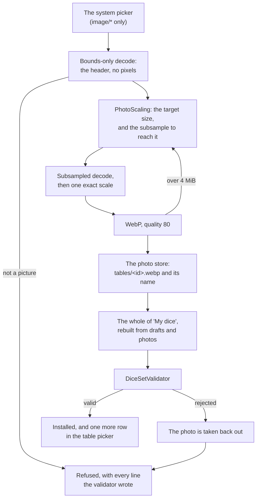
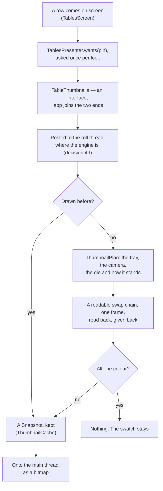

# Tables

> **Design:** the table picker is option 1u of the [clickable design](../design/dInfinity.dc.html)
> ([design/](../design/)); 9j adds an installed set's table and 8a pins one to
> a saved-roll group.

The **table** is the dice tray: the box the dice tumble in. Two things about
it are fixed and one is exchangeable.

- **Fixed: the mesh.** A rectangular box with a flat floor, four vertical
  walls and rounded inner corners. Nobody can ship a table with a hole in the
  floor or a ramp in the corner.
- **Fixed: the size.** The table is the phone's screen. Its aspect ratio is
  the screen's, its walls sit at the screen edges, and the camera frames it
  edge to edge. It does not grow to fit a big roll; the dice shrink, and past
  a limit the roll is refused.
- **Exchangeable: the look.** Floor and wall textures, colours, material,
  sound profile and lighting preset — the same idea as choosing a wallpaper.
  Tables ship inside the same package format as dice sets and can be
  downloaded from the same sources.

## Geometry

Simulation units are millimetres.

| Property | Value |
| --- | --- |
| Long side | 240 mm, always (a real dice tray, regardless of phone size) |
| Short side | 240 mm × screen aspect ratio, clamped to 0.40–0.75 (Pixel 10a: 20:9 → ~108 mm) |
| Wall height | 60 mm as drawn; the collision box is closed to the ceiling at 200 mm |
| Inner corner radius | 12 mm (dice do not wedge into sharp corners) |
| Floor friction / restitution | from the table look, clamped (see below) |

The two heights are not a contradiction. Sixty millimetres is the rim the
renderer draws — the wall you can see. The *collision* walls run the full two
hundred up to the ceiling, because "dice cannot leave the table no matter how
hard the phone is shaken" is not true of a box with a lid two hundred
millimetres up and sides only sixty: a die thrown hard leaves through the gap
and never comes back. **The rounded corners run the full height too.** They
were once only as tall as the rim, on the reasoning that the rim is as far up
as a die can wedge into anything — which is true, and beside the point: a post
that stops at sixty has a *top*, and four horizontal ledges sixty millimetres
up inside the tray are four places a die can come to rest in mid-air. It took
a phone to see it, and what it looked like was a die floating with its shadow
on the floor beneath it.

Orientation follows the phone: portrait phone → portrait table. **The roll
screen then holds whatever *shape* it opened in**, because the tray *is* the
screen and a quarter turn rebuilds the table — a different shape, a different
capacity, the camera reframed. That is the right answer for somebody who meant
to turn it and an unwelcome surprise for somebody who is shaking it, which is
most of the time on that screen. Held to the shape it was opened in rather than
to portrait: a player who opened the app in landscape meant it. The rest of the
app turns as it likes.

**A half turn is allowed, and a quarter turn is not.** Turning the phone end
over end gives back the same table — same aspect ratio, same capacity, same
camera — so none of the reasoning above applies to it, and refusing it costs
something real: the display's rotation is how a shake knows which way the hand
went, so a screen pinned to the rotation it opened at reports the phone as
upright while it is being shaken upside down, and the dice pool at the end away
from the hand (`docs/physics-and-rendering.md`, "Shake input"). The screen asks
for its shape either way up, which also leaves a player who has locked rotation
system-wide with the phone held still, as they asked.

The physical size of the phone's screen is deliberately *not* used to scale
the table. A 6.3" and a 6.9" phone get the same table; only the aspect ratio
differs. This keeps rolls comparable and keeps the capacity numbers stable
across devices.

## Capacity rule

Before any physics body is created, the roll is checked against the table:

```text
floorArea     = longSide × shortSide
footprint(d)  = π × r(d)²           r = bounding-sphere radius of die d at scale 1
required      = Σ footprint(d) over all dice in the roll
                (including the dice a first explosion could add)

scale = min(1, sqrt(0.30 × floorArea / required))

if scale < 0.40   → roll refused
if diceCount > 100 → roll refused (engine hard cap, independent of scale)
else               → all dice are spawned at `scale`
```

`r(d)` does not come from the shape at all. A die's `size_mm` is **how wide it
is** — the diameter of the sphere its corners sit on — so its bounding radius
is `size_mm / 2` whatever solid is inside it. A 16 mm d6, a 16 mm d12 and a
16 mm d20 are all 16 mm across at their widest, which is how a set of dice
looks in a hand.

`size_mm` used to be read as a dice maker's *nominal* size — the edge length
for a polyhedron — and each shape had its own ratio from that to its bounding
radius. That convention is defensible and is what a manufacturer quotes, but
it is not what anybody means by "a 16 mm die": a dodecahedron with 16 mm edges
is 45 mm across. Dice that size under ordinary gravity take half again as long
to fall their own length, and the roll reads as weightless — a miniature
filmed at normal speed. See `docs/dice-sets.md`, "Size".

That is: dice may collectively cover at most 30 % of the floor with their
bounding circles, and they may shrink to 40 % of their size to get there. Both numbers are tunable constants and both are covered by the golden
determinism tests.

Worked example on a Pixel 10a table (240 × 108 mm ≈ 259 cm²):

| Roll | Required at scale 1 | Result |
| --- | --- | --- |
| `1d20` (16 mm) | 2.0 cm² | scale 1.0 |
| `8d6` (16 mm) | 16 cm² | scale 1.0 |
| `38d6` | 76 cm² | scale 1.0 — the most that roll full size |
| `60d6` | 121 cm² | scale 0.80 |
| `100d6` | 201 cm² | scale 0.62 — the engine's whole cap |
| `101d6` | — | refused: "101 dice don't fit on the table; up to 100 do" |
| `500d6` | — | refused |

Note what the first column no longer does: **the floor rule stops refusing
anything.** The two constants do different jobs — 30 % *shrinks* and 40 %
*refuses* — and 16 mm dice are small enough that a hundred of them shrink only
to 0.62, nowhere near the floor. It would take **241** before the floor refused
one, and the engine stops at 100. The rule still does its real job, which is to
shrink a crowded tray so the dice have room to tumble; the refusal a player
actually meets is the body cap.

Both numbers were revisited on the Pixel 10a and **left alone**. At the cap the
shrink they apply produces a roll where everything settles but one throw in
sixty, nothing is stacked at rest, nothing leaves the tray, and a step costs
3.09 ms against the 8.33 ms it has. There is no evidence for moving either, and
moving a tuned constant on no evidence is how it stops meaning anything. The 241
is asserted in `TableCapacityTest`, so raising the body cap past it is noticed —
that is the point at which the scale floor would become live for the first
time.

The refusal message always says the largest count that *would* fit, and
offers to open the outcome graph instead, which has no such limit.

**An explosion that would take a roll past what the table holds stops; it is
not refused.** The check above counts the dice a *first* explosion could add,
because those are known before anything is thrown. A chain can go deeper than
that, and nobody knows how deep until the dice land — by which time the roll is
on the table and has been read, so there is nothing left to refuse. The limit
is therefore asked again before each added die, as the physical question it
really is: is there a patch of clear floor to drop one onto, and is the tray
still under the hundred bodies the engine takes. When the answer is no the
chain ends there and the breakdown says so. The one thing that never happens is
a die dropped onto the pile to keep a chain going
(`docs/physics-and-rendering.md`, "The dice an explosion or a reroll adds").

Why refuse rather than batch or grow the table: a physics engine with
hundreds of convex bodies packed into a small box tunnels, jitters and
explodes. The result would not be a roll of the dice, it would be a bug. The
outcome graph already answers "what does 500d6 look like"; the table answers
"what did *these* dice do", and that only means something when they had room
to do it.

## Table looks

A table look is a `[[table]]` entry in a package's `diceset.toml`
(`docs/dice-sets.md`). A package can contain only tables — a "table pack".

```toml
[[table]]
id = "green-felt"                 # slug, unique within the package
name = "Green felt"
floor_texture = "tables/felt.png" # optional, relative, inside the package
floor_tiling = [3, 6]             # texture repeats across short/long side, default [1, 1]
wall_texture = "tables/oak.png"   # optional
wall_tiling = [8, 1]
floor_color = "#1f5e3a"           # tint; the whole colour when no texture
wall_color = "#5a3a1e"
roughness = 0.9                   # 0..1
metallic = 0.0                    # 0..1
friction = 0.6                    # floor + walls, clamped to 0.2..1.0
restitution = 0.2                 # clamped to 0.0..0.6
sound = "felt"                    # felt | wood | glass | stone | plastic  (built-in impact sound sets)
light = "warm"                    # neutral | warm | cool | dim  (built-in lighting presets)
```

Rules:

- No mesh field. There is nothing to put there.
- Textures: PNG/WebP, max 2048×2048, same byte limits as die textures.
  `floor_tiling` lets a 512×512 felt tile cover the floor without a
  screen-sized image. **They are validated and not yet drawn.** A die's
  artwork is found by a key of package and path, and a table look's texture
  carries a path and nothing saying whose package — so it resolves to nothing
  and the table is drawn in `floor_color` and `wall_color` alone
  (`docs/dice-sets.md`, "How an atlas reaches the tray";
  `docs/TODO.md`, "Open questions").
- Physics values are clamped at validation and again at load, like dice.
  A table can be a bit slippery or a bit grippy; it cannot be frictionless.
- Sound and light are names from built-in lists so a package cannot ship
  audio files or HDR environment maps (both are large and both are attack
  surface for decoders). More presets can be added to the app over time.
- **The app does not ship the five sounds either; it makes them.** Each preset
  is a short burst generated in plain Kotlin — a ring at a pitch the surface
  decides, a share of noise, and a decay — written straight into an `AudioTrack`
  as raw PCM. So no decoder takes part at all, on a stranger's file or on the
  app's own, which is this rule carried one step further than it had to be. Felt
  is almost all noise and gone in a fiftieth of a second; glass is almost all
  ring and hangs on ten times as long
  (`docs/physics-and-rendering.md`, "Impacts, haptics and sound").
- **A `sound` names what the *table* sounds like, not what the roll sounds
  like.** Dice hitting each other sound like dice whatever they are landing on,
  so those impacts take the `plastic` preset — which is what a set of acrylic
  dice is — and the table's preset covers the floor and the walls. A player who
  wants none of it turns sound off in Settings.
- Unknown keys are ignored with a warning.

### Built-in tables

The bundled package ships `felt-green`, `felt-black`, `oak`, `dark-glass`
and `plain` (a neutral grey that is easy on the eyes and on the battery — it
is what power-saving mode's result screen echoes).

### Your own photo

**Use a photo** sits at the foot of the table picker (`design/dInfinity.dc.html`,
option `1u`): it takes an image from the system picker, cuts it down to size,
and writes a `[[table]]` entry and its picture into the personal package,
`mine` (`docs/dice-sets.md`, "Packages the app writes"). It is then a normal
table — listed with the rest, choosable, pinnable by a group or a saved roll,
and exported inside `mine`'s zip like anything else drawn on this phone.

**Nothing about it is a privileged path.** The photo is written into the
package and that *whole package* then goes through the same `DiceSetValidator`
a downloaded one goes through. A package that comes back rejected is not
installed, the photo is taken back out of the store it was put in, and the
report the validator wrote is what the sheet shows — the same lines a refused
install shows. So a refusal leaves the phone exactly as it was, which matters
more here than anywhere: the photos are the record the package is *rebuilt*
from, and one left behind after a refusal would take the drawn dice down with
it at the next rebuild.



**How small, and why that small.** Neither number is this feature's own. A
phone camera makes something like 4080 × 3072 — forty-eight megabytes decoded —
and a hostile file may claim very much more, so the size is decided from the
limits the format already publishes:

| | |
| --- | --- |
| longest side | `MAX_TEXTURE_PIXELS` (2048), the aspect ratio kept, never upscaled — so a 4080 × 3072 photo becomes 2048 × 1542 |
| file size | `MAX_TEXTURE_MIB` (4). A 2048-pixel photo is not *guaranteed* to encode under it, so the size is a ladder: each rung halves the one before, down to 256 px on the long side, and the first rung whose encoded bytes fit is the one written. In practice the first rung always wins — a 2048 × 1542 WebP of a photograph is a few hundred kilobytes |
| format | **WebP, lossy, quality 80.** A photograph in PNG is several times the size for a difference nobody can see under tumbling dice, and WebP is one of the two kinds the validator's header reader already understands |
| how many | `MAX_PACKAGE_TEXTURE_MIB / MAX_TEXTURE_MIB` = **6**: as many textures as a package could hold if every one of them were the largest a texture may be. The seventh is refused rather than pushing the oldest out — a drawing nobody has opened for months is a fair thing to drop, and the table somebody is playing on tonight is not |

**The decode is in two passes, and that order is the whole of the defence.**
The first asks only for the header (`inJustDecodeBounds`) and allocates
nothing, so a file claiming to be thirty thousand pixels square is found out
for the cost of a few bytes. The second carries an `inSampleSize` — the largest
power of two that still leaves enough pixels — so the decoder never holds more
than about four times what is wanted, and one ordinary scale finishes the job.
**A full-size decode of an attacker-controlled image does not happen on any
path.**

**What a photo table is, as a look.** Its tiling is `[1, 1]`: tiling exists so
a 512-pixel felt swatch can cover a tray without being a screen-sized image,
and a photograph is one picture of one thing. Its floor colour is white, so the
picture is shown as it was taken rather than multiplied by a tint; its walls
keep `plain`'s grey. Its `sound` is `felt` and its `light` is `neutral` — a
photograph says nothing about how hard a surface is — and **every physics value
is the model's own default**: a photo changes how the tray looks and nothing
about how it rolls.

Its id is `photo-` plus the name slugged, numbered (`photo-oak-2`) when that id
is taken, so a photo can never land on a drawn set's table id. The name is the
player's, tidied and cut to 40 characters — the length an id may be — and
suggested from the file's own name (`oak_table-02.jpg` → "Oak table 02"), which
is a suggestion to type over rather than an answer.

A photo table is also the one row in the picker that offers **Remove**, because
it is the one look that does not belong to a package: everything else is
removed by removing its package, on the screen that is about packages.

**The tray does not draw the picture yet**, and neither does it draw a drawn
die's artwork: nothing fills the `atlases` seam that turns a package's texture
into a `Texture` on the GPU (`docs/TODO.md`, Step 3). So a photo table is a
complete, valid, exportable table that currently renders as its colours, in
exactly the state a die with a drawn atlas is in. What is done here is the
package and the path into it; what is left is one seam, shared with the dice.

## Selecting a table

- **Tables are global.** Every look from every installed package is listed in
  every table picker, whatever dice set it shipped with. A dice set never
  brings its own table along or overrides the chosen one: a roll that mixes
  Brass & Bone dice with built-in dice happens on the one selected table,
  like reaching into two bags over the same tray.
- The **Table** screen shows every installed look in one list, with the chosen
  one marked and the package named beside a look only when more than one
  package supplies tables — repeating the same name down a list of five says
  nothing. Choosing one is remembered with the settings, and the tray is built
  on it the next time it is opened. A choice whose package is no longer
  installed shows the look the tray would really use instead; the setting is
  left as it was, because the package may be re-installed tomorrow. Each row
  carries a **thumbnail** of the look — the real tray, with a d20 standing on
  it — and its swatch of colours until one arrives ("Thumbnails", below).
- Saved-roll groups can pin a table ("the Strahd campaign is always played on
  black felt"), and so can an individual saved roll ("Fireball is thrown on
  black felt"). Precedence, most specific first: the saved roll's pin, then
  the pin of the group it lives in, then the app default from Settings. The
  roll's pin is set in the roll editor and the group's on the group sheet;
  "Default" in either means *follow the pin above this one*.

  **The rule is answered where both halves are known.** A saved roll and the
  group it lives in arrive together — the saved-rolls list and the strip both
  watch the two flows as one — so the precedence is settled at the moment a
  roll is tapped and the throw carries the answer with it (`SavedRollSource`).
  Nothing downstream asks a database which table to use, and the roll screen
  never learns what a saved roll is. `null` means the app default, and the
  tray cannot tell whether that is because nothing was pinned or because the
  default is what was pinned — which is the same thing to a player.

  The tray is told again whenever the table changes, and only then: tapping a
  roll pinned to black felt changes it, typing over that formula changes it
  back — the pin travels with the attribution, because a roll that was
  Fireball and has been edited is not Fireball's throw — and a keystroke that
  changes neither leaves the scene alone.

  A throw started from the saved-rolls **list** carries no pin, because it
  carries no attribution either: that tap fills the formula field and the
  player makes the throw themselves. It lands on the app default, like
  anything else typed.
- Power-saving mode ignores the table look entirely; the physics values of
  the *selected* table are still used so the roll is identical to what
  normal mode would produce. Its `sound` is still used too — nothing is drawn
  there, but the dice are still heard, from the impacts the throw actually made
  (`docs/physics-and-rendering.md`, "Power-saving mode").

## Thumbnails

Every row of the picker is a **picture of its own tray**: the real box mesh
built from that look, lit the way the roll screen lights it, with a d20
standing on the floor (`design/dInfinity.dc.html`, option `1u`). It is drawn by
the renderer that draws the tray — `FilamentDiceRenderer` over `Stage`, the
same scene a throw builds — because a second way of building it would be a
second thing to keep in step, and the first time the two drifted the picker
would be advertising a table the tray does not draw.

It is the first thing in the app to want the renderer on a screen that is not
the tray, and that is the whole of what is new here
(`docs/architecture.md`, decision 60).

**A thumbnail does not follow the Table view setting.** It is a picture of a
table rather than a roll in progress, and the leaning shot is the one that
shows a look's walls — a straight-down thumbnail of an oak tray is a rectangle
of felt. So the renderer a thumbnail is drawn with is built without a
table view and takes this module's own default, which is the angled shot
(`docs/physics-and-rendering.md`, "Rendering (normal mode)").



**What the picture is of.** The tray is built for the *thumbnail's* shape
rather than for the phone's — a table is its screen, and a thumbnail is a very
small screen, so the same rule gives it a table of its own proportions. The
camera is the tray's own, at the far corner and as close as a pinch may ever
take it (`TrayView.CLOSEST`): framing the whole 240 mm would put a 16 mm die
across a twentieth of a picture 44 dp wide, which is true and is a picture of
nothing. Close in, the die is a quarter of the frame, two walls and the rounded
corner between them are in shot, and a floor texture is at a size somebody can
see repeat. The die shows its **best** face — the highest value, read from the
die's own faces rather than from its face count, so a d20 numbered 0–19 shows
its `19` — and it is the bundled package's d20, or another package's when the
bundled one is not there. A package with no twenty-sided die at all gets the
tray by itself, which is still a true picture of the look.

**Nothing about a thumbnail is a roll.** No physics world is opened, no step is
taken, and the die is placed where the arithmetic says rather than where a
solver left it. A thumbnail decides nothing, because nobody reads a face off
one (`docs/architecture.md`, goal 1).

**The swatch is still there, and it is the fallback.** Two colours in a box —
the floor inside, the wall around it — drawn at exactly the size the picture
will be, so the list does not jump about as pictures land in it. It is what
every row shows for the first moment of a visit, and what every row shows for
ever on:

- a device where the engine will not open or the material will not compile,
  which is asked once and never again;
- a device whose driver renders correctly to a screen and hands back an empty
  buffer when asked to read one. A frame that comes back all one colour is
  thrown away rather than shown, because a black rectangle in a list of tables
  is worse than the swatch it replaced;
- **power-saving mode**, where no Filament engine is created at all. That
  promise is about the app rather than only about the roll screen, and a
  picture of a table is not worth breaking it for
  (`docs/physics-and-rendering.md`, "Power-saving mode").

**What it costs.** A picture is asked for by the row that is on screen rather
than for the whole list at once, so somebody with thirty installed looks pays
for the six they can see and for the next six when they scroll to them. Each
one is a swap chain, a scene and one wait on the GPU, and each is given back
the moment the frame has been read. The answers are kept — a look's colours
cannot change without its package being reinstalled — bounded at sixteen, the
least recently asked-for dropped first, and they outlive a visit to the screen
because the engine does (`docs/architecture.md`, decision 50). A picture is
filed under which table it is *and what that table is*, so a photograph removed
and another made under the same id is drawn afresh rather than shown the first
one's picture.

**A photo table's thumbnail is its colours, like every other table's.** Nothing
fills the seam that turns a package's texture into a `Texture` on the GPU yet,
so a thumbnail shows exactly what the tray shows: `floor_color` and
`wall_color` (`docs/TODO.md`, Step 3). When that seam is filled, both change
together, because both go through the same renderer.
