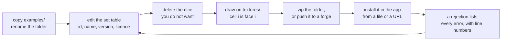

# A dice set to start from

This folder is a complete, installable dice set. It exists because the app's
own dice are compiled into it and cannot be exported, so somebody who wants to
make a set would otherwise be starting from a specification rather than from a
file that works.

It defines **one die on every solid in the v1 catalogue**, plus one that is not
a standard die at all, and it ships a **blank texture atlas for each shape**,
cut to exactly the grid the app expects. The atlases are fully transparent:
open one in an editor and draw on it, and the faces you drew carry your
artwork while the faces you left alone carry the printed number.

| | |
| --- | --- |
| [diceset.toml](diceset.toml) | The set itself. Every field is commented — what is required, what it defaults to, and the limit where there is one. Read it instead of the specification |
| [textures/](textures/) | One blank atlas per catalogue shape, correctly sized. Written by [../tools/generate-atlases.py](../tools/generate-atlases.py) |

## Making it yours



Two things are worth knowing before the first attempt:

- **`set.id` is not decoration.** It becomes the folder the package is
  installed into and the `setref` notation uses, so `examples:d20` rolls this
  set's d20. Change it to something nobody else will choose, and change it
  before you publish rather than after — an id is how an update finds the
  package it is updating.
- **The atlas grid belongs to the app, not to you.** A die's faces are laid out
  in a grid derived from the face count — as square as it can be, widest first,
  face *i* in cell *i* reading left to right and top to bottom. The files in
  `textures/` are already that grid at 256 pixels per cell, which is why they
  are worth copying rather than starting from a blank canvas of your own.

## Installing it

Zip the folder and hand the archive to the app's dice-set screen, or point the
app at a folder with the system file picker. A set on a git forge is installed
from its URL. All three go through the same validator, and a package that fails
it is rejected whole, with every error listed and a line number against each.

Nothing in a package is ever executed: there are no scripts and no build steps,
only a text file and pictures.

## Regenerating the atlases

The blank PNGs are generated rather than committed by hand, so they can be
proved to match the catalogue:

```sh
python3 tools/generate-atlases.py .
```

It needs nothing but Python. Re-running it rewrites the same bytes, so it shows
up in `git status` only when the catalogue has actually changed.

A test in `dicesets/format` validates this folder on every build and checks
each atlas against the app's own `DieShape` and `ShapeAtlas`, which is what
stops the example drifting away from the format it is teaching.

## Where the rules are written down

- [../docs/dice-sets.md](../docs/dice-sets.md) — the format, the shape
  catalogue, the limits, how installing and validating work
- [../docs/tables.md](../docs/tables.md) — table looks, which a package may
  ship instead of or alongside dice
- [../docs/face-designer.md](../docs/face-designer.md) — drawing faces on the
  phone instead, and exporting the result as a package like this one

## Licence

The set file and the blank atlases in this folder are CC0-1.0 — public domain —
so you can copy them into your own package without carrying anything of ours
with them. The rest of the repository is GPL-2.0-or-later
([../LICENSE](../LICENSE)).
