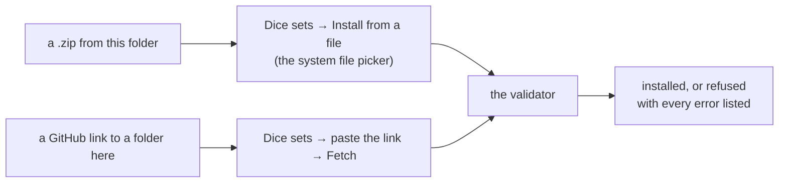

# Sample dice sets

Four finished dice sets to install, for trying the app's import — from a file
and from a link — and for seeing what the set format's materials do on the
tray. Each defines the ten standard dice (`d2` to `d20`, `d10-tens`, `df`), so
plain notation rolls them once they are installed: `marble:d20`,
`steel:3d6`.

| Set | What it shows | Folder | Archive |
| --- | --- | --- | --- |
| Marble | Artwork on every face — veined stone with the numbers cut into it | [marble/](marble/) | [marble.zip](marble.zip) |
| Steel | A fully metallic body (`metallic = 1`), heavy (`density = 7.8`) | [steel/](steel/) | [steel.zip](steel.zip) |
| Green resin | Somewhat translucent (`translucency = 45`): the felt softly through it | [green-resin/](green-resin/) | [green-resin.zip](green-resin.zip) |
| Red glass | Wholly clear and polished (`translucency = 100`, `roughness = 0.05`) | [red-glass/](red-glass/) | [red-glass.zip](red-glass.zip) |

They are not a starting point for a set of your own — that is
[../examples/](../examples/), whose every field is commented. They live apart
from it on purpose: `examples/` is a package you are told to copy and zip, and
a package carrying four more packages inside it would install whichever
`diceset.toml` the app found first.

## Installing one



- **From a file.** Download a zip — on GitHub, open it above and use
  *Download raw file* — and pick it with **Install from a file**. The archive is the folder,
  one level deep, exactly as a downloaded package usually arrives.
- **From a link.** Paste the folder's GitHub address into the link field
  under *Install from a URL or file* and press **Fetch**, for example
  `https://github.com/drehtuer/dInfinityApp/tree/main/sample-sets/marble`.
  The app fetches the repository's archive and installs the one folder the
  link names (`docs/dice-sets.md`, "Installing from a URL or file").

Both go through the same validator a stranger's package does; none of these
four is given any trust the bundled set has.

## How they are made, and how they are checked

| What | Made by | Checked by |
| --- | --- | --- |
| The four `diceset.toml` files | hand | `SampleArchivesTest` (dicesets/install) installs each archive and expects no warnings |
| `marble/textures/*.png` | `MarbleArtwork` (render/filament, test sources) | `MarbleArtworkTest` — the PNGs are what the generator draws, every face is artwork, and the numbers sit where the app would print them |
| The four `.zip` files | [build-archives.py](build-archives.py) | `SampleArchivesTest` — each holds exactly its folder, byte for byte |

**Why the marble generator is Kotlin and not a script here.** A face with
artwork on it is not printed (`docs/architecture.md`, decision 96), so a
marble die has to carry its numbers in the picture. They are taken from the
app's own printing (`DieNumbers`), so a marble d4's corner numbers or a d20's
marked `6.` sit exactly where a plain die's would — which only Kotlin in the
app's own build can reach. The archives need nothing but Python.

After changing a set, or the printing:

```sh
# the marble pictures (inside the devcontainer)
DINFINITY_WRITE_EXAMPLES=1 ./gradlew :render:filament:testDebugUnitTest \
  --tests '*MarbleArtworkTest*' --rerun

# the four archives
python3 sample-sets/build-archives.py
```

Both write the same bytes every time, so a file shows up in `git status` only
when something has actually changed — and a test fails until both have been
run.

## Licence

CC0-1.0, like `examples/`: copy anything here freely.
